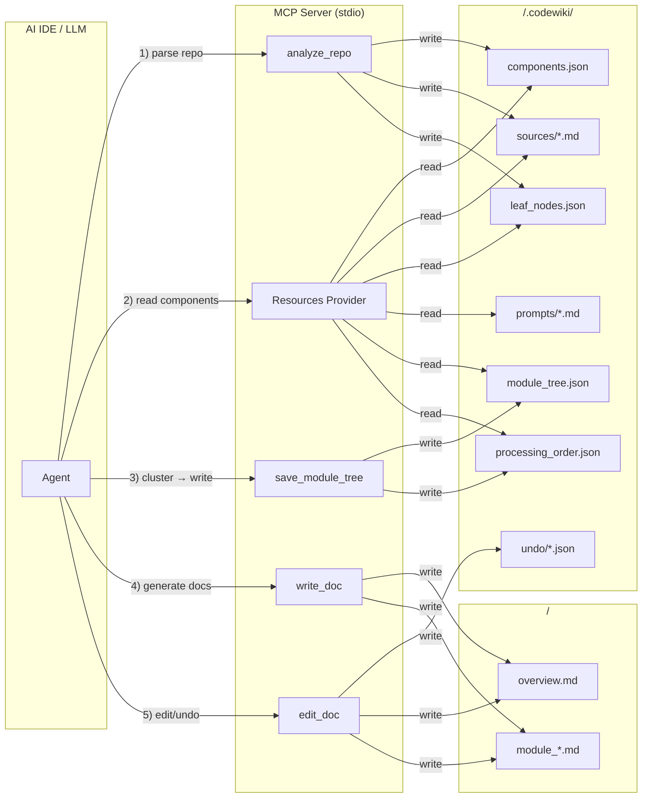

## MCP server代码可以优化吗，因为用的是stdio模式，是不是可以通过读写文件的方式来代替通过MCP协议传输大量内容

## 最简方案：session = 目录，Resources 替代所有只读 tool

### 核心设计

把 MCP server 拆成**控制平面（4 个 tool）+ 数据平面（7 类 Resources）**，两者的桥梁就是 output_dir 下一个固定的 `.codewiki/` 工作目录：



### 数据平面：`.codewiki/` 目录布局

```
<output_dir>/
├── .codewiki/                 ← MCP server 的"工作目录"
│   ├── components.json        全量组件索引（带源码）
│   ├── leaf_nodes.json        叶节点列表
│   ├── module_tree.json       当前聚类树
│   ├── processing_order.json  叶优先处理顺序（save_module_tree 时算好）
│   ├── prompts/
│   │   ├── cluster.md
│   │   ├── system_complex.md
│   │   ├── system_leaf.md
│   │   ├── user.md
│   │   ├── overview_module.md
│   │   └── overview_repo.md
│   ├── sources/               每个组件的源码
│   │   ├── auth.py__login.md
│   │   ├── auth.py__logout.md
│   │   └── ...
│   └── undo/                  编辑历史（每文件一摞）
│       ├── auth_module.md.json
│       └── ...
├── overview.md
├── auth_module.md
├── module_tree.json            ↑ 业务产物，对外可见
├── first_module_tree.json
└── metadata.json
```

**变化点**：
- `session_id` / `SessionStore` / 2h TTL / 10 个并发上限 **全部删除** → "session" 就是 `output_dir` 这个绝对路径
- 截断（`_MAX_RESPONSE_LEN=24000` / `_MAX_COMPONENT_SOURCE_LEN=8000`）**全部删除** → LLM 直接读磁盘，无大小限制
- `view_repo_file` **删除** → LLM 自己的文件系统工具就能看
- `get_prompt` **删除** → 模板是静态文件，做成 Resource
- `get_processing_order` **删除** → `save_module_tree` 一次性算好写盘
- `close_session` **删除** → 删 `.codewiki/` 是用户/IDE 自己的事
- 内存里的 `components` dict **删除** → 解析完直接序列化到 `components.json`，需要时按组件 ID 切片到 `sources/<id>.md`

### 控制平面：4 个 tool

```python
Tool(name="analyze_repo", ...)         # 唯一的"重活"tool
Tool(name="write_doc", ...)            # 写 .md
Tool(name="edit_doc", ...)             # 替换/插入/撤销
Tool(name="save_module_tree", ...)     # 保存聚类
```

每个 tool 的 `arguments` 全部接受 `output_dir`（绝对路径）作为**隐式 session key**，不再有 `session_id` 字段。

#### `analyze_repo(repo_path, output_dir, include_patterns, exclude_patterns)`

- 行为与旧版一致：Tree-sitter 解析、构建依赖图、git/mtime 增量检测
- **新行为**：所有结果落盘到 `<output_dir>/.codewiki/`
- 返回值（**极小**）：
  ```json
  {
    "output_dir": "/abs/path/to/output_dir",
    "components_file": ".../.codewiki/components.json",
    "leaf_nodes_file": ".../.codewiki/leaf_nodes.json",
    "components_count": 327,
    "leaf_nodes_count": 89,
    "languages": {"python": 280, "typescript": 47},
    "changes": null  // 或增量检测结果
  }
  ```

#### `write_doc(output_dir, filename, content=None, content_path=None)`

- 至少给一个：`content`（小段）或 `content_path`（LLM 先把内容写到自己工区的临时文件，再传路径）
- 写完后做 Mermaid 校验，返回 `{path, lines, mermaid_validation}`

#### `edit_doc(output_dir, filename, command, old_str, new_str, insert_line)`

- 三个 command：`str_replace` / `insert` / `undo`
- 编辑前把当前内容推到 `<output_dir>/.codewiki/undo/<filename>.json`（数组，最多 20 条）
- `undo` 从中弹一条写回
- 返回 `{status, snippet, mermaid_validation}`

#### `save_module_tree(output_dir, module_tree=None, module_tree_path=None)`

- 二选一：直接传 `module_tree` 对象，或传 `module_tree_path`（LLM 写到临时文件后给路径）
- 写 `<output_dir>/module_tree.json` + `<output_dir>/first_module_tree.json` + `<output_dir>/.codewiki/processing_order.json`
- 返回 `{tree_path, processing_order_path, processing_order: [...]}`

### 数据平面：7 类 MCP Resources

```python
@server.list_resources()
async def list_resources() -> list[Resource]:
    # 动态扫描 .codewiki/ 下已落盘的文件，注册为 Resources
    # 一次 analyze_repo 后，这些 Resources 自动可读
    ...

@server.read_resource()
async def read_resource(uri: str) -> list[ReadResourceContents]:
    # URI 路由到对应磁盘文件
    ...
```

URI 设计（**注意输出目录里多个 repo 共存**时用 hash 区分）：

| URI | 实际文件 | 内容 |
|-----|---------|------|
| `codewiki://<sid>/components` | `components.json` | 完整组件索引（id/type/file/source 都有） |
| `codewiki://<sid>/components/{id}` | `sources/{id}.md` | 单个组件源码（带 ```lang fence） |
| `codewiki://<sid>/leaf-nodes` | `leaf_nodes.json` | 叶节点 ID 列表 |
| `codewiki://<sid>/module-tree` | `module_tree.json` | 当前模块树 |
| `codewiki://<sid>/processing-order` | `processing_order.json` | 叶优先处理顺序 |
| `codewiki://<sid>/prompts/{type}` | `prompts/{type}.md` | 提示词模板（占位符未填） |
| `codewiki://<sid>/docs/{filename}` | `output_dir/{filename}.md` | 任意已生成的 .md |

`<sid>` = `hashlib.md5(output_dir.encode()).hexdigest()[:12]`，让 LLM 拿一个稳定 ID 引用即可。

**LLM 工作流**：

```
1. analyze_repo → 拿到 output_dir + sid
2. resources/read codewiki://<sid>/components
3. 推理聚类 → write .codewiki/_tmp_tree.json → save_module_tree(module_tree_path=...)
4. resources/read codewiki://<sid>/prompts/system_leaf
5. resources/read codewiki://<sid>/components/{cid1} ... /components/{cidN}
6. 生成 .md → 写到自己的临时文件 → write_doc(content_path=...)
7. resources/read codewiki://<sid>/docs/overview.md  ← 父模块/总览阶段读子文档
8. close？不需要。删 output_dir 由 IDE/用户决定。
```

### stdio 流量对比

| 阶段 | 旧版（11 tool, 截断，全 inline） | 新版（4 tool + 7 Resources） |
|------|-------------------------------|------------------------------|
| analyze_repo | ~30 KB inline | **< 1 KB** inline |
| 读 200 个组件源码 | 200 × 8 KB = **1.6 MB** 走 stdio | **0** 走 stdio（LLM 走 Resources/磁盘） |
| get_prompt × 6 | 6 × 25 KB = 150 KB | 0（Resources） |
| 写 30 篇 .md | 30 × 15 KB = 450 KB | < 1 KB × 30（只传路径） |
| save_module_tree | 30 KB | < 1 KB |
| **总计** | **~2.3 MB** | **< 50 KB** |

LLM context 端：旧版工具返回值会被 IDE 塞进 context（白白占 token），新版 LLM 用 Resources 读到的内容也进 context，但**可以按 view_range 切片**，且**没有 8000 字符的截断**，长文件一次读全。

---

## 实施步骤（要改的文件）

1. **删**：`codewiki/mcp/session.py`（彻底不要内存 session）
2. **删**：`codewiki/mcp/payload_store.py`（如果之前尝试过）
3. **重写**：`codewiki/mcp/server.py` — 4 个 tool + 7 类 Resources
4. **新建**：`codewiki/mcp/resources.py` — `list_resources` / `read_resource` 的实现 + URI 路由
5. **合并**：`codewiki/mcp/tools/*.py` 收敛到 4 个 handler（甚至可以并入 `server.py`）
6. **更新**：`codewiki/src/config.py` — `DOCS_DIR` 仍是 `docs`，但 `FIRST_MODULE_TREE_FILENAME` 等保留（CLI 还要用），**新增** `CODEWIKI_DIR = ".codewiki"`
7. **更新**：`codewiki/src/be/utils.py` — `validate_mermaid_diagrams` 现在读的是 output_dir 下的真实文件，逻辑保持
8. **重写**：`IDE_DRIVEN_GUIDE.md` — 改写整个工具章节
9. **重写**：`.codebuddy/rules/codewiki-wiki-generator/RULE.mdc` 和 `.cursorrules` — 改成基于 Resources 的工作流
10. **更新**：`pyproject.toml` — 确认 `mcp[server] >= 1.0`（Resources 是标准能力，老版本 mcp 库没实现）
11. **改写**：`tests/smoke_test_mcp.py` — 改成验证 Resources URI 可读

### 唯一需要保留的"路径保护"逻辑

- `write_doc` / `edit_doc` 的 `_safe_doc_path` 保留（防 `../` 越狱）
- `analyze_repo` 的 `output_dir` 校验保留（不接受写到 repo 外）

---

## 不做的事

- ❌ 不再做 `_MAX_RESPONSE_LEN` / `_MAX_COMPONENT_SOURCE_LEN` 截断
- ❌ 不再做 `asyncio.to_thread` 绕 GIL（Resources 同步读盘很快，Tree-sitter 那一步保留同步即可）
- ❌ 不再做 `mermaid-py` 跨线程的 `_main_loop` 复杂同步（重构后调用栈更短，可改成一次性 import 时初始化）
- ❌ 不再做 `SessionStore._purge_expired` / `_MAX_SESSIONS` 防御
- ❌ 不再返回 `component_index` 全量到 MCP response（分页到磁盘）
- ❌ 不再做 `get_prompt` 变量服务端填充（LLM 自己填 `{module_name}` 等占位符）

---

### 风险

| 风险 | 应对 |
|------|------|
| 部分老 IDE 不支持 MCP Resources | 罕见；Cursor/Claude Desktop/CodeBuddy 全部支持；如果担心，在 server.py 启动时探测并 warn |
| LLM 不愿用 Resources | 规则文件里写清楚工作流，prompt 中强调"读组件源码请用 resources/read" |
| output_dir 被手动删除 | analyze_repo 重复调就是幂等的，重新构建即可 |
| 多 repo 并行分析时 hash 冲突 | 12 位 md5 撞库概率 1/16^12，且即便撞也只影响 resources URI，不影响磁盘文件 |

---

**最终落点**：4 个 tool + 7 类 Resources + 一个 `.codewiki/` 工作目录，stdio 流量降到 5% 以下，LLM 用 Resources 读大数据用 tool 写小数据，整个 server 没有内存状态、没有 TTL、没有截断。
