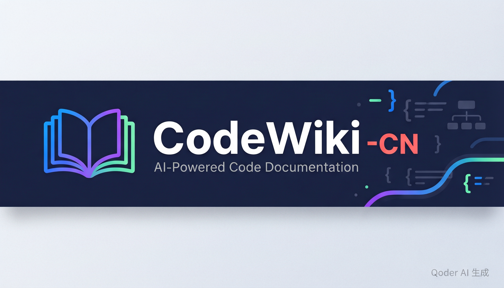

<p align="center">
  
</p>

<h1 align="center">CodeWiki-CN</h1>

<p align="center">
  <strong>用 AI IDE 驱动的代码仓库文档生成工具</strong><br>
  <strong>AI IDE-Driven Code Documentation Generator</strong>
</p>

<p align="center">
  <a href="https://python.org/"></a>
  <a href="./LICENSE"></a>
  <a href="https://github.com/FSoft-AI4Code/CodeWiki"></a>
</p>

<p align="center">
  <a href="#zh"><strong>中文</strong></a> | <a href="#en"><strong>English</strong></a>
</p>

---

<a id="zh"></a>

## 中文

### 这个项目是什么？

CodeWiki-CN 是 [FSoft-AI4Code/CodeWiki](https://github.com/FSoft-AI4Code/CodeWiki) 的中国社区分支，核心改动是**让 CodeWiki 无需配置任何大模型 API，直接由 AI IDE（CodeBuddy、Cursor、Claude Desktop 等）自身的模型驱动 Wiki 文档生成**。

### 为什么要做这个改造？

原版 CodeWiki 是一个非常优秀的仓库级文档生成框架，它通过 Tree-sitter AST 解析、依赖图构建、拓扑排序等工具链实现高质量的代码文档生成。但它有一个使用门槛：**必须自行配置 LLM API**（申请 API Key、选择 provider、处理模型兼容性），且整个生成过程是黑盒的，用户无法中途干预。

实际上，CodeWiki 的核心工具链——AST 解析、依赖图、Mermaid 校验——完全不需要 LLM。真正需要 LLM 智能的 4 个环节（模块聚类、文档撰写、子模块递归、总览合成），恰好是 AI IDE 的 Agent 最擅长做的事情。

因此，我们将 CodeWiki 的 MCP Server 从"黑盒式一键生成"拆分为**9 个细粒度工具**，让它退化为纯工具链服务器。AI IDE 的 Agent 通过 MCP 协议调用这些工具，用自己的推理能力完成全部文档生成工作：

```
改造前：
  IDE → generate_docs(repo) → [CodeWiki 内部调用 LLM API] → 结果

改造后：
  IDE Agent → analyze_repo → read_code → (Agent 自己推理) → write_doc → overview
              ↑ 纯工具       ↑ 纯工具    ↑ IDE 自身模型      ↑ 纯工具
```

### 前置条件

- **Python 3.12+**
- **Node.js**（用于 Mermaid 图表校验，不安装则图表校验会静默跳过）
- 一个支持 MCP 的 AI IDE（CodeBuddy、Cursor、Claude Desktop 等）

### 快速开始（以 CodeBuddy 为例）

整个过程只需 4 步，不需要任何 API Key。

**第 1 步：安装 CodeWiki-CN**

```bash
git clone https://github.com/mambo-wang/CodeWiki-CN.git
cd CodeWiki-CN
pip install -e .
```

验证安装：

```bash
python -c "from codewiki.mcp.server import server; print('MCP Server OK')"
```

**第 2 步：配置 MCP Server**

在 CodeBuddy 的 MCP 设置中添加以下配置（通常在设置界面的"工具"或"MCP"板块）：

```json
{
  "mcpServers": {
    "codewiki": {
      "command": "python",
      "args": ["-m", "codewiki.mcp.server"],
      "cwd": "/你的路径/CodeWiki-CN"
    }
  }
}
```

> 将 `/你的路径/CodeWiki-CN` 替换为你实际克隆 CodeWiki-CN 的绝对路径。

配置完成后，CodeBuddy 的 MCP 工具列表中应出现 `codewiki` 相关的 9 个工具（`analyze_repo`、`read_code_components` 等）。

**第 3 步：配置项目规则（Rule）**

本项目已预置 CodeBuddy 规则文件：

```
.codebuddy/rules/codewiki-wiki-generator/RULE.mdc
```

该规则定义了 Wiki 生成的 5 阶段工作流（分析 → 聚类 → 逐模块文档 → 总览 → 清理），当你在 Agent 对话中提及"生成文档"或"Wiki"时，CodeBuddy 会自动加载这些指令。

如果你使用的是 **Cursor**，项目中也提供了 `.cursorrules` 文件，打开项目后自动生效。

**第 4 步：在 Agent 模式中输入提示词**

打开 CodeBuddy 的 Agent 模式，用 CodeBuddy 打开你要生成文档的目标项目，然后输入：

```
帮我分析当前仓库并生成 Wiki 文档，输出到 repowiki 目录。请使用中文撰写文档。
```

Agent 会自动按照以下流程工作：

```
阶段 1: 调用 analyze_repo → 得到 session_id、组件索引、叶节点列表
  ↓
阶段 2: 调用 get_prompt("cluster") 获取聚类规则
        调用 read_code_components 阅读源码
        自主推理，将组件分组为 3-8 个逻辑模块
        调用 save_module_tree 保存聚类结果
  ↓
阶段 3: 按叶优先顺序逐模块生成文档
        每个叶模块：read_code → 分析推理 → write_doc_file
        每个父模块：读取子文档 → 合成总览 → write_doc_file
  ↓
阶段 4: 生成仓库总览 overview.md
  ↓
阶段 5: 调用 close_session 释放资源
```

生成的文档结构：

```
repowiki/
├── overview.md              # 仓库总览（从这里开始阅读）
├── module1.md               # 各模块文档
├── module2.md               # ...
├── module_tree.json         # 模块层级结构
├── first_module_tree.json   # 初始聚类结果
└── metadata.json            # 生成元数据
```

### MCP 工具速查

所有工具均不需要 LLM 配置，由 IDE Agent 通过 MCP 协议调用：

| 工具 | 用途 |
|------|------|
| `analyze_repo` | 分析仓库，构建依赖图，返回组件索引 |
| `read_code_components` | 根据组件 ID 读取源码 |
| `view_repo_file` | 只读浏览仓库中的文件/目录 |
| `write_doc_file` | 创建 .md 文档（自动 Mermaid 校验） |
| `edit_doc_file` | 编辑文档（替换/插入/撤销） |
| `save_module_tree` | 保存模块聚类结果 |
| `get_processing_order` | 获取叶优先的文档生成顺序 |
| `get_prompt` | 获取各阶段的提示词模板 |
| `close_session` | 关闭会话释放资源 |

> 另有 2 个遗留工具（`generate_docs`、`get_module_tree`）保留向后兼容，需先通过 `codewiki config set` 配置 LLM API。

### 支持的其他 AI IDE

除 CodeBuddy 外，任何支持 MCP stdio 协议的 AI IDE 均可使用：

**Cursor**：在 Settings → MCP 中添加相同的 Server 配置，项目规则通过 `.cursorrules` 自动加载。

**Claude Desktop**：在 `~/Library/Application Support/Claude/claude_desktop_config.json`（macOS）中添加 MCP 配置。

**其他 IDE**：指定 `command: "python"`, `args: ["-m", "codewiki.mcp.server"]` 即可。

### 原始 CLI 模式（仍然可用）

如果你更习惯命令行一键生成，原始的 CLI 方式完全不受影响。需要先配置 LLM API：

```bash
codewiki config set \
  --provider openai-compatible \
  --api-key YOUR_KEY \
  --base-url https://api.example.com \
  --main-model claude-sonnet-4 \
  --cluster-model claude-sonnet-4

codewiki generate
```

支持 OpenAI、Anthropic、Azure OpenAI、AWS Bedrock 以及 Claude Code / Codex 订阅模式。详见[上游项目 README](https://github.com/FSoft-AI4Code/CodeWiki)。

### 支持的语言

Python、Java、JavaScript、TypeScript、C、C++、C#、Kotlin

### 致谢

本项目的核心工具链（Tree-sitter AST 解析、依赖图构建、拓扑排序、Mermaid 校验）全部来自 [FSoft-AI4Code/CodeWiki](https://github.com/FSoft-AI4Code/CodeWiki) 上游项目。我们在此基础上将 MCP Server 从黑盒模式拆分为细粒度工具集，使其能够被 AI IDE 的 Agent 直接驱动。

上游论文：[CodeWiki: Evaluating AI's Ability to Generate Holistic Documentation for Large-Scale Codebases](https://arxiv.org/abs/2510.24428)

```bibtex
@misc{hoang2025codewikievaluatingaisability,
      title={CodeWiki: Evaluating AI's Ability to Generate Holistic Documentation for Large-Scale Codebases},
      author={Anh Nguyen Hoang and Minh Le-Anh and Bach Le and Nghi D. Q. Bui},
      year={2025},
      eprint={2510.24428},
      archivePrefix={arXiv},
      primaryClass={cs.SE},
      url={https://arxiv.org/abs/2510.24428},
}
```

---

<a id="en"></a>

## English

### What is this project?

CodeWiki-CN is a community fork of [FSoft-AI4Code/CodeWiki](https://github.com/FSoft-AI4Code/CodeWiki) that enables **zero-LLM-config Wiki generation** driven entirely by AI IDEs (CodeBuddy, Cursor, Claude Desktop, etc.) via MCP (Model Context Protocol).

### Why this fork?

The original CodeWiki is an excellent repository-level documentation framework. However, it requires users to configure their own LLM API (API key, provider, model selection), and the generation pipeline runs as a black box with no user intervention.

In practice, CodeWiki's core toolchain—Tree-sitter AST parsing, dependency graph construction, topological sorting, and Mermaid validation—does not need an LLM at all. The 4 stages that do require LLM intelligence (module clustering, document writing, sub-module recursion, and overview synthesis) are exactly what AI IDE Agents excel at.

We refactored CodeWiki's MCP Server from a "one-click black box" into **9 fine-grained tools**, turning it into a pure toolchain server. The AI IDE's Agent calls these tools via MCP and uses its own reasoning to complete all documentation work:

```
Before:
  IDE → generate_docs(repo) → [CodeWiki calls LLM API internally] → result

After:
  IDE Agent → analyze_repo → read_code → (Agent reasons) → write_doc → overview
              ↑ pure tool     ↑ pure tool  ↑ IDE's own model ↑ pure tool
```

### Prerequisites

- **Python 3.12+**
- **Node.js** (for Mermaid diagram validation; without it, validation is silently skipped)
- An MCP-compatible AI IDE (CodeBuddy, Cursor, Claude Desktop, etc.)

### Quick Start (CodeBuddy Example)

4 steps, no API key needed.

**Step 1: Install CodeWiki-CN**

```bash
git clone https://github.com/mambo-wang/CodeWiki-CN.git
cd CodeWiki-CN
pip install -e .
```

**Step 2: Configure MCP Server**

Add the following to your CodeBuddy MCP settings:

```json
{
  "mcpServers": {
    "codewiki": {
      "command": "python",
      "args": ["-m", "codewiki.mcp.server"],
      "cwd": "/your/path/to/CodeWiki-CN"
    }
  }
}
```

> Replace `/your/path/to/CodeWiki-CN` with the actual absolute path where you cloned CodeWiki-CN.

**Step 3: Project Rules**

A CodeBuddy rule file is pre-configured at:

```
.codebuddy/rules/codewiki-wiki-generator/RULE.mdc
```

It defines the 5-stage Wiki generation workflow (analyze → cluster → document modules → synthesize overviews → cleanup). CodeBuddy auto-loads it when you mention "generate docs" or "Wiki" in Agent mode.

For **Cursor**, a `.cursorrules` file is also provided and loads automatically when the project is opened.

**Step 4: Prompt your AI Agent**

Open the target project in CodeBuddy, switch to Agent mode, and enter:

```
Analyze the current repository and generate Wiki documentation into the repowiki directory. Write docs in English.
```

The Agent follows a 5-stage pipeline:

```
Stage 1: Call analyze_repo → get session_id, component index, leaf nodes
Stage 2: Call get_prompt("cluster") for clustering rules
         Read source code, reason about grouping, call save_module_tree
Stage 3: Document each module leaf-first
         Leaf modules: read_code → reason → write_doc_file
         Parent modules: read child docs → synthesize → write_doc_file
Stage 4: Generate repository overview (overview.md)
Stage 5: Call close_session to free resources
```

### MCP Tools

All tools require zero LLM config. The IDE Agent invokes them via MCP:

| Tool | Purpose |
|------|---------|
| `analyze_repo` | Parse repo, build dependency graph, return component index |
| `read_code_components` | Read source code by component ID |
| `view_repo_file` | Read-only file/directory browsing |
| `write_doc_file` | Create .md docs with automatic Mermaid validation |
| `edit_doc_file` | Edit docs (str_replace / insert / undo) |
| `save_module_tree` | Persist module clustering results |
| `get_processing_order` | Get leaf-first documentation order |
| `get_prompt` | Retrieve prompt templates for each stage |
| `close_session` | Close session and free resources |

> 2 legacy tools (`generate_docs`, `get_module_tree`) are retained for backward compatibility and require `codewiki config set` first.

### Other Supported AI IDEs

Any AI IDE supporting MCP stdio protocol works:

**Cursor**: Add the same MCP config in Settings → MCP. Rules auto-load via `.cursorrules`.

**Claude Desktop**: Add MCP config to `~/Library/Application Support/Claude/claude_desktop_config.json` (macOS).

**Others**: Specify `command: "python"`, `args: ["-m", "codewiki.mcp.server"]`.

### Original CLI Mode (Still Available)

The original CLI workflow remains fully functional. Configure LLM API first:

```bash
codewiki config set \
  --provider openai-compatible \
  --api-key YOUR_KEY \
  --base-url https://api.example.com \
  --main-model claude-sonnet-4 \
  --cluster-model claude-sonnet-4

codewiki generate
```

Supports OpenAI, Anthropic, Azure OpenAI, AWS Bedrock, and Claude Code / Codex subscription mode. See [upstream README](https://github.com/FSoft-AI4Code/CodeWiki) for details.

### Supported Languages

Python, Java, JavaScript, TypeScript, C, C++, C#, Kotlin

### Acknowledgements

The core toolchain (Tree-sitter AST parsing, dependency graph, topological sort, Mermaid validation) comes from the [FSoft-AI4Code/CodeWiki](https://github.com/FSoft-AI4Code/CodeWiki) upstream project. We refactored the MCP Server into fine-grained tools to enable direct orchestration by AI IDE Agents.

Paper: [CodeWiki: Evaluating AI's Ability to Generate Holistic Documentation for Large-Scale Codebases](https://arxiv.org/abs/2510.24428)

---

## License

MIT
