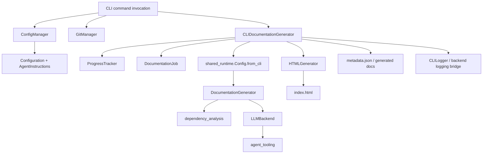
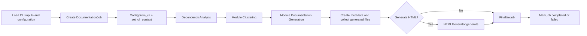
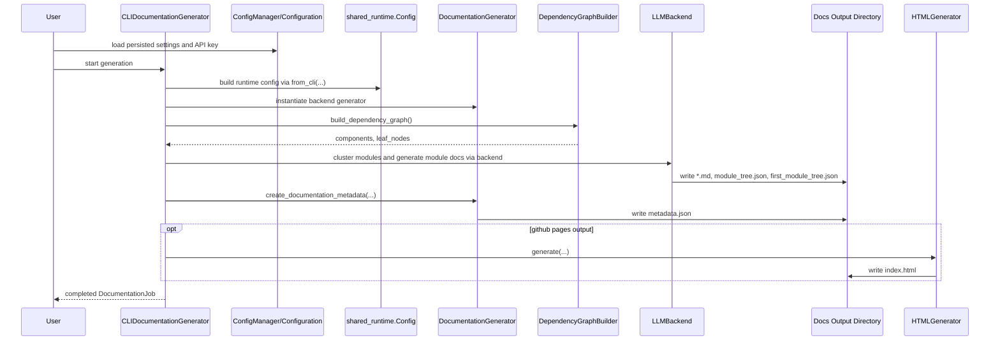
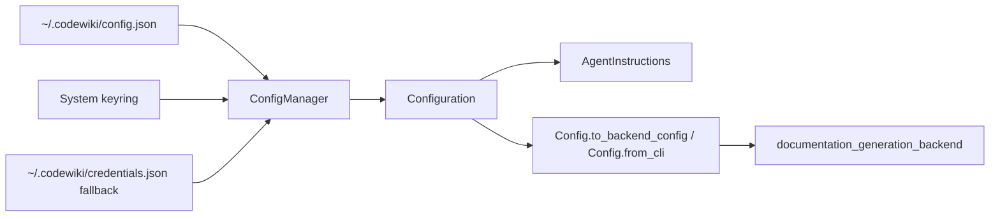
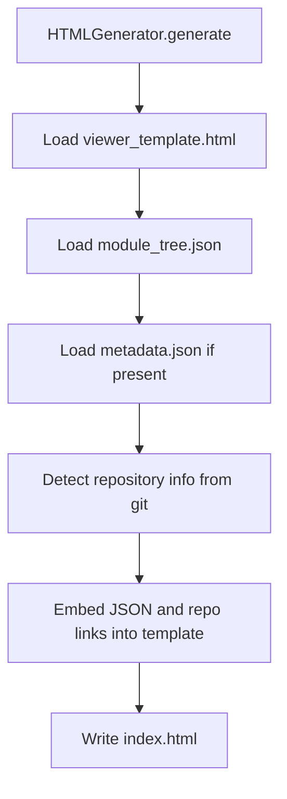
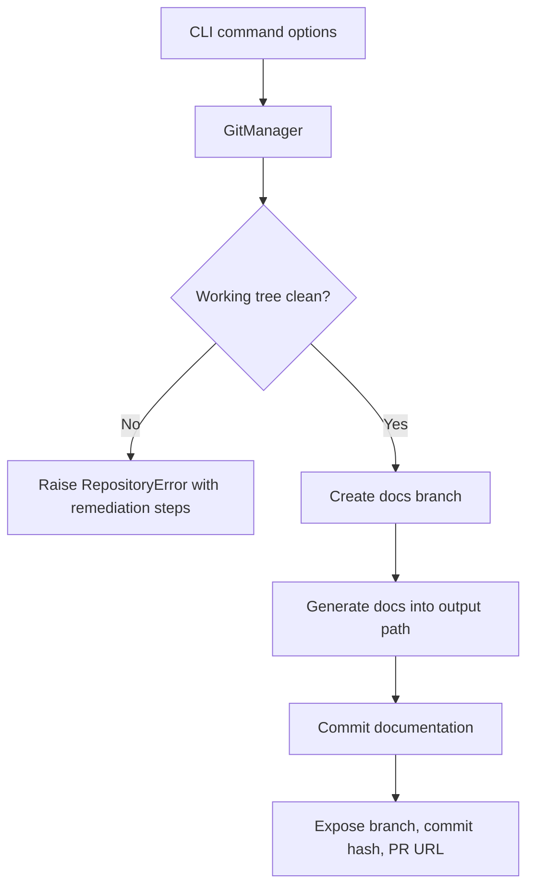

# CLI Interface

The `cli_interface` module is the operational shell around CodeWiki's documentation engine. It translates user-facing CLI intent into backend runtime configuration, tracks a documentation job from start to finish, manages local operator concerns such as progress and logging, and optionally packages the generated Markdown into a browsable static HTML viewer.

This module does not perform dependency analysis or LLM-driven documentation authoring itself. Those responsibilities remain in [documentation_generation_backend](documentation_generation_backend.md), [dependency_analysis](dependency_analysis.md), and [agent_tooling](agent_tooling.md). The CLI layer exists to make those services usable as a repeatable command-line workflow.

## Module Scope

### Primary responsibilities

- Adapt persisted CLI configuration into backend runtime configuration.
- Start and monitor a `DocumentationJob` for a single repository run.
- Provide human-readable progress, logging, and status output.
- Manage optional repository-side git operations around generated docs.
- Generate optional `index.html` output for static hosting.

### Explicit non-responsibilities

- Parsing source code or building dependency graphs.
- Choosing module boundaries beyond delegating to backend clustering.
- Authoring module Markdown with direct LLM logic.
- Serving documentation over HTTP.

## Architecture Overview

## Component Responsibilities

| Component | Role in the module | Key interactions |
| --- | --- | --- |
| `CLIDocumentationGenerator` | Main orchestration adapter for CLI-driven generation | Builds backend config, invokes backend pipeline, manages progress, collects artifacts, optionally triggers HTML generation |
| `ConfigManager` | Persistent configuration and credential storage | Loads and saves `Configuration`, uses system keyring when possible, falls back to local credentials file |
| `GitManager` | Repository hygiene and optional commit/branch workflow | Checks working tree state, creates docs branches, stages and commits output, derives GitHub URLs |
| `HTMLGenerator` | Post-processing for static viewing | Reads `module_tree.json` and `metadata.json`, injects them into a template-backed `index.html` |
| `Configuration` | Persistent CLI-facing config model | Stores provider, model, token, output, and instruction settings; converts to backend `Config` |
| `AgentInstructions` | User guidance overlay for generation | Carries include/exclude patterns, focus modules, doc type, and custom prompt additions |
| `DocumentationJob` and related models | Runtime job state and result envelope | Captures timestamps, status, LLM settings, file list, module count, and summary statistics |
| `CLILogger` | Lightweight CLI console logger | Emits formatted info, step, success, warning, and error output |
| `ProgressTracker` / `ModuleProgressBar` | Progress presentation | Represents staged workflow and optional per-module progress output |

## Runtime Pipeline

`CLIDocumentationGenerator` is the control point for the module. It wraps the backend generator and converts a backend-oriented process into a CLI-oriented job lifecycle.

### Stage semantics

`ProgressTracker` models five stages:

1. Dependency analysis
2. Module clustering
3. Documentation generation
4. HTML generation
5. Finalization

In practice, `CLIDocumentationGenerator` explicitly reports stages 1 through 4 and performs finalization inline by verifying or backfilling `metadata.json` before completing the job object.

## End-to-End Data Flow

## Configuration Architecture

The module separates persistent operator preferences from backend runtime state.

### Configuration layers

- `ConfigManager` owns disk and keyring I/O.
- `Configuration` is the durable, user-editable settings model.
- `AgentInstructions` holds generation guidance that becomes prompt additions at runtime.
- `codewiki.src.config.Config` is the backend runtime contract consumed by the generator and LLM backends.

### Provider-aware behavior

The CLI config layer is responsible for handling the difference between:

- API-key providers, which require base URL, model configuration, and credentials.
- Subscription CLI providers such as Codex or Claude Code, which validate mainly on `main_model` and delegate authentication to the installed upstream CLI.

This provider split is enforced in both `Configuration.validate()` and `ConfigManager.is_configured()`, then carried into backend selection through [documentation_generation_backend](documentation_generation_backend.md).

### Instruction propagation

`AgentInstructions` is the CLI-side extension point for controlling generation intent:

- `include_patterns` and `exclude_patterns` constrain repository scope.
- `focus_modules` identifies areas deserving more detail.
- `doc_type` changes the documentation emphasis, including architecture-oriented output.
- `custom_instructions` appends free-form operator guidance.

These instructions are serialized into backend `Config.agent_instructions`, where the backend converts them into prompt additions instead of exposing prompt construction directly in the CLI layer.

## Backend Integration Boundary

The module is intentionally thin at the engine boundary:

- `CLIDocumentationGenerator` instantiates `DocumentationGenerator`.
- `DocumentationGenerator` owns dependency graph construction, module ordering, module generation, and overview creation.
- Backend provider resolution chooses `PydanticAIBackend` or `CawBackend` through `get_backend()`.
- Per-module agent execution and sub-module delegation live in [agent_tooling](agent_tooling.md), not in the CLI module.

This boundary keeps the CLI layer stable even as backend prompting, agent recursion, or dependency-analysis strategies evolve.

## Output and Artifact Lifecycle

### Generated artifacts

- `*.md` module documentation files
- `overview.md`
- `first_module_tree.json`
- `module_tree.json`
- `metadata.json`
- `index.html` when HTML generation is enabled

### Artifact ownership

- Backend generation owns Markdown, module trees, and the primary metadata file.
- `CLIDocumentationGenerator` collects artifact names into `DocumentationJob.files_generated`.
- CLI finalization verifies `metadata.json` exists and, if necessary, writes fallback job metadata into that same file.
- `HTMLGenerator` is a pure post-processor over existing docs artifacts.

### HTML generation flow

The HTML viewer is intentionally decoupled from the generation backend. It consumes documentation artifacts after generation rather than influencing how docs are produced.

## Git Integration

`GitManager` is an operational helper rather than part of the core documentation pipeline. It supports workflows where generated docs should be isolated and published through version control.

### Supported operations

- Validate that the target repository is a Git repository.
- Check for dirty working trees before creating a documentation branch.
- Create timestamped branches such as `docs/codewiki-YYYYMMDD-HHMMSS`.
- Commit generated documentation into the repository index.
- Derive repository remote URLs and GitHub compare links.

### Interaction model

Git actions remain optional so documentation generation can still run against local directories, CI workspaces, or repositories where commit side effects are undesirable.

## Job Model and Observability

The job models provide the CLI-facing execution record for one run.

### `DocumentationJob`

Tracks:

- Repository identity and output directory
- Start and end timestamps
- Execution status: `pending`, `running`, `completed`, `failed`
- Generated files and module count
- Effective LLM configuration
- Aggregate statistics such as analyzed files and leaf node count

### Logging and progress

- `CLILogger` formats human-facing output for normal and verbose modes.
- `CLIDocumentationGenerator._configure_backend_logging()` bridges backend logs into CLI-friendly colored streams.
- `ProgressTracker` provides phase-based progress reporting and ETA estimation.
- `ModuleProgressBar` exists for module-by-module feedback in non-verbose mode, although the adapter shown here primarily uses stage-level progress.

## Failure Model

The CLI module standardizes failures into operator-visible boundaries rather than allowing backend exceptions to leak uncontextualized.

- Dependency analysis, clustering, and documentation-generation failures are wrapped as `APIError` with stage-specific context.
- Configuration load/save and validation failures remain within `ConfigManager` and the config models.
- Repository setup failures are surfaced through `RepositoryError`.
- HTML metadata loading failures are treated as non-critical when possible, allowing the viewer to render with reduced repository info.

This approach keeps the CLI contract stable: callers receive a completed or failed `DocumentationJob`, plus clear console output for the stage that failed.

## How This Module Fits the System

The `cli_interface` module is the command-line façade for the CodeWiki system:

- It sits above [documentation_generation_backend](documentation_generation_backend.md) and packages backend capabilities into a runnable workflow.
- It depends on [shared_runtime](shared_runtime.md) for runtime configuration and common file/logging utilities.
- It delegates code understanding to [dependency_analysis](dependency_analysis.md).
- It relies on [agent_tooling](agent_tooling.md) indirectly through the backend when module-level agents are invoked.
- It complements, rather than overlaps with, [web_frontend](web_frontend.md), which exposes similar generation capabilities through an HTTP/UI-oriented flow instead of a local CLI flow.

For maintainers, the practical rule is:

- Change the CLI module when the operator experience, persistence model, git workflow, or packaging outputs need to change.
- Change backend or analyzer modules when the actual repository understanding or documentation-generation behavior needs to change.
