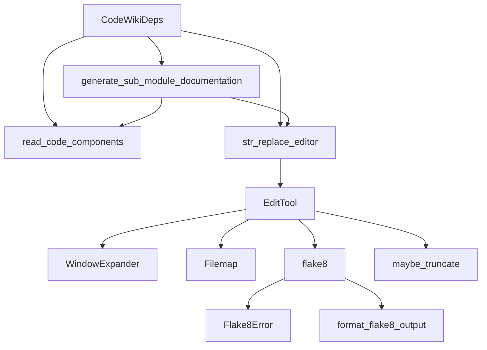
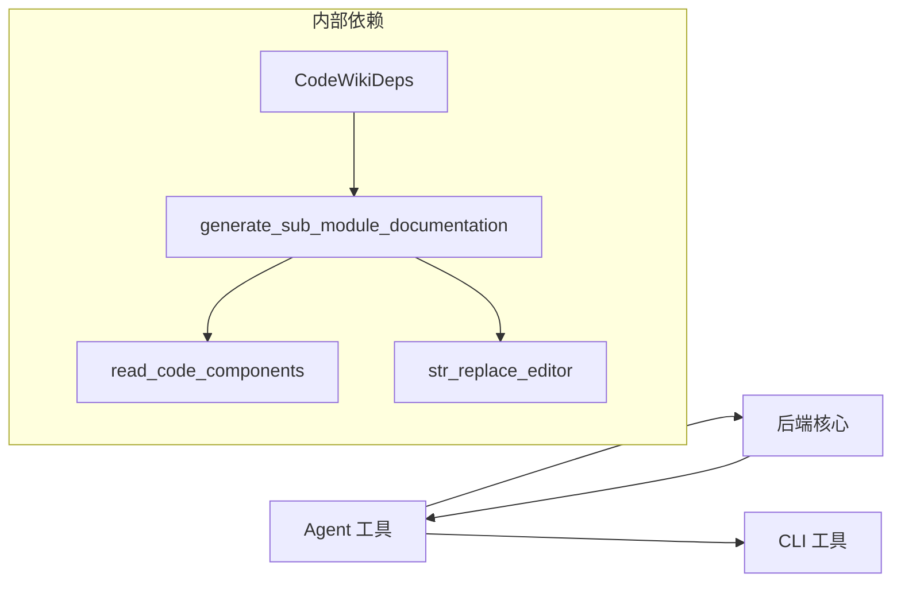
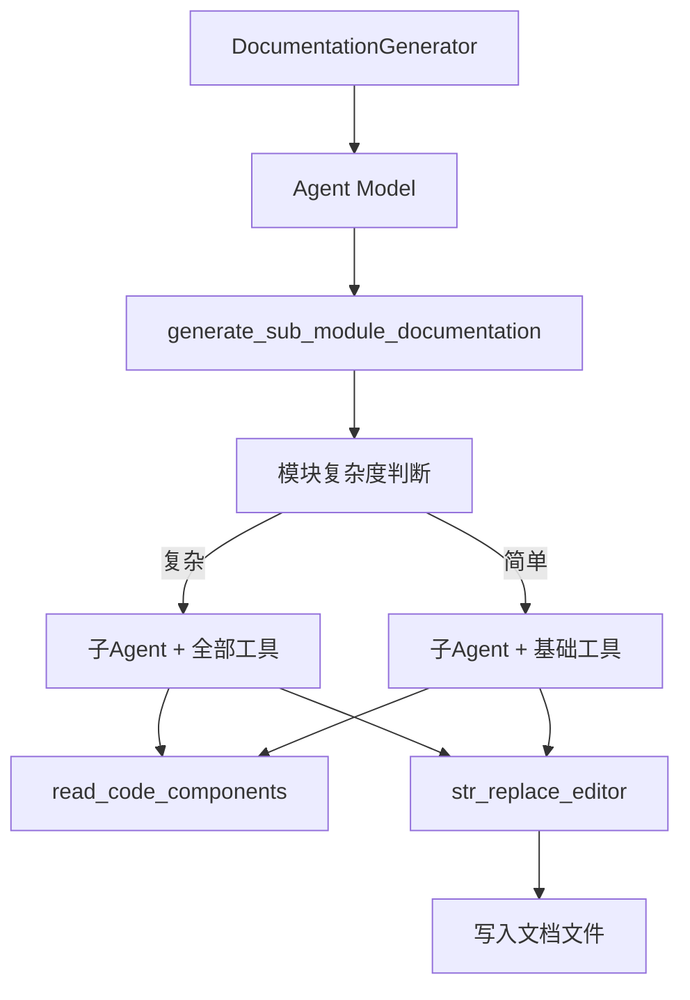

# Agent 工具

## 简介

Agent 工具模块是 CodeWiki 后端中为 AI Agent 提供基础设施的工具集，位于 `codewiki/src/be/agent_tools/`。该模块包含依赖注入容器、代码组件读取、文档生成子代理委托以及文件系统编辑器等核心能力，为 LLM 驱动的文档生成流程提供运行环境。

## 架构概览

## 核心组件

### CodeWikiDeps

> **文件**: `codewiki/src/be/agent_tools/deps.py`

Agent 依赖注入容器，为 AI Agent 提供运行时上下文。它作为一个数据中心类，在文档生成流程中承载所有必要信息。

| 属性 | 类型 | 说明 |
|------|------|------|
| `absolute_docs_path` | `str` | 文档输出目录的绝对路径 |
| `absolute_repo_path` | `str` | 被分析仓库的绝对路径 |
| `registry` | `dict` | 键值注册表，用于跨工具通信 |
| `components` | `dict[str, Node]` | 所有代码组件的索引字典 |
| `path_to_current_module` | `list[str]` | 当前模块在模块树中的路径 |
| `current_module_name` | `str` | 当前正在处理的模块名 |
| `module_tree` | `dict` | 完整的模块聚类树 |
| `max_depth` | `int` | 子模块递归最大深度 |
| `current_depth` | `int` | 当前递归深度 |
| `config` | `Config` | LLM 配置 |
| `custom_instructions` | `str` | 自定义指令 |

### generate_sub_module_documentation

> **文件**: `codewiki/src/be/agent_tools/generate_sub_module_documentations.py`

将文档生成任务委托给子 Agent。当模块需要被细分为更小粒度的子模块时，此函数创建子 Agent 并并行生成各子模块的文档。

**核心逻辑**：

1. 接收 `sub_module_specs`（子模块名到组件 ID 列表的映射）
2. 将子模块注册到模块树中
3. 对每个子模块：
   - 使用 `is_complex_module()` 判断是否需递归委托
   - 复杂模块分配 `generate_sub_module_documentation` + `str_replace_editor` + `read_code_components` 工具
   - 简单模块仅分配 `str_replace_editor` + `read_code_components` 工具
4. 使用 `format_user_prompt()` 生成提示词并运行子 Agent

**递归终止条件**：
- `current_depth >= max_depth` — 达到最大递归深度
- `token_count < max_token_per_leaf_module` — Token 数量在单模块可处理范围内
- 模块判断为非复杂模块

### read_code_components

> **文件**: `codewiki/src/be/agent_tools/read_code_components.py`

从组件索引中读取指定组件的源代码。组件 ID 格式为 `文件路径::组件名`（如 `auth/middleware.py::verify_token`）。如果组件不在索引中，返回 "not found" 提示。

### str_replace_editor（文件系统编辑器）

> **文件**: `codewiki/src/be/agent_tools/str_replace_editor.py`

提供给 AI Agent 使用的完整文件系统编辑器，支持视图、创建、替换、插入和撤销操作。

**命令列表**：

| 命令 | 说明 |
|------|------|
| `view` | 查看文件或目录内容，支持 `view_range` 行范围 |
| `create` | 创建新文件 |
| `str_replace` | 在文件中查找并替换字符串（需唯一匹配） |
| `insert` | 在指定行插入文本 |
| `undo_edit` | 撤销最近一次编辑 |

#### EditTool

编辑器核心类，实现所有文件操作。关键属性：

- `REGISTRY`：跨工具共享状态注册表
- `absolute_docs_path`：文档输出根目录
- `_file_history`：文件编辑历史，用于 `undo_edit`

**`view` 命令特性**：
- 目录模式：列出最多 2 层深度的文件（排除隐藏项）
- 文件模式：显示指定行范围内容
- 大文件（>100K）：使用 `Filemap` 生成缩略视图
- `WindowExpander`：智能扩展视口到函数/类边界

**`str_replace` 命令特性**：
- 要求 `old_str` 在文件中唯一出现
- 集成 Flake8 代码检查（编辑前后对比）
- 替换后自动跑 lint 并过滤已存在的错误
- 显示编辑片段便于确认

#### WindowExpander

智能视口扩展器，替代固定行数窗口。通过分析代码结构（空行、函数定义、类定义等）找到自然断点。

- `_find_breakpoints()`：沿指定方向（上/下）搜索断点，按优先级评分
- `expand_window()`：双向扩展视口到最近的代码边界

#### Filemap

大文件缩略视图生成器。使用 tree-sitter 解析 Python 文件，折叠函数体（超过 5 行）并用行号标注，帮助 Agent 快速了解文件结构。

#### flake8 / Flake8Error / format_flake8_output

代码质量检查工具链：

- `flake8()`：对指定文件运行 flake8（仅检查 F821/F822/F831/E 系列错误）
- `Flake8Error`：flake8 错误的解析模型，支持从输出行反序列化
- `format_flake8_output()`：格式化 lint 输出，过滤已有错误并只报告编辑窗口内的新错误

#### _coerce_json_string / maybe_truncate

辅助函数：

- `_coerce_json_string()`：兼容本地模型通过 OpenAI 兼容端点传输的 JSON 编码字符串参数（如 `"[1, 50]"` → `[1, 50]`），确保 pydantic 严格验证通过
- `maybe_truncate()`：内容超长时截断并附加提示信息

## 模块依赖关系

- 本模块通过 `CodeWikiDeps` 依赖 [后端核心](后端核心.md) 中的 `Config`、`count_tokens`、`is_complex_module` 等
- 通过 `logger` 依赖 [CLI 工具](CLI 工具.md) 中的日志函数
- [后端核心](后端核心.md) 中的 `CawBackend` 和 `PydanticAIBackend` 调用本模块的工具来执行文档生成

## 数据流

## 关键设计决策

1. **递归委托**：通过子 Agent 递归处理复杂模块，而非一次性加载所有源码，有效控制 Token 消耗
2. **WindowExpander**：智能视口扩展而非固定行数，使 Agent 获取函数/类的完整上下文
3. **Lint 集成**：编辑后自动运行 flake8 并区分新旧错误，降低 Agent 引入 bug 的风险
4. **JSON 兼容**：`_coerce_json_string` 解决本地模型参数序列化问题，提升多 LLM 兼容性
5. **Filemap 缩略图**：对大文件提供函数级结构概览，避免直接暴露全部内容导致 Token 超限