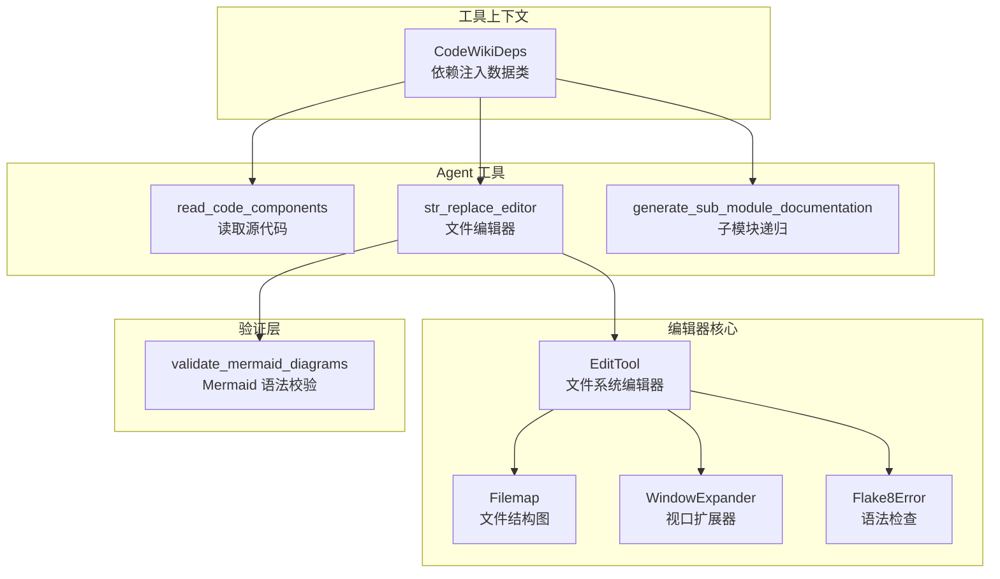
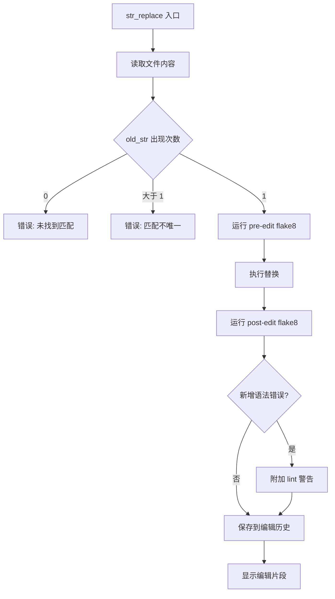
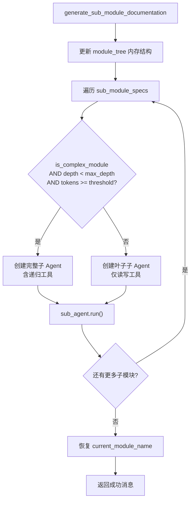
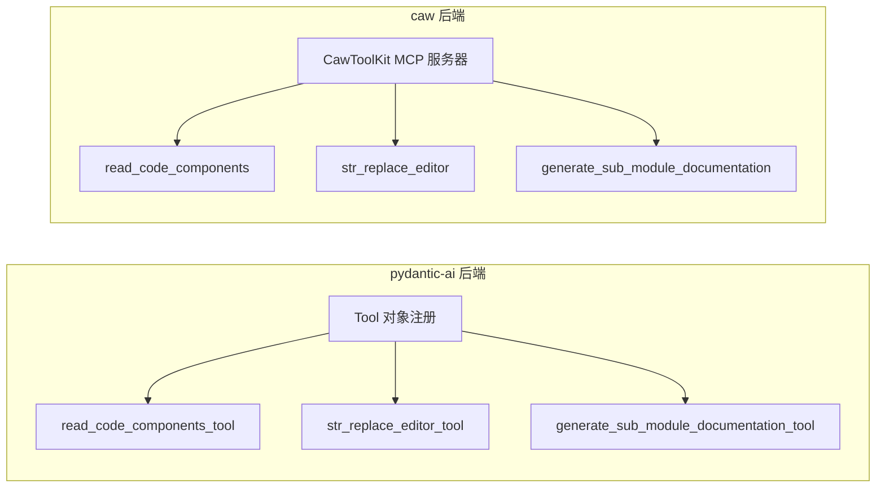

# Agent 工具集

## 模块概述

Agent 工具集是 CodeWiki-CN 中 LLM Agent 在文档生成过程中可以调用的全部工具集合。这些工具赋予 Agent 读取源代码、创建/编辑文档文件、以及递归生成子模块文档的能力。工具集在 pydantic-ai 和 caw 两种后端路径下共享核心实现，确保行为一致性。

### 核心功能

- **依赖注入上下文**（`CodeWikiDeps`）：为所有工具提供模块状态、组件映射和配置信息
- **文件编辑工具**（`EditTool` / `str_replace_editor`）：支持查看、创建、字符串替换、插入和撤销操作
- **源代码读取**（`read_code_components`）：按组件 ID 读取对应源代码
- **子模块文档递归**（`generate_sub_module_documentation`）：将复杂模块拆分给子 Agent 并行生成文档
- **Mermaid 图表验证**：每次文件编辑后自动校验 Mermaid 语法正确性

## 架构总览



## 组件详解

### 1. CodeWikiDeps — 依赖注入上下文

`CodeWikiDeps` 是一个数据类，作为 pydantic-ai 的 `deps_type` 注入到所有 Agent 工具中，提供当前模块的完整状态信息。

**文件路径**: `codewiki/src/be/agent_tools/deps.py`

```python
@dataclass
class CodeWikiDeps:
    absolute_docs_path: str          # 文档输出目录的绝对路径
    absolute_repo_path: str          # 代码仓库的绝对路径
    registry: dict                   # 持久化状态（如文件编辑历史）
    components: dict[str, Node]      # 组件 ID 到 Node 对象的映射
    path_to_current_module: list[str]  # 当前模块在树中的路径
    current_module_name: str         # 当前模块名称
    module_tree: dict[str, any]      # 完整的模块树结构
    max_depth: int                   # 最大递归深度
    current_depth: int               # 当前递归深度
    config: Config                   # LLM 配置
    custom_instructions: str = None  # 自定义指令
```

**设计要点**：
- `registry` 字典用于持久化 `EditTool` 的文件编辑历史，支持 `undo_edit` 操作
- `components` 存储了所有代码组件的 `Node` 对象，包含源代码、相对路径等信息
- `module_tree` 是内存中的模块树，子 Agent 递归时会动态更新

### 2. EditTool — 文件系统编辑器

`EditTool` 是 CodeWiki 中最复杂的工具组件，源自 SWE-agent 项目，支持五种文件操作命令。

**文件路径**: `codewiki/src/be/agent_tools/str_replace_editor.py`

#### 支持的命令

| 命令 | 功能 | 工作目录限制 |
|------|------|----------|
| `view` | 查看文件内容或目录结构 | repo 和 docs 均可 |
| `create` | 创建新文件（不可覆盖） | 仅 docs |
| `str_replace` | 字符串替换（要求唯一匹配） | 仅 docs |
| `insert` | 在指定行插入内容 | 仅 docs |
| `undo_edit` | 撤销最近一次编辑 | 仅 docs |

#### 核心实现

```python
class EditTool:
    name = "str_replace_editor"

    def __init__(self, REGISTRY, absolute_docs_path=None):
        self.REGISTRY = REGISTRY
        self.logs = []
        self.absolute_docs_path = Path(absolute_docs_path) \
            if absolute_docs_path else None

    def __call__(self, *, command, path, file_text=None,
                 view_range=None, old_str=None, new_str=None,
                 insert_line=None, **kwargs):
        _path = Path(path)
        if not self.validate_path(command, _path):
            return
        if command == "view":
            return self.view(_path, view_range)
        elif command == "create":
            self.create_file(_path, file_text)
        elif command == "str_replace":
            return self.str_replace(_path, old_str, new_str)
        elif command == "insert":
            return self.insert(_path, insert_line, new_str)
        elif command == "undo_edit":
            return self.undo_edit(_path)
```

#### str_replace 命令流程



**关键安全设计**：
- `str_replace` 要求 `old_str` 在文件中必须**唯一匹配**，防止误修改
- 编辑历史通过 `registry` 持久化，支持多次 `undo_edit`
- 可选的 flake8 语法检查能在编辑后捕获新引入的语法错误

#### 文件编辑与 Mermaid 验证集成

`str_replace_editor` 函数是 EditTool 的高层封装，每次非 view 的 `.md` 文件操作后自动触发 Mermaid 验证：

```python
async def str_replace_editor(ctx, working_dir, command, path=None, ...):
    tool = EditTool(ctx.deps.registry, ctx.deps.absolute_docs_path)

    # 解析工作目录
    if working_dir == "docs":
        absolute_path = str(Path(ctx.deps.absolute_docs_path) / path)
    else:
        absolute_path = str(Path(ctx.deps.absolute_repo_path) / path)

    tool(command=command, path=absolute_path, ...)
    result = "\n".join(tool.logs)

    # 自动 Mermaid 验证
    if command != "view" and path.endswith(".md"):
        mermaid_validation = await validate_mermaid_diagrams(
            absolute_path, path
        )
        result += "\n---------- Mermaid validation ----------\n"
        result += mermaid_validation
    return result
```

### 3. WindowExpander — 智能视口扩展

`WindowExpander` 用于将查看范围扩展到完整的函数/类边界，而非固定行数窗口。

```python
class WindowExpander:
    def expand_window(self, lines, start, stop, max_added_lines):
        """将视口扩展到完整的函数/类边界。"""
        new_start = self._find_breakpoints(
            lines, start, direction=-1,
            max_added_lines=max_added_lines
        )
        new_stop = self._find_breakpoints(
            lines, stop, direction=1,
            max_added_lines=max_added_lines
        )
        return new_start, new_stop
```

**断点评分策略**（分数越高越优先）：

| 分数 | 条件 |
|------|------|
| 3 | Python 的 `def`、`class`、`@装饰器`，或文件首尾行 |
| 2 | 双空行 |
| 1 | 单空行 |

### 4. Filemap — 文件结构图

`Filemap` 利用 tree-sitter 解析 Python 文件，生成省略函数体的结构概览。

```python
class Filemap:
    def show_filemap(self, file_contents, encoding="utf8"):
        parser = get_parser("python")
        language = get_language("python")
        tree = parser.parse(bytes(file_contents.encode(encoding)))

        # 查找所有函数体
        query = language.query("""
        (function_definition body: (_) @body)
        """)

        # 省略足够长的函数体（>= 5 行）
        elide_line_ranges = [
            (node.start_point[0], node.end_point[0])
            for node, _ in query.captures(tree.root_node)
            if node.end_point[0] - node.start_point[0] >= 5
        ]
        # 生成带省略标记的文件概览
```

**使用场景**：当 Python 文件内容超过 `MAX_RESPONSE_LEN`（16000 字符）时，自动切换到 Filemap 模式显示文件结构，而非完整内容。

### 5. Flake8Error 与语法检查

`Flake8Error` 类封装了 flake8 语法检查的错误信息，支持编辑前后的错误对比。

```python
class Flake8Error:
    def __init__(self, filename, line_number, col_number, problem):
        self.filename = filename
        self.line_number = line_number
        self.col_number = col_number
        self.problem = problem

    @classmethod
    def from_line(cls, line: str):
        """从 flake8 输出行解析错误信息。"""
        prefix, _sep, problem = line.partition(": ")
        filename, line_number, col_number = prefix.split(":")
        return cls(filename, int(line_number),
                   int(col_number), problem)
```

**编辑前后错误过滤流程**：

```python
def format_flake8_output(input_string, show_line_numbers=False, *,
                         previous_errors_string="",
                         replacement_window=None,
                         replacement_n_lines=None):
    """过滤 flake8 输出，仅报告编辑引入的新错误。"""
    errors = [Flake8Error.from_line(line.strip())
              for line in input_string.split("\n") if line.strip()]
    if previous_errors_string:
        # 更新旧错误行号，排除编辑窗口内的错误
        previous_errors = _update_previous_errors(
            previous_errors, replacement_window,
            replacement_n_lines
        )
        # 仅保留新增错误
        errors = [e for e in errors if e not in previous_errors]
        errors = [e for e in errors
                  if e.line_number >= replacement_window[0]]
```

**flake8 检查规则**：仅检查以下严重语法错误：
- `F821` / `F822` / `F831`：未定义名称/属性/重复参数
- `E111` / `E112` / `E113`：缩进错误
- `E999` / `E902`：语法错误/IO 错误

### 6. read_code_components — 源代码读取

`read_code_components` 是最简单但最常用的工具，根据组件 ID 列表返回对应的源代码。

**文件路径**: `codewiki/src/be/agent_tools/read_code_components.py`

```python
async def read_code_components(
    ctx: RunContext[CodeWikiDeps],
    component_ids: list[str]
) -> str:
    """读取组件 ID 列表对应的源代码。

    Args:
        component_ids: 组件 ID 列表，格式如
            ["sweagent/types.py::AgentRunResult",
             "auth/middleware.py::verify_token"]
    """
    results = []
    for component_id in component_ids:
        if component_id not in ctx.deps.components:
            results.append(f"# Component {component_id} not found")
        else:
            results.append(
                f"# Component {component_id}:\n"
                f"{ctx.deps.components[component_id].source_code.strip()}\n\n"
            )
    return "\n".join(results)
```

**工具注册**：

```python
read_code_components_tool = Tool(
    function=read_code_components,
    name="read_code_components",
    description="Read the code of a given list of component ids",
    takes_ctx=True
)
```

### 7. generate_sub_module_documentation — 子模块递归

子模块文档生成工具允许 Agent 将复杂模块拆分为多个子模块，并为每个子模块启动独立的子 Agent 生成文档。

**文件路径**: `codewiki/src/be/agent_tools/generate_sub_module_documentations.py`



**递归控制条件**：

子模块是否继续递归取决于三个条件的交集：

```python
can_recurse = (
    is_complex_module(ctx.deps.components, core_component_ids)
    and ctx.deps.current_depth < ctx.deps.max_depth
    and num_tokens >= ctx.deps.config.max_token_per_leaf_module
)
```

| 条件 | 含义 |
|------|------|
| `is_complex_module` | 模块包含多个文件的组件 |
| `current_depth < max_depth` | 未达到最大递归深度 |
| `num_tokens >= max_token_per_leaf_module` | 组件总 token 数超过叶子模块阈值 |

**状态管理**：

子模块递归过程中需要维护的关键状态：
- `deps.current_module_name`：进入子模块时更新，退出时恢复
- `deps.path_to_current_module`：追加子模块名，退出时 pop
- `deps.current_depth`：递增，退出时递减
- `deps.module_tree`：在内存中持续更新，所有子 Agent 共享

## 工具在不同后端的暴露方式



两种后端共享相同的 `EditTool` 核心实现和 Mermaid 验证逻辑，仅在工具注册方式上有所不同：
- **pydantic-ai**：使用 `Tool` 对象直接注册到 `Agent`
- **caw**：使用 `@tool` 装饰器注册到 `CawToolKit`（继承 `ToolKit`），通过 MCP 协议暴露

## JSON 参数兼容性处理

部分本地模型（LiteLLM、vLLM、Ollama 等）将列表和整数参数以 JSON 字符串形式发送（如 `"[1, 50]"` 而非 `[1, 50]`）。工具集通过两处兼容层解决此问题：

```python
# pydantic-ai 路径：pydantic BeforeValidator
ViewRange = Annotated[
    Optional[List[int]],
    BeforeValidator(_coerce_json_string)
]
InsertLine = Annotated[
    Optional[int],
    BeforeValidator(_coerce_json_string)
]

# caw 路径：手动解析
def _coerce_json_arg(value):
    if isinstance(value, str):
        try:
            return json.loads(value)
        except ValueError:
            pass
    return value
```

## 跨模块引用

- [LLM 后端与服务](LLM%20后端与服务.md)：介绍 `CawToolKit` 如何嵌入 caw Agent，以及 `PydanticAIBackend` 如何注册工具
- [后端工具与流程](后端工具与流程.md)：展示工具在 `DocumentationGenerator` 整体流程中的调用时机

## 错误处理策略

| 场景 | 处理方式 |
|------|----------|
| 组件 ID 不存在 | 返回 `# Component {id} not found` 消息 |
| 文件路径不存在 | 返回友好错误提示并建议正确路径 |
| `old_str` 不唯一 | 报告所有匹配行号，要求 Agent 提供更多上下文 |
| 路径逃逸工作目录 | 拒绝操作并提示使用相对路径 |
| Mermaid 语法错误 | 返回详细错误信息（行号 + 错误描述），Agent 可据此修复 |
| 编码错误 | 依次尝试 None → utf-8 → latin-1 → utf-8+replace 编码 |
