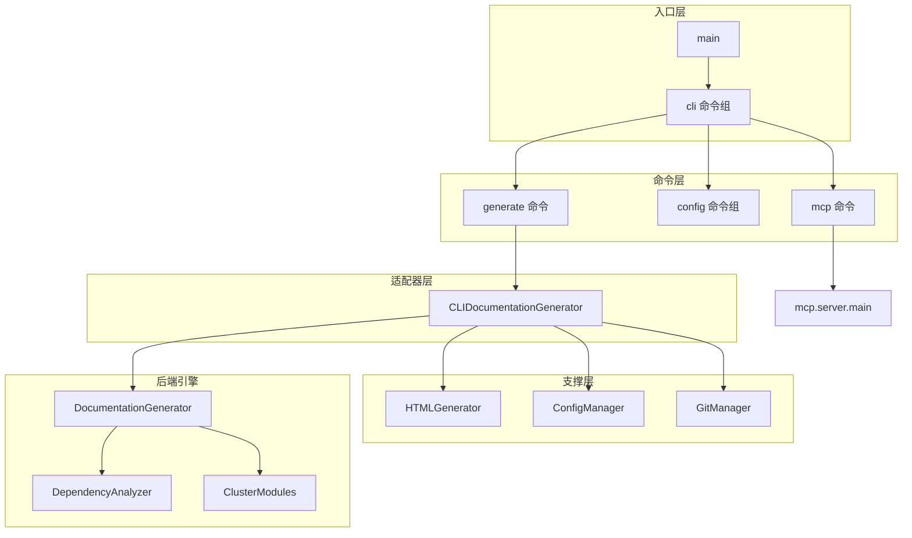
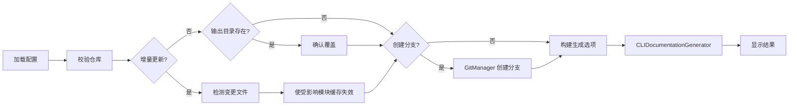
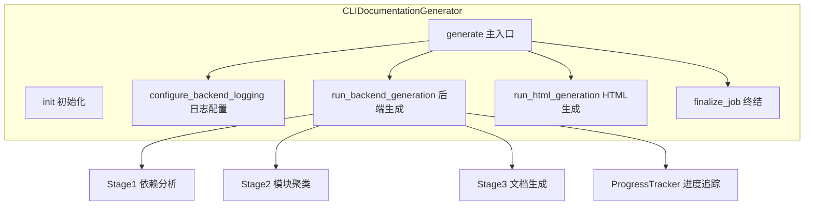
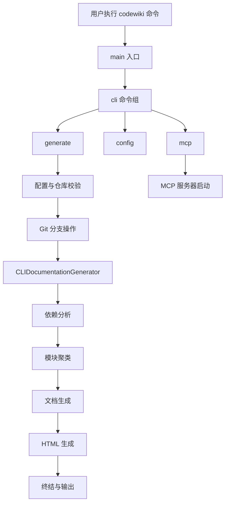

# CLI 入口与命令

## 模块概述

CLI 入口与命令模块是 CodeWiki 命令行工具的核心入口层，负责接收用户输入、解析命令行参数、协调各子系统完成文档生成任务。该模块基于 Python 的 `click` 框架构建，提供了 `codewiki` 主命令及其子命令（`generate`、`config`、`mcp`），并通过适配器模式将 CLI 层与后端文档生成引擎解耦。

### 核心功能

- **命令行入口管理**：通过 `click` 框架定义 CLI 命令组和子命令，统一处理异常和退出码
- **文档生成调度**：`generate` 命令执行完整的文档生成流水线，包括配置加载、仓库校验、分支创建、文档生成和结果输出
- **配置管理命令**：`config` 命令组提供 API 密钥设置、配置验证等子命令
- **MCP 协议服务**：`mcp` 命令将 CodeWiki 作为 MCP 服务器启动，供外部工具（如 Claude、Cursor）调用
- **HTML 查看器生成**：可选生成静态 HTML 文档查看器，支持 GitHub Pages 部署
- **增量更新支持**：通过 `--update` 标志检测变更文件，仅重新生成受影响的模块文档

## 架构设计



## 组件详解

### 1. main - 程序入口点

`main()` 函数是整个 CodeWiki CLI 的启动入口，负责调用 `cli()` 命令组并捕获顶层异常。

**职责：**
- 启动 CLI 命令组执行
- 捕获 `KeyboardInterrupt`（用户中断，退出码 130）
- 捕获未预期的异常并输出错误信息（退出码 1）

**代码示例：**

```python
def main():
    """Entry point for the CLI."""
    try:
        cli(obj={})
    except KeyboardInterrupt:
        click.echo("\n\nInterrupted by user", err=True)
        sys.exit(130)
    except Exception as e:
        click.secho(f"\n Unexpected error: {e}", fg="red", err=True)
        sys.exit(1)
```

### 2. cli - 命令组根节点

`cli()` 是 `click.group` 装饰的根命令组，定义了 CodeWiki 的全局描述和帮助信息。所有子命令（`generate`、`config`、`mcp`）均注册在此命令组下。

**职责：**
- 定义 CLI 根命令及其帮助文本
- 初始化 `click` 上下文对象 (`ctx.ensure_object(dict)`)
- 作为子命令的注册容器

**代码示例：**

```python
@click.group()
@click.pass_context
def cli(ctx):
    """CodeWiki: Transform codebases into comprehensive documentation."""
    ctx.ensure_object(dict)
```

### 3. generate_command - 文档生成命令

`generate` 是 CodeWiki 最核心的子命令，执行从配置校验到文档输出的完整流水线。该命令支持丰富的命令行参数来控制生成行为。

**职责：**
- 加载并验证配置（API 密钥、模型设置等）
- 校验当前目录是否为有效的代码仓库
- 可选创建 Git 文档分支
- 构建 `GenerationOptions` 和 `AgentInstructions` 运行时参数
- 实例化 `CLIDocumentationGenerator` 并执行文档生成
- 处理增量更新（`--update` 标志）
- 显示生成结果和后续操作指引

**支持的命令行参数：**

| 参数 | 说明 | 默认值 |
|------|------|--------|
| `--output` | 输出目录 | `docs` |
| `--create-branch` | 创建 Git 文档分支 | `False` |
| `--github-pages` | 生成 HTML 查看器 | `False` |
| `--no-cache` | 强制全量重新生成 | `False` |
| `--include` | 文件包含模式（如 `*.cs`） | `None` |
| `--exclude` | 文件排除模式（如 `*Tests*`） | `None` |
| `--focus` | 聚焦特定模块 | `None` |
| `--doc-type` | 文档类型（api/architecture 等） | `None` |
| `--instructions` | 自定义生成指令 | `None` |
| `--verbose` | 详细输出模式 | `False` |
| `--max-tokens` | LLM 最大 token 数 | 配置值 |
| `--max-depth` | 层次分解最大深度 | 配置值 |
| `--update` | 增量更新模式 | `False` |

**执行流水线：**



**使用示例：**

```bash
# 基础生成
codewiki generate

# 创建 Git 分支并生成 GitHub Pages
codewiki generate --create-branch --github-pages

# C# 项目：仅包含 .cs 文件，排除测试
codewiki generate --include "*.cs" --exclude "*Tests*,*Specs*"

# 聚焦特定模块
codewiki generate --focus "src/core,src/api" --doc-type architecture

# 增量更新
codewiki generate --update

# 覆盖 token 限制
codewiki generate --max-tokens 32768 --max-depth 3
```

### 4. config_group - 配置管理命令组

`config` 命令组提供 CodeWiki 配置的管理功能，包括 API 凭证设置、配置验证和配置清除等。

**职责：**
- 管理 LLM API 凭证（密钥、URL、模型名称）
- 验证配置完整性
- 持久化配置到本地文件

**关联组件：** 详见 [CLI 配置与模型](CLI%20配置与模型.md)

### 5. mcp_command - MCP 服务命令

`mcp` 命令将 CodeWiki 作为 MCP（Model Context Protocol）服务器启动，通过 stdio 传输协议暴露文档生成工具，供 Claude、Cursor 等 MCP 客户端调用。

**职责：**
- 启动异步 MCP 服务器
- 暴露文档生成工具供外部调用
- 使用 stdio 传输协议

**MCP 客户端配置示例：**

```json
{
    "mcpServers": {
        "codewiki": {
            "command": "codewiki",
            "args": ["mcp"]
        }
    }
}
```

**代码示例：**

```python
def mcp_command():
    """Start CodeWiki as an MCP server."""
    import asyncio
    from codewiki.mcp.server import main as mcp_main
    asyncio.run(mcp_main())
```

### 6. CLIDocumentationGenerator - CLI 适配器

`CLIDocumentationGenerator` 是 CLI 层与后端文档生成引擎之间的适配器类，封装了后端调用并添加了 CLI 特有的进度追踪、日志输出和错误处理功能。

**职责：**
- 封装后端 `DocumentationGenerator` 并添加 CLI 进度报告
- 管理 5 阶段文档生成流水线的进度追踪
- 配置后端日志输出（支持 verbose/normal 两种模式）
- 协调 HTML 生成和任务终结

**生成流水线 5 个阶段：**

| 阶段 | 名称 | 说明 |
|------|------|------|
| 1 | 依赖分析 | 解析源文件，构建依赖图，识别叶节点 |
| 2 | 模块聚类 | 使用 LLM 将叶节点聚类为逻辑模块 |
| 3 | 文档生成 | 为每个模块生成 Markdown 文档 |
| 4 | HTML 生成 | 可选生成静态 HTML 查看器 |
| 5 | 终结 | 创建元数据文件，完成作业记录 |

**初始化参数：**

```python
generator = CLIDocumentationGenerator(
    repo_path=Path("/path/to/repo"),
    output_dir=Path("/path/to/docs"),
    config={
        'main_model': 'gpt-4',
        'cluster_model': 'gpt-3.5-turbo',
        'fallback_model': 'glm-4p5',
        'base_url': 'https://api.openai.com/v1',
        'api_key': 'sk-...',
        'max_tokens': 32768,
        'max_depth': 2,
    },
    verbose=True,
    generate_html=True,
    commit_id="abc123",
)
job = generator.generate()
```

**内部架构：**



### 7. HTMLGenerator - HTML 查看器生成器

`HTMLGenerator` 负责生成自包含的静态 HTML 文档查看器（`index.html`），支持 GitHub Pages 部署。生成的 HTML 文件内嵌了样式、脚本和配置数据，可在客户端渲染 Markdown 文档。

**职责：**
- 从模板生成静态 HTML 文件
- 嵌入模块树、元数据和配置信息
- 自动检测仓库信息（名称、远程 URL、GitHub Pages URL）
- 加载并验证模块树和元数据文件

**核心方法：**

| 方法 | 说明 |
|------|------|
| `generate()` | 生成 HTML 文件，替换模板中的占位符 |
| `load_module_tree()` | 从文档目录加载模块树结构 |
| `load_metadata()` | 从文档目录加载元数据 |
| `detect_repository_info()` | 从 Git 检测仓库名称、URL 和 GitHub Pages URL |
| `_build_info_content()` | 构建仓库信息区域的 HTML 内容 |
| `_escape_html()` | HTML 特殊字符转义 |

**模板占位符：**

| 占位符 | 说明 |
|--------|------|
| `{{TITLE}}` | 文档标题 |
| `{{REPO_LINK}}` | 仓库链接 HTML |
| `{{SHOW_INFO}}` | 信息区域显示状态 |
| `{{INFO_CONTENT}}` | 仓库信息内容 |
| `{{CONFIG_JSON}}` | 配置 JSON |
| `{{MODULE_TREE_JSON}}` | 模块树 JSON |
| `{{METADATA_JSON}}` | 元数据 JSON |
| `{{DOCS_BASE_PATH}}` | 文档基础路径 |

**使用示例：**

```python
html_gen = HTMLGenerator()
repo_info = html_gen.detect_repository_info(repo_path)
html_gen.generate(
    output_path=Path("docs/index.html"),
    title=repo_info['name'],
    repository_url=repo_info['url'],
    github_pages_url=repo_info['github_pages_url'],
    docs_dir=Path("docs"),
)
```

## 命令执行流程总览



## 错误处理机制

`generate_command` 实现了分层的错误处理策略：

| 异常类型 | 处理方式 | 退出码 |
|----------|----------|--------|
| `ConfigurationError` | 输出配置错误信息 | 配置错误码 |
| `RepositoryError` | 输出仓库错误信息 | 仓库错误码 |
| `APIError` | 输出 API 错误信息 | API 错误码 |
| `KeyboardInterrupt` | 输出中断信息 | 130 |
| `Exception` | 通过 `handle_error` 处理 | 通用错误码 |

详见 [CLI 工具库](CLI%20工具库.md) 中的错误处理工具。

## 模块关系

- [CLI 配置与模型](CLI%20配置与模型.md) - 配置管理和数据模型定义
- [CLI 工具库](CLI%20工具库.md) - 工具类函数（Git 管理、日志、进度追踪、错误处理等）
- [MCP 服务端](MCP%20服务端.md) - MCP 协议服务器实现

## 版本信息

- **所属子系统**：CLI 子系统
- **主要依赖**：click、asyncio、gitpython
- **入口点**：`codewiki` 命令（通过 `setup.py` 或 `pyproject.toml` 注册的 console_scripts）