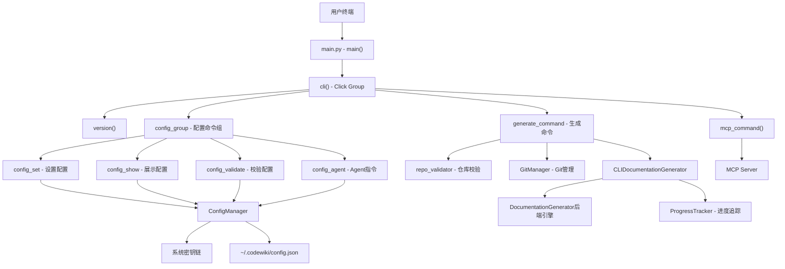
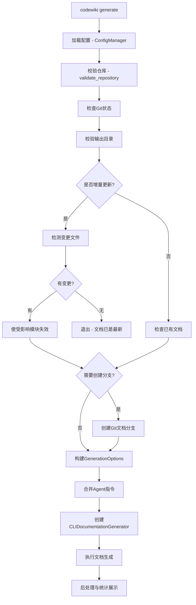
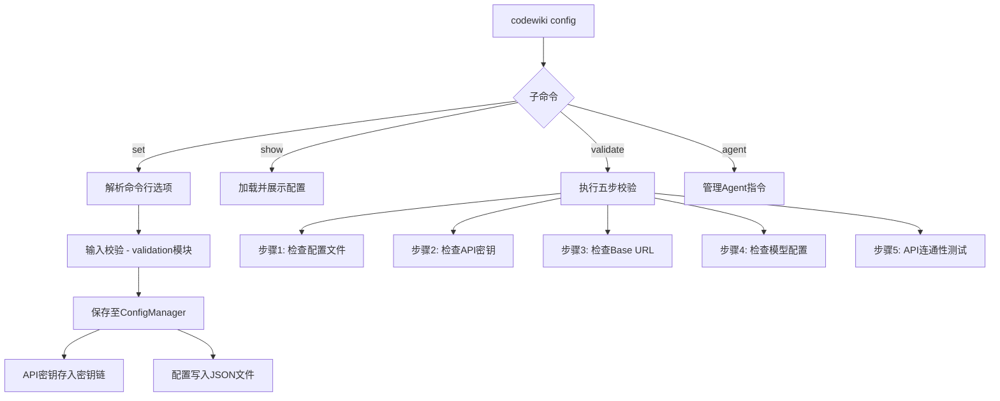

# CLI 入口与命令

## 模块简介

CLI 入口与命令模块是 CodeWiki 系统的用户交互层，负责接收用户输入、解析命令行参数、调度后端服务完成文档生成与配置管理。该模块基于 Python Click 框架构建，提供了结构化的子命令体系，涵盖配置管理（`config`）、文档生成（`generate`）、MCP 服务启动（`mcp`）以及版本信息查看（`version`）四大核心功能。

模块采用分层架构设计：顶层 `main.py` 负责命令注册与全局入口，`commands/` 目录下的各子模块实现具体命令逻辑，`models/` 层封装数据模型，`utils/` 层提供校验、错误处理、日志等通用工具，`adapters/` 层则作为 CLI 与后端引擎之间的桥梁。

## 核心功能

- **配置管理**：通过 `codewiki config set/show/validate/agent` 子命令组完成 API 密钥、模型选择、Token 限制、Provider 类型等全部配置项的设置、展示、校验与 Agent 指令管理
- **文档生成**：通过 `codewiki generate` 命令触发 AI 驱动的仓库文档生成流程，支持增量更新、Git 分支创建、GitHub Pages 部署等高级特性
- **MCP 服务**：通过 `codewiki mcp` 命令将 CodeWiki 作为 Model Context Protocol 服务器启动，通过 stdio 传输协议对外暴露文档生成工具
- **版本管理**：通过 `codewiki version` 命令展示当前 CLI 版本号与基本信息

## 架构图

### 整体架构



### 文档生成流程



### 配置管理流程



## 各组件职责说明

### main.py - CLI 应用入口

**文件路径**: `codewiki/cli/main.py`

该文件是整个 CLI 应用的起点，承担以下核心职责：

#### `cli()` - 命令组根节点

使用 `@click.group()` 装饰器定义根命令组，作为所有子命令的容器。同时通过 `@click.version_option()` 注入 `--version` 全局选项，允许用户快速查看版本号。函数内部调用 `ctx.ensure_object(dict)` 确保 Click 上下文对象始终可用，为后续命令间数据传递提供基础。

#### `version()` - 版本信息命令

独立的子命令，输出 CodeWiki CLI 的版本号和简要描述信息。版本数据来源于顶层包 `codewiki/__init__.py` 中定义的 `__version__` 变量。

#### `mcp_command()` - MCP 服务启动命令

负责将 CodeWiki 以 MCP (Model Context Protocol) 服务器模式启动。内部通过延迟导入 `codewiki.mcp.server` 模块的 `main` 函数，并使用 `asyncio.run()` 驱动异步事件循环。该命令使得 Claude、Cursor 等 MCP 客户端可以通过 stdio 传输协议调用 CodeWiki 的文档生成工具。

#### `main()` - 程序入口函数

作为 `setup.py` 或 `pyproject.toml` 中定义的 console_scripts 入口点。该函数执行 `cli(obj={})` 启动 Click 应用，并统一捕获 `KeyboardInterrupt`（用户中断，退出码 130）和通用异常（退出码 1），保证程序在任何情况下都能给出友好的错误提示并正确退出。

#### 命令注册机制

在模块级别通过 `cli.add_command()` 将 `config_group` 和 `generate_command` 注册到根命令组。这种延迟注册方式避免了循环导入问题，同时使命令组织结构与文件目录结构保持一致。

---

### commands/config.py - 配置管理命令组

**文件路径**: `codewiki/cli/commands/config.py`

该文件实现了 `codewiki config` 下的全部四个子命令，是 CLI 中代码量最大、功能最丰富的命令模块。

#### `parse_patterns()` - 模式解析工具函数

将逗号分隔的字符串（如 `"*.cs,*.py"`）解析为去空格后的列表。被 `config_agent` 和 `config_set` 命令复用，用于处理文件匹配模式输入。

#### `config_group()` - 配置命令组

使用 `@click.group(name="config")` 定义的命令组容器，下挂 `set`、`show`、`validate`、`agent` 四个子命令。

#### `config_set()` - 配置设置命令

核心配置写入命令，支持以下全部选项：

| 选项 | 类型 | 说明 |
|------|------|------|
| `--api-key` | str | LLM API 密钥，存储于系统密钥链 |
| `--base-url` | str | LLM API 基础 URL |
| `--main-model` | str | 主模型，用于文档生成 |
| `--cluster-model` | str | 聚类模型，用于模块聚类分析 |
| `--fallback-model` | str | 备用模型，主模型失败时回退 |
| `--max-tokens` | int | LLM 响应最大 Token 数（默认 32768） |
| `--max-token-per-module` | int | 每模块最大 Token 数（默认 36369） |
| `--max-token-per-leaf-module` | int | 每叶子模块最大 Token 数（默认 16000） |
| `--max-depth` | int | 层次分解最大深度（默认 2） |
| `--provider` | choice | LLM 提供商类型 |
| `--aws-region` | str | AWS Bedrock 区域 |
| `--api-version` | str | Azure OpenAI API 版本 |
| `--azure-deployment` | str | Azure OpenAI 部署名称 |

处理流程：
1. 检查是否至少提供了一个选项
2. 对每个提供的选项调用 [校验工具](#交叉引用) 进行格式验证（`validate_api_key`、`validate_url`、`validate_model_name`）
3. 对数值型选项进行正整数校验
4. 通过 [ConfigManager](配置管理与持久化.md) 加载已有配置并保存更新
5. 向用户展示成功信息，对于聚类模型非顶级 LLM 的情况发出质量警告

支持的 Provider 类型包括：`openai-compatible`（默认）、`anthropic`、`bedrock`、`azure-openai`、`claude-code`（订阅模式）、`codex`（订阅模式）。其中 `claude-code` 和 `codex` 为订阅模式，无需 API 密钥，通过宿主 CLI 的登录认证完成鉴权。

#### `config_show()` - 配置展示命令

以人类可读的表格格式或 JSON 格式展示当前全部配置。支持 `--json` 标志切换输出格式。展示内容分为以下几个区块：

- **Credentials**: API 密钥状态（使用 `mask_api_key` 脱敏显示，仅保留首尾各 4 位字符）及存储位置（密钥链或加密文件）
- **API Settings**: Provider 类型、主模型、Base URL、聚类模型、备用模型，以及 Provider 特定的 AWS Region 或 Azure 部署信息
- **Output Settings**: 默认输出目录
- **Token Settings**: 各项 Token 限制配置
- **Decomposition Settings**: 层次分解最大深度
- **Agent Instructions**: 自定义 Agent 指令（包含模式、焦点模块、文档类型等）

该命令能够自动识别订阅模式（CAW provider），在订阅模式下隐藏 Base URL 等非必要信息。

#### `config_validate()` - 配置校验命令

执行五步校验流程验证配置完整性和 API 可用性：

| 步骤 | 校验内容 | 订阅模式差异 |
|------|----------|-------------|
| 1 | 配置文件存在且为合法 JSON | 无差异 |
| 2 | API 密钥已设置 | 跳过（不需要密钥） |
| 3 | Base URL 格式正确（HTTPS） | 跳过（不需要 URL） |
| 4 | 模型配置完整 | 仅检查主模型 |
| 5 | API 连通性测试 | 检查宿主 CLI 是否在 PATH 中 |

支持 `--quick` 标志跳过第 5 步 API 连通性测试，`--verbose` 标志显示每步详细信息。API 连通性测试会根据 Provider 类型选择不同的 SDK：
- Azure OpenAI: 使用 `AzureOpenAI` 客户端
- Anthropic: 使用 `anthropic.Anthropic` 客户端
- 其他 OpenAI 兼容端点: 使用 `OpenAI` 客户端

#### `config_agent()` - Agent 指令管理命令

管理文档生成时的默认 Agent 指令，支持以下选项：

| 选项 | 说明 |
|------|------|
| `--include / -i` | 文件包含模式（如 `"*.cs,*.py"`） |
| `--exclude / -e` | 文件排除模式（如 `"*Tests*,*Specs*"`） |
| `--focus / -f` | 焦点模块路径（如 `"src/core,src/api"`） |
| `--doc-type / -t` | 文档类型：api / architecture / user-guide / developer |
| `--instructions` | 自定义指令文本 |
| `--clear` | 清除全部 Agent 指令 |

当不提供任何选项时，展示当前已设置的 Agent 指令。运行时选项优先级高于持久化配置，在 `generate` 命令中会进行指令合并。

---

### commands/generate.py - 文档生成命令

**文件路径**: `codewiki/cli/commands/generate.py`

该文件实现了 CodeWiki 的核心功能 -- AI 驱动的仓库文档生成。

#### `parse_patterns()` - 模式解析工具函数

与 `config.py` 中同名函数功能一致，将逗号分隔的模式字符串解析为列表。由于 Click 命令模块间解耦的设计，该函数在两个文件中各有一份。

#### `_detect_changed_files()` - 变更文件检测函数

增量更新（`--update`）的核心辅助函数。工作流程：

1. 从输出目录的 `metadata.json` 中读取上次生成时的 `commit_id`
2. 获取当前 Git HEAD 的 commit SHA
3. 若两者相同则返回空列表（无变更）
4. 通过 `git.Repo.commit(prev).diff(current)` 计算变更文件列表
5. 支持 monorepo 子目录场景：仅返回当前子目录下的变更文件，并去除目录前缀以对齐 `module_tree.json` 中的组件路径

当无法获取元数据或 Git 信息时返回 `None`，触发全量生成回退策略。

#### `_invalidate_affected_modules()` - 受影响模块失效函数

增量更新的另一个核心辅助函数。工作流程：

1. 读取输出目录中的 `module_tree.json`
2. 递归遍历模块树，检查每个模块的 `components` 是否与变更文件路径存在重叠
3. 将匹配的模块及其所有父模块加入失效集合
4. 同时失效 `overview.md`（因为概览文档依赖子模块内容）
5. 删除失效模块对应的 `.md` 文件，使其在下次生成时被重新创建

#### `generate_command()` - 文档生成主命令

作为 `@click.command(name="generate")` 注册到根命令组，是 CodeWiki 最核心的命令。支持以下选项：

| 选项 | 类型 | 说明 |
|------|------|------|
| `--output / -o` | path | 输出目录（默认 `./docs`） |
| `--create-branch` | flag | 创建 Git 文档分支 |
| `--github-pages` | flag | 生成 GitHub Pages 的 index.html |
| `--no-cache` | flag | 忽略缓存，强制全量重新生成 |
| `--include / -i` | str | 文件包含模式（覆盖配置默认值） |
| `--exclude / -e` | str | 文件排除模式 |
| `--focus / -f` | str | 焦点模块路径 |
| `--doc-type / -t` | choice | 文档类型 |
| `--instructions` | str | 自定义 Agent 指令 |
| `--verbose / -v` | flag | 显示详细进度与调试信息 |
| `--max-tokens` | int | LLM 最大 Token 数（覆盖配置） |
| `--max-token-per-module` | int | 每模块最大 Token 数 |
| `--max-token-per-leaf-module` | int | 每叶子模块最大 Token 数 |
| `--max-depth` | int | 层次分解最大深度 |
| `--update` | flag | 增量更新模式 |

**完整执行流程**（四阶段）：

**阶段 1 -- 配置校验**：
- 通过 `ConfigManager` 加载配置文件
- 调用 `is_configured()` 检查配置完整性
- 获取 `config` 对象和 `api_key`

**阶段 2 -- 仓库校验**：
- 使用 `validate_repository()` 验证当前目录为合法代码仓库并检测编程语言
- 使用 `is_git_repository()` 检查是否为 Git 仓库（非 Git 仓库下禁用 `--create-branch`）
- 使用 `check_writable_output()` 验证输出目录的父目录可写

**阶段 3 -- 增量更新与 Git 分支**：
- 若启用 `--update`，调用 `_detect_changed_files()` 检测变更
- 无变更时直接退出并提示文档已是最新
- 有变更时调用 `_invalidate_affected_modules()` 清除受影响模块的缓存
- 若启用 `--create-branch`，通过 [GitManager](Git集成与分支管理.md) 检查工作目录清洁度并创建文档分支

**阶段 4 -- 文档生成与后处理**：
- 构建 `GenerationOptions` 和 `AgentInstructions` 对象
- 合并运行时指令与持久化指令（运行时优先）
- 创建 [CLIDocumentationGenerator](文档生成引擎.md) 实例并传入全部配置
- 调用 `generator.generate()` 执行生成，返回 `DocumentationJob` 结果
- 调用 `display_post_generation_instructions()` 展示生成统计与后续操作指引

**异常处理层次**：
- `ConfigurationError`: 配置错误，退出码 2
- `RepositoryError`: 仓库错误，退出码 3
- `APIError`: LLM API 错误，退出码 4
- `KeyboardInterrupt`: 用户中断，退出码 130
- 通用异常: 通过 `handle_error()` 统一处理，退出码 1

## 数据模型

### AgentInstructions

定义于 `codewiki/cli/models/config.py`，封装文档生成的自定义指令参数：

| 属性 | 类型 | 说明 |
|------|------|------|
| `include_patterns` | `Optional[List[str]]` | 文件包含模式列表 |
| `exclude_patterns` | `Optional[List[str]]` | 文件排除模式列表 |
| `focus_modules` | `Optional[List[str]]` | 焦点模块列表 |
| `doc_type` | `Optional[str]` | 文档类型 |
| `custom_instructions` | `Optional[str]` | 自定义指令文本 |

提供 `to_dict()` 和 `from_dict()` 方法用于序列化/反序列化，`is_empty()` 方法检查是否全部为默认值。

### GenerationOptions

定义于 `codewiki/cli/models/job.py`，封装单次生成任务的运行选项：

| 属性 | 类型 | 说明 |
|------|------|------|
| `create_branch` | `bool` | 是否创建 Git 分支 |
| `github_pages` | `bool` | 是否生成 GitHub Pages |
| `no_cache` | `bool` | 是否忽略缓存 |
| `custom_output` | `Optional[str]` | 自定义输出路径 |

### DocumentationJob

定义于 `codewiki/cli/models/job.py`，表示一次完整的文档生成任务结果，包含 `files_generated`、`module_count`、`statistics` 等运行时统计数据。

## 错误处理体系

CLI 模块定义了层次化的异常类体系，全部位于 `codewiki/cli/utils/errors.py`：

```
CodeWikiError (基类, 退出码 1)
  |-- ConfigurationError (退出码 2)
  |-- RepositoryError (退出码 3)
  |-- APIError (退出码 4)
  |-- FileSystemError (退出码 5)
```

每个异常类携带 `message`（用户友好的错误描述）和 `exit_code`（进程退出码）两个属性。`handle_error()` 函数负责将未预期异常转换为格式化输出并返回对应退出码。命令层通过 `try/except` 逐层捕获特定异常，保证不同类型的错误给出精确的反馈信息。

## Provider 支持矩阵

CLI 通过 `--provider` 选项支持多种 LLM 提供商，不同 Provider 对配置项的需求不同：

| Provider | API Key | Base URL | 额外配置 | 说明 |
|----------|---------|----------|----------|------|
| `openai-compatible` | 必需 | 必需 | 无 | 默认，兼容 OpenAI 协议的端点 |
| `anthropic` | 必需 | 必需 | 无 | Anthropic 原生 API |
| `bedrock` | 必需 | 必需 | `aws-region` | AWS Bedrock 托管服务 |
| `azure-openai` | 必需 | 必需 | `api-version`, `azure-deployment` | Azure OpenAI 服务 |
| `claude-code` | 不需要 | 不需要 | 无 | 订阅模式，需宿主 `claude login` |
| `codex` | 不需要 | 不需要 | 无 | 订阅模式，需宿主 `codex login` |

## 配置持久化策略

配置数据采用双层存储策略：

1. **API 密钥**: 优先存储于操作系统密钥链（macOS Keychain / Windows Credential Manager / Linux Secret Service），当密钥链不可用时回退至加密文件存储。通过 `ConfigManager.keyring_available` 属性标识当前存储方式。
2. **其他配置项**: 以 JSON 格式存储于 `~/.codewiki/config.json`，包含模型名称、URL、Token 限制、Agent 指令等全部非敏感配置。

`ConfigManager` 提供 `load()`、`save()`、`get_config()`、`get_api_key()`、`is_configured()` 等方法，封装了配置读取、合并、校验和持久化的全部逻辑。

## 增量更新机制

`generate --update` 命令实现了基于 Git commit 差异的增量文档更新：

1. **变更检测**: 通过 `metadata.json` 中记录的 `commit_id` 与当前 HEAD 比较，使用 `git diff` 获取变更文件列表
2. **Monorepo 支持**: 自动检测当前工作目录在 Git 仓库中的相对路径，仅关注子目录范围内的变更
3. **模块失效**: 遍历 `module_tree.json` 定位包含变更文件的模块，向上冒泡失效父模块，并删除对应 `.md` 缓存文件
4. **选择性重建**: 仅重新生成失效模块的文档，未受影响的模块保留原有缓存，大幅减少 LLM 调用次数和生成时间

## 交叉引用

- [配置管理与持久化](配置管理与持久化.md) -- ConfigManager 的完整实现、配置文件格式与密钥链集成细节
- [数据模型](数据模型.md) -- Configuration、AgentInstructions、DocumentationJob、GenerationOptions 等模型的详细定义
- [校验工具](校验工具.md) -- validate_url、validate_api_key、validate_model_name、is_top_tier_model 等校验函数的实现
- [错误处理](错误处理.md) -- CodeWikiError 异常体系与 handle_error 函数的完整逻辑
- [文档生成引擎](文档生成引擎.md) -- CLIDocumentationGenerator 适配器与后端 DocumentationGenerator 的交互细节
- [Git集成与分支管理](Git集成与分支管理.md) -- GitManager 的分支创建、工作目录检查等 Git 操作
- [MCP 服务](MCP服务.md) -- MCP Server 的工具定义与 stdio 传输协议实现
- [进度追踪与日志](进度追踪与日志.md) -- ProgressTracker 与 create_logger 的实现细节
- [仓库校验](仓库校验.md) -- validate_repository、is_git_repository、check_writable_output 等仓库检查函数
- [后端引擎](后端引擎.md) -- DocumentationGenerator 后端核心引擎的架构与模块聚类分析流程


<!-- crosslinks (auto-generated) -->
## Related Modules
- Depends on: [CLI 工具库](cli_工具库.md), [CLI 配置与模型](cli_配置与模型.md), [LLM 后端与服务](llm_后端与服务.md)
