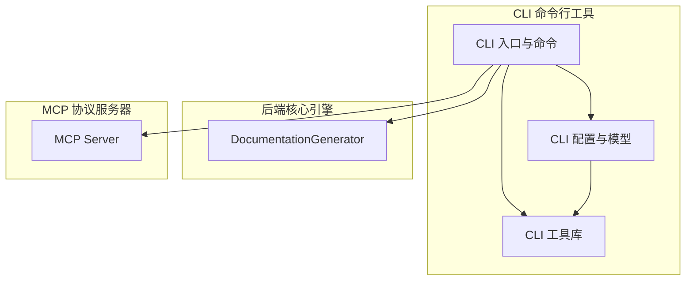
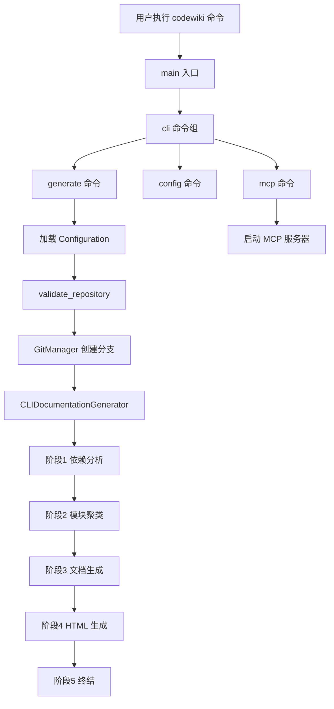
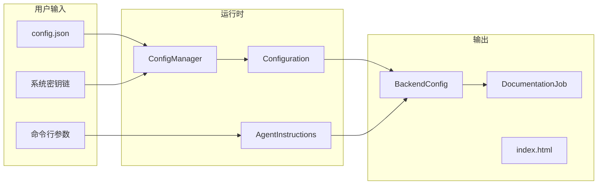

# CLI 命令行工具

## 模块概述

CLI 命令行工具是 CodeWiki-CN 系统的用户交互入口，为开发者提供了一套完整的命令行界面，用于驱动代码仓库文档的自动化生成全流程。该模块基于 Python `click` 框架构建，以 `codewiki` 为主命令，下设 `generate`、`config`、`mcp` 三个子命令，分别承担文档生成调度、配置管理和 MCP 协议服务启动的职责。

作为 CodeWiki-CN 架构中最接近用户的一层，CLI 模块扮演了"前端控制器"的角色：它负责接收用户的命令行参数，加载和验证配置，协调 Git 操作，然后通过适配器模式将任务委托给后端核心引擎完成实际的文档生成工作。这种分层设计使得 CLI 层与后端引擎充分解耦，便于独立测试和功能扩展。

## 子模块架构

## 子模块说明

### CLI 入口与命令

[CLI 入口与命令](CLI%20入口与命令.md) 是 `codewiki` 命令的入口层，定义了所有子命令的注册、参数解析和执行调度逻辑。

**核心职责：**
- `main()` 函数作为程序入口，统一捕获顶层异常并映射退出码
- `cli()` 命令组作为根节点，注册所有子命令
- `generate` 命令执行 5 阶段文档生成流水线（依赖分析 → 模块聚类 → 文档生成 → HTML 生成 → 终结）
- `config` 命令组提供 API 密钥设置、配置验证等管理功能
- `mcp` 命令启动 MCP 协议服务器，供 Claude/Cursor 等外部工具调用
- `CLIDocumentationGenerator` 适配器将 CLI 参数转化为后端引擎调用，并添加进度追踪和日志输出
- `HTMLGenerator` 可选生成自包含的静态 HTML 文档查看器

**支持的命令行参数**包括输出目录、Git 分支创建、GitHub Pages 生成、增量更新、文件过滤模式、模块聚焦、文档类型选择、token 限制等。

### CLI 配置与模型

[CLI 配置与模型](CLI%20配置与模型.md) 是配置管理和数据建模的核心层，负责管理 LLM API 凭证、生成配置和作业状态跟踪。

**核心职责：**
- `ConfigManager` 采用分层存储策略：API 密钥优先存储在系统密钥链（macOS Keychain / Windows Credential Manager / Linux Secret Service），不可用时回退到 `~/.codewiki/credentials.json` 文件（权限 0o600）；非敏感配置存储在 `~/.codewiki/config.json`
- `Configuration` 数据类定义了完整的配置结构，支持 6 种 LLM 供应商（OpenAI 兼容、Anthropic、AWS Bedrock、Azure OpenAI、Claude Code、Codex）
- `AgentInstructions` 模型支持文件过滤、模块聚焦、文档类型和自定义指令，运行时参数与持久化配置自动合并
- `DocumentationJob` 跟踪文档生成作业的完整生命周期（PENDING → RUNNING → COMPLETED/FAILED）
- 所有模型类均支持 JSON 序列化/反序列化，便于持久化和传输

**安全设计：** 通过 `CODEWIKI_NO_KEYRING=1` 环境变量可禁用密钥链，适应 CI/CD 等无 GUI 环境。

### CLI 工具库

[CLI 工具库](CLI%20工具库.md) 为 CLI 层提供基础设施组件，是被广泛依赖的底层支撑。

**核心组件：**
- **GitManager**：封装 GitPython，提供仓库验证、文档分支创建（`docs/codewiki-时间戳`）、文档提交、远程 URL 检测等操作
- **分层异常体系**：`CodeWikiError` 基类派生 `ConfigurationError`、`RepositoryError`、`APIError`、`FileSystemError`，各自关联特定退出码
- **ProgressTracker**：5 阶段加权进度追踪（依赖分析 40%、模块聚类 20%、文档生成 30%、HTML 生成 5%、终结 5%），支持 ETA 估算
- **ModuleProgressBar**：模块级进度条，支持 verbose/normal 双模式
- **CLILogger**：带彩色输出的日志记录器，5 级日志（debug/info/success/warning/error）
- **验证工具**：`validate_api_key`、`validate_repository` 等输入校验函数
- **文件系统工具**：`safe_read`/`safe_write`/`ensure_directory` 等安全文件操作

## 执行流程

## 数据流

## 错误处理策略

CLI 模块实现了分层的错误处理机制：

| 异常类型 | 退出码 | 处理方式 |
|----------|--------|----------|
| `ConfigurationError` | 2 | 输出配置错误信息，建议运行 `codewiki config set` |
| `RepositoryError` | 3 | 输出仓库错误信息，提示检查目录 |
| `APIError` | 4 | 输出 API 错误信息，提示检查密钥和网络 |
| `FileSystemError` | 5 | 输出文件系统错误，提示检查权限 |
| `KeyboardInterrupt` | 130 | 输出中断信息 |
| 未预期异常 | 1 | verbose 模式下输出堆栈跟踪 |

## 与其他模块的关系

- **[MCP 协议服务器](MCP%20协议服务器.md)**：`mcp` 命令启动 MCP 服务器，复用 CLI 的配置管理体系
- **[后端核心引擎](后端核心引擎.md)**：`generate` 命令通过 `CLIDocumentationGenerator` 适配器调用 `DocumentationGenerator` 完成文档生成
- **[依赖分析器](依赖分析器.md)**：后端引擎的第一阶段调用依赖分析器构建代码依赖图

## 设计要点

1. **适配器模式**：`CLIDocumentationGenerator` 隔离了 CLI 特有逻辑（进度、日志、错误处理）与后端引擎，使两者可独立演进
2. **安全优先**：API 密钥分层存储（密钥链 > 加密文件），敏感信息绝不写入配置文件
3. **双模式输出**：所有用户面向的组件（日志、进度、错误）均支持 verbose/normal 模式
4. **幂等性**：`generate` 命令支持跳过已存在的文档，`--update` 模式仅重新生成受影响的模块
5. **渐进式交互**：5 阶段加权进度条让用户清晰了解生成进展和预计剩余时间
