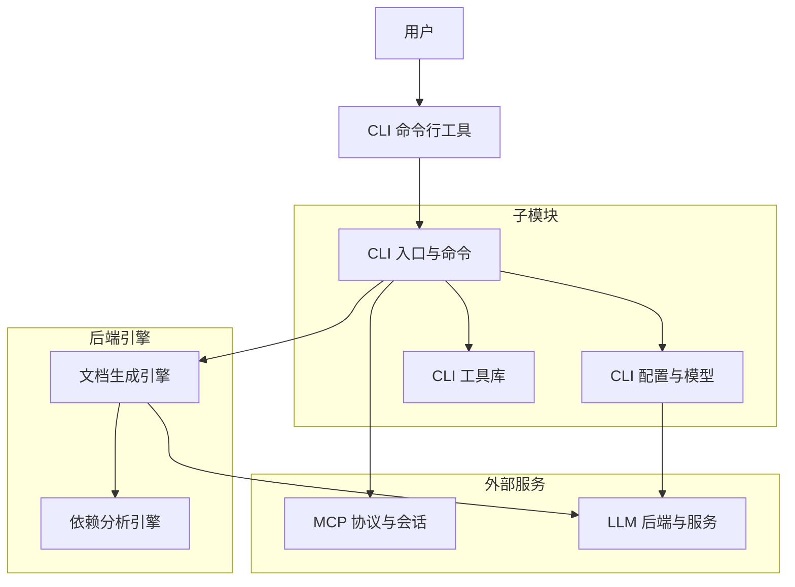
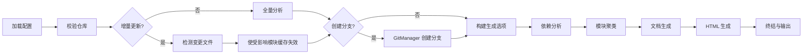

# CLI 命令行工具

## 模块概述

CLI 命令行工具是 CodeWiki-CN 项目的用户交互入口，提供完整的命令行接口来完成代码仓库文档的生成、配置管理和服务化部署。该模块基于 Python `click` 框架构建，采用分层架构设计，将命令入口、配置管理和工具库三个子模块有机组合，形成从用户输入到后端引擎调用的完整链路。

CLI 模块不仅承担文档生成的调度职责，还通过 MCP 命令将 CodeWiki 能力以服务化形式暴露给外部工具（如 Claude、Cursor），实现了从单机工具到协议服务的扩展。

### 核心定位

- **用户交互层**：解析命令行参数，将用户意图转化为后端引擎可执行的生成任务
- **配置管理层**：管理 LLM API 凭证、模型选择、生成选项等配置信息，支持安全存储与持久化
- **服务化入口**：通过 MCP 协议将 CodeWiki 能力开放给外部 AI 工具链调用
- **进度与反馈层**：提供多阶段进度追踪、日志输出和错误处理，保证用户体验

## 架构总览



### 子模块依赖关系

三个子模块之间形成清晰的依赖层次：

1. **CLI 入口与命令**（顶层）：定义命令组、解析参数、调度生成流程
2. **CLI 配置与模型**（中间层）：提供配置加载、数据建模和凭证管理
3. **CLI 工具库**（底层）：提供 Git 操作、错误处理、进度追踪、日志和文件工具等基础能力

入口层依赖配置层获取运行时参数，依赖工具层获取基础设施能力；配置层依赖工具层的文件系统和验证函数。

## 子模块详解

### 1. CLI 入口与命令

CLI 入口与命令模块是整个 CodeWiki 的启动入口，基于 `click` 框架定义了 `codewiki` 主命令及其三个子命令：

| 子命令 | 功能 | 说明 |
|--------|------|------|
| `generate` | 文档生成 | 执行完整的文档生成流水线，支持增量更新 |
| `config` | 配置管理 | 管理 API 密钥、模型设置等配置项 |
| `mcp` | MCP 服务 | 将 CodeWiki 作为 MCP 服务器启动 |

该模块还包含 `CLIDocumentationGenerator` 适配器类，将 CLI 层与后端文档生成引擎解耦，并管理 5 阶段生成流水线（依赖分析、模块聚类、文档生成、HTML 生成、终结）的进度追踪。

详见 [CLI 入口与命令](CLI%20入口与命令.md)。

### 2. CLI 配置与模型

CLI 配置与模型模块负责配置管理和数据建模，采用安全优先的分层存储策略：

| 存储位置 | 内容 | 安全性 |
|----------|------|--------|
| 系统密钥链 | API 密钥 | 高（加密存储） |
| `~/.codewiki/credentials.json` | API 密钥（回退） | 中（文件权限 0o600） |
| `~/.codewiki/config.json` | 模型、URL 等配置 | 低（明文 JSON） |

核心数据模型包括：

- **Configuration**：完整配置结构，支持多供应商（OpenAI、Anthropic、Bedrock、Azure 等）
- **AgentInstructions**：Agent 自定义指令（文件过滤、模块聚焦、文档类型）
- **DocumentationJob**：作业生命周期管理（PENDING -> RUNNING -> COMPLETED/FAILED）
- **GenerationOptions**：生成运行时选项（分支创建、HTML 生成、缓存控制）

详见 [CLI 配置与模型](CLI%20配置与模型.md)。

### 3. CLI 工具库

CLI 工具库模块为上层命令和适配器提供基础设施组件：

| 组件 | 功能 |
|------|------|
| `GitManager` | Git 仓库操作：分支创建、状态检查、提交、远程检测 |
| `CodeWikiError` 体系 | 分层异常处理，映射到特定退出码 |
| `ProgressTracker` | 5 阶段加权进度追踪与 ETA 估算 |
| `ModuleProgressBar` | 模块级进度条显示 |
| `CLILogger` | 带彩色输出的日志记录器（verbose/normal 双模式） |
| 验证工具 | API 密钥格式验证、仓库有效性检查 |
| 文件系统工具 | 安全文件读写、目录创建、权限管理 |

详见 [CLI 工具库](CLI%20工具库.md)。

## CLI 命令执行流程

CodeWiki CLI 的典型使用流程遵循「配置 -> 生成 -> 服务」三个阶段：

### 阶段一：配置（config）

用户首先通过 `codewiki config` 命令组设置 LLM 凭证和生成选项：

```bash
# 设置 API 密钥和模型
codewiki config set --api-key sk-xxx --base-url https://api.openai.com/v1 \
    --main-model gpt-4 --cluster-model gpt-3.5-turbo

# 验证配置
codewiki config validate
```

配置通过 `ConfigManager` 加载，API 密钥存储在系统密钥链中，非敏感配置写入 `~/.codewiki/config.json`。

### 阶段二：生成（generate）

配置完成后，用户通过 `codewiki generate` 触发文档生成：

```bash
# 基础生成
codewiki generate

# 高级用法：创建分支、HTML 查看器、增量更新
codewiki generate --create-branch --github-pages --update
```

生成流程经过以下流水线：



### 阶段三：MCP 服务（mcp）

用户可通过 `codewiki mcp` 将 CodeWiki 作为 MCP 服务器启动，供外部 AI 工具调用：

```json
{
    "mcpServers": {
        "codewiki": {
            "command": "codewiki",
            "args": ["mcp"]
        }
    }
}
```

MCP 服务通过 stdio 传输协议暴露文档生成工具，使 Claude、Cursor 等 MCP 客户端能够直接调用 CodeWiki 的代码分析和文档生成能力。此功能与 [MCP 协议与会话](MCP%20协议与会话.md) 模块紧密协作。

## 与后端引擎的交互

CLI 模块通过适配器模式与后端引擎解耦。`CLIDocumentationGenerator` 作为桥梁，将 CLI 配置转换为后端 `BackendConfig`，并驱动后端引擎的 5 阶段生成流水线：

| 阶段 | 后端组件 | CLI 职责 |
|------|----------|----------|
| 1. 依赖分析 | 依赖分析引擎 | 进度追踪、日志输出 |
| 2. 模块聚类 | LLM 后端与服务 | 进度追踪、API 调用监控 |
| 3. 文档生成 | LLM 后端与服务 | 模块进度条显示 |
| 4. HTML 生成 | HTMLGenerator | 触发 HTML 生成 |
| 5. 终结 | DocumentationJob | 记录作业元数据 |

文档生成阶段中的 LLM 调用通过 [LLM 后端与服务](LLM%20后端与服务.md) 模块完成，该模块负责 API 客户端管理、重试策略和模型回退逻辑。

## 错误处理策略

CLI 模块实现了分层的错误处理策略，确保错误信息对用户友好且可定位：

| 异常类型 | 退出码 | 典型场景 |
|----------|--------|----------|
| `ConfigurationError` | 2 | API 密钥缺失、配置无效 |
| `RepositoryError` | 3 | 非 Git 仓库、无源代码文件 |
| `APIError` | 4 | LLM 网络超时、认证失败 |
| `FileSystemError` | 5 | 输出目录不可写 |
| `KeyboardInterrupt` | 130 | 用户中断 |
| 通用异常 | 1 | 未预期的错误 |

所有异常通过 `handle_error()` 统一处理，verbose 模式下额外输出堆栈跟踪信息。

## 设计要点

1. **适配器解耦**：`CLIDocumentationGenerator` 将 CLI 层与后端引擎完全解耦，后端可独立演进
2. **安全凭证管理**：API 密钥优先使用系统密钥链加密存储，仅在不可用时回退到文件存储
3. **增量更新能力**：通过 `--update` 标志检测变更文件，仅使受影响模块的缓存失效，显著提升二次生成速度
4. **双模式输出**：日志和进度组件均支持 verbose/normal 两种模式，适应不同使用场景
5. **协议扩展性**：MCP 命令将 CodeWiki 从单机工具扩展为可被外部 AI 工具链调用的协议服务

## 模块关系

| 关联模块 | 关系说明 |
|----------|----------|
| [CLI 入口与命令](CLI%20入口与命令.md) | 子模块：命令定义与生成调度 |
| [CLI 配置与模型](CLI%20配置与模型.md) | 子模块：配置管理与数据建模 |
| [CLI 工具库](CLI%20工具库.md) | 子模块：基础设施工具集 |
| [MCP 协议与会话](MCP%20协议与会话.md) | MCP 命令启动 MCP 服务器，暴露文档生成工具 |
| [LLM 后端与服务](LLM%20后端与服务.md) | 文档生成阶段的 LLM 调用由后端服务完成 |
| [依赖分析引擎](依赖分析引擎.md) | 生成流水线第一阶段依赖该引擎进行代码分析 |