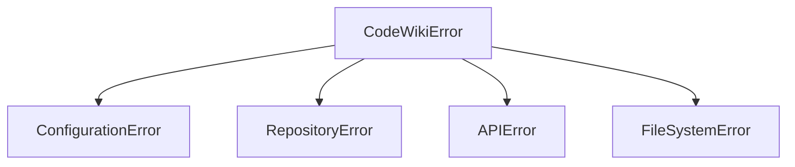
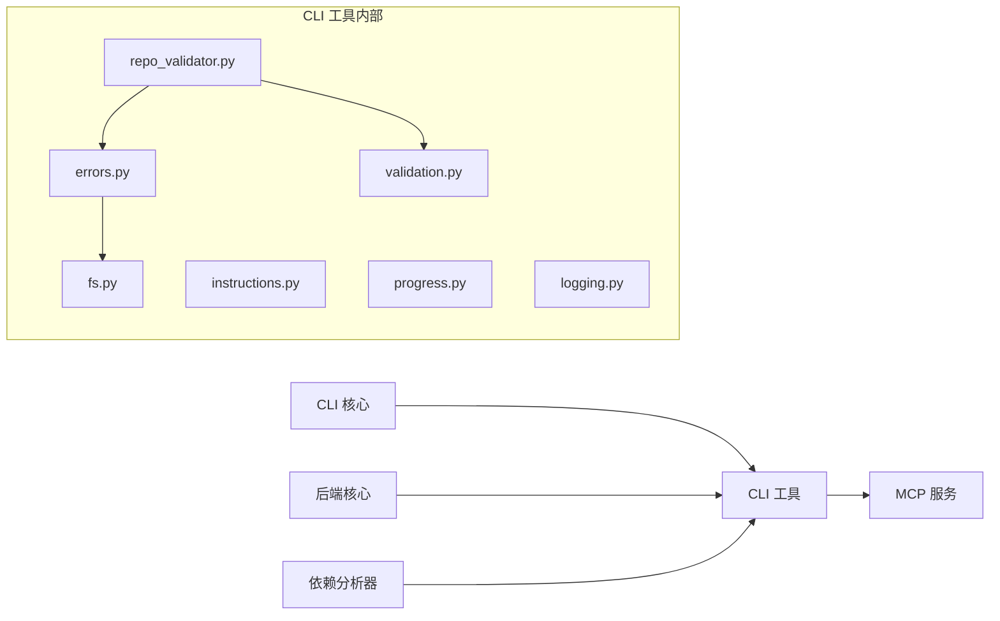

# CLI 工具

## 简介

CLI 工具模块位于 `codewiki/cli/utils/`，为 CLI 命令行界面提供基础工具支持。涵盖异常处理体系、文件系统操作、输入验证、日志记录、进度追踪、仓库校验和用户指令显示等功能。所有子模块通过 [CLI 核心](CLI 核心.md) 中的命令和适配器进行调用。

## 架构概览

```mermaid
graph TD
    CLI[CLI 核心] --> ERR[errors.py]
    CLI --> FS[fs.py]
    CLI --> VAL[validation.py]
    CLI --> LOG[logging.py]
    CLI --> PROG[progress.py]
    CLI --> REPO[repo_validator.py]
    CLI --> INST[instructions.py]
    CLI --> APIE[api_errors.py]

    ERR --> CODB[CodeWikiError]
    ERR --> CONF[ConfigurationError]
    ERR --> REPOE[RepositoryError]
    ERR --> APIE2[APIError]
    ERR --> FSE[FileSystemError]
    ERR --> HL[handle_error]

    FS --> ED[ensure_directory]
    FS --> SW[safe_write]
    FS --> SR[safe_read]

    VAL --> VURL[validate_url]
    VAL --> VKEY[validate_api_key]
    VAL --> VREPO[validate_repository_path]
    VAL --> DETECT[detect_supported_languages]
    VAL --> MASK[mask_api_key]

    REPO --> VREPO2[validate_repository]
    REPO --> GIT[Git operations]

    PROG --> PT[ProgressTracker]
    PROG --> MPB[ModuleProgressBar]
```

## 子模块详解

### errors.py — 异常处理体系

> **文件**: `codewiki/cli/utils/errors.py`

定义统一的异常层次结构和 CLI 输出辅助函数。

#### 异常类层次

| 异常类 | 退出码 | 触发场景 |
|--------|--------|----------|
| `CodeWikiError` | 3 | 所有异常基类，携带 `message` 和 `exit_code` |
| `ConfigurationError` | 4 | 配置相关错误（URL/API Key/模型名称无效） |
| `RepositoryError` | 5 | 仓库路径不存在、不可读或无支持的代码文件 |
| `APIError` | 1 | LLM API 调用失败 |
| `FileSystemError` | 6 | 文件读写/目录创建权限错误 |

#### 输出辅助函数

| 函数 | 签名 | 说明 |
|------|------|------|
| `handle_error(error, verbose)` | `(Exception, bool) -> int` | 统一错误处理，区分 CodeWikiError 和未知异常，返回退出码 |
| `error_with_suggestion(message, suggestion, exit_code)` | `(str, str, int) -> None` | 显示错误并附带解决建议，调用 `sys.exit` |
| `warning(message)` | `(str) -> None` | 黄色警告信息输出 |
| `success(message)` | `(str) -> None` | 绿色成功信息输出 |
| `info(message)` | `(str) -> None` | 普通信息输出 |

### fs.py — 文件系统操作

> **文件**: `codewiki/cli/utils/fs.py`

提供安全的文件和目录操作，自动处理权限检查和原子写入。

| 函数 | 说明 |
|------|------|
| `ensure_directory(path, mode=0o700)` | 确保目录存在，自动创建父目录。权限默认仅用户可访问 |
| `check_writable(path)` | 检查路径是否可写（存在则直接检测；不存在则检测父目录） |
| `safe_write(path, content, encoding="utf-8")` | **原子写入**：先写临时文件 `.tmp`，再 `replace` 重命名 |
| `safe_read(path, encoding="utf-8")` | 安全读取文件，处理 FileNotFoundError/PermissionError |
| `get_file_size(path)` | 获取文件大小（字节） |
| `find_files(directory, extensions, recursive)` | 按扩展名查找文件，支持递归搜索 |
| `cleanup_directory(path, keep_hidden=True)` | 清理目录内容，默认保留隐藏文件 |

### validation.py — 输入验证

> **文件**: `codewiki/cli/utils/validation.py`

验证用户输入的有效性，确保配置和路径正确。

| 函数 | 说明 |
|------|------|
| `validate_url(url, require_https, allow_localhost)` | 验证 URL 格式和协议（HTTPS 要求，localhost 例外） |
| `validate_api_key(api_key, min_length=10)` | 验证 API Key 非空且长度足够 |
| `validate_model_name(model)` | 验证模型名称非空 |
| `validate_output_directory(path)` | 验证输出目录路径有效性 |
| `validate_repository_path(path)` | 验证仓库路径存在且为目录 |
| `detect_supported_languages(directory)` | 扫描目录检测支持的编程语言及文件数量。支持 9 种语言，排除 node_modules、.git 等目录 |
| `is_top_tier_model(model)` | 判断模型是否为顶级模型（claude-opus、claude-sonnet、gpt-4/5、gemini-2.5），影响聚类策略 |
| `mask_api_key(api_key, visible_chars=4)` | 脱敏显示 API Key（如 `sk-1234...5678`） |

### logging.py — 日志记录

> **文件**: `codewiki/cli/utils/logging.py`

提供 CLI 专用的日志记录器。

**CLILogger** 支持两种模式：

| 方法 | 说明 |
|------|------|
| `debug(message)` | 仅 verbose 模式下输出，带时间戳 |
| `info(message)` | 普通信息输出 |
| `success(message)` | 绿色成功信息 |
| `warning(message)` | 黄色警告信息 |
| `error(message)` | 红色错误信息 |
| `step(message, step, total)` | 步骤进度信息，格式 `[step/total] message` |
| `elapsed_time()` | 返回自 Logger 创建以来的耗时 |

**create_logger(verbose)** 工厂函数创建 CLILogger 实例。

### progress.py — 进度追踪

> **文件**: `codewiki/cli/utils/progress.py`

#### ProgressTracker

多阶段进度追踪器，支持 ETA 估算。将文档生成流程分为 5 个阶段：

| 阶段 | 占比 | 说明 |
|------|------|------|
| 1 | 40% | 依赖分析 |
| 2 | 20% | 模块聚类 |
| 3 | 30% | 文档生成 |
| 4 | 5% | HTML 生成（可选） |
| 5 | 5% | 最终化 |

核心方法：`start_stage()`、`update_stage()`、`complete_stage()`、`get_overall_progress()`、`get_eta()`。

#### ModuleProgressBar

逐模块生成进度条，支持 verbose 模式（显示模块名和缓存状态）和标准模式（click 进度条）。

### repo_validator.py — 仓库校验

> **文件**: `codewiki/cli/utils/repo_validator.py`

| 函数 | 说明 |
|------|------|
| `validate_repository(repo_path)` | 完整校验：路径存在 → 目录类型 → 检测支持语言，返回 `(路径, 语言列表)` |
| `check_writable_output(output_dir)` | 检查输出目录可写性，不存在则检查父目录 |
| `is_git_repository(repo_path)` | 判断是否在 Git 仓库内（支持 monorepo 子目录，向上搜索父目录） |
| `get_git_commit_hash(repo_path)` | 获取当前 Git commit hash |
| `get_git_branch(repo_path)` | 获取当前 Git 分支名 |
| `count_code_files(repo_path)` | 统计支持的代码文件数量 |

### instructions.py — 用户指令

> **文件**: `codewiki/cli/utils/instructions.py`

文档生成完成后的用户指引输出。

| 函数 | 说明 |
|------|------|
| `compute_github_pages_url(repo_url, repo_name)` | 从 GitHub URL 推导 Pages 地址 |
| `get_pr_creation_url(repo_url, branch_name)` | 生成 PR 创建链接 |
| `display_post_generation_instructions(...)` | 显示生成完成后的综合指令（输出目录、生成文件列表、GitHub Pages 指南、PR 提示） |
| `display_generation_summary()` | 显示生成摘要统计 |

### api_errors.py — API 错误处理

> **文件**: `codewiki/cli/utils/api_errors.py`

| 组件 | 说明 |
|------|------|
| `APIErrorHandler` | API 错误处理器，将原始 API 异常转换为 CodeWiki 的 `APIError` |
| `wrap_api_call` | 装饰器/上下文管理器，用于包装 API 调用并统一错误处理 |

## 模块依赖关系

- [CLI 核心](CLI 核心.md) 是本模块的主要消费者
- [后端核心](后端核心.md) 和 [依赖分析器](依赖分析器.md) 也依赖 `errors.py` 的异常类和 `warning`/`info` 输出函数
- [MCP 服务](MCP 服务.md) 间接依赖本模块的配置管理和异常处理

## 设计要点

1. **原子写入**：`safe_write` 使用 temp + rename 模式确保写入原子性，防止部分写入
2. **统一异常体系**：所有 CLI 异常继承 `CodeWikiError`，带退出码，支持 `handle_error` 统一处理
3. **阶段权重 ETA**：`ProgressTracker` 使用预设阶段权重（40/20/30/5/5）估算剩余时间
4. **Monorepo 支持**：Git 函数向上搜索父目录，支持在 monorepo 子目录中运行
5. **安全脱敏**：`mask_api_key` 仅显示首尾 4 个字符，短密钥仅显示首尾 2 个字符