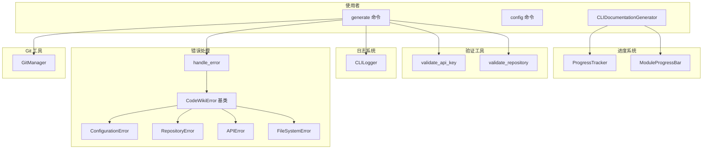
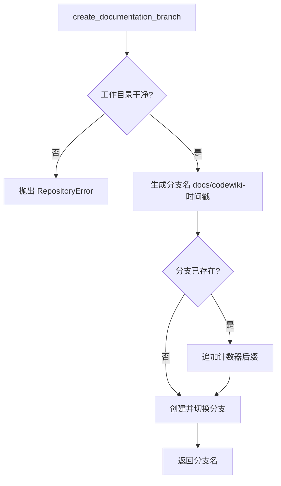
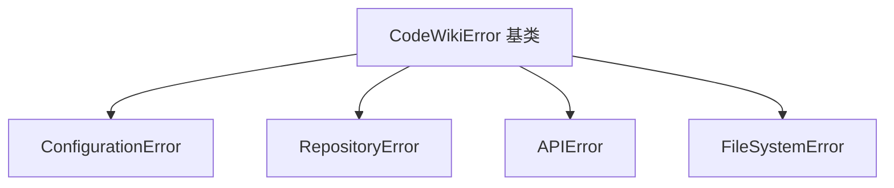
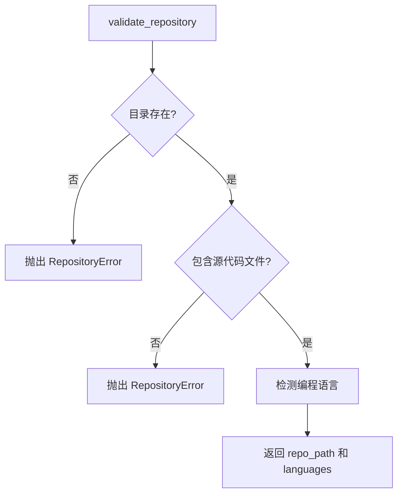
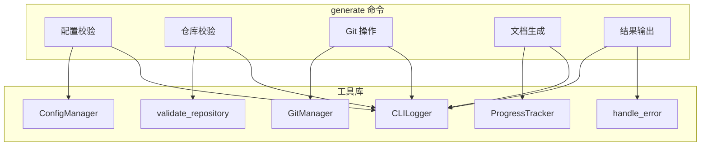

# CLI 工具库

## 模块概述

CLI 工具库模块为 CodeWiki 命令行工具提供了一系列基础设施组件，包括 Git 仓库操作、错误处理、进度追踪、日志记录、输入验证和文件系统工具等。这些工具类被 CLI 命令层和适配器层广泛依赖，是保证 CLI 稳定运行的底层支撑。

### 核心功能

- **Git 仓库管理**：封装 GitPython 库，提供分支创建、状态检查、提交和远程检测等操作
- **统一错误处理**：定义分层异常体系和统一错误处理入口，映射到合适的退出码
- **进度追踪系统**：支持多阶段进度跟踪和 ETA 估算，以及模块级别的进度条显示
- **日志系统**：提供带彩色输出的 CLI 日志记录器，支持 verbose/normal 双模式
- **输入验证**：验证 API 密钥格式、仓库有效性等用户输入
- **文件系统工具**：提供安全的文件读写、目录创建等辅助函数

## 架构设计



## 组件详解

### 1. GitManager - Git 仓库管理器

`GitManager` 封装了 GitPython 库，为文档生成流程提供完整的 Git 操作支持。它在文档生成时用于创建文档分支，在生成后可用于提交文档。

**职责：**
- 验证目录是否为有效的 Git 仓库
- 检查工作目录是否干净（无未提交变更）
- 创建带时间戳的文档分支
- 提交生成的文档
- 检测远程仓库 URL 和 GitHub PR 链接

**核心方法：**

| 方法 | 说明 | 返回值 |
|------|------|--------|
| `check_clean_working_directory()` | 检查工作目录是否干净 | `Tuple[bool, str]` |
| `create_documentation_branch()` | 创建文档分支 | 分支名称 |
| `commit_documentation()` | 提交文档 | 提交哈希 |
| `get_remote_url()` | 获取远程 URL | URL 字符串 |
| `get_current_branch()` | 获取当前分支 | 分支名称 |
| `get_commit_hash()` | 获取当前提交哈希 | 哈希字符串 |
| `branch_exists()` | 检查分支是否存在 | `bool` |
| `get_github_pr_url()` | 获取 GitHub PR URL | URL 或 None |

**分支创建流程：**



**代码示例：**

```python
from codewiki.cli.git_manager import GitManager
from pathlib import Path

# 初始化 Git 管理器
git = GitManager(Path("/path/to/repo"))

# 检查工作目录
is_clean, status = git.check_clean_working_directory()
if not is_clean:
    print(f"未提交的变更:\n{status}")

# 创建文档分支
branch_name = git.create_documentation_branch()
# 生成分支如: docs/codewiki-20240315-143022

# 提交文档
commit_hash = git.commit_documentation(
    docs_path=Path("docs"),
    message="Add generated documentation"
)

# 获取 GitHub PR 链接
pr_url = git.get_github_pr_url(branch_name)
# https://github.com/owner/repo/compare/docs/codewiki-20240315-143022
```

**分支命名规则：**
- 基本格式：`docs/codewiki-YYYYMMDD-HHMMSS`
- 如果分支名已存在（极少发生），追加数字后缀：`docs/codewiki-20240315-143022-1`

### 2. 错误处理体系

CodeWiki 定义了分层的异常体系，每个异常类型关联特定的退出码，使错误处理清晰可预测。

#### 异常类层次



#### 异常类型说明

| 异常类 | 说明 | 典型场景 |
|--------|------|----------|
| `CodeWikiError` | 所有 CodeWiki 异常的基类 | - |
| `ConfigurationError` | 配置相关错误 | 配置缺失、API 密钥无效 |
| `RepositoryError` | 仓库相关错误 | 非 Git 仓库、工作目录不干净 |
| `APIError` | LLM API 调用错误 | 网络超时、认证失败、速率限制 |
| `FileSystemError` | 文件系统错误 | 目录不可写、文件读取失败 |

#### handle_error - 统一错误处理函数

`handle_error()` 是 CLI 层的顶层错误处理入口，根据异常类型返回适当的退出码。

**职责：**
- 识别 `CodeWikiError` 子类并提取错误信息和退出码
- 对未知异常输出错误信息并返回通用退出码
- 在 verbose 模式下输出完整的堆栈跟踪

**代码示例：**

```python
def handle_error(error: Exception, verbose: bool = False) -> int:
    if isinstance(error, CodeWikiError):
        click.secho(f"\n Error: {error.message}", fg="red", err=True)
        return error.exit_code
    else:
        click.secho(f"\n Unexpected error: {error}", fg="red", err=True)
        if verbose:
            import traceback
            click.echo(traceback.format_exc(), err=True)
        return EXIT_GENERAL_ERROR
```

**退出码映射：**

| 退出码 | 说明 |
|--------|------|
| 0 | 成功 |
| 1 | 通用错误 |
| 2 | 配置错误 |
| 3 | 仓库错误 |
| 4 | API 错误 |
| 5 | 文件系统错误 |
| 130 | 用户中断（Ctrl+C） |

### 3. ProgressTracker - 多阶段进度追踪器

`ProgressTracker` 提供多阶段进度跟踪功能，将文档生成过程分为 5 个阶段，每个阶段有不同的时间权重，支持 ETA 估算。

**职责：**
- 跟踪 5 个文档生成阶段的进度
- 根据阶段权重计算总体进度
- 估算剩余时间（ETA）
- 支持 verbose/normal 两种输出模式

**阶段权重分配：**

| 阶段 | 名称 | 权重 | 说明 |
|------|------|------|------|
| 1 | 依赖分析 | 40% | 解析源文件，构建依赖图 |
| 2 | 模块聚类 | 20% | LLM 聚类叶节点 |
| 3 | 文档生成 | 30% | 生成模块文档 |
| 4 | HTML 生成 | 5% | 生成 HTML 查看器 |
| 5 | 终结 | 5% | 创建元数据 |

**代码示例：**

```python
tracker = ProgressTracker(total_stages=5, verbose=True)

# 开始阶段 1
tracker.start_stage(1, "依赖分析")
tracker.update_stage(0.5, "解析源文件中...")
tracker.update_stage(0.8, "已分析 42 个文件")
tracker.complete_stage()

# 开始阶段 2
tracker.start_stage(2, "模块聚类")
tracker.update_stage(0.5, "LLM 聚类中...")
tracker.complete_stage()

# 查看总体进度
progress = tracker.get_overall_progress()  # 0.6 (40% + 20%)
eta = tracker.get_eta()  # "3m 15s"
```

**ETA 计算逻辑：**

```python
def get_eta(self) -> Optional[str]:
    elapsed = time.time() - self.start_time
    progress = self.get_overall_progress()
    if progress <= 0.0:
        return None
    total_estimated = elapsed / progress
    remaining = total_estimated - elapsed
    # 格式化为 "Xh Ym" / "Ym Zs" / "Zs"
```

### 4. ModuleProgressBar - 模块进度条

`ModuleProgressBar` 提供模块级别的进度显示，在文档生成阶段逐个显示每个模块的处理状态。

**职责：**
- 显示模块生成的进度条
- 在 verbose 模式下显示每个模块的名称和缓存状态
- 在 normal 模式下显示简洁的进度条

**代码示例：**

```python
bar = ModuleProgressBar(total_modules=10, verbose=True)

# 处理每个模块
for module in modules:
    cached = module in cache
    bar.update(module.name, cached=cached)
    # verbose 输出: [3/10] auth_module... cached
    # normal 模式: 更新进度条

bar.finish()
```

**双模式输出：**

| 模式 | 输出效果 |
|------|----------|
| verbose | `[3/10] auth_module... cached` |
| normal | `Generating modules [###----] 30% ETA: 00:02:15` |

### 5. CLILogger - CLI 日志记录器

`CLILogger` 提供带彩色输出的 CLI 日志记录功能，支持多种日志级别和格式化的步骤输出。

**职责：**
- 提供 debug/info/success/warning/error 五级日志
- 支持 verbose/normal 双模式输出
- 提供带编号的步骤输出格式
- 记录并计算经过时间

**日志级别与颜色：**

| 方法 | 颜色 | 说明 | verbose 限制 |
|------|------|------|------|
| `debug()` | 青色（暗淡） | 调试信息 | 仅 verbose 模式 |
| `info()` | 默认 | 普通信息 | 总是显示 |
| `success()` | 绿色 | 成功信息 | 总是显示 |
| `warning()` | 黄色 | 警告信息 | 总是显示 |
| `error()` | 红色 | 错误信息 | 总是显示 |
| `step()` | 蓝色（加粗） | 步骤信息 | 总是显示 |

**代码示例：**

```python
logger = CLILogger(verbose=True)

logger.step("验证配置...", step=1, total=4)
# 输出: [1/4] 验证配置...

logger.success("配置有效")
# 输出: check 配置有效

logger.debug("检测到的语言: Python (42 files), JavaScript (18 files)")
# 输出: [14:30:22] 检测到的语言: Python (42 files), JavaScript (18 files)

logger.warning("不是 Git 仓库，Git 功能不可用")
# 输出: warning 不是 Git 仓库，Git 功能不可用

logger.error("API 密钥无效")
# 输出: cross API 密钥无效

elapsed = logger.elapsed_time()
# 返回: "2m 15s"
```

### 6. 验证工具函数

验证工具函数提供用户输入和环境的校验能力，确保文档生成流程的前置条件满足。

#### validate_api_key

验证 API 密钥的格式和有效性。根据配置中的 `provider` 类型，采用不同的验证规则。

#### validate_repository

验证指定目录是否为有效的代码仓库，并检测仓库中使用的编程语言。

**典型使用流程：**

```python
# 在 generate 命令中使用
repo_path = Path.cwd()
repo_path, languages = validate_repository(repo_path)
# languages = [("Python", 42), ("JavaScript", 18)]

# 检查是否为 Git 仓库
if not is_git_repository(repo_path):
    logger.warning("Not a git repository. Git features unavailable.")

# 检查输出目录可写
check_writable_output(output_dir.parent)
```

**仓库验证流程：**



### 7. 文件系统工具

文件系统工具提供安全的文件读写操作，封装了常见的文件系统操作并统一错误处理。

**核心函数：**

| 函数 | 说明 |
|------|------|
| `safe_read()` | 安全读取文件内容 |
| `safe_write()` | 安全写入文件内容 |
| `ensure_directory()` | 确保目录存在，不存在则创建 |
| `check_writable_output()` | 检查输出目录是否可写 |
| `is_git_repository()` | 检查目录是否为 Git 仓库 |
| `get_git_commit_hash()` | 获取当前 Git 提交哈希 |
| `get_git_branch()` | 获取当前 Git 分支名 |

## 组件协作关系



## 常量与退出码定义

工具库中定义了多个常用常量：

| 常量 | 值 | 说明 |
|------|----|------|
| `EXIT_SUCCESS` | `0` | 成功退出 |
| `EXIT_GENERAL_ERROR` | `1` | 通用错误 |
| `CONFIG_DIR` | `~/.codewiki/` | 配置目录 |
| `CONFIG_FILE` | `~/.codewiki/config.json` | 配置文件路径 |
| `CREDENTIALS_FILE` | `~/.codewiki/credentials.json` | 凭证文件路径 |
| `KEYRING_SERVICE` | `"codewiki"` | 密钥链服务名 |
| `KEYRING_API_KEY_ACCOUNT` | `"api-key"` | 密钥链账户名 |

## 设计要点

1. **分层异常体系**：所有自定义异常继承自 `CodeWikiError` 基类，每个子类关联特定退出码，便于统一处理和用户友好的错误提示
2. **双模式输出**：日志和进度组件均支持 verbose/normal 两种模式，verbose 模式提供详细的调试信息，normal 模式保持输出简洁
3. **加权进度跟踪**：`ProgressTracker` 根据各阶段的实际耗时分配权重，使总体进度和 ETA 估算更准确
4. **安全优先**：文件系统工具统一使用 `safe_read`/`safe_write`，并在写入凭证文件时设置严格的文件权限（0o600）
5. **Git 安全操作**：创建分支前强制检查工作目录状态，防止文档生成与未提交代码混淆

## 模块关系

- [CLI 入口与命令](CLI%20入口与命令.md) - 工具库的主要使用者
- [CLI 配置与模型](CLI%20配置与模型.md) - ConfigManager 依赖文件工具和错误类
- [MCP 服务端](MCP%20服务端.md) - MCP 工具也可复用验证和文件工具