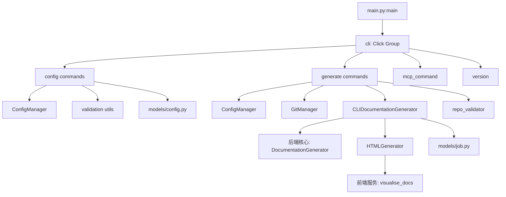
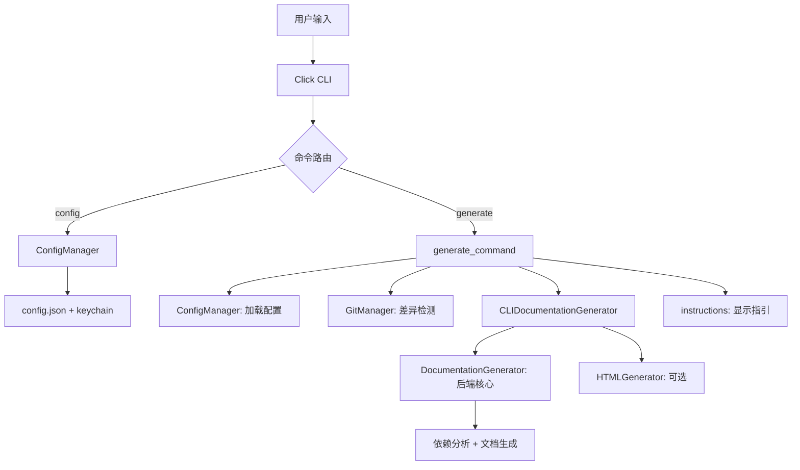

# CLI 核心

## 简介

CLI 核心模块是 CodeWiki 命令行界面的入口和控制中心，位于 `codewiki/cli/`。包含主入口点、`config` 和 `generate` 两个命令组、配置管理器、Git 管理器、HTML 生成器及文档生成适配器，负责编排整个文档生成流水线。

## 架构概览

## 入口与命令注册

### main.py — 程序入口

| 组件 | 说明 |
|------|------|
| `main()` | CLI 入口函数，调用 Click Group，捕获 KeyboardInterrupt 和通用异常 |
| `cli(ctx)` | Click 主命令组，设置上下文对象 |
| `version()` | 显示 CLI 版本信息 |
| `mcp_command()` | 启动 MCP Server（异步调用 `codewiki.mcp.server.main`） |

### config 命令组

| 命令 | 说明 |
|------|------|
| `config set` | 配置 API 凭据和参数。支持 `--api-key`、`--base-url`、`--main-model`、`--cluster-model`、`--fallback-model`、`--max-tokens`、`--max-depth`、`--provider` 等。API Key 写入系统密钥链 |
| `config show` | 显示当前配置。支持 `--json` 输出。API Key 脱敏显示 |
| `config validate` | 验证配置并测试 API 连接。分 5 步：配置文件 → API Key → Base URL → 模型 → 连通性测试 |
| `config agent` | 配置 Agent 默认指令（include/exclude 模式、focus 模块、doc type、自定义指令） |

### generate 命令组

| 组件 | 说明 |
|------|------|
| `generate_command` | 文档生成主命令。校验仓库 → 创建日志 → Git 差异检测 → 实例化适配器 → 执行生成 |
| `_detect_changed_files` | 比较 metadata.json 中 commit_id 与当前 HEAD 的 diff 检测变更，支持 monorepo |
| `_invalidate_affected_modules` | 递归查找变更文件影响的模块并标记失效 |
| `_find_affected` | 递归函数，查找需要重新生成的所有模块 |
| `parse_patterns` | 解析逗号分隔的 pattern 字符串 |

## 核心类

### ConfigManager

> **文件**: `codewiki/cli/config_manager.py`

配置管理器，负责配置的加载、保存和持久化。配置存储于 `~/.codewiki/config.json`，API Key 优先使用系统密钥链（keyring），fallback 到加密文件。

### GitManager

> **文件**: `codewiki/cli/git_manager.py`

Git 操作管理器，封装 GitPython 库操作。支持增量文档生成：检测 Git 仓库、获取分支/commit、diff 对比、monorepo 子目录支持。

### HTMLGenerator

> **文件**: `codewiki/cli/html_generator.py`

HTML 静态站点生成器，将 Markdown 文档转为 GitHub Pages 兼容的 HTML 站点：加载 module_tree.json 构建导航、嵌入 Mermaid CDN。

### CLIDocumentationGenerator

> **文件**: `codewiki/cli/adapters/doc_generator.py`

CLI 文档生成适配器，桥接 CLI 与 [后端核心](后端核心.md) 的 `DocumentationGenerator`。管理进度追踪、日志输出和增量文档生成。

## 数据模型

### models/config.py

| 类 | 说明 |
|------|------|
| `Configuration` | 完整配置模型：provider、base_url、main_model、cluster_model、fallback_model、max_tokens、max_depth、agent_instructions |
| `AgentInstructions` | Agent 指令：include_patterns、exclude_patterns、focus_modules、doc_type、custom_instructions |

### models/job.py

| 类 | 说明 |
|------|------|
| `JobStatus` | 作业状态枚举：PENDING/RUNNING/COMPLETED/FAILED/CANCELLED |
| `DocumentationJob` | 文档生成作业，聚合状态、LLM 配置、生成选项和统计 |
| `LLMConfig` | LLM 配置：provider、api_key、base_url、model 名称 |
| `GenerationOptions` | 生成选项：include/exclude patterns、output_dir、doc_type |
| `JobStatistics` | 统计：开始/结束时间、处理文件数、模块数、耗时 |

## 数据流

## 模块依赖

- **上游依赖**: [CLI 工具](CLI 工具.md)（验证、异常、文件系统、进度）
- **下游依赖**: [后端核心](后端核心.md)（文档生成引擎）、[MCP 服务](MCP 服务.md)（mcp_command 启动）
- **横向依赖**: [前端服务](前端服务.md)（HTMLGenerator 使用 visualise_docs）

## 关键设计决策

1. **密钥链存储**：API Key 优先使用系统密钥链（keyring），增强安全性
2. **增量生成**：通过 Git diff 检测变更，仅重新生成受影响模块的文档
3. **订阅模式**：支持 claude-code/codex 提供商，无需手动配置 API Key
4. **分步验证**：`config validate` 采用 5 步验证流程，每步独立报错