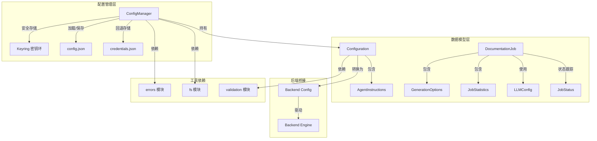
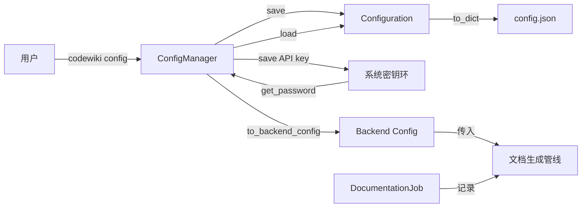
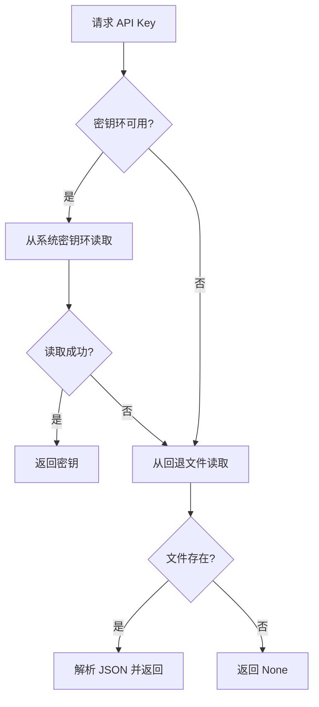
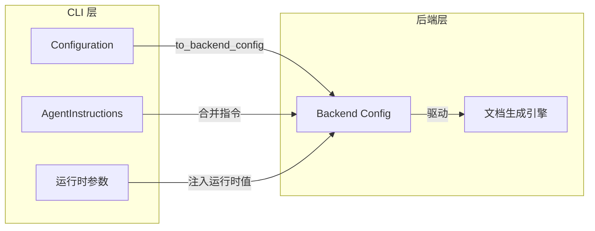
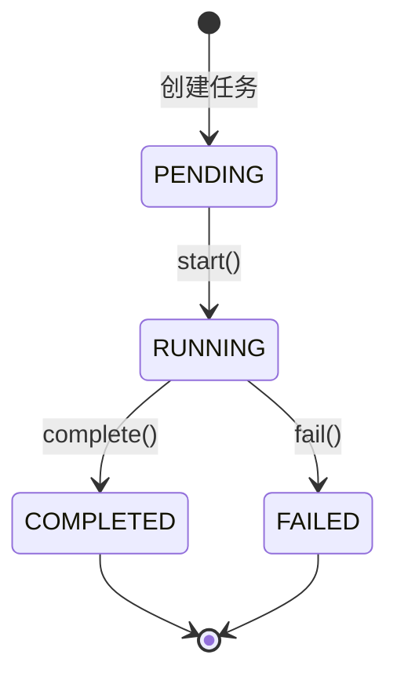

# CLI 配置与模型

## 模块简介

本模块是 CodeWiki CLI 的配置管理核心，负责处理用户持久化设置、安全凭证存储以及文档生成任务的建模。模块涵盖三个主要源文件：

- `codewiki/cli/config_manager.py` -- 配置管理器，集成系统密钥环实现安全凭证存储
- `codewiki/cli/models/config.py` -- 配置数据模型，定义用户持久化设置与 Agent 指令
- `codewiki/cli/models/job.py` -- 任务数据模型，定义文档生成作业的生命周期与统计数据

### 核心功能

1. **安全凭证管理**：优先使用操作系统密钥环（macOS Keychain、Windows Credential Manager、Linux Secret Service）存储 API 密钥，当密钥环不可用时自动回退到文件存储
2. **多提供商配置**：支持 openai-compatible、anthropic、bedrock、azure-openai 以及订阅制提供商（claude-code、codex）
3. **持久化配置**：将非敏感配置以 JSON 格式存储于 `~/.codewiki/config.json`
4. **Agent 指令定制**：允许用户自定义文件过滤模式、模块聚焦、文档类型等
5. **任务生命周期管理**：通过 DocumentationJob 模型跟踪文档生成的完整流程

## 架构图

### 数据流图

## 各组件职责说明

### ConfigManager 配置管理器

**文件位置**: `codewiki/cli/config_manager.py`

`ConfigManager` 是本模块的核心类，提供配置的完整生命周期管理。它实现了密钥环与文件存储的双层凭证管理机制，确保在各种运行环境（桌面系统、无头容器、RHEL 等）下都能可靠工作。

#### 关键属性

| 属性 | 类型 | 说明 |
|------|------|------|
| `_api_key` | `Optional[str]` | 缓存的 API 密钥 |
| `_config` | `Optional[Configuration]` | 当前配置对象 |
| `_force_no_keyring` | `bool` | 是否通过环境变量禁用密钥环 |
| `_keyring_available` | `bool` | 系统密钥环是否可用 |

#### 常量定义

| 常量 | 值 | 说明 |
|------|------|------|
| `KEYRING_SERVICE` | `"codewiki"` | 密钥环服务名称 |
| `KEYRING_API_KEY_ACCOUNT` | `"api_key"` | 密钥环中 API 密钥的账户名 |
| `CONFIG_DIR` | `~/.codewiki` | 配置文件目录 |
| `CONFIG_FILE` | `~/.codewiki/config.json` | 配置文件路径 |
| `CREDENTIALS_FILE` | `~/.codewiki/credentials.json` | 回退凭证文件路径 |
| `CONFIG_VERSION` | `"1.0"` | 配置文件版本号 |

#### 方法说明

**`__init__(self)`**

初始化配置管理器。读取环境变量 `CODEWIKI_NO_KEYRING` 判断是否强制禁用密钥环，并调用 `_check_keyring_available()` 检测系统密钥环的可用性。

**`_check_keyring_available(self) -> bool`**

检测系统密钥环是否可用。如果环境变量 `CODEWIKI_NO_KEYRING` 设置为 `1`、`true` 或 `yes`，则直接返回 `False`。否则尝试通过 `keyring.get_password()` 访问密钥环来判断可用性。

**`_load_api_key_from_file(self) -> Optional[str]`**

从回退凭证文件 `~/.codewiki/credentials.json` 中加载 API 密钥。当密钥环不可用或密钥环中未找到密钥时使用此方法。

**`_save_api_key_to_file(self, api_key: str)`**

将 API 密钥以明文 JSON 格式保存到回退凭证文件。保存后会将文件权限设置为 `0o600`（仅所有者可读写），以提高安全性。

**`load(self) -> bool`**

从 `config.json` 加载配置，并尝试从密钥环或回退文件加载 API 密钥。返回 `True` 表示配置存在，`False` 表示配置文件不存在。如果配置文件存在但解析失败，将抛出 `ConfigurationError`。

**`save(self, ...)`**

保存配置到文件和密钥环。支持 14 个可选参数，涵盖所有可配置字段：

- `api_key`: API 密钥（存储在密钥环中）
- `base_url`: LLM API 基础 URL
- `main_model`: 主模型
- `cluster_model`: 聚类模型
- `fallback_model`: 回退模型
- `default_output`: 默认输出目录
- `max_tokens`: LLM 响应最大 token 数
- `max_token_per_module`: 每模块最大 token 数
- `max_token_per_leaf_module`: 每叶模块最大 token 数
- `max_depth`: 层级分解最大深度
- `provider`: LLM 提供商类型
- `aws_region`: AWS 区域（Bedrock 提供商）
- `api_version`: Azure OpenAI API 版本
- `azure_deployment`: Azure OpenAI 部署名称

保存时会根据提供商类型进行条件验证：CAW 提供商仅需 `main_model`，其他提供商还需 `base_url` 和 `cluster_model`。

**`get_api_key(self) -> Optional[str]`**

获取 API 密钥。优先从内存缓存读取，然后尝试密钥环，最后回退到文件读取。

**`get_config(self) -> Optional[Configuration]`**

获取当前加载的 Configuration 对象。

**`is_configured(self) -> bool`**

检查配置是否完整有效。对于订阅制提供商（claude-code、codex），不要求 API 密钥，因为它们通过底层 CLI 的 OAuth 认证。对于 API 提供商，需要同时满足 API 密钥存在且配置完整。

**`delete_api_key(self)`**

从密钥环和回退文件中删除 API 密钥。

**`clear(self)`**

清除所有配置，包括删除 API 密钥和配置文件。

**`keyring_available` (property)**

只读属性，返回系统密钥环的可用状态。

**`config_file_path` (property)**

只读属性，返回配置文件的完整路径。

---

### Configuration 配置数据模型

**文件位置**: `codewiki/cli/models/config.py`

`Configuration` 是一个 `@dataclass` 类，表示用户的持久化设置。它存储于 `~/.codewiki/config.json`，在文档生成时转换为后端 `Config` 对象。

#### 属性定义

| 属性 | 类型 | 默认值 | 说明 |
|------|------|--------|------|
| `base_url` | `str` | 必填 | LLM API 基础 URL |
| `main_model` | `str` | 必填 | 文档生成的主模型 |
| `cluster_model` | `str` | 必填 | 模块聚类使用的模型 |
| `fallback_model` | `str` | `"glm-4p5"` | 回退模型 |
| `default_output` | `str` | `"docs"` | 默认输出目录 |
| `provider` | `str` | `"openai-compatible"` | LLM 提供商类型 |
| `aws_region` | `str` | `"us-east-1"` | Bedrock 提供商的 AWS 区域 |
| `api_version` | `str` | `"2024-12-01-preview"` | Azure OpenAI API 版本 |
| `azure_deployment` | `str` | `""` | Azure OpenAI 部署名称 |
| `max_tokens` | `int` | `32768` | LLM 响应最大 token 数 |
| `max_token_per_module` | `int` | `36369` | 聚类时每模块最大 token 数 |
| `max_token_per_leaf_module` | `int` | `16000` | 每叶模块最大 token 数 |
| `max_depth` | `int` | `2` | 层级分解最大深度 |
| `agent_instructions` | `AgentInstructions` | 空对象 | 自定义 Agent 指令 |

#### 方法说明

**`validate(self)`**

验证所有配置字段。验证逻辑根据提供商类型分支：
- CAW 提供商（claude-code、codex）：仅验证 `main_model` 名称格式
- API 提供商：验证 `base_url` 格式、`main_model`、`cluster_model` 和 `fallback_model` 名称

验证失败时抛出 `ConfigurationError`。

**`to_dict(self) -> dict`**

将配置转换为字典。当 `agent_instructions` 非空时，将其包含在输出中。

**`from_dict(cls, data: dict) -> Configuration`**

类方法，从字典创建 Configuration 实例。对缺失的字段使用默认值。

**`is_complete(self) -> bool`**

检查必填字段是否已设置。对于订阅制提供商仅需 `main_model`；对于 API 提供商需要 `base_url`、`main_model`、`cluster_model` 和 `fallback_model` 全部设置。

**`to_backend_config(self, repo_path, output_dir, api_key, runtime_instructions)`**

将 CLI Configuration 转换为后端 Config 对象，是连接 CLI 层与后端引擎的关键桥接方法。支持运行时指令覆盖持久化设置——当传入 `runtime_instructions` 时，其字段优先于持久化的 `agent_instructions`。

---

### AgentInstructions Agent 指令模型

**文件位置**: `codewiki/cli/models/config.py`

`AgentInstructions` 是一个 `@dataclass` 类，允许用户自定义文档生成 Agent 的行为。它支持文件过滤、模块聚焦、文档类型选择和自由文本指令。

#### 属性定义

| 属性 | 类型 | 说明 |
|------|------|------|
| `include_patterns` | `Optional[List[str]]` | 文件包含模式，如 `["*.cs", "*.py"]` |
| `exclude_patterns` | `Optional[List[str]]` | 文件/目录排除模式，如 `["*Tests*", "*test*"]` |
| `focus_modules` | `Optional[List[str]]` | 需要详细文档的模块列表 |
| `doc_type` | `Optional[str]` | 文档类型：api、architecture、user-guide、developer |
| `custom_instructions` | `Optional[str]` | 自定义指令文本 |

#### 方法说明

**`to_dict(self) -> dict`**

转换为字典，自动排除值为 `None` 的字段。

**`from_dict(cls, data: dict) -> AgentInstructions`**

从字典创建实例。

**`is_empty(self) -> bool`**

检查所有字段是否均为空或 `None`。

**`get_prompt_addition(self) -> str`**

根据指令内容生成 Prompt 附加文本。根据不同的 `doc_type` 生成对应的指令：

- `api`: 聚焦 API 文档（端点、参数、返回类型、使用示例）
- `architecture`: 聚焦架构文档（系统设计、组件关系、数据流）
- `user-guide`: 聚焦用户指南（功能使用、分步教程）
- `developer`: 聚焦开发者文档（代码结构、贡献指南、实现细节）

同时将 `focus_modules` 和 `custom_instructions` 拼接为附加指令文本。

---

### DocumentationJob 文档生成任务模型

**文件位置**: `codewiki/cli/models/job.py`

`DocumentationJob` 是一个 `@dataclass` 类，表示一次完整的文档生成任务。它跟踪任务从创建到完成的全生命周期，包括 Git 信息、生成选项、LLM 配置和执行统计。

#### 属性定义

| 属性 | 类型 | 默认值 | 说明 |
|------|------|--------|------|
| `job_id` | `str` | UUID | 任务唯一标识符 |
| `repository_path` | `str` | `""` | 仓库绝对路径 |
| `repository_name` | `str` | `""` | 仓库名称 |
| `output_directory` | `str` | `""` | 输出目录路径 |
| `commit_hash` | `str` | `""` | Git 提交 SHA |
| `branch_name` | `Optional[str]` | `None` | Git 分支名 |
| `timestamp_start` | `str` | 当前时间 | 任务开始时间（ISO 格式） |
| `timestamp_end` | `Optional[str]` | `None` | 任务结束时间 |
| `status` | `JobStatus` | `PENDING` | 任务状态 |
| `error_message` | `Optional[str]` | `None` | 失败时的错误信息 |
| `files_generated` | `List[str]` | `[]` | 已生成的文件列表 |
| `module_count` | `int` | `0` | 已文档化的模块数 |
| `generation_options` | `GenerationOptions` | 默认 | 生成选项 |
| `llm_config` | `Optional[LLMConfig]` | `None` | LLM 配置 |
| `statistics` | `JobStatistics` | 默认 | 任务统计数据 |

#### 方法说明

**`start(self)`**

将任务状态设为 `RUNNING` 并更新开始时间戳。

**`complete(self)`**

将任务状态设为 `COMPLETED` 并记录结束时间戳。

**`fail(self, error_message: str)`**

将任务状态设为 `FAILED`，记录错误信息和结束时间戳。

**`to_dict(self) -> Dict[str, Any]`**

将任务转换为字典以便 JSON 序列化。嵌套对象（`GenerationOptions`、`LLMConfig`、`JobStatistics`）通过 `asdict()` 递归转换。

**`to_json(self) -> str`**

将任务转换为格式化的 JSON 字符串。

**`from_dict(cls, data: Dict[str, Any]) -> DocumentationJob`**

从字典创建 DocumentationJob 实例，正确解析嵌套的 `GenerationOptions`、`LLMConfig` 和 `JobStatistics` 对象。

---

### JobStatus 任务状态枚举

**文件位置**: `codewiki/cli/models/job.py`

`JobStatus` 继承自 `str` 和 `Enum`，定义文档生成任务的四种状态：

| 状态 | 值 | 说明 |
|------|------|------|
| `PENDING` | `"pending"` | 任务已创建，等待执行 |
| `RUNNING` | `"running"` | 任务正在执行中 |
| `COMPLETED` | `"completed"` | 任务成功完成 |
| `FAILED` | `"failed"` | 任务执行失败 |

---

### GenerationOptions 生成选项

**文件位置**: `codewiki/cli/models/job.py`

`GenerationOptions` 是一个 `@dataclass` 类，封装文档生成时的选项配置：

| 属性 | 类型 | 默认值 | 说明 |
|------|------|--------|------|
| `create_branch` | `bool` | `False` | 是否创建 Git 分支 |
| `github_pages` | `bool` | `False` | 是否部署到 GitHub Pages |
| `no_cache` | `bool` | `False` | 是否禁用缓存 |
| `custom_output` | `Optional[str]` | `None` | 自定义输出路径 |

---

### JobStatistics 任务统计

**文件位置**: `codewiki/cli/models/job.py`

`JobStatistics` 是一个 `@dataclass` 类，记录文档生成过程中的统计数据：

| 属性 | 类型 | 默认值 | 说明 |
|------|------|--------|------|
| `total_files_analyzed` | `int` | `0` | 分析的文件总数 |
| `leaf_nodes` | `int` | `0` | 叶节点数量 |
| `max_depth` | `int` | `0` | 最大分解深度 |
| `total_tokens_used` | `int` | `0` | 消耗的 token 总数 |

---

### LLMConfig 任务 LLM 配置

**文件位置**: `codewiki/cli/models/job.py`

`LLMConfig` 是一个 `@dataclass` 类，记录任务执行时使用的 LLM 配置快照：

| 属性 | 类型 | 说明 |
|------|------|------|
| `main_model` | `str` | 主模型名称 |
| `cluster_model` | `str` | 聚类模型名称 |
| `base_url` | `str` | API 基础 URL |

## 凭证存储机制详解

本模块实现了分层的凭证存储策略，确保在各种环境下都能安全可靠地运行。

### 存储优先级

### 环境变量控制

通过设置环境变量 `CODEWIKI_NO_KEYRING=1`（或 `true`、`yes`）可以强制跳过密钥环，直接使用文件存储。这在以下场景中特别有用：

- 无头容器环境（如 Docker、Kubernetes）
- 没有 Secret Service 的 RHEL/CentOS 系统
- CI/CD 流水线中的自动化运行

### 回退文件安全

当使用文件存储时，凭证保存在 `~/.codewiki/credentials.json` 中。虽然以明文 JSON 存储，但模块会尝试将文件权限设置为 `0o600`（仅所有者可读写），并在日志中发出警告提示用户密钥环不可用。

## 配置与后端桥接

`Configuration.to_backend_config()` 方法是 CLI 层与后端引擎之间的关键桥梁。它完成以下转换：

1. 将持久化的用户设置与运行时参数（仓库路径、输出目录、API 密钥）合并
2. 合并运行时 Agent 指令与持久化指令（运行时优先）
3. 调用后端 `Config.from_cli()` 工厂方法创建后端配置对象

## 任务生命周期

`DocumentationJob` 模型跟踪文档生成任务从创建到完成的完整流程：

1. **创建阶段**：初始化 `DocumentationJob`，自动分配 UUID 和起始时间戳，状态为 `PENDING`
2. **执行阶段**：调用 `start()` 方法，状态变为 `RUNNING`
3. **完成阶段**：成功时调用 `complete()`，失败时调用 `fail(error_message)`，均记录结束时间戳
4. **序列化阶段**：通过 `to_dict()` 或 `to_json()` 将结果持久化或展示

## 交叉引用

- [CLI 入口与命令](CLI%20%E5%85%A5%E5%8F%A3%E4%B8%8E%E5%91%BD%E4%BB%A4.md) -- CLI 命令入口，调用 ConfigManager 进行配置加载
- [后端配置](%E5%90%8E%E7%AB%AF%E9%85%8D%E7%BD%AE.md) -- 后端 Config 类，由 `to_backend_config()` 创建
- [文档生成引擎](%E6%96%87%E6%A1%A3%E7%94%9F%E6%88%90%E5%BC%95%E6%93%8E.md) -- 使用 Backend Config 和 DocumentationJob 执行文档生成
- [错误处理工具](%E9%94%99%E8%AF%AF%E5%A4%84%E7%90%86%E5%B7%A5%E5%85%B7.md) -- 提供 `ConfigurationError` 和 `FileSystemError` 异常类
- [文件系统工具](%E6%96%87%E4%BB%B6%E7%B3%BB%E7%BB%9F%E5%B7%A5%E5%85%B7.md) -- 提供 `ensure_directory`、`safe_write`、`safe_read` 等文件操作函数
- [输入验证工具](%E8%BE%93%E5%85%A5%E9%AA%8C%E8%AF%81%E5%B7%A5%E5%85%B7.md) -- 提供 `validate_url`、`validate_api_key`、`validate_model_name` 验证函数

<!-- crosslinks (auto-generated) -->
## Related Modules
- Depends on: [CLI 工具库](cli_工具库.md), [LLM 后端与服务](llm_后端与服务.md)
- Used by: [CLI 入口与命令](cli_入口与命令.md), [CLI 工具库](cli_工具库.md), [MCP 协议与会话](mcp_协议与会话.md), [Web 前端服务](web_前端服务.md)
