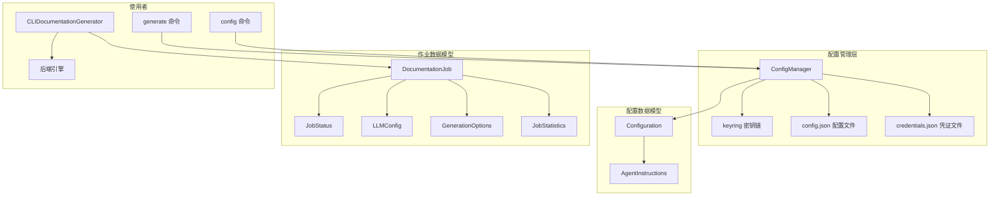
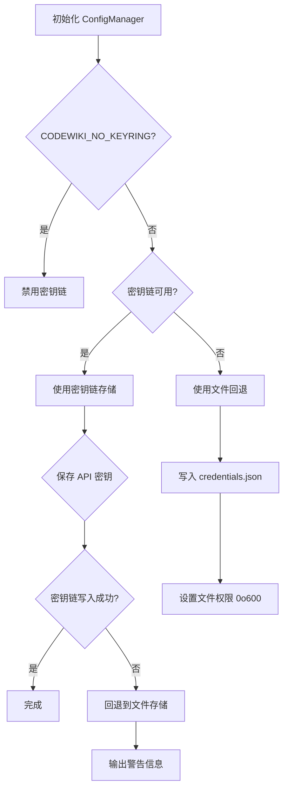
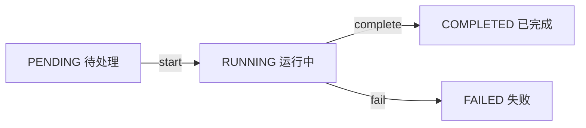
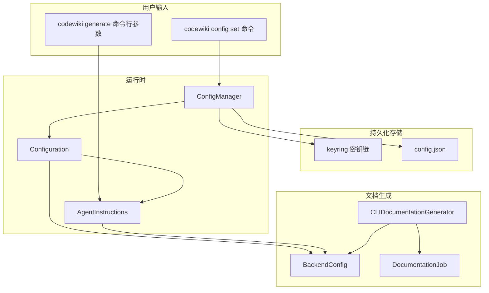

# CLI 配置与模型

## 模块概述

CLI 配置与模型模块是 CodeWiki 配置管理和数据建模的核心层，负责管理用户的 LLM API 凭证、生成配置、作业状态跟踪以及 Agent 指令等关键数据模型。该模块采用安全优先的设计，通过系统密钥链（keyring）存储 API 密钥，并提供文件回退机制确保在各种环境下均可正常工作。

### 核心功能

- **安全凭证管理**：通过系统密钥链（macOS Keychain / Windows Credential Manager / Linux Secret Service）安全存储 API 密钥
- **配置持久化**：将非敏感配置以 JSON 格式存储在 `~/.codewiki/config.json`
- **多供应商支持**：支持 OpenAI 兼容、Anthropic、AWS Bedrock、Azure OpenAI 等多种 LLM 供应商
- **Agent 指令系统**：支持文件过滤、模块聚焦、文档类型选择等自定义指令
- **作业生命周期管理**：完整跟踪文档生成作业的状态、统计和元数据
- **配置验证与迁移**：自动验证配置完整性并支持版本迁移

## 架构设计



## 组件详解

### 1. ConfigManager - 配置管理器

`ConfigManager` 是 CodeWiki 配置管理的核心类，负责加载、保存和管理用户配置。它采用分层存储策略，将敏感信息（API 密钥）与非敏感配置分离存储。

**职责：**
- 管理系统密钥链中的 API 密钥存储（优先）
- 管理 `~/.codewiki/config.json` 中的非敏感配置
- 提供密钥链不可用时的文件回退机制
- 配置加载、保存、验证和清除
- 支持通过环境变量 `CODEWIKI_NO_KEYRING=1` 禁用密钥链

**存储策略：**

| 存储位置 | 内容 | 安全性 |
|----------|------|--------|
| 系统密钥链 | API 密钥 | 高（加密存储） |
| `~/.codewiki/credentials.json` | API 密钥（回退） | 中（文件权限 0o600） |
| `~/.codewiki/config.json` | 模型、URL 等非敏感配置 | 低（明文 JSON） |

**核心方法：**

```python
# 初始化配置管理器
cm = ConfigManager()

# 加载配置
if cm.load():
    config = cm.get_config()
    api_key = cm.get_api_key()

# 保存配置
cm.save(
    api_key="sk-your-api-key",
    base_url="https://api.openai.com/v1",
    main_model="gpt-4",
    cluster_model="gpt-3.5-turbo",
    fallback_model="glm-4p5",
    provider="openai-compatible",
    max_tokens=32768,
    max_depth=2,
)

# 检查配置是否完整
if cm.is_configured():
    print("配置已就绪")

# 清除所有配置
cm.clear()
```

**密钥链检测与回退流程：**



**支持的 LLM 供应商：**

| 供应商 | provider 值 | 必需配置 |
|--------|------------|----------|
| OpenAI 兼容 | `openai-compatible` | base_url, main_model, cluster_model |
| Anthropic | `anthropic` | main_model, cluster_model |
| AWS Bedrock | `bedrock` | main_model, aws_region |
| Azure OpenAI | `azure-openai` | base_url, api_version, azure_deployment |
| Claude Code (CAW) | `claude-code` | main_model |
| Codex (CAW) | `codex` | main_model |

### 2. Configuration - 配置数据模型

`Configuration` 是一个数据类，定义了 CodeWiki 的完整配置结构。它支持序列化/反序列化、验证和向后端配置转换。

**职责：**
- 定义所有配置字段及其默认值
- 提供配置验证逻辑（按供应商类型区分）
- 支持与字典的双向转换
- 提供向后端 `Config` 的桥接转换方法

**字段说明：**

| 字段 | 类型 | 默认值 | 说明 |
|------|------|--------|------|
| `base_url` | `str` | `""` | LLM API 基础 URL |
| `main_model` | `str` | `""` | 主模型名称 |
| `cluster_model` | `str` | `""` | 聚类模型名称 |
| `fallback_model` | `str` | `"glm-4p5"` | 回退模型名称 |
| `default_output` | `str` | `"docs"` | 默认输出目录 |
| `provider` | `str` | `"openai-compatible"` | LLM 供应商类型 |
| `aws_region` | `str` | `"us-east-1"` | AWS 区域 |
| `api_version` | `str` | `"2024-12-01-preview"` | Azure API 版本 |
| `azure_deployment` | `str` | `""` | Azure 部署名称 |
| `max_tokens` | `int` | `32768` | LLM 最大 token 数 |
| `max_token_per_module` | `int` | `36369` | 每模块最大 token 数 |
| `max_token_per_leaf_module` | `int` | `16000` | 每叶模块最大 token 数 |
| `max_depth` | `int` | `2` | 层次分解最大深度 |
| `agent_instructions` | `AgentInstructions` | 空对象 | Agent 自定义指令 |

**验证规则：**

```python
# CAW 供应商（claude-code, codex）仅需验证 main_model
if is_caw_provider(self.provider):
    validate_model_name(self.main_model)
    return

# API 供应商需验证 URL 和所有模型名称
validate_url(self.base_url)
validate_model_name(self.main_model)
validate_model_name(self.cluster_model)
validate_model_name(self.fallback_model)
```

**与后端配置的桥接：**

```python
# 将 CLI 配置转换为后端配置
backend_config = config.to_backend_config(
    repo_path="/path/to/repo",
    output_dir="/path/to/docs",
    api_key=api_key,
    runtime_instructions=runtime_instructions,
)
```

### 3. AgentInstructions - Agent 指令模型

`AgentInstructions` 定义了文档生成 Agent 的自定义指令，允许用户通过文件过滤、模块聚焦、文档类型和自由文本指令来定制文档生成行为。

**职责：**
- 定义文件包含/排除模式
- 定义模块聚焦列表
- 定义文档类型（API、架构、用户指南等）
- 生成提示词附加内容

**字段说明：**

| 字段 | 类型 | 说明 | 示例 |
|------|------|------|------|
| `include_patterns` | `List[str]` | 文件包含模式 | `["*.cs", "*.py"]` |
| `exclude_patterns` | `List[str]` | 文件/目录排除模式 | `["*Tests*", "*test*"]` |
| `focus_modules` | `List[str]` | 聚焦模块列表 | `["src/core", "src/api"]` |
| `doc_type` | `str` | 文档类型 | `"api"`, `"architecture"` |
| `custom_instructions` | `str` | 自定义指令文本 | `"Focus on public APIs"` |

**文档类型预设：**

| doc_type | 预设指令 |
|----------|----------|
| `api` | 聚焦 API 文档：端点、参数、返回类型和使用示例 |
| `architecture` | 聚焦架构文档：系统设计、组件关系和数据流 |
| `user-guide` | 聚焦用户指南：功能使用、分步教程 |
| `developer` | 聚焦开发者文档：代码结构、贡献指南和实现细节 |

**指令合并策略：**

在 `generate` 命令中，运行时指令与持久化配置指令会进行合并，运行时指令优先级更高：

```python
# 合并运行时指令与持久化配置
merged = AgentInstructions(
    include_patterns=runtime.include_patterns or config.agent_instructions.include_patterns,
    exclude_patterns=runtime.exclude_patterns or config.agent_instructions.exclude_patterns,
    focus_modules=runtime.focus_modules or config.agent_instructions.focus_modules,
    doc_type=runtime.doc_type or config.agent_instructions.doc_type,
    custom_instructions=runtime.custom_instructions or config.agent_instructions.custom_instructions,
)
```

### 4. DocumentationJob - 文档作业模型

`DocumentationJob` 代表一次完整的文档生成作业，跟踪作业的完整生命周期从创建到完成或失败。

**职责：**
- 跟踪作业状态（待处理 -> 运行中 -> 已完成/失败）
- 记录作业元数据（仓库信息、时间戳、分支等）
- 收集生成的文件列表
- 存储 LLM 配置和生成选项
- 支持 JSON 序列化/反序列化

**作业生命周期：**



**代码示例：**

```python
# 创建作业
job = DocumentationJob()
job.repository_path = "/path/to/repo"
job.repository_name = "my-project"
job.output_directory = "/path/to/docs"
job.llm_config = LLMConfig(
    main_model="gpt-4",
    cluster_model="gpt-3.5-turbo",
    base_url="https://api.openai.com/v1",
)

# 开始作业
job.start()  # 状态变为 RUNNING

# ... 执行文档生成 ...

# 完成作业
job.files_generated = ["overview.md", "module1.md", "index.html"]
job.module_count = 5
job.complete()  # 状态变为 COMPLETED

# 序列化为 JSON
json_str = job.to_json()

# 从 JSON 恢复
restored_job = DocumentationJob.from_dict(json.loads(json_str))
```

### 5. JobStatus - 作业状态枚举

`JobStatus` 是一个字符串枚举，定义了文档作业的四种状态。

**状态值：**

| 枚举值 | 字符串值 | 说明 |
|--------|----------|------|
| `PENDING` | `"pending"` | 作业已创建但尚未开始 |
| `RUNNING` | `"running"` | 作业正在执行 |
| `COMPLETED` | `"completed"` | 作业成功完成 |
| `FAILED` | `"failed"` | 作业执行失败 |

### 6. LLMConfig - LLM 配置模型

`LLMConfig` 是一个轻量级数据类，存储与文档作业关联的 LLM 配置信息。

**字段：**

| 字段 | 类型 | 说明 |
|------|------|------|
| `main_model` | `str` | 主模型名称 |
| `cluster_model` | `str` | 聚类模型名称 |
| `base_url` | `str` | API 基础 URL |

### 7. GenerationOptions - 生成选项模型

`GenerationOptions` 存储文档生成时的运行时选项，控制生成行为的各种开关。

**字段：**

| 字段 | 类型 | 默认值 | 说明 |
|------|------|--------|------|
| `create_branch` | `bool` | `False` | 是否创建 Git 文档分支 |
| `github_pages` | `bool` | `False` | 是否生成 HTML 查看器 |
| `no_cache` | `bool` | `False` | 是否禁用缓存 |
| `custom_output` | `Optional[str]` | `None` | 自定义输出目录 |

### 8. JobStatistics - 作业统计模型

`JobStatistics` 记录文档生成作业的统计数据。

**字段：**

| 字段 | 类型 | 默认值 | 说明 |
|------|------|--------|------|
| `total_files_analyzed` | `int` | `0` | 分析的源文件总数 |
| `leaf_nodes` | `int` | `0` | 识别的叶节点数 |
| `max_depth` | `int` | `0` | 层次分解的最大深度 |
| `total_tokens_used` | `int` | `0` | 使用的 LLM token 总数 |

## 数据流与配置传递



## 配置文件格式

`~/.codewiki/config.json` 示例：

```json
{
  "version": "1.0",
  "base_url": "https://api.openai.com/v1",
  "main_model": "gpt-4",
  "cluster_model": "gpt-3.5-turbo",
  "fallback_model": "glm-4p5",
  "default_output": "docs",
  "provider": "openai-compatible",
  "max_tokens": 32768,
  "max_token_per_module": 36369,
  "max_token_per_leaf_module": 16000,
  "max_depth": 2,
  "agent_instructions": {
    "include_patterns": ["*.py", "*.ts"],
    "exclude_patterns": ["*test*", "*spec*"],
    "focus_modules": ["src/core"],
    "doc_type": "api",
    "custom_instructions": "Include usage examples"
  }
}
```

## 模块关系

- [CLI 入口与命令](CLI%20入口与命令.md) - 使用 ConfigManager 加载配置并传递给生成器
- [CLI 工具库](CLI%20工具库.md) - 提供文件系统工具、错误类和验证函数
- [后端配置](后端配置.md) - 接收 CLI Configuration 转换后的 BackendConfig

## 设计要点

1. **安全优先**：API 密钥优先存储在系统密钥链中，仅在密钥链不可用时回退到文件存储，并输出警告
2. **供应商适配**：通过 `provider` 字段和 `is_caw_provider()` 判断，对不同供应商采用不同的验证和配置策略
3. **指令合并**：运行时 CLI 参数与持久化配置指令自动合并，运行时优先
4. **序列化友好**：所有模型类均支持 `to_dict()`/`from_dict()` 双向转换，便于 JSON 存储和传输
5. **状态跟踪**：`DocumentationJob` 完整记录作业生命周期，支持序列化和恢复