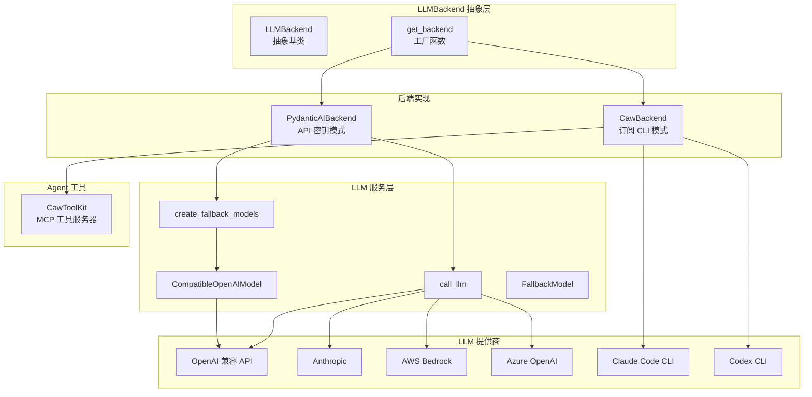
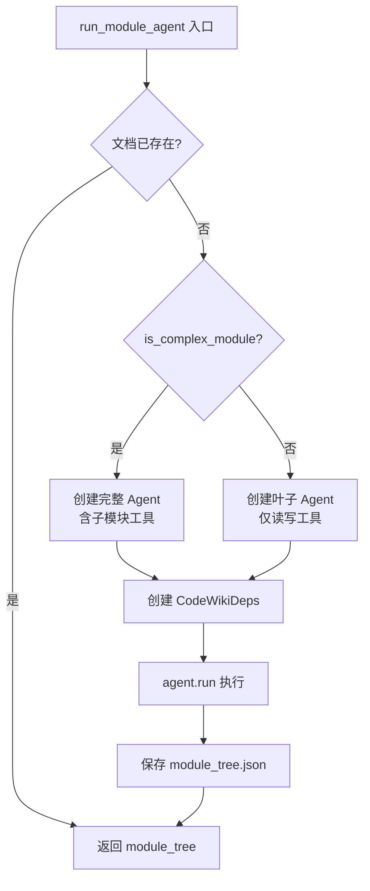
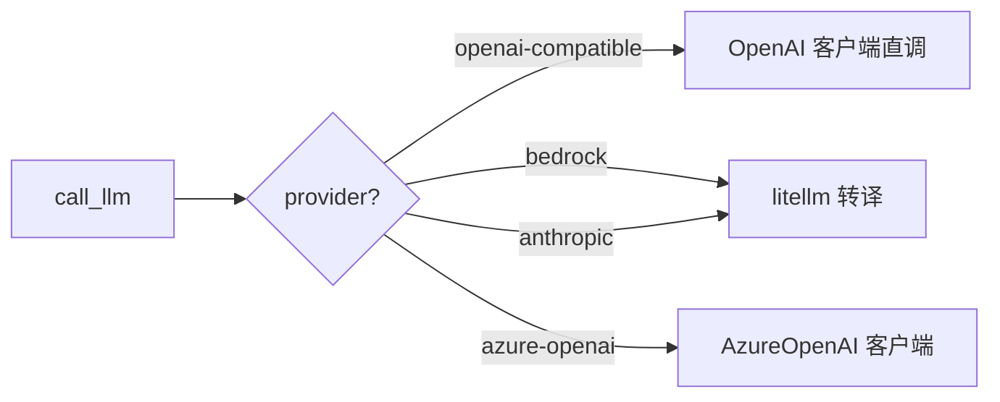
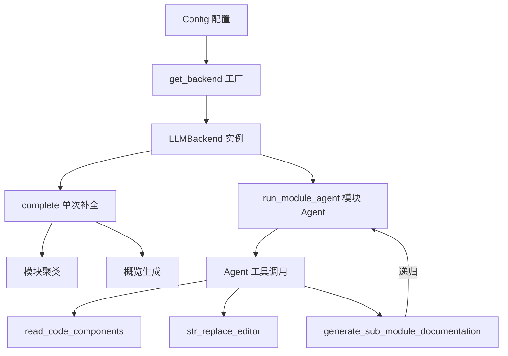

# LLM 后端与服务

## 模块概述

LLM 后端与服务模块是 CodeWiki-CN 的核心基础设施，负责统一管理所有大语言模型（LLM）的调用方式。该模块通过抽象层设计，将两种截然不同的 LLM 调用模式——**API 密钥模式**和**订阅模式**——封装在同一个接口之下，使得上层文档生成逻辑可以无缝切换不同的 LLM 提供商。

### 核心功能

- **统一抽象接口**：`LLMBackend` 定义了单次补全（`complete`）和异步 Agent 循环（`run_module_agent`）两个核心方法
- **工厂模式选择**：`get_backend` 根据配置自动实例化正确的后端实现
- **多提供商支持**：支持 OpenAI 兼容 API、Anthropic、AWS Bedrock、Azure OpenAI 以及 Claude Code/Codex CLI 订阅模式
- **回退链机制**：通过 `FallbackModel` 实现主模型到备用模型的自动切换
- **兼容性适配**：`CompatibleOpenAIModel` 修补非标准 API 代理响应

## 架构总览



## 组件详解

### 1. LLMBackend — 抽象基类

`LLMBackend` 是整个后端系统的核心抽象，定义了两个必须由子类实现的接口方法。

**文件路径**: `codewiki/src/be/backend.py`

```python
class LLMBackend(abc.ABC):
    """抽象 LLM 后端，供文档生成器使用。"""

    @abc.abstractmethod
    def complete(self, prompt: str, *, model: str | None = None,
                 temperature: float = 0.0) -> str:
        """单次文本补全——用于聚类、父模块/仓库概览生成。"""

    @abc.abstractmethod
    async def run_module_agent(self, module_name: str,
                               components: Dict[str, "Node"],
                               core_component_ids: List[str],
                               module_path: List[str],
                               working_dir: str) -> Dict[str, Any]:
        """运行模块级 Agent 循环——用于逐模块文档生成。"""
```

**设计意图**：
- `complete` 用于简单的同步单次调用场景（如模块聚类、概览生成）
- `run_module_agent` 用于复杂的多轮异步 Agent 交互（如叶子模块文档生成），支持工具调用和递归子 Agent

### 2. get_backend — 工厂函数

工厂函数根据配置中的 `provider` 字段决定实例化哪个后端。

```python
CAW_PROVIDERS = frozenset({"claude-code", "codex"})

def is_caw_provider(provider: str) -> bool:
    """判断是否为 caw 订阅模式提供商。"""
    return provider in CAW_PROVIDERS

def get_backend(config) -> "LLMBackend":
    """根据 config.provider 返回对应的后端实例。"""
    provider = getattr(config, "provider", "openai-compatible")
    if is_caw_provider(provider):
        from codewiki.src.be.caw_backend import CawBackend
        return CawBackend(config)
    from codewiki.src.be.pydantic_ai_backend import PydanticAIBackend
    return PydanticAIBackend(config)
```

**延迟导入策略**：工厂函数使用局部 `import` 而非模块顶层导入，避免了循环依赖，同时确保不使用的后端实现不会被加载。

### 3. PydanticAIBackend — API 密钥模式

`PydanticAIBackend` 是基于 pydantic-ai 框架和 OpenAI 兼容客户端的后端实现，使用 API 密钥进行认证。

**文件路径**: `codewiki/src/be/pydantic_ai_backend.py`

**核心特性**：
- 使用 `FallbackModel` 构建主模型 + 备用模型的回退链
- Agent 工具集根据模块复杂度动态调整：
  - 复杂模块（多文件）：配备 `read_code_components`、`str_replace_editor`、`generate_sub_module_documentation` 三个工具
  - 叶子模块（单文件）：仅配备 `read_code_components` 和 `str_replace_editor`

```python
class PydanticAIBackend(LLMBackend):
    def __init__(self, config: Config) -> None:
        self._config = config
        self._fallback_models = create_fallback_models(config)
        self._custom_instructions = config.get_prompt_addition()

    def complete(self, prompt: str, *, model=None, temperature=0.0) -> str:
        return call_llm(prompt, self._config, model=model,
                        temperature=temperature)

    async def run_module_agent(self, module_name, components,
                               core_component_ids, module_path,
                               working_dir) -> Dict[str, Any]:
        # 检查文档是否已存在（幂等性）
        # 根据模块复杂度选择不同的 Agent 工具集
        # 创建 CodeWikiDeps 依赖注入上下文
        # 运行 Agent 并保存模块树
```

**Agent 运行流程**：



### 4. CawBackend — 订阅 CLI 模式

`CawBackend` 通过 `claude` 或 `codex` CLI 二进制文件路由所有 LLM 调用，使用用户的 OAuth 订阅认证，无需 API 密钥。

**文件路径**: `codewiki/src/be/caw_backend.py`

**关键设计**：

| 特性 | 说明 |
|------|------|
| 提供商映射 | `claude-code` → `claude_code`，`codex` → `codex` |
| 工具组控制 | 禁用 WRITER/INTERACTION/WEB，仅启用 READER + PARALLEL |
| 超时补丁 | Codex MCP 工具超时设为 24 小时，防止长递归被取消 |
| 工作目录管理 | Agent 运行期间 `os.chdir` 到文档输出目录 |
| 心跳机制 | 子模块递归期间每 10 秒发送 MCP 进度通知 |

```python
class CawBackend(LLMBackend):
    def __init__(self, config: Config) -> None:
        self._config = config
        self._caw_provider = _resolve_caw_provider(config.provider)
        self._model = config.main_model or None
        # 验证 CLI 二进制文件是否可用
        cli = _CLI_BINARY[config.provider]
        if shutil.which(cli) is None:
            raise RuntimeError(
                f"Subscription mode requires the '{cli}' CLI on PATH."
            )
```

**工具组策略**：

```python
# 禁用内置 Write/Edit，强制使用 CodeWiki 的 str_replace_editor
# 确保 Mermaid 验证在两种后端中一致运行
_AGENT_TOOL_GROUP = ToolGroup.READER | ToolGroup.PARALLEL

def _agent_tool_group_for_provider(provider: str) -> ToolGroup:
    if provider == "codex":
        # Codex 需要 EXEC 模式才能使用 MCP 工具
        return _AGENT_TOOL_GROUP | ToolGroup.EXEC
    return _AGENT_TOOL_GROUP
```

**异步到同步桥接**：

CawBackend 的核心挑战是 caw 库通过 `subprocess.Popen` 调用 CLI，是阻塞操作。解决方案是使用 `asyncio.to_thread` 将阻塞调用移至工作线程：

```python
async def run_module_agent(self, ...):
    set_main_loop(asyncio.get_running_loop())
    return await asyncio.to_thread(
        self._run_module_agent_sync,
        module_name, components, core_component_ids,
        module_path, working_dir,
    )
```

### 5. CompatibleOpenAIModel — 兼容性适配

某些 OpenAI 兼容 API 代理返回的响应不完全符合标准，例如 `choices[].index` 可能为 `None`。`CompatibleOpenAIModel` 在 pydantic 验证之前修补这些字段。

**文件路径**: `codewiki/src/be/llm_services.py`

```python
class CompatibleOpenAIModel(OpenAIModel):
    """修补非标准 API 代理响应的 OpenAIModel 子类。"""

    def _validate_completion(self, response):
        if response.choices:
            for i, choice in enumerate(response.choices):
                if choice.index is None:
                    choice.index = i
        return super()._validate_completion(response)
```

### 6. LLM 服务层 — llm_services

LLM 服务层提供了一系列工厂函数和调用函数，是整个 LLM 调用的底层基础。

**文件路径**: `codewiki/src/be/llm_services.py`

#### 模型创建工厂

```python
def create_main_model(config: Config) -> CompatibleOpenAIModel:
    """从配置创建主 LLM 模型。"""
    return CompatibleOpenAIModel(
        model_name=config.main_model,
        provider=OpenAIProvider(
            base_url=config.llm_base_url,
            api_key=config.llm_api_key
        ),
        settings=_build_model_settings(config, config.main_model)
    )

def create_fallback_models(config: Config) -> FallbackModel:
    """创建主模型 + 备用模型的回退链。"""
    main = create_main_model(config)
    fallback = create_fallback_model(config)
    return FallbackModel(main, fallback)
```

#### call_llm — 统一补全函数

`call_llm` 函数根据 `provider` 自动选择调用路径：



**Token 参数自适应**：

较新的 OpenAI 模型（o1、o3、o4、gpt-4o、gpt-5 等）需要 `max_completion_tokens` 而非传统的 `max_tokens`。服务层通过 `_should_use_max_completion_tokens` 智能判断，并在首次请求失败时自动切换到另一个参数名重试。

```python
def call_llm(prompt, config, model=None, temperature=0.0) -> str:
    # 1. 根据提供商选择调用路径
    # 2. 智能选择 max_tokens 或 max_completion_tokens
    # 3. 如果服务器拒绝，自动切换到另一个参数重试
    # 4. 返回 response.choices[0].message.content
```

### 7. CawToolKit — MCP 工具服务器

`CawToolKit` 将 CodeWiki 的三个核心 Agent 工具以 caw MCP 服务器的形式暴露给 caw Agent。

**文件路径**: `codewiki/src/be/caw_toolkit.py`

**工具列表**：

| 工具名 | 功能 |
|--------|------|
| `read_code_components` | 读取组件源代码 |
| `str_replace_editor` | 文件查看/创建/编辑/撤销 |
| `generate_sub_module_documentation` | 子模块文档递归生成 |

```python
class CawToolKit(
    ToolKit,
    server_name="codewiki_tools",
    display_name="CodeWiki Tools",
):
    def __init__(self, deps: CodeWikiDeps,
                 backend: "CawBackend",
                 allow_subagent: bool) -> None:
        self._deps = deps
        self._backend = backend
        self._allow_subagent = allow_subagent
```

**安全控制**：
- 路径验证：拒绝绝对路径，防止写入工作目录之外的文件
- 路径遍历防护：验证 `..` 段不会逃逸 `base_dir`
- 命令白名单：`repo` 工作目录仅允许 `view` 命令
- 子 Agent 控制：叶子模块禁用 `generate_sub_module_documentation` 工具

**子模块递归与心跳**：

```python
async def generate_sub_module_documentation(self, sub_module_specs, ctx):
    if not self._allow_subagent:
        return "generate_sub_module_documentation is NOT available..."
    # 在工作线程中运行阻塞递归
    work = asyncio.create_task(
        asyncio.to_thread(self._run_sub_modules, sub_module_specs)
    )
    # 心跳任务防止 CLI 取消长工具调用
    heartbeat = asyncio.create_task(_heartbeat(ctx, work))
    try:
        return await work
    finally:
        heartbeat.cancel()
```

## 数据流



## 提供商对比

| 特性 | PydanticAIBackend | CawBackend |
|------|-------------------|------------|
| 认证方式 | API 密钥 | OAuth 订阅 |
| LLM 调用 | pydantic-ai + OpenAI 客户端 | caw 库 + CLI 子进程 |
| 模型回退 | FallbackModel 自动回退 | 无内置回退链 |
| 工具暴露 | pydantic-ai Tool 注册 | MCP 服务器（CawToolKit） |
| 温度控制 | 支持 | CLI 不暴露温度参数 |
| 并发模型 | 异步原生 | asyncio.to_thread 桥接 |
| Codex 支持 | 不适用 | 需要额外 EXEC 工具组 |

## 跨模块引用

- [Agent 工具集](Agent%20工具集.md)：详细介绍 `read_code_components`、`str_replace_editor`、`generate_sub_module_documentation` 的实现
- [后端工具与流程](后端工具与流程.md)：展示 `DocumentationGenerator` 如何调用后端接口完成端到端文档生成

## 配置参数参考

| 参数 | 说明 | 示例 |
|------|------|------|
| `provider` | LLM 提供商类型 | `openai-compatible`, `claude-code`, `bedrock` |
| `main_model` | 主模型名称 | `gpt-4o`, `claude-sonnet-4-20250514` |
| `fallback_model` | 备用模型名称 | `gpt-4o-mini` |
| `llm_base_url` | API 基础 URL | `https://api.openai.com/v1` |
| `llm_api_key` | API 密钥 | `sk-...` |
| `max_tokens` | 最大输出 token 数 | `4096` |
| `cluster_model` | 聚类专用模型 | `gpt-4o-mini` |
