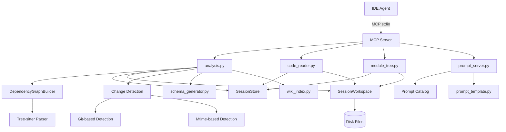
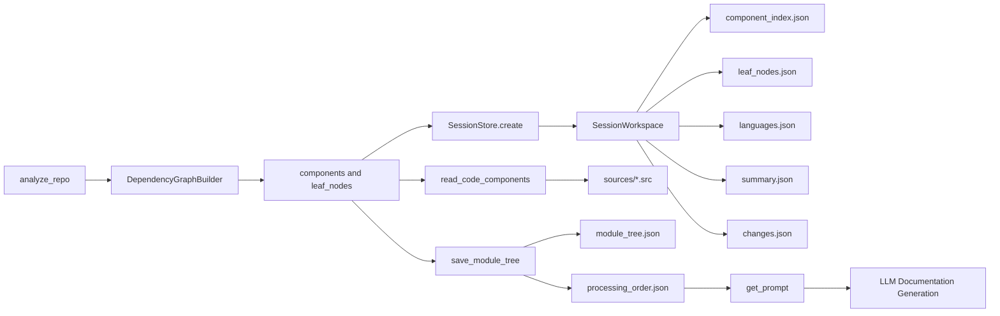

# MCP 代码分析工具

## 模块简介

MCP 代码分析工具是 CodeWiki-CN 项目中负责代码仓库分析、文档生成流水线的核心模块。它通过 MCP (Model Context Protocol) 协议向 IDE Agent 暴露一组结构化工具接口，实现了从代码解析、组件索引、模块聚类、源码读取、处理顺序计算到提示词模板服务的完整链路。

本模块的设计哲学是「磁盘优先」：所有大体量的分析结果（组件索引、叶节点列表、源代码文件等）均写入会话工作区的磁盘文件中，而非通过 MCP stdio 通道传输。IDE Agent 在收到工具返回的文件路径后，直接通过文件系统读取完整数据。这一策略避免了 stdio 通道对大载荷的截断问题，显著提升了数据传输的完整性与可靠性。

本模块位于 `codewiki/mcp/tools/` 目录下，包含四个核心文件：

| 文件 | 职责概述 |
|------|----------|
| `analysis.py` | 仓库分析与增量变更检测 |
| `code_reader.py` | 组件源码读取与磁盘输出 |
| `module_tree.py` | 模块树持久化与处理顺序计算 |
| `prompt_server.py` | 提示词模板目录与变量替换服务 |

---

## 核心功能

本模块提供以下五项核心能力：

1. **仓库依赖分析** -- 调用 Tree-sitter 依赖分析器解析仓库，构建组件依赖图，输出组件索引、叶节点列表、语言统计等结构化数据。
2. **增量变更检测** -- 支持基于 Git 提交历史和文件修改时间的双重检测策略，识别自上次文档生成以来的变更文件，并映射到受影响的模块。
3. **组件源码读取** -- 根据组件 ID 将完整源代码写入工作区磁盘文件，无需经过 MCP stdio 通道传输，避免截断。
4. **模块树管理** -- 持久化 IDE Agent 的聚类结果，计算叶优先 (leaf-first) 的文档生成处理顺序。
5. **提示词模板服务** -- 提供覆盖聚类、叶模块文档、父模块文档、仓库概览、知识管理等全流程的提示词模板，支持变量替换。

---

## 架构图



---

## 数据流与处理流程



完整的文档生成流水线如下：

1. IDE Agent 调用 `analyze_repo`，触发仓库解析和依赖图构建。
2. 分析结果写入工作区磁盘文件，返回 session_id 和文件路径摘要。
3. IDE Agent 读取组件索引和叶节点列表，使用 LLM 进行模块聚类。
4. 聚类结果通过 `save_module_tree` 持久化，同时计算叶优先处理顺序。
5. IDE Agent 按处理顺序，对每个模块调用 `get_prompt` 获取提示词模板，调用 `read_code_components` 获取源代码，然后生成文档。
6. 文档通过 [文档写入工具](MCP工具集.md) 写入最终输出目录。

---

## 各组件职责说明

### analysis.py -- 仓库分析与增量检测

本文件是整个分析流水线的入口，实现了 `handle_analyze_repo` 函数。

#### handle_analyze_repo

主入口函数，接收 IDE Agent 传入的参数（仓库路径、输出目录、包含/排除模式），执行以下操作：

1. 构建 `Config` 配置对象，设置仓库路径和输出目录。
2. 调用 `DependencyGraphBuilder.build_dependency_graph()` 执行 Tree-sitter 依赖分析，返回组件字典和叶节点列表。
3. 通过 `SessionStore.create()` 创建会话，分配唯一的 session_id。
4. 将分析结果写入工作区磁盘文件：
   - `component_index.json` -- 全量组件索引，包含每个组件的 ID、类型和文件路径
   - `leaf_nodes.json` -- 叶节点列表
   - `languages.json` -- 语言统计
   - `summary.json` -- 包含预览的摘要信息
   - `changes.json` -- 增量变更检测结果（如有）
5. 自动调用 `generate_schema` 生成 `schema.yaml`，调用 `rebuild_index` 和 `append_log` 更新索引与日志。
6. 返回精简的 JSON 摘要，包含 session_id、文件路径和统计数据。

支持的可选参数：
- `include_patterns` -- 逗号分隔的文件包含模式
- `exclude_patterns` -- 逗号分隔的文件排除模式

#### _detect_changes

增量变更检测的核心函数。检查是否存在上一次文档生成的元数据（`metadata.json` 和 `module_tree.json`），若存在则启动变更检测流程。返回结构化的变更信息字典，包含：

- `has_previous` -- 是否存在上一次生成记录
- `no_changes` -- 是否无变更
- `changed_files` -- 变更文件列表
- `affected_modules` -- 受影响的模块列表
- `cascade_modules` -- 需要刷新的级联父模块列表

#### _detect_via_git

基于 Git 的变更变检测策略。通过比较存储的 commit_id 与当前 HEAD 的差异来获取已提交的变更，同时通过 `git status` 检测未提交的变更和未跟踪的文件。依赖 `gitpython` 库，若非 Git 仓库则返回 None。

#### _detect_via_mtime

基于文件修改时间的回退检测策略。当 Git 检测不可用时（例如非 Git 仓库），遍历仓库目录树，将源文件的修改时间与上一次生成时间戳进行比较。仅识别 CodeWiki 支持的编程语言扩展名（`.py`, `.java`, `.js`, `.jsx`, `.ts`, `.tsx`, `.c`, `.h`, `.cpp`, `.hpp`, `.cs`, `.kt` 等）。

#### _find_affected_modules

将变更文件映射到受影响的模块。通过递归遍历 `module_tree.json` 中的组件列表，使用子串匹配策略判断哪些模块包含变更文件。同时收集级联父模块 -- 即那些子模块发生变更但自身文件未变更的模块。`overview` 模块始终被标记为级联模块，因为它依赖于所有子模块文档。

---

code_reader.py -- 组件源码读取

### handle_read_code_components

本函数实现了组件源码的磁盘输出。接收 session_id 和组件 ID 列表，执行以下操作：

1. 从 `SessionStore` 获取会话状态，验证会话有效性。
2. 遍历请求的组件 ID，从会话缓存中查找对应的 `Node` 对象。
3. 提取每个组件的源代码和语言信息，通过 `SessionWorkspace.write_component_source()` 写入 `sources/` 目录。
4. 返回写入文件数量、未找到的组件列表以及源文件目录路径。

这种「写文件 + 返回路径」的设计模式避免了通过 MCP stdio 传输大量源代码时的截断问题。IDE Agent 通过标准的文件读取接口获取完整、无损的源代码。

每个源文件以如下头部注释开头：

```
// Component: src/main.py::MyClass
// Language: python
```

文件名由组件 ID 经过安全化处理后生成，附加 SHA1 哈希后缀以避免冲突。

---

### module_tree.py -- 模块树管理与处理顺序

本文件管理 IDE Agent 的模块聚类结果，并计算文档生成的处理顺序。

#### handle_save_module_tree

持久化 IDE Agent 的聚类结果。接收 session_id 和模块树字典（JSON 格式），执行以下操作：

1. 将模块树同时写入两个文件：
   - `first_module_tree.json` -- 不可变快照，保留初始聚类结果
   - `module_tree.json` -- 可修改的工作副本
2. 将模块树缓存到会话状态中。
3. 调用 `_get_processing_order()` 计算叶优先处理顺序，写入 `processing_order.json`。
4. 返回保存状态、模块数量和文件路径。

保留两份副本的设计允许在后续的增量更新中，通过比较初始聚类与当前聚类来检测模块结构变化。

#### handle_get_processing_order

获取文档生成的叶优先处理顺序。优先从会话缓存中读取模块树，若缓存不可用则从磁盘文件加载。计算处理顺序后写入工作区文件并返回路径。

#### _get_processing_order

核心算法函数，通过深度优先遍历模块树计算叶优先处理顺序。对于每个模块节点：

- **叶模块**（无子模块）：直接加入处理列表
- **父模块**（有子模块）：先递归处理所有子模块，再将自身加入列表

这确保了在生成父模块文档时，其所有子模块的文档已经就绪，父模块可以引用和汇总子模块的内容。

返回的处理列表中每项包含：
- `module` -- 模块名称
- `path` -- 从根到当前模块的路径
- `is_leaf` -- 是否为叶模块
- `components` -- 该模块包含的组件列表
- `children` -- 子模块名称列表（仅父模块）

---

### prompt_server.py -- 提示词模板服务

本文件为 IDE Agent 提供 CodeWiki 全流程的提示词模板。

#### _PROMPT_CATALOG

提示词目录字典，定义了所有可用的提示词类型及其描述和使用说明。当前支持的提示词类型包括：

| 提示词类型 | 用途说明 |
|-----------|----------|
| `cluster` | 组件聚类提示词，用于将组件分组为逻辑模块 |
| `system_complex` | 复杂（多文件、父级）模块的系统提示词 |
| `system_leaf` | 叶模块文档生成的系统提示词 |
| `user` | 用户提示词模板，提供模块树和核心组件源码 |
| `overview_module` | 父模块概览生成提示词 |
| `overview_repo` | 仓库级概览生成提示词 |
| `wiki_query` | 使用 `query_wiki` 结果的引导说明 |
| `wiki_ingest` | 知识沉淀的引导说明 |
| `wiki_lint_report` | Lint 报告解读与修复计划引导 |

#### handle_get_prompt

提示词获取的主入口函数。接收 `prompt_type` 和可选的 `variables` 参数，根据提示词类型从目录中查找对应条目，调用 `_resolve_prompt` 执行变量替换后返回结构化的 JSON 结果，包含：

- `prompt_type` -- 提示词类型标识
- `description` -- 提示词描述
- `usage_hint` -- 使用说明
- `content` -- 经过变量替换的完整提示词文本

#### _resolve_prompt

提示词解析引擎，根据不同的提示词类型调用对应的格式化函数：

- `cluster` -- 调用 `format_cluster_prompt()`，支持 `potential_core_components`、`module_tree`、`module_name` 变量
- `system_complex` -- 调用 `format_system_prompt()`，支持 `module_name`、`custom_instructions` 变量
- `system_leaf` -- 调用 `format_leaf_system_prompt()`，支持 `module_name`、`custom_instructions` 变量
- `user` -- 使用 `USER_PROMPT.format()` 进行模板变量替换，支持 `module_name`、`module_tree`、`formatted_core_component_codes` 变量
- `overview_module` -- 使用 `MODULE_OVERVIEW_PROMPT.format()` 格式化
- `overview_repo` -- 使用 `REPO_OVERVIEW_PROMPT.format()` 格式化
- `wiki_query`、`wiki_ingest`、`wiki_lint_report` -- 返回静态的引导文本

---

## 会话与工作区机制

### SessionState

会话状态数据类，保存跨工具调用共享的上下文信息：

- `session_id` -- 12 位十六进制唯一标识符
- `repo_path` / `output_dir` -- 仓库路径和输出目录
- `components` -- 组件字典，键为组件 ID，值为 `Node` 对象
- `leaf_nodes` -- 叶节点 ID 列表
- `module_tree` -- 模块聚类树（由 `save_module_tree` 填充）
- `workspace` -- 关联的 `SessionWorkspace` 实例
- `created_at` / `last_accessed` -- 创建和最后访问时间戳

会话默认 TTL 为 2 小时，最大并发会话数为 10。超时会话在访问时自动清理工作区。

### SessionWorkspace

会话工作区管理器，在仓库目录下创建 `.codewiki/sessions/{session_id}/` 目录结构，提供以下文件操作：

- `write_json(name, data)` -- 将数据序列化为格式化 JSON 写入文件
- `write_component_source(component_id, source, language)` -- 将组件源码写入 `sources/` 子目录
- `read_json(name)` -- 从工作区读取 JSON 文件
- `cleanup()` -- 删除会话目录并尝试清理空的父目录

组件 ID 到文件名的转换使用安全化处理（替换非法字符为 `__`）并附加 SHA1 哈希后缀。

---

## 增量更新机制

增量更新是本模块的重要特性，它允许在仓库代码部分变更时仅更新受影响的模块文档，而非重新生成全部文档。其工作流程如下：

1. **变更检测**：在 `analyze_repo` 执行时，自动检测自上次文档生成以来的变更文件。
2. **模块映射**：通过 `_find_affected_modules` 将变更文件映射到具体受影响的模块。
3. **级联分析**：识别需要刷新的父模块（其子模块文档已变更）。
4. **策略建议**：返回的 `hint` 字段建议 IDE Agent 使用 `edit_doc_file` 进行定向更新，而非 `write_doc_file` 全量重写。

变更检测采用两级策略：

- **Git 优先**：比较 commit_id 差异，检测已提交变更和未提交变更
- **Mtime 回退**：当 Git 不可用时，通过文件修改时间与存储时间戳比较

---

## 与其他模块的依赖关系

本模块与 CodeWiki-CN 项目的其他模块存在以下依赖关系：

| 依赖模块 | 依赖方式 | 说明 |
|----------|----------|------|
| [MCP 会话与工作区](MCP会话与工作区.md) | 直接使用 | `SessionStore` 和 `SessionWorkspace` 是本模块的基础设施 |
| [MCP 协议服务器](MCP协议服务器.md) | 被注册 | 本模块的 handler 函数由 MCP Server 注册为工具端点 |
| [MCP 工具集](MCP工具集.md) | 同级模块 | 与 doc_writer、crosslink 等工具协同工作 |
| [依赖分析器](依赖分析器.md) | 直接调用 | `DependencyGraphBuilder` 提供 Tree-sitter 解析能力 |
| [数据模型与算法](数据模型与算法.md) | 数据依赖 | `Node` 数据类定义组件的结构化表示 |
| [后端工具与流程](后端工具与流程.md) | 方法论参考 | 提示词模板来源于后端的 prompt_template 模块 |
| [共享基础设施](共享基础设施.md) | 配置依赖 | `Config` 类和常量定义 |
| [分析服务](分析服务.md) | 功能互补 | 分析服务提供 CLI 模式的分析能力，本模块提供 MCP 模式 |

---

## 工具接口汇总

以下为 IDE Agent 可调用的 MCP 工具接口：

### analyze_repo

分析仓库并构建依赖图。

**参数**：
- `repo_path` (必填) -- 仓库根目录路径
- `output_dir` (可选) -- 输出目录，默认为 `{repo_path}/docs`
- `include_patterns` (可选) -- 逗号分隔的文件包含模式
- `exclude_patterns` (可选) -- 逗号分隔的文件排除模式

**返回**：session_id、工作区路径、统计信息和文件路径列表。

### read_code_components

读取指定组件的源代码并写入工作区磁盘文件。

**参数**：
- `session_id` (必填) -- 会话 ID
- `component_ids` (必填) -- 组件 ID 列表

**返回**：写入文件数量、未找到的组件列表、源文件目录路径。

### save_module_tree

保存 IDE Agent 的模块聚类结果。

**参数**：
- `session_id` (必填) -- 会话 ID
- `module_tree` (必填) -- 模块树字典

**返回**：保存状态、模块数量、文件路径和处理顺序文件路径。

### get_processing_order

获取叶优先的文档生成处理顺序。

**参数**：
- `session_id` (必填) -- 会话 ID

**返回**：模块数量和处理顺序文件路径。

### get_prompt

获取指定类型的提示词模板。

**参数**：
- `prompt_type` (必填) -- 提示词类型（cluster / system_complex / system_leaf / user / overview_module / overview_repo / wiki_query / wiki_ingest / wiki_lint_report）
- `variables` (可选) -- 模板变量字典

**返回**：提示词描述、使用说明和经过变量替换的完整提示词文本。

---

## 设计要点与注意事项

1. **磁盘优先传输**：所有大体量数据（组件索引、源代码、处理顺序等）均通过磁盘文件传递，MCP 返回仅包含文件路径和摘要信息。这一设计确保了数据传输的完整性。

2. **会话生命周期管理**：会话设有 2 小时 TTL 和最大 10 个并发会话的限制。过期或超限的会话会自动清理其工作区目录。

3. **增量更新优化**：通过 Git 和 Mtime 双重策略实现高效的增量检测，避免不必要的全量文档重新生成。`overview` 模块在任何子模块变更时都会自动标记为需要刷新。

4. **提示词模板解耦**：提示词模板集中在 `prompt_server.py` 中管理，IDE Agent 无需自行维护提示词副本。变量替换在运行时完成，确保模板始终使用最新版本。

5. **文件命名安全性**：组件 ID 到文件名的映射经过安全化处理，使用正则替换非法字符并附加哈希后缀，防止路径注入和命名冲突。

6. **非致命错误容错**：schema 生成和索引更新等操作使用 try/except 包裹，失败时仅记录警告日志，不影响主流程的执行。


<!-- crosslinks (auto-generated) -->
## Related Modules
- Depends on: [CLI 工具库](cli_工具库.md), [LLM 后端与服务](llm_后端与服务.md), [MCP 协议与会话](mcp_协议与会话.md), [MCP 文档生成工具](mcp_文档生成工具.md), [共享基础设施](共享基础设施.md), [分析服务与图算法](分析服务与图算法.md)
- Used by: [MCP 协议与会话](mcp_协议与会话.md)
