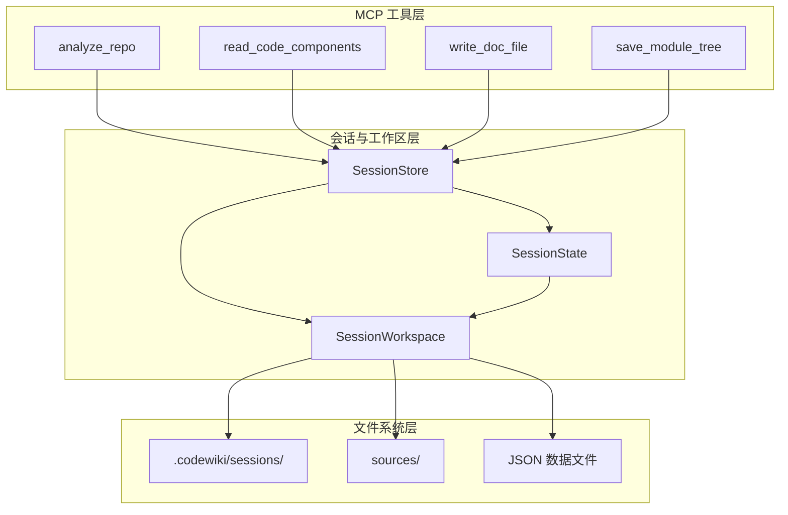
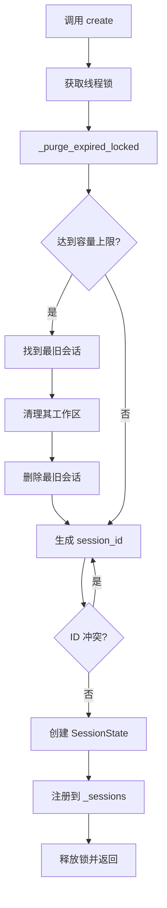
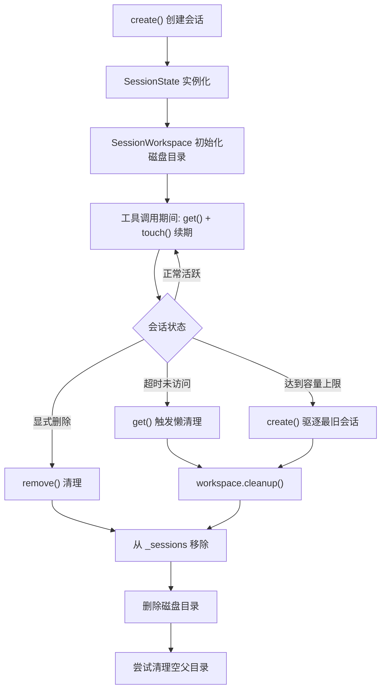
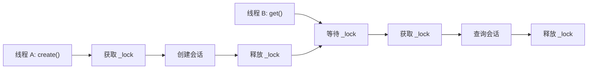

# MCP 会话与工作区

## 模块概述

MCP 会话与工作区是 CodeWiki-CN 的 MCP 子系统中的基础设施层，负责管理文档生成过程中所有工具调用的**状态持久化**、**生命周期管理**和**文件系统操作**。该模块包含三个核心组件：`SessionState`（会话状态数据类）、`SessionStore`（线程安全的会话存储）和 `SessionWorkspace`（磁盘工作区管理器），共同构成了所有 MCP 工具函数运行时的基础支撑。

## 架构总览



## 组件详解

### 1. SessionState — 会话状态数据类

#### 职责

`SessionState` 是一个数据类（dataclass），封装了单个 MCP 会话运行期间所有工具需要共享的可变状态。每个活跃的文档生成任务对应一个 `SessionState` 实例。

#### 字段说明

| 字段 | 类型 | 默认值 | 说明 |
|------|------|---------|------|
| `session_id` | `str` | 必填 | 会话唯一标识符（12位十六进制） |
| `repo_path` | `str` | 必填 | 代码仓库根目录路径 |
| `output_dir` | `str` | 必填 | 文档输出目录路径 |
| `components` | `Dict[str, Node]` | 必填 | 组件 ID 到 Node 对象的映射 |
| `leaf_nodes` | `List[str]` | 必填 | 叶子节点 ID 列表 |
| `module_tree` | `Dict[str, Any]` | `{}` | 模块聚类树结构 |
| `registry` | `Dict[str, Any]` | `{}` | 通用注册表（存储编辑历史等） |
| `workspace` | `Optional[SessionWorkspace]` | `None` | 关联的磁盘工作区 |
| `created_at` | `float` | `time.time()` | 会话创建时间戳 |
| `last_accessed` | `float` | `time.time()` | 最近访问时间戳 |

#### 过期检测与续期

```python
class SessionState:
    def touch(self) -> None:
        """更新最近访问时间戳，保持会话活跃。"""
        self.last_accessed = time.time()

    @property
    def is_expired(self) -> bool:
        """检查会话是否已超时。"""
        return (time.time() - self.last_accessed) > _SESSION_TTL_SECONDS
```

`touch()` 方法在每次通过 `SessionStore.get()` 访问会话时自动调用，确保活跃会话不会因超时被清理。`is_expired` 属性基于 `_SESSION_TTL_SECONDS` 常量判断会话是否已超过空闲时间阈值。

#### 数据流向


---

### 2. SessionStore — 线程安全的会话存储

#### 职责

`SessionStore` 是一个内存中的会话管理器，提供线程安全的会话创建、查询和删除操作。它管理所有并发 MCP 工具调用的会话生命周期，并实现了自动过期清理和容量限制驱逐机制。

#### 核心操作

| 方法 | 功能 | 线程安全 |
|------|------|---------|
| `create()` | 创建新会话，自动清理过期会话和驱逐最旧会话 | 是 |
| `get()` | 获取会话，自动续期；过期会话自动清理并返回 None | 是 |
| `remove()` | 显式删除会话 | 是 |
| `_purge_expired_locked()` | 批量清理所有过期会话（内部方法） | 需持有锁 |

#### 会话创建流程



#### 容量管理与驱逐策略

当活跃会话数量达到 `_MAX_SESSIONS` 上限时，系统会自动驱逐 `last_accessed` 时间最早的会话。驱逐过程包括：

1. 找到最旧访问的会话
2. 调用该会话的 `workspace.cleanup()` 清理磁盘文件
3. 从 `_sessions` 字典中移除

```python
if len(self._sessions) >= _MAX_SESSIONS:
    oldest_id = min(
        self._sessions,
        key=lambda sid: self._sessions[sid].last_accessed,
    )
    evicted = self._sessions[oldest_id]
    if evicted.workspace is not None:
        evicted.workspace.cleanup()
    del self._sessions[oldest_id]
```

#### 会话 ID 生成策略

会话 ID 使用 `uuid.uuid4().hex[:12]` 生成，即取 UUID4 的前 12 位十六进制字符。生成后检查是否与现有会话冲突，若冲突则重新生成：

```python
session_id = uuid.uuid4().hex[:12]
while session_id in self._sessions:
    session_id = uuid.uuid4().hex[:12]
```

#### 过期会话的懒清理

`get()` 方法实现了懒清理策略：访问会话时若发现已过期，立即清理其工作区并从存储中移除，然后返回 `None`。这避免了需要单独的定时清理线程。

```python
def get(self, session_id: str) -> Optional[SessionState]:
    with self._lock:
        state = self._sessions.get(session_id)
        if state is None:
            return None
        if state.is_expired:
            if state.workspace is not None:
                state.workspace.cleanup()
            del self._sessions[session_id]
            return None
        state.touch()  # 自动续期
        return state
```

---

### 3. SessionWorkspace — 磁盘工作区管理器

#### 职责

`SessionWorkspace` 管理单个会话在磁盘上的文件空间，提供结构化的 JSON 数据写入、源码文件写入和清理功能。每个工作区对应一个唯一的目录路径。

#### 目录结构

```
{repo_path}/
  .codewiki/
    sessions/
      {session_id}/         <- SessionWorkspace.root
        component_index.json
        leaf_nodes.json
        languages.json
        summary.json
        changes.json
        processing_order.json
        sources/             <- 源码文件目录
          pkg__module.py____MyClass.src
          ...
```

工作区目录固定位于 `{repo_path}/.codewiki/sessions/{session_id}/`，初始化时自动创建根目录和 `sources/` 子目录。

#### 核心方法

| 方法 | 功能 | 返回 |
|------|------|------|
| `write_json(name, data)` | 写入格式化的 JSON 文件 | `Path` 文件路径 |
| `write_component_source(cid, source, lang)` | 写入组件源码（含头部注释） | `Path` 文件路径 |
| `read_json(name)` | 读取 JSON 文件内容 | 解析后的对象或 `None` |
| `cleanup()` | 删除会话目录并尝试清理空父目录 | `None` |

#### JSON 数据写入

`write_json` 将 Python 数据对象序列化为缩进为 2 的格式化 JSON，使用 UTF-8 编码写入：

```python
def write_json(self, name: str, data: Any) -> Path:
    p = self.root / name
    p.write_text(
        json.dumps(data, indent=2, ensure_ascii=False),
        encoding="utf-8"
    )
    return p
```

#### 源码文件写入

`write_component_source` 将组件源码写入 `sources/` 子目录，文件名通过 `_safe_filename` 函数生成，并自动添加组件元信息头部：

```python
def write_component_source(self, component_id, source, language=""):
    p = self.root / "sources" / _safe_filename(component_id)
    header = f"// Component: {component_id}\n// Language: {language}\n"
    p.write_text(header + source, encoding="utf-8")
    return p
```

---

### 4. _safe_filename — 文件名安全转换

#### 职责

`_safe_filename` 是一个内部辅助函数，将组件 ID（可能包含 `::`、`/` 等特殊字符）转换为文件系统安全的文件名。转换规则：

- 将 `::` 替换为 `____`（四个下划线）
- 将路径分隔符替换为 `__`
- 添加 `.src` 扩展名

例如：
- `pkg::module.py::MyClass` → `pkg__module.py____MyClass.src`
- `src/components/Button.tsx` → `src__components__Button.tsx.src`

## 生命周期管理



## 线程安全机制

`SessionStore` 使用 `threading.Lock` 确保所有会话操作的线程安全性：

- **create** — 在锁内完成清理、驱逐、ID 生成和注册的全过程
- **get** — 在锁内检查过期、清理和续期，避免并发访问导致的状态不一致
- **remove** — 在锁内执行字典的 pop 操作
- **_purge_expired_locked** — 仅在持有锁时调用，遍历并清理所有过期会话



## 工作区清理策略

`cleanup()` 方法实现了级联式的目录清理：

```python
def cleanup(self) -> None:
    # 1. 删除会话目录及其所有内容
    if self.root.exists():
        shutil.rmtree(self.root, ignore_errors=True)
    # 2. 尝试清理空的父目录
    sessions_dir = self.root.parent  # .codewiki/sessions
    if sessions_dir.exists() and not any(sessions_dir.iterdir()):
        sessions_dir.rmdir()
        base_dir = sessions_dir.parent  # .codewiki
        if base_dir.exists() and not any(base_dir.iterdir()):
            base_dir.rmdir()
```

清理过程：

1. 使用 `shutil.rmtree` 删除整个会话目录（`ignore_errors=True` 容忍部分失败）
2. 向上检查 `sessions/` 目录是否为空，若空则删除
3. 继续向上检查 `.codewiki/` 目录是否为空，若空则删除

这种级联清理确保不会留下空的目录结构。

## 与相关模块的关系

- [MCP 工具集](MCP_工具集.md) — 所有工具函数通过 `SessionStore` 获取会话状态，通过 `SessionWorkspace` 读写文件
- [MCP 服务器](MCP_服务器.md) — MCP 服务器在启动时创建 `SessionStore` 实例并注入到各工具函数
- [依赖分析引擎](依赖分析引擎.md) — 分析结果（`components`、`leaf_nodes`）存储在 `SessionState` 中

## 配置常量

| 常量 | 说明 |
|------|------|
| `_SESSION_TTL_SECONDS` | 会话空闲超时时间（秒） |
| `_MAX_SESSIONS` | 最大并发会话数 |
| `_WORKSPACE_REL` | 工作区相对路径前缀，固定为 `.codewiki/sessions` |

## 设计亮点

- **零拷贝数据共享**：所有工具函数通过同一个 `SessionState` 实例共享组件数据和中间结果，无需序列化传输
- **懒过期清理**：会话过期检测在 `get()` 时触发，避免了后台清理线程的复杂性
- **磁盘传递模式**：大数据量内容（源码、组件索引）通过工作区文件传递，MCP 响应仅包含文件路径
- **级联目录清理**：工作区删除时自动向上清理空目录，保持仓库目录整洁
- **文件名安全转换**：`_safe_filename` 确保所有组件 ID 均可安全用作文件名，避免特殊字符问题
