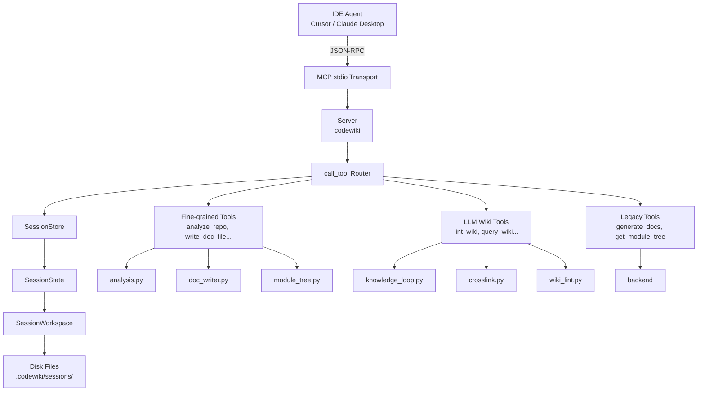
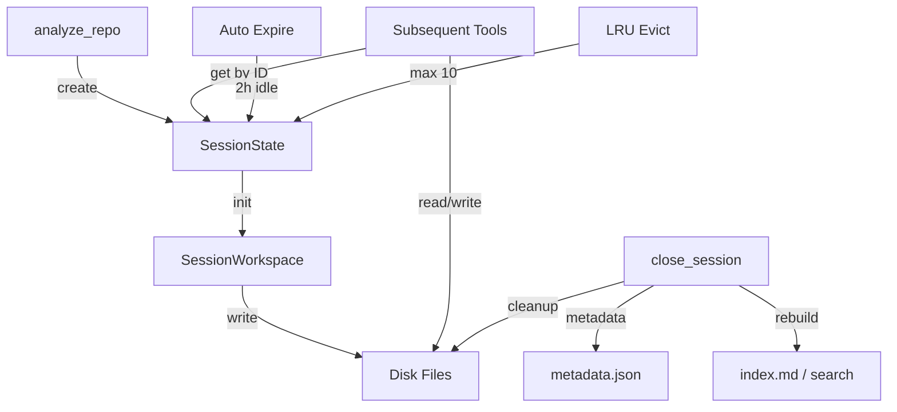

# MCP 协议与会话

## 模块简介

MCP 协议与会话模块是 CodeWiki-CN 的核心通信层，负责通过 [Model Context Protocol (MCP)](https://modelcontextprotocol.io) 标准协议对外暴露代码分析与文档生成能力。该模块由三个核心文件组成：`server.py` 实现 MCP 服务端与工具路由，`session.py` 管理多会话生命周期与状态缓存，`workspace.py` 处理大规模分析产物的磁盘持久化。

整体设计遵循「大结果写磁盘、小摘要走协议」的原则，避免通过 MCP stdio 通道传输体积庞大的组件索引和源代码，而是将完整数据写入会话工作区文件，仅向 IDE 代理返回文件路径和精简摘要。

## 核心功能一览

| 功能领域 | 说明 |
|---------|------|
| MCP 服务启动 | 基于 stdio 传输的异步 MCP 服务器，支持 Cursor / Claude Desktop 等 IDE 直接集成 |
| 工具注册与路由 | 注册 14 个 MCP 工具，按类型分为细粒度工具、LLM Wiki 工具和遗留工具三组 |
| 会话管理 | 线程安全的会话存储，支持自动过期（2 小时）、最大并发限制（10 个）和 LRU 淘汰 |
| 工作区持久化 | 每个会话在 `.codewiki/sessions/{session_id}/` 下创建独立目录，存储 JSON 索引和源代码文件 |
| 增量更新 | 通过 `metadata.json` 记录 git commit 基线，后续 `analyze_repo` 调用自动检测变更文件 |
| Mermaid 校验 | 写入文档时自动校验 Mermaid 图表语法，防止生成无效的架构图 |

## 架构图



## 文件与组件职责说明

### server.py -- MCP 服务端主体

`server.py` 是整个 MCP 协议的入口文件，承担以下职责：

**全局实例初始化**：在模块加载时创建全局 `SessionStore` 实例（`_store`）和 MCP `Server` 实例（`server`）。`_store` 的生命周期与 MCP 服务进程相同，所有工具调用共享同一个会话存储。

**工具注册**：通过 `_fine_grained_tools()` 和 `_legacy_tools()` 两个函数分别构建工具定义列表。每个工具以 `mcp.types.Tool` 对象描述，包含名称、功能说明和 JSON Schema 输入参数定义。`list_tools()` 装饰器函数将两组工具合并后返回给客户端。

**工具路由与分发**：`call_tool()` 是核心路由函数，根据工具名称将请求分发到对应处理器。路由策略如下：

- `analyze_repo`：在主线程同步执行（因 Tree-sitter C 扩展非线程安全）
- 其余细粒度工具：通过 `asyncio.to_thread()` 在后台线程执行，避免阻塞事件循环
- LLM Wiki 工具：同样使用 `asyncio.to_thread()` 异步执行
- 遗留工具：调用 `_legacy_generate_docs()` 或 `_legacy_get_module_tree()` 内部异步处理

**会话关闭与清理**：`close_session` 处理器在关闭会话时执行一系列收尾操作：写入 `metadata.json` 记录当前 git commit、更新 `index.md` 和 `log.md`、构建 BM25 搜索索引、清理工作区磁盘文件，最后从 `SessionStore` 中移除会话。

**增量更新支持**：`_write_generation_metadata()` 辅助函数在会话关闭时将当前 git commit hash 和时间戳写入 `metadata.json`。下次调用 `analyze_repo` 时，系统可以对比基线数据，仅返回变更文件列表和需要更新的模块。

**启动入口**：`main()` 函数使用 `stdio_server()` 上下文管理器建立标准输入输出流，并启动 MCP 服务器。通过 `python -m codewiki.mcp.server` 即可运行。

### session.py -- 会话状态管理

`session.py` 实现多会话并发管理，是连接工具调用与分析数据的桥梁。

**SessionState 数据类**：使用 `@dataclass` 定义单个会话的可变状态，包含以下字段：

| 字段 | 类型 | 说明 |
|------|------|------|
| `session_id` | `str` | 12 位十六进制唯一标识符 |
| `repo_path` | `str` | 被分析仓库的绝对路径 |
| `output_dir` | `str` | 文档输出目录路径 |
| `components` | `Dict[str, Node]` | 组件 ID 到 AST 节点的映射表 |
| `leaf_nodes` | `List[str]` | 叶子节点（无依赖的组件）ID 列表 |
| `module_tree` | `Dict[str, Any]` | 模块聚类树结构 |
| `registry` | `Dict[str, Any]` | 组件注册表（用于代码查找） |
| `workspace` | `SessionWorkspace` | 关联的磁盘工作区实例 |
| `created_at` | `float` | 会话创建时间戳 |
| `last_accessed` | `float` | 最近访问时间戳 |

`touch()` 方法更新最近访问时间，`is_expired` 属性判断会话是否已超过 2 小时不活跃。

**SessionStore 存储类**：线程安全的会话管理器，使用 `threading.Lock` 保护内部字典。核心方法：

- `create()`：创建新会话。先调用 `_purge_expired_locked()` 清理过期会话，若达到 10 个上限则淘汰最久未访问的会话（LRU 策略），然后生成唯一 ID 并存储新会话。
- `get()`：获取会话并自动更新访问时间。若会话已过期，自动清理工作区并删除。
- `remove()`：主动移除会话，返回是否成功。
- `_purge_expired_locked()`：批量清理所有过期会话并释放工作区资源。

### workspace.py -- 磁盘工作区管理

`workspace.py` 实现分析产物的磁盘持久化，避免通过 MCP stdio 通道传输大量数据。

**目录结构**：每个会话在 `{repo_path}/.codewiki/sessions/{session_id}/` 下创建独立工作目录，典型布局如下：

```
.codewiki/sessions/{session_id}/
    component_index.json    # 完整组件索引
    leaf_nodes.json         # 叶子节点列表
    languages.json          # 语言统计信息
    changes.json            # 增量变更数据
    summary.json            # 精简摘要
    processing_order.json   # 叶优先处理顺序
    sources/                # 组件源代码目录
        {sanitized_id}.src  # 单个组件的完整源码
```

**SessionWorkspace 类**：管理工作区的读写操作，主要方法：

- `write_json(name, data)`：将数据以格式化 JSON 写入工作区根目录，返回文件路径。
- `write_component_source(component_id, source, language)`：将组件源码写入 `sources/` 子目录。文件名通过 `_safe_filename()` 生成，包含净化后的 ID 和 SHA1 哈希后缀以防止命名冲突。每个源码文件头部包含组件 ID 和语言注释。
- `read_json(name)`：读取工作区中的 JSON 文件，文件不存在时返回 `None`。
- `cleanup()`：删除整个会话目录，并尝试向上清理空的父目录（`sessions/` 和 `.codewiki/`）。

**文件名净化**：`_safe_filename()` 函数处理组件 ID（如 `src/main.py::MyClass`）中的特殊字符，将非单词字符替换为 `__`，并附加 8 位 SHA1 哈希后缀。这确保了即使 `src/a-b.py` 和 `src/a_b.py` 净化后主体相同，哈希后缀也能区分它们。

## 工具分组详解

### 细粒度工具（Fine-grained Tools）

这组工具面向 IDE 代理驱动的工作流，不需要额外的 LLM 配置：

| 工具名 | 功能 | 对应处理器 |
|--------|------|------------|
| `analyze_repo` | 解析仓库结构并构建依赖图，支持增量更新 | `analysis.py` |
| `read_code_components` | 将组件源码写入工作区文件 | `code_reader.py` |
| `write_doc_file` | 创建 Markdown 文档并校验 Mermaid 图表 | `doc_writer.py` |
| `edit_doc_file` | 编辑文档（str_replace / insert / undo） | `doc_writer.py` |
| `save_module_tree` | 持久化模块聚类结果 | `module_tree.py` |
| `get_processing_order` | 计算叶优先的文档生成顺序 | `module_tree.py` |
| `get_prompt` | 获取各阶段的提示词模板 | `prompt_server.py` |
| `close_session` | 关闭会话并执行清理 | `server.py` 内联 |

### LLM Wiki 工具（知识管理工具）

这组工具同样不需要 LLM 配置，专注于知识库管理：

| 工具名 | 功能 | 对应处理器 |
|--------|------|------------|
| `list_dependencies` | 暴露组件/模块间的依赖关系，支持分页和聚合 | `crosslink.py` |
| `lint_wiki` | 检测文档与代码的一致性（过期引用、断裂链接、覆盖率缺口等） | `wiki_lint.py` |
| `ingest_note` | 将结构化笔记（决策记录、经验教训等）归入知识库 | `knowledge_loop.py` |
| `query_wiki` | 跨文档和笔记搜索，返回排序结果和上下文包 | `knowledge_loop.py` |

### 遗留工具（Legacy Tools）

需要先通过 `codewiki config set` 配置 LLM 提供商信息：

| 工具名 | 功能 | 说明 |
|--------|------|------|
| `generate_docs` | 一键生成完整文档 | 黑盒模式，调用后端 DocumentationGenerator |
| `get_module_tree` | 获取已有的模块聚类树 | 从 `module_tree.json` 读取并返回摘要 |

## 会话生命周期

一个典型的会话经历以下阶段：

1. **创建**：IDE 代理调用 `analyze_repo`，`SessionStore.create()` 分配会话 ID，`SessionWorkspace` 在磁盘创建工作目录，分析结果（组件索引、叶子节点、语言统计）写入工作区文件。
2. **使用**：后续工具调用通过 `session_id` 引用会话。`SessionStore.get()` 自动更新访问时间并检查过期状态。处理器从 `SessionState` 读取组件数据，将结果写入工作区。
3. **关闭**：`close_session` 触发元数据写入、索引重建、搜索索引构建，最后调用 `workspace.cleanup()` 删除磁盘文件并从存储中移除会话。
4. **自动淘汰**：若会话 2 小时未被访问，下次 `get()` 或 `create()` 时自动清理。若并发数达到 10 个上限，最久未使用的会话被强制淘汰。



## 线程安全与并发模型

该模块采用混合并发策略以适应不同工具的特性：

- **SessionStore**：所有操作通过 `threading.Lock` 保护，确保多线程环境下的会话创建、查询和删除是原子性的。
- **同步工具**：`analyze_repo` 因依赖 Tree-sitter C 扩展（非线程安全）必须在主线程执行，会短暂阻塞事件循环。这是一次性的重量级操作，可接受此权衡。
- **异步工具**：其余工具通过 `asyncio.to_thread()` 在后台线程池中执行，不阻塞 MCP stdio 服务器的事件循环。
- **工作区 I/O**：`SessionWorkspace` 的文件读写操作是同步的，但由于仅在后台线程中调用，不会影响主事件循环。

## 设计决策与权衡

**大结果走磁盘而非协议通道**：MCP stdio 通道适合传输结构化的小数据（JSON 响应），但组件索引可能包含数千个组件的完整 AST 信息，体积可达数 MB。将这些数据写入磁盘文件，IDE 代理通过自身文件访问能力读取，既降低协议负载又避免截断风险。

**会话 TTL 与 LRU 双重保护**：2 小时过期时间防止忘记关闭的会话无限占用内存；10 个并发上限防止大规模并行分析场景下的内存溢出。两者结合确保服务长期稳定运行。

**文件名哈希防碰撞**：组件 ID 包含路径分隔符和 `::` 等特殊字符，简单替换可能导致不同 ID 映射到相同文件名。附加 SHA1 哈希后缀以极低成本消除碰撞风险。

**关闭时自动重建索引**：`close_session` 自动触发 `rebuild_index()` 和 `build_full_index()`，确保每次会话结束后 `index.md`、`log.md` 和 BM25 搜索索引与最新文档保持同步。

## 交叉引用

- [MCP 工具集](MCP%20工具集.md) -- 各工具处理器的详细实现逻辑
- [MCP 会话与工作区](MCP%20会话与工作区.md) -- 会话与工作区的补充说明
- [MCP 协议服务器](MCP%20协议服务器.md) -- 协议层面的补充文档
- [依赖分析器](依赖分析器.md) -- `analyze_repo` 底层使用的 AST 解析与依赖分析引擎
- [数据模型与算法](数据模型与算法.md) -- `Node` 数据模型和依赖图算法的定义
- [后端核心引擎](后端核心引擎.md) -- 遗留工具 `generate_docs` 调用的 `DocumentationGenerator`
- [LLM 后端与服务](LLM%20后端与服务.md) -- 遗留工具所需的 LLM 配置与服务层
- [CLI 配置与模型](CLI%20配置与模型.md) -- `ConfigManager` 配置管理器
- [分析器工具](分析器工具.md) -- 分析器相关的辅助工具
- [共享基础设施](共享基础设施.md) -- 公共工具函数和基础设施


<!-- crosslinks (auto-generated) -->
## Related Modules
- Depends on: [CLI 工具库](cli_工具库.md), [CLI 配置与模型](cli_配置与模型.md), [LLM 后端与服务](llm_后端与服务.md), [MCP 代码分析工具](mcp_代码分析工具.md), [MCP 文档生成工具](mcp_文档生成工具.md), [MCP 知识管理工具](mcp_知识管理工具.md), [共享基础设施](共享基础设施.md)
- Used by: [MCP 代码分析工具](mcp_代码分析工具.md)
