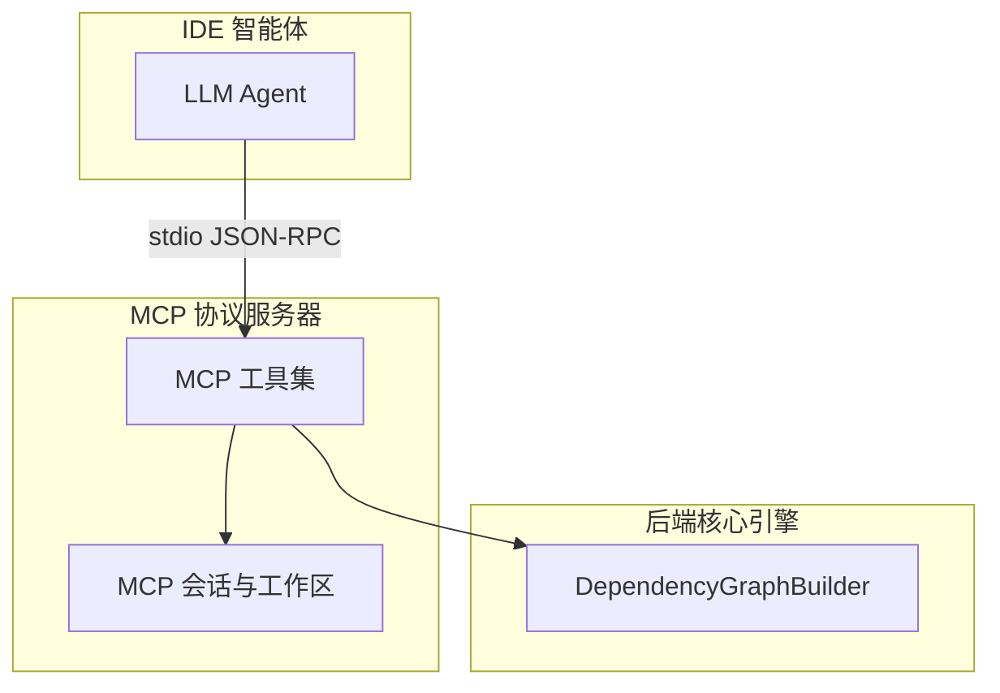
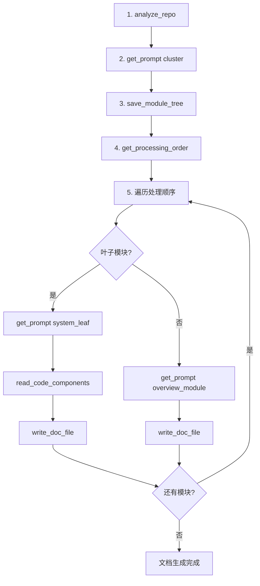
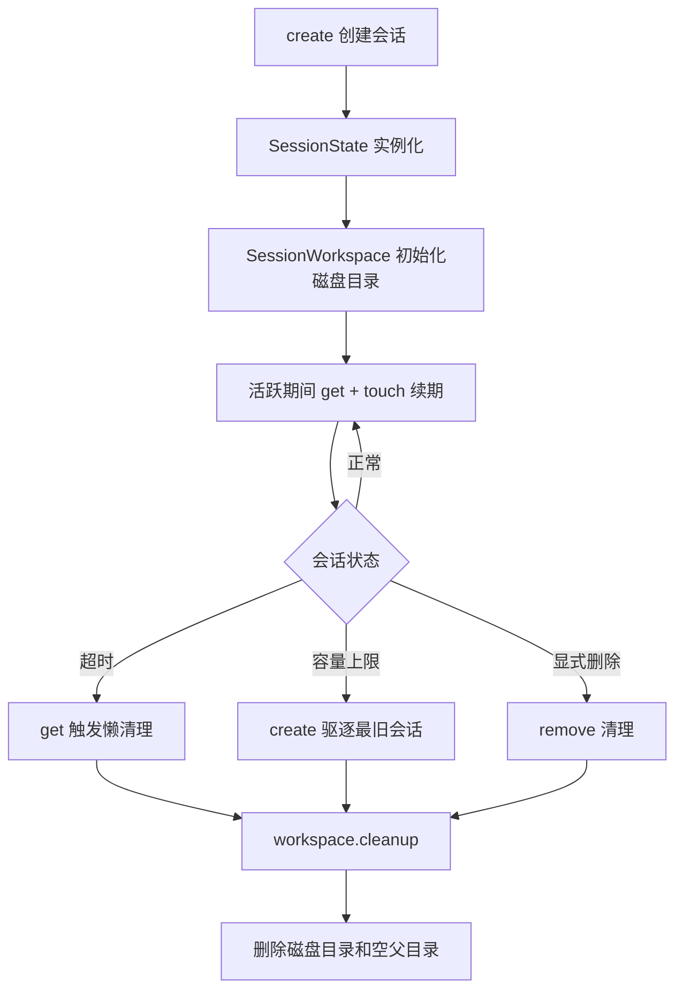
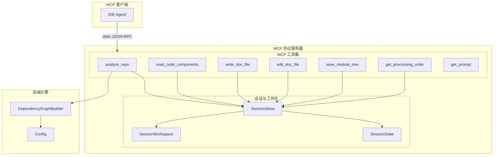

# MCP 协议服务器

## 模块概述

MCP 协议服务器是 CodeWiki-CN 系统对外暴露文档生成能力的标准化接口层。它基于 MCP（Model Context Protocol）协议，通过 stdio JSON-RPC 传输方式，为 IDE 智能体（如 Claude、Cursor 等）提供了一组结构化的工具函数，使其能够以编程方式驱动代码仓库的文档生成全流程。

与 CLI 命令行工具面向人类用户不同，MCP 服务器面向的是 LLM 智能体。智能体通过调用 MCP 工具完成从仓库分析、源码读取、模块聚类到文档写入的端到端流程。这种设计使 CodeWiki-CN 可以无缝嵌入各种 AI 编程助手的工作流中，成为其代码理解与文档生成能力的延伸。

## 子模块架构



## 子模块说明

### MCP 工具集

[MCP 工具集](MCP%20工具集.md) 是 MCP 服务器的功能核心，提供了 7 个工具函数，覆盖文档生成全流程的各个环节。

**工具清单：**

| 工具名 | 所在文件 | 功能 |
|--------|---------|------|
| `analyze_repo` | analysis.py | 分析仓库依赖结构，创建会话和工作区 |
| `read_code_components` | code_reader.py | 将组件源码写入工作区文件（避免内联传输） |
| `write_doc_file` | doc_writer.py | 在输出目录创建新文档文件 |
| `edit_doc_file` | doc_writer.py | 编辑已有文档（支持 str_replace/insert/undo） |
| `save_module_tree` | module_tree.py | 保存模块聚类树（双文件策略：快照 + 工作副本） |
| `get_processing_order` | module_tree.py | 获取叶子优先的处理顺序 |
| `get_prompt` | prompt_server.py | 获取提示词模板（cluster/system_leaf/overview_module） |

**工具调用全流程：**



**关键设计特性：**
- **文件传递模式**：大数据量（源码、组件索引、处理顺序）通过写入工作区文件传递，MCP 响应仅返回文件路径，显著降低 token 消耗
- **Mermaid 自动验证**：每次 `write_doc_file` 和 `edit_doc_file` 操作后自动校验 Mermaid 图表语法
- **编辑可撤销**：`edit_doc_file` 内置编辑历史栈，支持安全的 undo 操作
- **增量更新感知**：通过 git 差异或文件修改时间检测仓库变更，智能引导智能体仅更新受影响模块

### MCP 会话与工作区

[MCP 会话与工作区](MCP%20会话与工作区.md) 是 MCP 服务器的基础设施层，管理所有工具调用的状态持久化和文件系统操作。

**三大核心组件：**

| 组件 | 职责 | 关键特性 |
|------|------|----------|
| `SessionState` | 封装单个会话的可变状态 | 支持过期检测（`is_expired`）和自动续期（`touch()`） |
| `SessionStore` | 线程安全的会话管理器 | 自动过期清理 + 容量限制驱逐（LRU 策略） |
| `SessionWorkspace` | 磁盘工作区管理器 | 结构化 JSON 写入、源码文件管理、级联目录清理 |

**会话生命周期：**



**磁盘工作区结构：**

```
{repo_path}/
  .codewiki/
    sessions/
      {session_id}/
        component_index.json
        leaf_nodes.json
        languages.json
        summary.json
        changes.json
        processing_order.json
        sources/
          pkg__module.py____MyClass.src
```

**线程安全机制**：`SessionStore` 使用 `threading.Lock` 保护所有会话操作（create/get/remove），确保并发 MCP 工具调用的状态一致性。

## 系统架构



## 与其他模块的关系

- **[CLI 命令行工具](CLI%20命令行工具.md)**：`codewiki mcp` 命令启动 MCP 服务器；MCP 工具复用 CLI 配置管理的数据模型
- **[后端核心引擎](后端核心引擎.md)**：`analyze_repo` 工具调用 `DependencyGraphBuilder` 执行底层代码分析；提示词模板与后端引擎共享
- **[依赖分析器](依赖分析器.md)**：`DependencyGraphBuilder` 是依赖分析器的高层接口，MCP 工具通过它获取组件和叶子节点数据

## 设计要点

1. **文件传递模式**：大量数据通过工作区文件传递而非 MCP 消息体内联，避免消息体过大导致性能问题
2. **零拷贝数据共享**：同一 `SessionState` 实例在工具调用间共享组件数据，无需序列化传输
3. **懒过期清理**：会话过期在 `get()` 时触发，避免后台清理线程的复杂性
4. **幂等性保护**：`write_doc_file` 拒绝覆盖已存在文件，引导使用 `edit_doc_file`
5. **级联目录清理**：工作区删除时自动向上清理空目录，保持仓库整洁
6. **安全路径校验**：所有文件操作前检查路径是否逃逸出预期目录，防止路径遍历攻击
