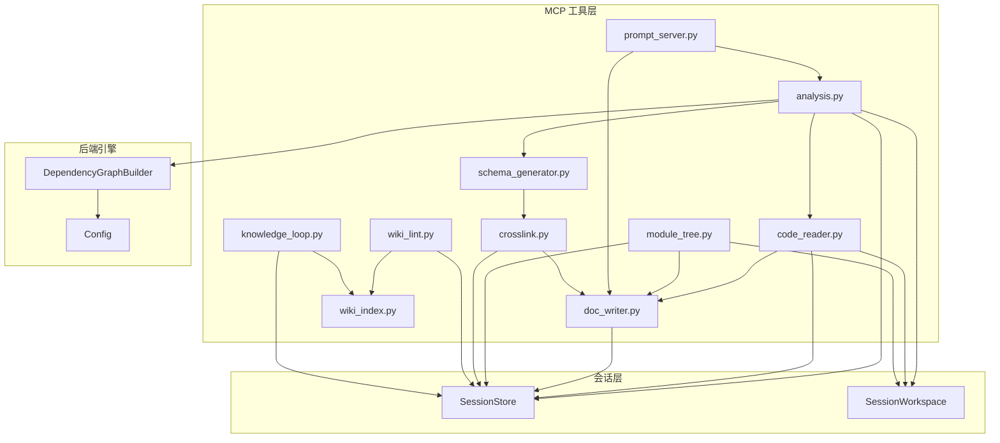
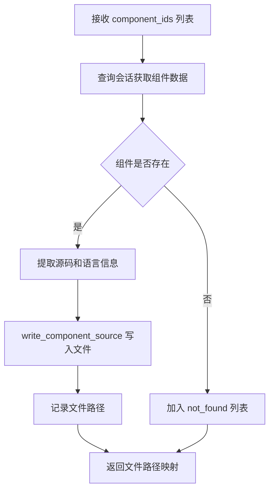
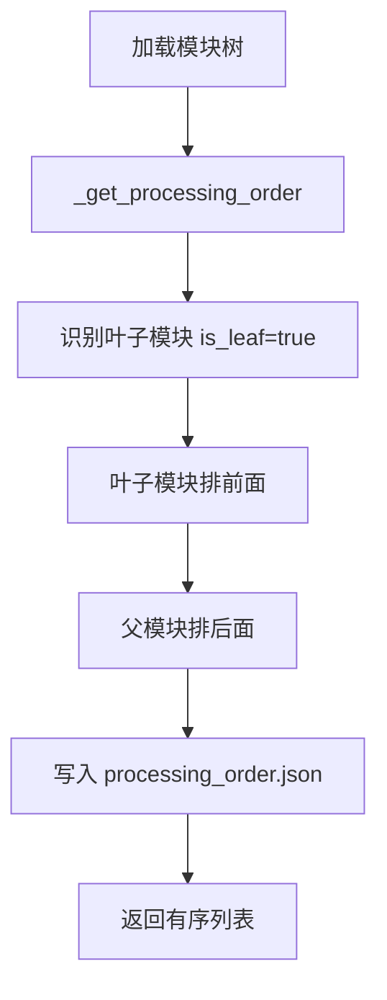
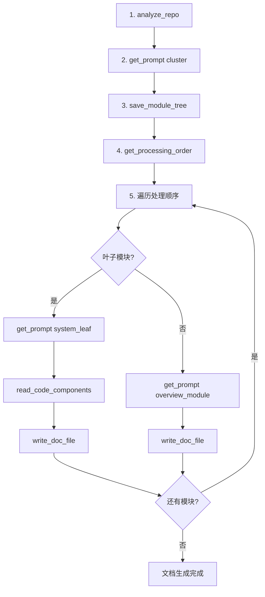
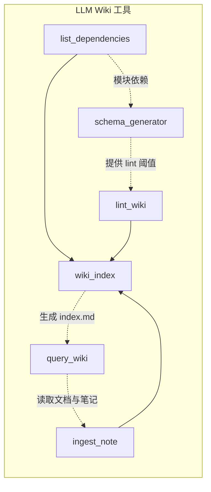
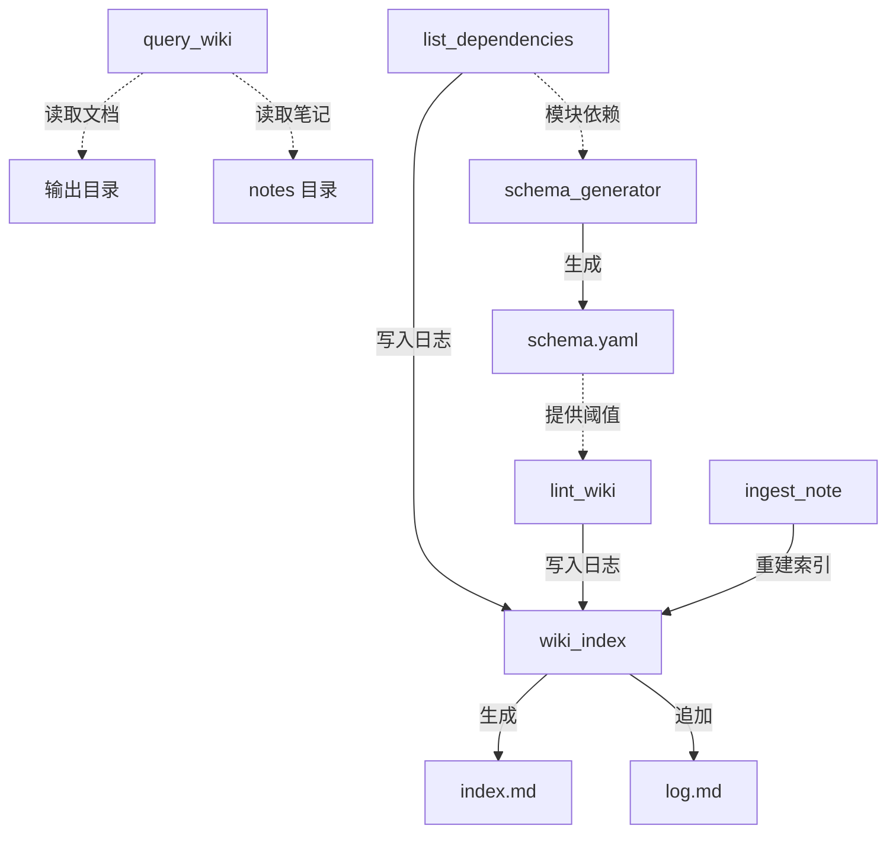

# MCP 工具集

## 模块概述

MCP 工具集是 CodeWiki-CN 系统中 MCP（Model Context Protocol）子系统的核心功能层，提供了一组完整的工具函数，用于支持 IDE 智能体完成代码仓库文档生成的全流程操作。该模块涵盖**仓库分析**、**源码读取**、**文档写入与编辑**、**模块树管理**和**提示词服务**五大核心能力，通过统一的工具接口对外暴露，使 LLM 智能体能够以结构化的方式完成从代码分析到文档产出的端到端流程。

## 架构总览



## 工具清单

| 工具名 | 所在文件 | 功能简述 |
|--------|---------|----------|
| `analyze_repo` | analysis.py | 分析代码仓库依赖结构，创建会话 |
| `read_code_components` | code_reader.py | 将组件源码写入工作区文件 |
| `write_doc_file` | doc_writer.py | 在输出目录创建新文档文件 |
| `edit_doc_file` | doc_writer.py | 编辑已有文档（替换/插入/撤销） |
| `save_module_tree` | module_tree.py | 保存模块聚类树 |
| `get_processing_order` | module_tree.py | 获取叶子优先的处理顺序 |
| `get_prompt` | prompt_server.py | 获取提示词模板 |
| `list_dependencies` | crosslink.py | 查询组件依赖关系 |
| `lint_wiki` | wiki_lint.py | 文档一致性健康检查 |
| `ingest_note` | knowledge_loop.py | 归档结构化知识笔记 |
| `query_wiki` | knowledge_loop.py | 全文检索文档与笔记 |
| `generate_schema` | schema_generator.py | 自动生成文档约定文件 |
| `rebuild_index` / `append_log` | wiki_index.py | 自动生成索引与操作日志 |

## 组件详解

### 1. 仓库分析工具 (analysis.py)

#### 职责

`handle_analyze_repo` 是整个文档生成流程的入口工具。它负责：

- 接收仓库路径参数，验证路径有效性
- 调用 `DependencyGraphBuilder` 构建依赖图，获取所有组件和叶子节点
- 创建 MCP 会话并初始化工作区
- 将分析结果（组件索引、叶子节点、语言统计）写入工作区 JSON 文件
- 执行增量更新检测（通过 git 或文件修改时间）
- 返回精简的摘要信息供智能体使用

#### 工作流程


#### 关键参数

| 参数 | 类型 | 必填 | 说明 |
|------|------|------|------|
| `repo_path` | string | 是 | 代码仓库根目录路径 |
| `output_dir` | string | 否 | 文档输出目录，默认为 `{repo_path}/docs` |
| `include_patterns` | string | 否 | 包含模式（逗号分隔） |
| `exclude_patterns` | string | 否 | 排除模式（逗号分隔） |

#### 输出文件

分析完成后，工作区中将生成以下 JSON 文件：

- **component_index.json** — 全量组件索引，包含每个组件的 ID、类型和文件路径
- **leaf_nodes.json** — 叶子节点 ID 列表
- **languages.json** — 各语言组件数量统计
- **summary.json** — 分析摘要（含会话 ID、仓库信息、统计数据和叶子节点预览）
- **changes.json**（可选）— 增量变更检测结果

#### 代码示例

```python
# 调用示例
def handle_analyze_repo(arguments, store):
    repo_path = Path(arguments["repo_path"]).expanduser().resolve()
    # 构建最小化 Config
    config = Config(
        repo_path=str(repo_path),
        output_dir=str(output_dir / "temp"),
        max_depth=2,
        llm_base_url="not-needed",
        llm_api_key="not-needed",
        main_model="unused",
        cluster_model="unused",
    )
    # 执行依赖分析
    builder = DependencyGraphBuilder(config)
    components, leaf_nodes = builder.build_dependency_graph()
    # 创建会话和工作区
    session = store.create(
        repo_path=str(repo_path),
        output_dir=str(output_dir),
        components=components,
        leaf_nodes=leaf_nodes,
    )
    workspace = SessionWorkspace(repo_path, session.session_id)
    session.workspace = workspace
```

#### 增量更新检测

`_detect_changes` 函数通过 git 差异或文件修改时间（mtime）检测仓库变更，返回受影响的模块列表（`affected_modules`）和需要级联刷新的父模块列表（`cascade_modules`）。如果未检测到变更，则返回 `no_changes: true`。

---

### 2. 源码读取工具 (code_reader.py)

#### 职责

`handle_read_code_components` 负责将指定组件的源代码写入工作区文件，而非直接返回源码内容。这种"写文件 + 返回路径"的设计模式避免了在 MCP 响应中内联大量源码，显著降低了 token 消耗。

#### 设计原理



#### 返回值结构

```json
{
    "written": 5,
    "not_found_count": 1,
    "not_found": ["pkg::missing_module"],
    "source_dir": "/path/to/.codewiki/sessions/abc123/sources",
    "files": {
        "pkg__module.py____MyClass.src": "pkg::module.py::MyClass"
    }
}
```

#### 代码示例

```python
def handle_read_code_components(arguments, store):
    session = store.get(arguments["session_id"])
    component_ids = arguments["component_ids"]
    for cid in component_ids:
        node = components.get(cid)
        lang = getattr(node, "language", "")
        source = getattr(node, "source_code", "").strip()
        file_path = workspace.write_component_source(cid, source, lang)
```

每个源码文件会包含组件 ID 和语言信息的头部注释，格式如下：

```
// Component: pkg::module.py::MyClass
// Language: python
<实际源码内容>
```

---

### 3. 文档写入与编辑工具 (doc_writer.py)

#### 职责

文档写入模块提供两个互补的工具函数，管理文档文件的完整生命周期：

- **write_doc_file** — 创建新文档文件
- **edit_doc_file** — 编辑已有文档文件

两者均在操作完成后自动执行 **Mermaid 图表语法验证**，确保文档中的流程图符合规范。

#### write_doc_file 工作流程


#### edit_doc_file 支持的命令

| 命令 | 说明 | 必要参数 |
|------|------|----------|
| `str_replace` | 查找并替换唯一字符串 | `old_str`, `new_str` |
| `insert` | 在指定行号插入内容 | `insert_line`, `new_str` |
| `undo` | 撤销最近一次编辑 | 无额外参数 |

#### 编辑历史管理

`edit_doc_file` 内置了编辑历史机制。每次编辑操作前，会将当前文件内容压入 `session.registry["file_history"]` 栈中。`undo` 命令从栈中弹出上一个版本并恢复文件内容。

#### 安全特性

- **路径安全**：`_safe_doc_path` 函数确保文件名不会通过路径遍历逃逸出输出目录
- **唯一性检查**：`str_replace` 要求 `old_str` 在文件中只出现一次，避免歧义替换
- **编辑上下文**：编辑完成后返回修改位置附近的代码片段（snippet），方便智能体确认修改正确性

#### 代码示例

```python
async def handle_edit_doc_file(arguments, store):
    command = arguments["command"]
    if command == "str_replace":
        old_str = arguments.get("old_str")
        new_str = arguments.get("new_str", "")
        occurrences = current_content.count(old_str)
        if occurrences == 0:
            return {"error": "old_str not found"}
        if occurrences > 1:
            return {"error": f"old_str appears {occurrences} times"}
        new_content = current_content.replace(old_str, new_str, 1)
        doc_path.write_text(new_content, encoding="utf-8")
    # 所有操作后均执行 Mermaid 验证
    mermaid_result = await _validate_mermaid(str(doc_path), filename)
```

---

### 4. 模块树管理工具 (module_tree.py)

#### 职责

模块树管理工具包含两个函数，负责管理代码模块的聚类结构和文档生成顺序：

- **save_module_tree** — 保存智能体聚类结果
- **get_processing_order** — 计算叶子优先的处理顺序

#### 双文件保存策略

`save_module_tree` 同时写入两个文件：

| 文件 | 用途 |
|------|------|
| `module_tree_first.json` | 不可变快照，保留初始聚类结果 |
| `module_tree.json` | 可变工作副本，后续可修改 |

#### 处理顺序计算



叶子优先的策略确保了：在生成父模块的概览文档时，其子模块的文档已经就绪，父模块文档可以准确引用子模块的内容和结论。

#### 代码示例

```python
def handle_save_module_tree(arguments, store):
    module_tree = arguments["module_tree"]
    # 保存不可变快照和工作副本
    first_path = os.path.join(output_dir, FIRST_MODULE_TREE_FILENAME)
    working_path = os.path.join(output_dir, MODULE_TREE_FILENAME)
    # 计算处理顺序
    order = _get_processing_order(module_tree)
    session.workspace.write_json("processing_order.json", order)
```

`get_processing_order` 支持从会话缓存或磁盘文件中恢复模块树数据：

```python
def handle_get_processing_order(arguments, store):
    module_tree = session.module_tree
    if not module_tree:
        # 从磁盘文件恢复
        tree_path = os.path.join(session.output_dir, MODULE_TREE_FILENAME)
        with open(tree_path, encoding="utf-8") as f:
            module_tree = json.load(f)
        session.module_tree = module_tree
```

---

### 5. 提示词服务工具 (prompt_server.py)

#### 职责

`handle_get_prompt` 提供结构化的提示词模板服务，供智能体在不同阶段获取专用指令。提示词通过 `_PROMPT_CATALOG` 目录进行注册管理，每个模板包含描述信息、使用说明和可参数化的内容。

#### 提示词类型

| 提示词类型 | 使用场景 |
|-----------|----------|
| `cluster` | 模块聚类规则指导 |
| `system_leaf` | 叶子模块文档生成指令 |
| `overview_module` | 父模块概览文档生成指令 |

#### 返回值结构

```json
{
    "prompt_type": "system_leaf",
    "description": "叶子模块文档生成的系统提示词",
    "usage_hint": "在生成叶子模块文档前调用，结合 read_code_components 的结果使用",
    "content": "<完整的提示词内容，支持变量替换>"
}
```

#### 变量替换

提示词内容支持通过 `variables` 参数进行模板变量替换，由内部的 `_resolve_prompt` 函数处理：

```python
def handle_get_prompt(arguments, store):
    prompt_type = arguments["prompt_type"]
    variables = arguments.get("variables", {})
    content = _resolve_prompt(prompt_type, variables)
```

---

## 工具调用全流程

以下是完整的文档生成流程中各工具的调用顺序：



## 与相关模块的关系

- [MCP 会话与工作区](MCP_会话与工作区.md) — 工具集依赖会话管理和工作区文件系统来存储中间结果和最终文档
- [MCP 服务器](MCP_服务器.md) — 工具集通过 MCP 服务器的路由机制注册和分发
- [依赖分析引擎](依赖分析引擎.md) — `analyze_repo` 调用 `DependencyGraphBuilder` 执行底层代码分析
- [配置管理](配置管理.md) — 分析工具使用 `Config` 对象传递仓库路径和过滤规则

## 错误处理机制

所有工具函数遵循统一的错误处理模式：

1. **会话校验** — 每个工具首先通过 `store.get(session_id)` 验证会话有效性，失效则返回包含错误信息的 JSON
2. **路径安全** — 文件操作前检查路径是否逃逸出预期目录
3. **幂等性保护** — `write_doc_file` 拒绝覆盖已存在文件，引导使用 `edit_doc_file`
4. **增量更新支持** — `analyze_repo` 检测变更并调整提示策略，引导智能体仅更新受影响模块

```python
# 统一的错误返回格式
session = store.get(session_id)
if session is None:
    return json.dumps({"error": f"Session {session_id} not found or expired."})
```

## 设计亮点

- **文件传递模式**：大量数据（组件索引、源码、处理顺序）通过写入工作区文件传递，避免 MCP 消息体过大
- **Mermaid 自动验证**：每次文档写入/编辑后自动校验 Mermaid 图表语法，及早发现问题
- **增量更新感知**：通过变更检测智能引导，仅更新受影响的模块文档，提高生成效率
- **编辑可撤销**：`edit_doc_file` 内置编辑历史栈，支持安全的撤销操作

---

## LLM Wiki 工具

LLM Wiki 工具是在基础 MCP 工具之上的一组扩展能力，为文档系统提供**依赖查询**、**健康检查**、**知识沉淀**、**全文检索**、**配置自生成**和**索引管理**功能。这些工具使 LLM 智能体不仅能生成文档，还能持续维护和演进知识库。

### 工具关系图



### 1. list_dependencies (crosslink.py)

#### 函数签名

```python
def handle_list_dependencies(arguments: Dict[str, Any], store: SessionStore) -> str
```

#### 职责

查询组件间的依赖关系（`depends_on` / `depended_by`），支持模块级聚合，用于生成文档中的交叉引用链接。

#### 关键参数

| 参数 | 类型 | 必填 | 说明 |
|------|------|------|------|
| `session_id` | string | 是 | 会话 ID |
| `direction` | string | 否 | `depends_on` / `depended_by` / `both`（默认 `both`） |
| `module_level` | bool | 否 | 是否聚合到模块级依赖图（默认 `false`） |
| `component_ids` | list | 否 | 指定组件 ID 列表进行过滤 |
| `offset` / `limit` | int | 否 | 分页参数，默认 offset=0, limit=100（上限 200） |

#### 返回格式

```json
{
    "dependencies": [
        {"source": "pkg::A", "target": "pkg::B", "direction": "depends_on",
         "source_module": "mod_a", "target_module": "mod_b"}
    ],
    "pagination": {"total": 42, "offset": 0, "limit": 100, "has_more": false},
    "module_dependency_graph": {"mod_a": {"depends_on": ["mod_b"], "depended_by": []}},
    "high_impact_components": [{"component_id": "pkg::Core", "depended_by_count": 12}]
}
```

高影响组件阈值从 `schema.yaml` 的 `lint.high_impact_threshold` 字段读取（默认 5）。

---

### 2. lint_wiki (wiki_lint.py)

#### 函数签名

```python
def handle_lint_wiki(arguments: Dict[str, Any], store: SessionStore) -> str
```

#### 职责

对生成的文档执行一致性健康检查，检测以下五类问题：

| 检查项 | 说明 | 严重级别 |
|--------|------|----------|
| `stale_refs` | 文档中引用了已不存在的模块文件 | error |
| `broken_links` | Markdown 链接指向不存在的目标 | error |
| `undocumented` | 高影响组件未被任何模块文档覆盖 | warning |
| `cycles` | 组件级循环依赖检测 | info |
| `coverage` | 文档覆盖率统计 | info |

#### 关键参数

| 参数 | 类型 | 必填 | 说明 |
|------|------|------|------|
| `session_id` | string | 否 | 会话 ID |
| `checks` | list | 否 | 检查项列表，默认 `["all"]` |
| `severity_filter` | string | 否 | 最低严重级别过滤（默认 `info`） |

#### 返回格式

```json
{
    "total_issues": 3,
    "by_severity": {"error": 1, "warning": 1, "info": 1},
    "checks_run": ["stale_refs", "broken_links", "coverage"],
    "issues": [
        {"check": "stale_refs", "severity": "error", "message": "...",
         "file": "auth.md", "line": 15, "suggestion": "..."}
    ],
    "summary": "Found 1 error(s), 1 warning(s), 1 info. Priority: fix errors first."
}
```

操作完成后自动调用 `wiki_index.append_log` 记录检查日志。

---

### 3. ingest_note (knowledge_loop.py)

#### 函数签名

```python
def handle_ingest_note(arguments: Dict[str, Any], store: SessionStore) -> str
```

#### 职责

将结构化笔记（架构决策、经验教训、设计理由等）归档到 `repowiki/notes/` 目录。自动生成带 YAML 前置元数据的 Markdown 文件，智能匹配关联模块，提取可搜索标签，并更新 `decisions_index.json` 索引。

#### 关键参数

| 参数 | 类型 | 必填 | 说明 |
|------|------|------|------|
| `session_id` | string | 否 | 会话 ID |
| `note_type` | string | 否 | 笔记类型：`decision` / `lesson` / `architecture` / `general` |
| `title` | string | 是 | 笔记标题 |
| `content` | string | 是 | 笔记正文 |
| `related_modules` | list | 否 | 关联模块（未提供时自动匹配） |
| `related_components` | list | 否 | 关联组件 ID |

#### 返回格式

```json
{
    "status": "ingested",
    "note_path": "/path/to/notes/2025-01-15-auth-refactor.md",
    "note_type": "decision",
    "auto_matched_modules": ["auth", "middleware"],
    "related_modules": ["auth", "middleware"],
    "tags": ["decision", "auth", "SessionManager"],
    "decisions_index_updated": true
}
```

操作完成后自动调用 `wiki_index.rebuild_index` 和 `append_log` 更新索引。

---

### 4. query_wiki (knowledge_loop.py)

#### 函数签名

```python
def handle_query_wiki(arguments: Dict[str, Any], store: SessionStore) -> str
```

#### 职责

跨已生成的文档和知识笔记进行全文检索，返回结构化上下文供新开发任务引用。使用 TF-IDF 风格的纯文本匹配评分（无需向量数据库），支持模块范围过滤和代码组件反向映射。

#### 关键参数

| 参数 | 类型 | 必填 | 说明 |
|------|------|------|------|
| `session_id` | string | 否 | 会话 ID |
| `query` | string | 是 | 搜索查询字符串 |
| `scope` | string | 否 | 限定模块名称范围 |
| `include_notes` | bool | 否 | 是否包含笔记（默认 `true`） |
| `include_code_refs` | bool | 否 | 是否返回关联组件（默认 `true`） |
| `max_results` | int | 否 | 最大结果数，上限 20 |

#### 返回格式

```json
{
    "query": "认证模块的架构决策",
    "keywords": ["认证", "模块", "架构", "决策"],
    "results": [
        {"source": "doc", "file": "auth.md", "title": "Auth",
         "snippet": "...", "relevance_score": 0.85,
         "related_components": ["pkg::auth.py::AuthManager"]}
    ],
    "context_package": "2 doc(s), 1 note(s)\n- [doc] Auth: ..."
}
```

---

### 5. schema_generator (schema_generator.py)

#### 函数签名

```python
def generate_schema(
    repo_name: str,
    components: Dict[str, Any],
    languages: List[str],
    output_dir: Path,
    module_names: Optional[List[str]] = None,
) -> dict
```

#### 职责

在 `analyze_repo` 阶段自动生成 `schema.yaml` 项目文档约定文件，内容包括：

- **project** — 项目基础信息（名称、语言、组件总数），始终自动更新
- **conventions** — 命名规范、文件模式、交叉引用格式等
- **required_sections** — 文档必需章节列表
- **documentation_dimensions** — 文档维度（架构决策、API 契约、数据模型等）
- **update_policy** — 更新策略配置
- **lint** — 健康检查阈值配置

#### 合并策略

若 `schema.yaml` 已存在，执行智能合并：`version`、`generated_at`、`project` 字段始终覆盖更新；用户自定义的其他字段完整保留。

---

### 6. wiki_index (wiki_index.py)

#### 函数签名

```python
def rebuild_index(output_dir: str | Path) -> None
def append_log(output_dir: str | Path, operation: str, summary: str) -> None
```

#### 职责

两个辅助函数，被其他工具在操作末尾调用，用于自动维护文档目录的两个元文件：

| 函数 | 目标文件 | 行为 |
|------|----------|------|
| `rebuild_index` | `index.md` | 扫描输出目录，重建完整的内容目录（模块文档表 + 知识笔记表） |
| `append_log` | `log.md` | 追加一行带时间戳的操作记录 |

#### 设计要点

- **线程安全**：`rebuild_index` 使用模块级 `threading.Lock`；`append_log` 使用 `fcntl.flock` 文件锁
- **原子写入**：`rebuild_index` 通过临时文件 + `os.replace` 实现原子替换，读者不会看到中间状态
- **非阻塞**：所有调用方均使用 `try/except` 包裹，索引更新失败不影响主操作
- **自动创建**：`append_log` 在 `log.md` 不存在时自动创建带 Markdown 表格头的文件

### LLM Wiki 工具数据流


