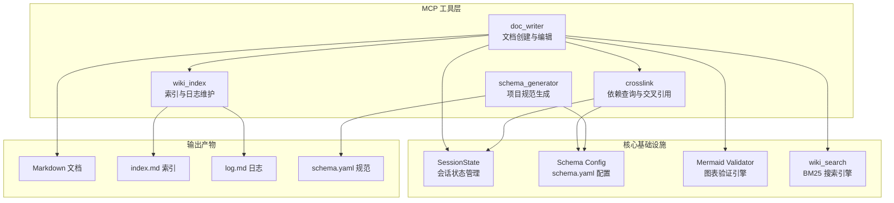
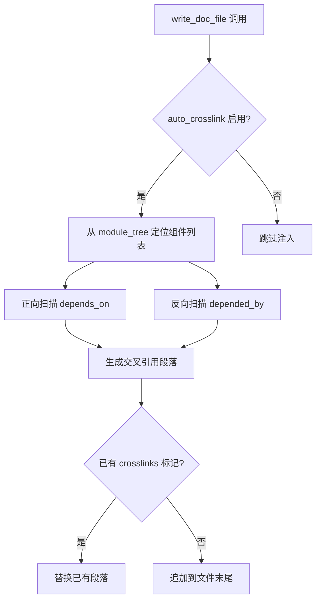
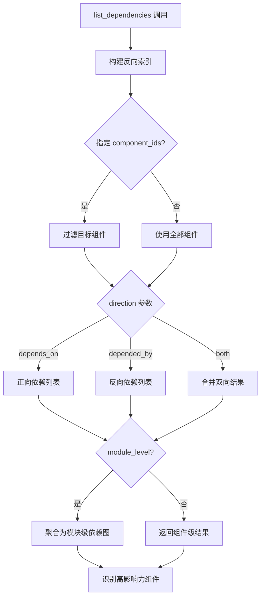
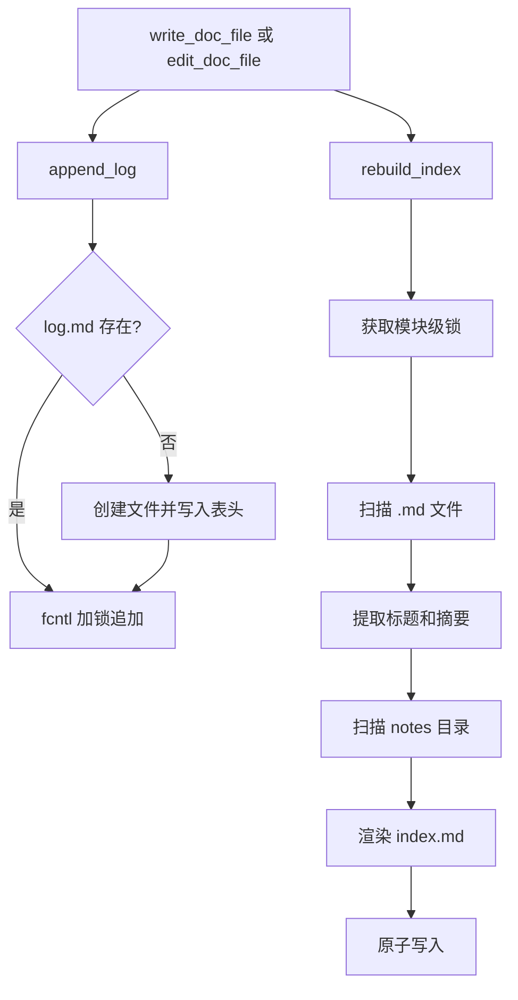

# MCP 文档生成工具

## 模块简介

MCP 文档生成工具是 CodeWiki-CN 项目的核心输出层，负责将代码分析结果转化为结构化的 Markdown 文档。该模块通过 MCP（Model Context Protocol）协议对外暴露一组工具接口，涵盖文档创建、编辑、交叉引用注入、项目规范生成以及文档索引维护等完整生命周期。

模块设计遵循以下原则：

- **安全性优先**：所有文件路径操作均经过目录遍历防护，确保写入不会逃逸出指定的输出目录。
- **自动化增强**：每次写入或编辑操作后自动执行 Mermaid 图表验证、交叉引用注入、索引重建和搜索索引更新。
- **容错设计**：所有增强操作（索引、日志、搜索）均以 try/except 包裹，失败不会阻断主流程。
- **并发安全**：索引重建使用模块级锁，日志追加使用 fcntl 文件锁，防止并发写入导致数据损坏。

## 核心功能

| 功能 | 说明 | 对应工具 |
|------|------|----------|
| 文档创建 | 在输出目录中创建新的 Markdown 文件 | `write_doc_file` |
| 文档编辑 | 支持字符串替换、行插入和撤销操作 | `edit_doc_file` |
| 依赖查询 | 查询组件间依赖关系，支持模块级聚合 | `list_dependencies` |
| 规范生成 | 自动生成项目文档宪法 `schema.yaml` | `generate_schema` |
| 索引维护 | 自动重建 `index.md` 文档目录 | `rebuild_index` |
| 操作日志 | 追加时间戳操作记录到 `log.md` | `append_log` |

## 架构图



## 组件详细说明

### 1. doc_writer -- 文档创建与编辑引擎

**文件路径**：`codewiki/mcp/tools/doc_writer.py`

该模块是整个文档生成系统的核心入口，提供 `write_doc_file` 和 `edit_doc_file` 两个 MCP 工具处理函数。

#### 1.1 handle_write_doc_file

异步处理函数，负责在输出目录中创建新的 Markdown 文档文件。

**执行流程**：

1. 通过 `session_id` 获取会话状态，验证会话有效性
2. 调用 `_safe_doc_path` 解析文件路径，防止目录遍历攻击
3. 创建父目录（如需要），检查文件是否已存在
4. 将内容写入文件
5. 自动执行 Mermaid 图表验证
6. 根据 `schema.yaml` 中的 `auto_crosslink` 配置注入交叉引用
7. 更新 `index.md` 和 `log.md`
8. 更新 BM25 搜索索引

**参数说明**：

| 参数 | 类型 | 说明 |
|------|------|------|
| `session_id` | string | 会话标识符 |
| `filename` | string | 文档文件名（自动补充 `.md` 后缀） |
| `content` | string | Markdown 文档内容 |

**返回值**：JSON 格式的结果对象，包含 `status`、`path`、`filename`、`lines`、`mermaid_validation` 以及可选的 `crosslinks` 字段。

#### 1.2 handle_edit_doc_file

异步处理函数，支持三种编辑命令：

**str_replace -- 字符串替换**：

- 要求 `old_str` 在文件中唯一匹配（恰好出现一次）
- 如果未找到或出现多次均返回错误
- 替换后返回编辑位置附近的代码片段

**insert -- 行插入**：

- 在指定行号 `insert_line` 处插入新内容
- 行号自动裁剪到有效范围

**undo -- 撤销操作**：

- 从会话注册表中的编辑历史恢复上一次的内容
- 每个文件最多保留 20 条历史记录（`_MAX_HISTORY_PER_FILE`）

所有编辑操作完成后均会触发 Mermaid 验证、索引重建和搜索索引更新。

#### 1.3 安全辅助函数

| 函数 | 职责 |
|------|------|
| `_is_within(path, base)` | 验证路径是否在基础目录内，防止路径逃逸 |
| `_safe_doc_path(session, filename)` | 在会话输出目录内安全解析文件路径，自动补充 `.md` 后缀 |
| `_ensure_parent_dirs(path)` | 递归创建父目录 |

#### 1.4 编辑历史管理

`_save_history` 函数将每次编辑前的文件内容保存到会话注册表（`session.registry["file_history"]`）中。历史以文件路径为键、内容列表为值，每个文件最多保留 20 条记录。超出上限时自动淘汰最早的记录，防止内存无限增长。

#### 1.5 交叉引用注入

`_inject_crosslinks` 函数在文档创建时自动分析模块间的依赖关系，并在文档末尾追加 "Related Modules" 段落。其工作流程：

1. 读取 `schema.yaml` 中的 `conventions.auto_crosslink` 标志
2. 从 `module_tree` 中定位当前模块的组件列表
3. 正向遍历：收集当前模块组件所依赖的外部模块（`depends_on`）
4. 反向遍历：收集依赖当前模块组件的外部模块（`depended_by`）
5. 生成 Markdown 格式的交叉引用段落，使用 `[模块名](模块名.md)` 格式
6. 如果文档中已存在交叉引用标记，则替换旧内容；否则追加到文件末尾



### 2. crosslink -- 依赖查询与模块级聚合

**文件路径**：`codewiki/mcp/tools/crosslink.py`

该模块提供 `list_dependencies` MCP 工具，用于查询和展示组件间的依赖关系。

#### 2.1 handle_list_dependencies

同步处理函数，返回组件或模块级别的依赖关系数据。

**核心能力**：

- **方向过滤**：支持 `depends_on`（正向依赖）、`depended_by`（反向依赖）和 `both`（双向）三种查询模式
- **模块级聚合**：当 `module_level=True` 时，将组件级依赖关系聚合为模块级依赖图
- **分页支持**：通过 `offset` 和 `limit` 参数实现分页，单次最大返回 200 条
- **高影响力组件识别**：根据 `schema.yaml` 中的 `lint.high_impact_threshold` 配置（默认值 5），识别被依赖数量超过阈值的关键组件

**参数说明**：

| 参数 | 类型 | 默认值 | 说明 |
|------|------|--------|------|
| `session_id` | string | -- | 会话标识符 |
| `direction` | string | `"both"` | 依赖方向过滤 |
| `module_level` | bool | `false` | 是否返回模块级聚合 |
| `component_ids` | list | `null` | 指定查询的组件 ID 列表 |
| `offset` | int | `0` | 分页偏移量 |
| `limit` | int | `100` | 每页条数（上限 200） |

#### 2.2 反向索引构建

`_build_reverse_index` 函数从所有组件的 `depends_on` 集合中构建反向映射（`depended_by`），使得查询"谁依赖了我"成为 O(1) 操作。反向索引以组件 ID 为键，依赖该组件的所有组件 ID 集合为值。

#### 2.3 模块级依赖图构建

`_build_module_dependency_graph` 函数将组件级别的细粒度依赖关系聚合为模块级别的宏观视图。其核心逻辑：

1. 遍历所有组件，通过 `_component_to_module` 映射到所属模块
2. 对每对依赖关系，解析源模块和目标模块
3. 过滤掉模块内部的自依赖
4. 输出按模块名排序的依赖图，每个模块包含 `depends_on` 和 `depended_by` 两个排序列表

#### 2.4 组件到模块映射

`_component_to_module` 函数通过递归遍历 `module_tree` 将组件 ID 映射到其所属模块名称。支持嵌套的子模块结构（通过 `children` 字段）。



### 3. schema_generator -- 项目文档规范生成器

**文件路径**：`codewiki/mcp/tools/schema_generator.py`

该模块负责自动生成和维护项目的文档宪法文件 `schema.yaml`，为后续的文档生成提供统一的规范约束。

#### 3.1 generate_schema

主入口函数，生成或更新 `schema.yaml`。

**生成内容**：

| 字段 | 说明 | 自动管理 |
|------|------|----------|
| `version` | 规范版本号 | 是 |
| `generated_at` | 生成时间戳 | 是 |
| `project` | 项目元数据（名称、语言、组件总数） | 是 |
| `conventions` | 文档约定（命名风格、文件模式、交叉引用格式等） | 否 |
| `required_sections` | 文档必需章节（架构概览、组件职责、交叉引用） | 否 |
| `documentation_dimensions` | 文档维度（架构决策、API 契约、数据模型、依赖理由） | 否 |
| `update_policy` | 更新策略（变更时更新受影响文档、保留决策、级联到概览） | 否 |
| `lint` | 代码检查配置（高影响力阈值） | 否 |

**合并策略**：

当 `schema.yaml` 已存在时，采用智能合并策略：

- `version`、`generated_at`、`project` 三个字段始终使用新推断的值
- 用户自定义的字段（如 `conventions` 中的额外配置）会被保留
- 列表类型字段如果用户有修改则保留用户版本
- 字典类型字段进行深层合并，用户新增的键被保留

#### 3.2 命名风格检测

`_detect_naming_convention` 函数通过分析模块名称列表，自动推断项目的主导命名风格：

| 检测模式 | 判定条件 |
|----------|----------|
| `kebab-case` | 名称中包含连字符 `-` |
| `snake_case` | 名称中包含下划线 `_` |
| `PascalCase` | 首字母大写 |
| `camelCase` | 非首字母存在大写字符 |

检测结果用于设置 `conventions.module_naming` 字段，使生成的文档与项目风格保持一致。

#### 3.3 默认约定配置

```
module_naming: snake_case
file_pattern: "*.md"
cross_reference_format: "[[{module_name}]]({module_name}.md)"
mermaid_required: true
min_leaf_doc_lines: 200
max_overview_doc_lines: 300
auto_crosslink: true
```

这些默认值可通过 `schema.yaml` 手动覆盖。`min_leaf_doc_lines` 和 `max_overview_doc_lines` 用于文档长度约束，在 [Wiki Lint](Wiki-Lint.md) 模块中被引用。

### 4. wiki_index -- 文档索引与操作日志

**文件路径**：`codewiki/mcp/tools/wiki_index.py`

该模块提供两个核心公共 API：`rebuild_index` 和 `append_log`，在每次文档写入/编辑操作后自动调用。

#### 4.1 rebuild_index -- 文档目录重建

扫描输出目录，重新生成 `index.md` 文件。

**执行流程**：

1. 获取模块级锁 `_index_lock`，防止并发重建冲突
2. 扫描输出目录中的根级 `.md` 文件（排除 `index.md` 和 `log.md`）
3. 提取每个文档的标题（首个 H1 标题）和摘要（首个非标记行，截取前 120 字符）
4. 排序：`overview.md` 置顶，其余按标题字母序排列
5. 扫描 `notes/` 子目录，解析笔记文件的 YAML frontmatter（标题、类型、日期）
6. 笔记按日期降序排列
7. 渲染 Markdown 表格格式的索引内容
8. 通过原子写入（临时文件 + `os.replace`）更新 `index.md`

**并发安全机制**：

- 使用 `threading.Lock` 确保同一时刻只有一个线程执行重建
- 原子写入保证读取方不会看到半写状态的文件

#### 4.2 append_log -- 操作日志追加

向 `log.md` 文件追加一条带时间戳的操作记录。

**特性**：

- 首次调用时自动创建文件并写入表格头（线程安全，使用 `_log_create_lock`）
- 使用 `fcntl.flock` 文件锁确保并发追加安全
- 自动转义管道符 `|`，防止 Markdown 表格结构损坏
- 时区固定为 UTC+8

**日志格式**：

```markdown
| 时间 | 操作 | 说明 |
|------|------|------|
| 2025-01-15T14:30:00+08:00 | write_doc_file | 创建 auth_module.md |
```

#### 4.3 内部辅助函数

| 函数 | 职责 |
|------|------|
| `_extract_doc_title_and_summary` | 读取文件前 50 行，提取 H1 标题和首个内容行作为摘要 |
| `_parse_note_frontmatter` | 解析笔记文件的 YAML frontmatter 元数据 |
| `_render_index` | 将模块文档和笔记条目渲染为完整的 `index.md` Markdown 内容 |
| `_atomic_write` | 通过临时文件加 `os.replace` 实现原子写入，防止文件损坏 |
| `_append_with_lock` | 使用 `fcntl` 排他锁安全地追加单行内容 |



## 数据流与协作关系

### 文档创建完整流程

当调用 `write_doc_file` 创建一个新文档时，系统按以下顺序执行：

1. **会话验证**：通过 `SessionStore` 获取 `SessionState`，检查会话是否过期（默认 TTL 为 2 小时）
2. **路径安全校验**：解析文件路径并验证其在输出目录内
3. **文件写入**：创建父目录并写入 Markdown 内容
4. **Mermaid 验证**：调用 `validate_mermaid_diagrams` 检查文档中的所有 Mermaid 图表语法
5. **交叉引用注入**：如果 `schema.yaml` 启用了 `auto_crosslink`，分析模块依赖并追加引用段落
6. **日志记录**：向 `log.md` 追加操作记录
7. **索引重建**：重新生成 `index.md`
8. **搜索索引更新**：调用 `wiki_search.update_file` 更新 BM25 倒排索引

### 编辑操作与撤销机制

`edit_doc_file` 在执行任何修改操作（`str_replace` 或 `insert`）前，会将当前文件内容保存到会话注册表的历史列表中。`undo` 命令从历史栈中弹出最近一条记录并恢复文件内容。历史栈上限为 20 条，采用 FIFO 策略淘汰旧记录。

### 依赖关系数据流

`crosslink` 模块的依赖数据来源于 `SessionState.components`，这是一个由后端代码分析引擎（[依赖分析器](依赖分析器.md)）在 `analyze_repo` 阶段构建的组件字典。每个组件节点包含 `depends_on` 属性（依赖集合）。`crosslink` 模块在此基础上构建反向索引和模块级聚合图。

## 与其他模块的关系

| 关联模块 | 关系说明 |
|----------|----------|
| [会话管理](会话管理.md) | `doc_writer` 和 `crosslink` 依赖 `SessionState` 和 `SessionStore` 获取会话上下文 |
| [依赖分析器](依赖分析器.md) | 提供 `components` 字典和 `Node` 模型，是依赖查询的数据来源 |
| [模块树构建](模块树构建.md) | 提供 `module_tree` 结构，用于组件到模块的映射和交叉引用生成 |
| [Wiki 搜索引擎](Wiki-搜索引擎.md) | `doc_writer` 在每次写入/编辑后调用 `wiki_search.update_file` 更新 BM25 索引 |
| [Wiki Lint](Wiki-Lint.md) | 读取 `schema.yaml` 中的 `lint.high_impact_threshold` 和文档长度约定 |
| [Mermaid 验证](Mermaid-验证.md) | `doc_writer` 在每次写入/编辑/撤销后调用验证引擎检查图表语法 |
| [MCP 服务器](MCP-服务器.md) | 注册本模块的工具处理函数到 MCP 协议路由 |

## 设计决策与注意事项

### 路径安全防护

`_safe_doc_path` 函数通过 `Path.resolve()` 将路径标准化后，使用 `relative_to` 验证目标路径是否位于输出目录内。这可以防止通过 `../` 等路径遍历手段写入非预期位置。所有接受 `filename` 参数的公共函数均通过此函数进行路径解析。

### 延迟导入策略

模块间依赖采用延迟导入（lazy import）模式。例如 `doc_writer` 中对 `wiki_index`、`wiki_search` 和 `validate_mermaid_diagrams` 的导入均发生在函数体内。这种设计降低了模块间的耦合度，避免了循环导入问题，同时确保单个工具的加载不会拉取整个工具链。

### 非致命操作隔离

索引重建、日志追加和搜索索引更新均被包裹在独立的 try/except 块中。即使这些增强操作失败（例如 `yaml` 库未安装），主操作（文件写入/编辑）仍然正常完成并返回结果。日志中会记录警告信息供排查。

### 并发写入保护

`wiki_index` 模块使用两层并发保护机制：

- **模块级锁**（`_index_lock`）：`threading.Lock` 实例，确保 `rebuild_index` 不会被并发执行
- **文件级锁**（`fcntl.flock`）：确保 `append_log` 的并发追加不会导致行交错

原子写入（`_atomic_write`）通过写入临时文件后使用 `os.replace` 原子替换，确保读取方永远不会看到不完整的 `index.md`。

### schema.yaml 合并兼容性

`schema_generator` 在重新运行 `analyze_repo` 时会智能合并新旧规范。`_AUTO_FIELDS` 集合标记了始终由系统管理的字段（`version`、`generated_at`、`project`），这些字段在每次生成时都会更新。其余字段尊重用户的手动修改，仅在用户未修改时使用默认值。


<!-- crosslinks (auto-generated) -->
## Related Modules
- Depends on: [CLI 工具库](cli_工具库.md), [LLM 后端与服务](llm_后端与服务.md), [MCP 知识管理工具](mcp_知识管理工具.md)
- Used by: [MCP 代码分析工具](mcp_代码分析工具.md), [MCP 协议与会话](mcp_协议与会话.md), [MCP 知识管理工具](mcp_知识管理工具.md)
