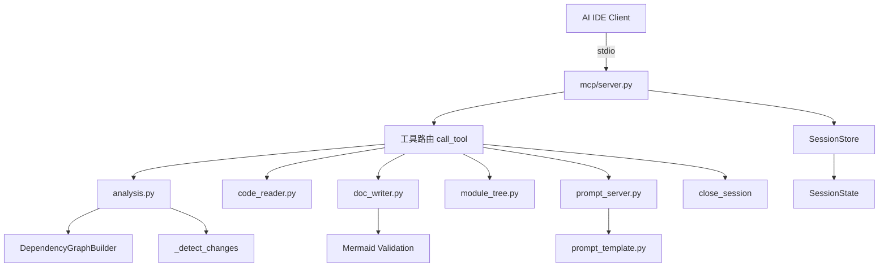
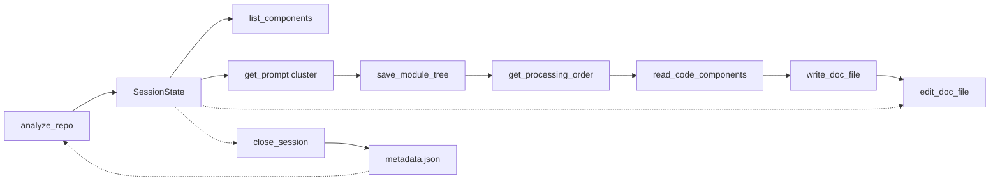

# MCP 服务

## 简介

MCP 服务模块位于 `codewiki/mcp/`，实现 CodeWiki 的 Model Context Protocol 服务器，使 AI IDE（如 CodeBuddy、Cursor、Claude Desktop）能够通过细粒度工具链驱动 Wiki 文档生成流程，无需任何 LLM API 配置。

## 架构概览

## 核心组件

### server.py — MCP 服务器

| 组件 | 说明 |
|------|------|
| `main()` | 启动 MCP server，通过 stdio transport 与 AI IDE 通信 |
| `list_tools()` | 列出所有可用工具：`_fine_grained_tools()` + `_legacy_tools()` |
| `call_tool(name, arguments)` | 路由工具调用到对应 handler，同步 handler 通过 `asyncio.to_thread()` 异步化 |
| `_fine_grained_tools()` | 返回 10 个细粒度工具定义（见下方工具列表） |
| `_legacy_tools()` | 返回 2 个旧版工具：`generate_docs`（需 LLM 配置）、`get_module_tree` |
| `_load_config()` | 为 legacy 工具加载 CodeWiki 配置 |
| `_text(content)` | 将字符串包装为 MCP TextContent |
| `_write_generation_metadata(session)` | 在 close_session 时写入 metadata.json（含 git commit_id + timestamp），支持增量更新 |

**线程模型**：`analyze_repo` 因 Tree-sitter C 扩展非线程安全，在主线程同步执行；其余同步 handler 均通过 `asyncio.to_thread()` 包装，避免阻塞事件循环。异步 handler（`write_doc_file`、`edit_doc_file`）直接 await 调用。

### session.py — 会话管理

#### SessionState

单个分析会话的状态快照：

| 字段 | 说明 |
|------|------|
| `session_id` | 12 位 UUID hex（碰撞安全生成） |
| `repo_path` | 仓库绝对路径 |
| `output_dir` | 文档输出目录 |
| `components` | `dict[str, Node]` 组件索引 |
| `leaf_nodes` | 叶节点 ID 列表 |
| `module_tree` | 模块聚类树（阶段 2 填充） |
| `registry` | 跨工具共享的键值注册表（含编辑历史） |
| `created_at` / `last_accessed` | 时间戳，用于过期检测 |

#### SessionStore

线程安全的内存会话存储，所有方法通过 `threading.Lock` 保护：

| 方法 | 说明 |
|------|------|
| `create()` | 创建新会话，先清理过期会话，满额时淘汰最旧会话（`_MAX_SESSIONS=10`） |
| `get()` | 获取会话并更新 `last_accessed`，过期则自动删除 |
| `remove()` | 删除指定会话 |
| `_purge_expired_locked()` | 清理所有过期会话（调用方持锁） |

关键常量：`_SESSION_TTL_SECONDS = 7200`（2 小时）、`_MAX_SESSIONS = 10`。UUID 生成使用 `while` 循环确保无碰撞。

### 工具处理器

#### analysis.py — 仓库分析与增量更新

- `handle_analyze_repo()`：创建最小化 Config → 调用 `DependencyGraphBuilder` 构建依赖图 → 创建 SessionState → 构建分页组件索引 → 检测增量变更
- `handle_list_components()`：从已有会话分页浏览组件索引，无需重新分析仓库
- `_build_component_index(components, offset, limit)`：将组件字典转为轻量 JSON，返回 `(index_list, pagination_info)`，每条仅含 `id`/`type`/`file`，`limit` 范围 [1, 200]
- `_detect_changes(repo_path, output_dir)`：增量更新检测，返回变更文件和受影响模块
- `_detect_via_git()`：基于 git diff 检测已提交变更 + `git status` 检测未提交变更
- `_detect_via_mtime()`：非 git 仓库回退到文件修改时间对比
- `_find_affected_modules()`：通过子串匹配将变更文件映射到受影响模块和级联父模块

#### code_reader.py — 代码读取

- `handle_read_code_components()`：根据组件 ID 列表从会话中读取源码（带语言代码块），每组件源码超 8000 字符自动截断
- `handle_view_repo_file()`：只读查看仓库文件或目录（目录列出 2 层，文件支持行范围），使用 `pathlib.Path.iterdir()` 替代 shell 调用
- `_maybe_truncate()`：超长内容截断（`_MAX_RESPONSE_LEN=24000`）
- `_is_within(path, base)`：路径穿越防护，使用 `Path.resolve().relative_to()` 校验

**响应大小控制**：`_MAX_COMPONENTS_PER_CALL=20`（每次最多读取 20 个组件）、`_MAX_COMPONENT_SOURCE_LEN=8000`（单个组件源码上限）、`_MAX_RESPONSE_LEN=24000`（总响应上限）。超出限制时在响应开头添加提示信息。

#### doc_writer.py — 文档写入

- `handle_write_doc_file()`：创建新 .md 文件 → 自动 Mermaid 验证
- `handle_edit_doc_file()`：编辑文件（str_replace / insert / undo）→ 自动 Mermaid 验证（含 undo 路径）
- `_validate_mermaid()`：调用 `validate_mermaid_diagrams` 验证 Mermaid 语法
- `_safe_doc_path(session, filename)`：路径穿越防护，确保文档路径不逃逸出 `output_dir`
- `_save_history(session, doc_path, content)`：编辑历史保存，上限 `_MAX_HISTORY_PER_FILE=20` 条，使用原生 dict 存储

#### module_tree.py — 模块树管理

- `handle_save_module_tree()`：保存模块聚类 JSON 到磁盘 + `first_module_tree.json` 备份 → 返回叶优先处理顺序
- `handle_get_processing_order()`：返回叶优先处理顺序（优先从会话缓存读取，回退到磁盘）
- `_get_processing_order()`：递归遍历模块树生成处理顺序
- `_collect()`：递归收集子模块组件

#### prompt_server.py — 提示词服务

- `handle_get_prompt()`：返回指定类型（cluster/system_leaf/overview 等）的提示词模板
- `_resolve_prompt()`：调用 `prompt_template.py` 中的格式化函数生成提示词

## 工具清单

### 细粒度工具（无需 LLM 配置）

| 工具 | 说明 |
|------|------|
| `analyze_repo` | 分析仓库结构和依赖，返回 session_id + 分页组件索引 + 叶节点 + 增量变更信息 |
| `list_components` | 从已有会话分页浏览组件索引，无需重新分析 |
| `read_code_components` | 读取指定组件的源代码（每批上限 20 个，每组件上限 8000 字符） |
| `view_repo_file` | 只读浏览仓库文件/目录（路径穿越防护） |
| `write_doc_file` | 创建文档文件 + Mermaid 验证（路径穿越防护） |
| `edit_doc_file` | 编辑文档（str_replace/insert/undo）+ Mermaid 验证 |
| `save_module_tree` | 保存模块聚类结果，返回处理顺序 |
| `get_processing_order` | 获取叶优先处理顺序 |
| `get_prompt` | 获取各阶段提示词模板 |
| `close_session` | 关闭会话释放内存（写入 metadata.json 支持增量更新） |

### 旧版工具（需 LLM 配置）

| 工具 | 说明 |
|------|------|
| `generate_docs` | 一键生成完整文档（需先 `codewiki config set`） |
| `get_module_tree` | 获取已有模块聚类树 |

## 数据流

## 增量更新机制

当 `output_dir` 下存在 `metadata.json` 和 `module_tree.json` 时，`analyze_repo` 自动触发变更检测：

1. **Git 检测**（优先）：对比存储的 `commit_id` 与当前 HEAD，外加 `git status` 未提交变更
2. **Mtime 回退**（非 git 仓库）：对比源码文件修改时间与生成时间戳
3. **影响映射**：通过子串匹配将变更文件映射到 `module_tree.json` 中的模块，区分直接受影响模块和需级联刷新的父模块

`close_session` 在销毁会话前写入 `metadata.json`（含当前 git commit_id），为下次增量更新提供基线。

## 安全加固

- **路径穿越防护**：`view_repo_file`、`write_doc_file`、`edit_doc_file` 均通过 `_is_within()` / `_safe_doc_path()` 校验路径不逃逸出仓库/输出目录
- **Shell 注入消除**：`view_repo_file` 目录列表改用 `pathlib.Path.iterdir()`，移除 `subprocess.run(shell=True)`
- **会话上限**：`_MAX_SESSIONS=10` 防止内存无限增长，满额淘汰最旧会话
- **编辑历史上限**：`_MAX_HISTORY_PER_FILE=20` 防止 undo 历史无限增长
- **组件读取上限**：`_MAX_COMPONENTS_PER_CALL=20` + `_MAX_COMPONENT_SOURCE_LEN=8000` 防止响应过大
- **线程安全**：`SessionStore` 所有方法通过 `threading.Lock` 保护

## 模块依赖

- **上游依赖**: [依赖分析器](依赖分析器.md)（DependencyGraphBuilder）、[后端核心](后端核心.md)（prompt_template、Mermaid 验证）
- **向下依赖**: [CLI 核心](CLI 核心.md)（mcp_command 启动入口）、[CLI 工具](CLI 工具.md)（ConfigManager）

## 关键设计

1. **无状态协议 + 会话管理**：MCP 本身无状态，通过线程安全的 SessionStore 维护会话上下文，2 小时自动过期
2. **细粒度拆分**：10 个工具 vs 旧版 2 个工具，让 AI IDE Agent 更灵活地控制流程
3. **分页设计**：`analyze_repo` + `list_components` 分页浏览组件索引，避免单次响应超限
4. **增量更新**：基于 git diff + mtime 双策略检测变更，仅更新受影响模块
5. **多层截断**：组件级（8000 字符）、批次级（20 个）、响应级（24000 字符）三层截断防止 token 溢出
6. **Mermaid 验证**：每次写/编辑文档后自动检查 Mermaid 语法
7. **双模式兼容**：同时提供细粒度工具（IDE 驱动）和旧版工具（一键生成）