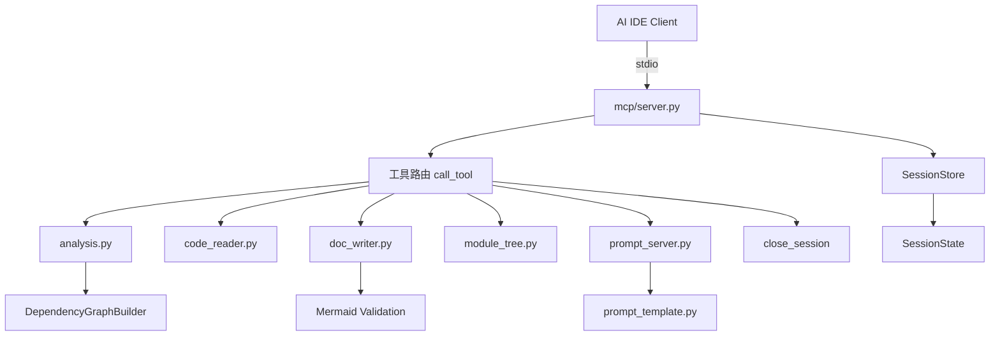
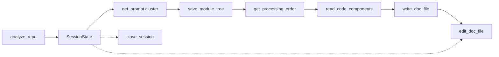

# MCP 服务

## 简介

MCP 服务模块位于 `codewiki/mcp/`，实现 CodeWiki 的 Model Context Protocol 服务器，使 AI IDE（如 CodeBuddy、Cursor、Claude Desktop）能够通过细粒度工具链驱动 Wiki 文档生成流程，无需任何 LLM API 配置。

## 架构概览

## 核心组件

### server.py — MCP 服务器

| 组件 | 说明 |
|------|------|
| `main()` | 启动 MCP server，通过 stdio transport 与 AI IDE 通信 |
| `list_tools()` | 列出所有可用工具：`_fine_grained_tools()` + `_legacy_tools()` |
| `call_tool(name, arguments)` | 路由工具调用到对应 handler，按名称分发 |
| `_fine_grained_tools()` | 返回 9 个细粒度工具定义（见下方工具列表） |
| `_legacy_tools()` | 返回 2 个旧版工具：`generate_docs`（需 LLM 配置）、`get_module_tree` |
| `_load_config()` | 为 legacy 工具加载 CodeWiki 配置 |
| `_text(content)` | 将字符串包装为 MCP TextContent |

### session.py — 会话管理

#### SessionState

单个分析会话的状态快照：

| 字段 | 说明 |
|------|------|
| `session_id` | 12 位 UUID hex |
| `repo_path` | 仓库绝对路径 |
| `output_dir` | 文档输出目录 |
| `components` | `dict[str, Node]` 组件索引 |
| `leaf_nodes` | 叶节点 ID 列表 |
| `module_tree` | 模块聚类树（阶段 2 填充） |
| `registry` | 跨工具共享的键值注册表 |
| `created_at` / `last_accessed` | 时间戳，用于过期检测 |

#### SessionStore

内存会话存储，支持创建、获取（带过期检测）、删除和过期清理。

### 工具处理器

#### analysis.py — 仓库分析

- `handle_analyze_repo()`：创建最小化 Config → 调用 `DependencyGraphBuilder` 构建依赖图 → 创建 SessionState → 构建组件索引
- `_build_component_index()`：将组件字典转为轻量 JSON，最多 500 条，含截断标记

#### code_reader.py — 代码读取

- `handle_read_code_components()`：根据组件 ID 列表从会话中读取源码（带语言代码块）
- `handle_view_repo_file()`：只读查看仓库文件或目录（目录列出 2 层，文件支持行范围）
- `_maybe_truncate()`：超长内容截断

#### doc_writer.py — 文档写入

- `handle_write_doc_file()`：创建新 .md 文件 → 自动 Mermaid 验证
- `handle_edit_doc_file()`：编辑文件（str_replace / insert / undo）→ 自动 Mermaid 验证
- `_validate_mermaid()`：调用 `validate_mermaid_diagrams` 验证 Mermaid 语法

#### module_tree.py — 模块树管理

- `handle_save_module_tree()`：保存模块聚类 JSON 到磁盘 + `first_module_tree.json` 备份 → 返回叶优先处理顺序
- `handle_get_processing_order()`：返回叶优先处理顺序
- `_get_processing_order()`：递归遍历模块树生成处理顺序
- `_collect()`：递归收集子模块组件

#### prompt_server.py — 提示词服务

- `handle_get_prompt()`：返回指定类型（cluster/system_leaf/overview 等）的提示词模板
- `_resolve_prompt()`：调用 `prompt_template.py` 中的格式化函数生成提示词

## 工具清单

### 细粒度工具（无需 LLM 配置）

| 工具 | 说明 |
|------|------|
| `analyze_repo` | 分析仓库结构和依赖，返回 session_id + 组件索引 + 叶节点 |
| `read_code_components` | 读取指定组件的源代码 |
| `view_repo_file` | 只读浏览仓库文件/目录 |
| `write_doc_file` | 创建文档文件 + Mermaid 验证 |
| `edit_doc_file` | 编辑文档（str_replace/insert/undo）+ Mermaid 验证 |
| `save_module_tree` | 保存模块聚类结果，返回处理顺序 |
| `get_processing_order` | 获取叶优先处理顺序 |
| `get_prompt` | 获取各阶段提示词模板 |
| `close_session` | 关闭会话释放内存 |

### 旧版工具（需 LLM 配置）

| 工具 | 说明 |
|------|------|
| `generate_docs` | 一键生成完整文档（需先 `codewiki config set`） |
| `get_module_tree` | 获取已有模块聚类树 |

## 数据流

## 模块依赖

- **上游依赖**: [依赖分析器](依赖分析器.md)（DependencyGraphBuilder）、[后端核心](后端核心.md)（prompt_template、Mermaid 验证）
- **向下依赖**: [CLI 核心](CLI 核心.md)（mcp_command 启动入口）、[CLI 工具](CLI 工具.md)（ConfigManager）

## 关键设计

1. **无状态协议**：MCP 本身无状态，通过 SessionStore 维护会话上下文
2. **会话过期**：SessionState 自动过期清理，防止内存泄漏
3. **细粒度拆分**：9 个工具 vs 旧版 2 个工具，让 AI IDE Agent 更灵活地控制流程
4. **Mermaid 验证**：每次写/编辑文档后自动检查 Mermaid 语法
5. **双模式兼容**：同时提供细粒度工具（IDE 驱动）和旧版工具（一键生成）