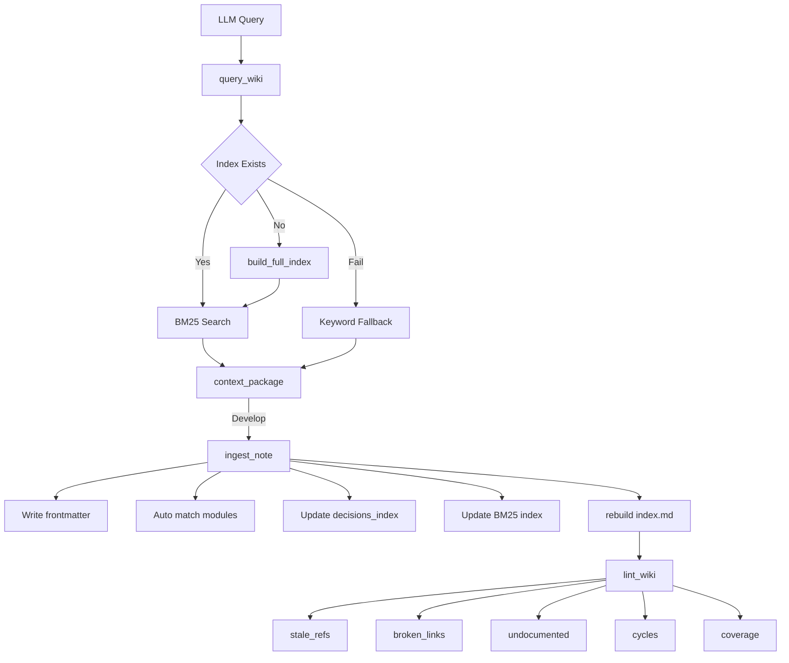
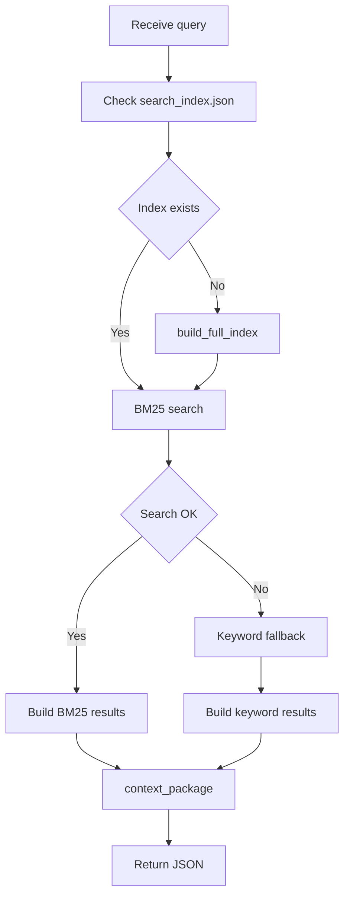

# MCP 知识管理工具

> 模块路径: `codewiki/mcp/tools/`
> 源文件: `knowledge_loop.py` | `wiki_search.py` | `wiki_lint.py`
> 组件数量: 39 个公开/内部组件

---

## 目录

1. [模块简介](#模块简介)
2. [架构总览](#架构总览)
3. [知识沉淀 ingest_note](#知识沉淀-ingest_note)
4. [知识查询 query_wiki](#知识查询-query_wiki)
5. [BM25 搜索引擎详解](#bm25-搜索引擎详解)
6. [文档一致性检查 lint_wiki](#文档一致性检查-lint_wiki)
7. [组件清单](#组件清单)
8. [交叉引用](#交叉引用)

---

## 模块简介

MCP 知识管理工具模块是 CodeWiki-CN 的核心子系统之一,负责在 AI 辅助开发过程中实现 **知识闭环管理**。该模块将散落在开发会话中的架构决策、经验教训、设计理由等非结构化知识,通过标准化的流程沉淀到 Wiki 知识库中,并提供高效的检索与质量保障机制。

模块围绕 **query - develop - ingest - lint** 四阶段闭环设计:

- **query** -- 开发新任务前,通过 `query_wiki` 检索已有知识,避免重复劳动
- **develop** -- 在开发过程中积累新的经验与决策
- **ingest** -- 通过 `ingest_note` 将新产生的结构化笔记写入知识库
- **lint** -- 通过 `lint_wiki` 检查文档与代码的一致性,保证知识库质量

本模块包含三个源文件,共 39 个组件:

| 源文件 | 职责 | 关键组件 |
|--------|------|----------|
| `knowledge_loop.py` | 知识沉淀与查询入口 | `handle_ingest_note`, `handle_query_wiki` |
| `wiki_search.py` | BM25 搜索引擎 | `build_full_index`, `search`, `_IndexData` |
| `wiki_lint.py` | 文档一致性检查 | `handle_lint_wiki`, 5 种检查器 |

---

## 架构总览



---

## 知识沉淀 ingest_note

### 功能概述

`handle_ingest_note` 是知识沉淀的核心入口,负责将 LLM 在开发过程中产生的结构化笔记(架构决策、经验教训、设计理由等)写入 `repowiki/notes/` 目录,并同步更新多个索引以实现快速检索。

### 调用参数

| 参数 | 类型 | 必填 | 说明 |
|------|------|------|------|
| `session_id` | string | 否 | 会话 ID,用于解析 output_dir 和 module_tree |
| `output_dir` | string | 否 | 输出目录(session_id 和 output_dir 二选一) |
| `note_type` | string | 否 | 笔记类型,默认 `general`,可选 `decision`/`lesson`/`architecture` |
| `title` | string | 否 | 笔记标题,默认 `Untitled` |
| `content` | string | 是 | 笔记正文内容 |
| `related_modules` | list | 否 | 关联模块列表,为空时自动匹配 |
| `related_components` | list | 否 | 关联组件 ID 列表 |

### Frontmatter 结构

每个笔记文件以 YAML frontmatter 开头,包含以下元数据字段:

```yaml
---
type: decision
title: "数据库连接池优化策略"
date: 2025-06-28
related_modules: ["database_module", "performance_tuning"]
related_components: ["ConnectionPool", "DBManager"]
tags: ["decision", "database", "performance", "connectionpool"]
---
```

字段说明:

- **type**: 笔记分类,支持 `general`(通用)、`decision`(决策)、`lesson`(经验)、`architecture`(架构)
- **title**: 笔记标题,同时用于生成文件名
- **date**: 写入日期,格式 `YYYY-MM-DD`
- **related_modules**: 关联的模块名称列表
- **related_components**: 关联的代码组件标识符
- **tags**: 自动提取的可搜索标签,上限 15 个

### 文件名生成规则

文件名格式为 `{date}-{slug}.md`,其中 slug 由 `_slugify` 函数生成:

1. 将标题转为小写,移除特殊字符
2. 空格和下划线替换为连字符
3. 若 slug 长度不足 3(常见于纯中文标题),则使用标题的 SHA1 哈希前 8 位
4. 若 slug 超过 60 字符,截断并移除尾部连字符
5. 若生成文件名已存在(重复检测),追加 SHA1 哈希前 6 位作为后缀

### 模块自动匹配

当 `related_modules` 参数为空且会话中存在 `module_tree` 时,系统调用 `_auto_match_modules` 自动匹配:

1. 递归收集模块树中的所有模块名称
2. 对每个模块名称,检查其是否出现在笔记内容中(大小写不敏感)
3. 对包含多个单词的模块名(以空格、下划线或连字符分隔),若半数以上单词出现在内容中则匹配
4. 最多返回 5 个匹配结果

### 标签提取

`_extract_tags` 函数从标题和内容中自动提取标签:

- 始终包含 `note_type` 作为基础标签
- 正则匹配 `#hashtag` 格式的标签
- 从内容前 500 字符中提取 CamelCase 标识符(如 `ConnectionPool`)
- 所有标签转为小写,上限 15 个

### decisions_index.json

每次笔记写入后,系统同步更新 `decisions_index.json` 索引文件。该文件是所有笔记的集中目录,结构如下:

```json
{
  "entries": [
    {
      "date": "2025-06-28",
      "type": "decision",
      "title": "数据库连接池优化策略",
      "file": "notes/2025-06-28-db-pool-optimization.md",
      "modules": ["database_module"],
      "tags": ["decision", "database", "performance"]
    }
  ]
}
```

更新逻辑:

- 若索引文件已存在则加载,否则创建空索引
- 通过 `(date, title)` 二元组进行去重检测
- 若标题和日期已存在,更新该条目而非重复添加
- 写入时自动调用 `rebuild_index` 更新 `index.md` 和 `append_log` 更新 `log.md`

### 搜索索引同步

笔记写入的最后一步是调用 `wiki_search.update_file` 增量更新 BM25 搜索索引。这确保新笔记在下一次 `query_wiki` 调用时即可被检索到,无需全量重建索引。该操作为非致命操作,失败时仅记录警告日志。

---

## 知识查询 query_wiki

### 功能概述

`handle_query_wiki` 是知识检索的核心入口,在已生成的文档和沉淀的笔记中搜索与查询相关的内容,返回结构化的 `context_package` 供 LLM 在开发任务时使用。

### 调用参数

| 参数 | 类型 | 必填 | 说明 |
|------|------|------|------|
| `session_id` | string | 否 | 会话 ID |
| `output_dir` | string | 否 | 输出目录 |
| `query` | string | 是 | 自然语言搜索查询 |
| `scope` | string | 否 | 限定搜索范围的模块名称 |
| `include_notes` | bool | 否 | 是否包含笔记,默认 `true` |
| `include_code_refs` | bool | 否 | 是否包含代码组件引用,默认 `true` |
| `max_results` | int | 否 | 最大结果数(1-20),默认 10 |
| `expand_terms` | list | 否 | 同义词/扩展词列表 |

### 搜索策略

`query_wiki` 采用 **BM25 优先,关键词回退** 的双层搜索策略:



### BM25 搜索流程

1. 检查 `search_index.json` 是否存在,不存在则调用 `build_full_index` 自动构建
2. 调用 `wiki_search.search` 执行 BM25 评分检索
3. 对每条结果附加日期信息(笔记类型)和关联组件(文档类型)
4. `search_method` 字段标记为 `bm25`

### expand_terms 同义词扩展

`expand_terms` 参数允许调用者传入一组同义词或相关术语,扩展原始查询的覆盖面。系统将这些术语经过同样的分词处理后,追加到查询 token 列表中(去重),从而召回仅凭原始查询无法匹配到的文档。

例如,查询 "数据库连接" 时传入 `expand_terms: ["DB连接", "连接池", "datasource"]`,可显著提高召回率。

### 关键词回退搜索

当 BM25 搜索引擎不可用(例如 jieba 未安装且索引加载失败)时,系统自动回退到 `_legacy_keyword_search`:

1. **关键词提取**: `_extract_keywords` 函数将查询字符串分词,过滤停用词和长度不足 2 的 token
2. **文档评分**: `_score_document` 函数对每个文档计算综合得分:
   - 覆盖率得分(60%权重): 命中的不同关键词数 / 总关键词数
   - 频次得分(30%权重): 总命中次数 / 10,上限 1.0
   - 长度因子(10%权重): `min(1.0, 50 / 行数)`,防止长文档占据优势
3. **片段提取**: 以首个命中关键词所在行为中心,提取前后共 4 行作为摘要
4. **阈值过滤**: 仅返回得分大于 0.05 的结果

### 停用词表

模块维护一份中英双语停用词表(约 100 个词),在关键词提取和 BM25 分词中共同使用。涵盖:

- 英文: 冠词、介词、代词、助动词、连词等(如 `the`, `is`, `with`, `because`)
- 中文: 常用虚词和语气词(如 `的`, `了`, `在`, `是`, `这个`, `因为`, `所以`)

### 返回结构

```json
{
  "query": "数据库连接池配置",
  "keywords": ["数据库", "连接池", "配置"],
  "search_method": "bm25",
  "results": [
    {
      "source": "doc",
      "file": "database_module.md",
      "title": "Database Module",
      "snippet": "连接池采用 HikariCP 实现...",
      "relevance_score": 3.4521,
      "related_components": ["ConnectionPool", "DBManager"]
    }
  ],
  "context_package": "2 doc(s) 1 note(s)\n- [doc] Database Module: 连接池采用..."
}
```

---

## BM25 搜索引擎详解

`wiki_search.py` 实现了一个完整的 BM25 倒排索引搜索引擎,专为 CodeWiki 的中英文混合文档设计。该引擎使用 `jieba` 进行中文分词,支持增量单文件更新,索引以 JSON 格式持久化。

### 公开 API

| 函数 | 说明 |
|------|------|
| `build_full_index(output_dir)` | 全量扫描并重建搜索索引 |
| `update_file(output_dir, filepath)` | 增量更新单个文件的索引条目 |
| `remove_file(output_dir, filepath)` | 从索引中移除单个文件 |
| `search(output_dir, query, ...)` | 执行 BM25 查询并返回排序结果 |

### _IndexData 数据结构

`_IndexData` 是索引的内存表示,持久化为 `search_index.json` 文件:

```json
{
  "version": 1,
  "total_docs": 25,
  "avg_doc_len": 342.5,
  "doc_freq": {
    "连接池": 8,
    "认证": 5,
    "middleware": 3
  },
  "docs": {
    "database_module.md": {
      "title": "Database Module",
      "source": "doc",
      "doc_len": 520,
      "term_freq": {"连接池": 12, "hikaricp": 3, "sql": 8}
    },
    "notes/2025-06-28-db-pool.md": {
      "title": "数据库连接池优化",
      "source": "note",
      "doc_len": 180,
      "term_freq": {"连接池": 5, "优化": 2}
    }
  }
}
```

核心字段说明:

| 字段 | 类型 | 说明 |
|------|------|------|
| `version` | int | 索引版本号,当前为 1 |
| `total_docs` | int | 索引中的文档总数 |
| `avg_doc_len` | float | 所有文档的平均 token 数 |
| `doc_freq` | dict | 文档频率表:每个 token 出现在多少个文档中 |
| `docs` | dict | 文档详情表:以 file_key 为键的文档元数据 |

每个文档条目包含:

| 字段 | 说明 |
|------|------|
| `title` | 文档标题(从 H1 标题或 frontmatter 提取) |
| `source` | 来源类型:`doc`(模块文档)或 `note`(笔记) |
| `doc_len` | 文档 token 总数 |
| `term_freq` | 词频表:每个 token 在该文档中的出现次数 |

`file_key` 是相对于 output_dir 的路径,如 `auth_module.md` 或 `notes/2025-01-01-decision.md`。

### 分词器 _tokenize

分词器支持两种模式,优先使用 jieba:

1. **jieba 模式**(推荐): 调用 `jieba.lcut` 进行精确中文分词
2. **正则回退模式**: 当 jieba 不可用时,按空白和标点符号分割文本

分词流程:

1. 移除 HTML 注释(`<!-- ... -->`)
2. 移除 YAML frontmatter(`---...---`)
3. 移除 Markdown 标记字符(`#`, `*`, `` ` ``, `[`, `]`, `|`, `>`, `_`, `~`)
4. 执行分词(jieba 或正则)
5. 统一转小写,去除首尾空白
6. 过滤: 空 token、长度 < 2 的 token、停用词、纯数字 token

jieba 采用懒加载策略,首次调用时导入并设置日志级别为 WARNING。若导入失败,`_JIEBA_AVAILABLE` 标记为 `False`,后续调用直接使用正则回退模式。

### build_full_index 全量构建

`build_full_index` 扫描 output_dir 目录并重建完整索引:

1. 获取线程锁 `_build_lock`,确保并发安全
2. 创建空的 `_IndexData` 实例
3. **扫描模块文档**: 遍历 output_dir 根目录下的 `.md` 文件(排除 `index.md`、`log.md`、`overview.md` 等系统文件),调用 `_read_doc_content` 读取内容(自动剥离 crosslink 区段)
4. **扫描笔记**: 遍历 `notes/` 子目录下的 `.md` 文件,调用 `_read_note_content` 读取内容
5. 对每个文件调用 `index.upsert(file_key, title, source, content)` 写入索引
6. 调用 `_save_index` 原子写入磁盘(先写临时文件,再 `os.replace` 替换)
7. 返回统计信息: `docs_indexed`、`notes_indexed`、`total_docs`、`avg_doc_len`、`vocabulary_size`

### update_file 增量更新

`update_file` 用于单文件的增量索引更新,被 `write_doc_file`、`ingest_note`、`edit_doc_file` 等操作调用:

1. 将文件路径规范化为相对于 output_dir 的 file_key
2. 获取线程锁
3. 从磁盘加载现有索引
4. 若文件已不存在,从索引中移除该条目
5. 根据文件路径判断类型(`notes/` 前缀为笔记,否则为文档)
6. 读取内容并调用 `index.upsert` 更新
7. 原子写入磁盘

### remove_file 索引删除

`remove_file` 从索引中移除指定文档:

1. 规范化 file_key
2. 获取线程锁并加载索引
3. 调用 `index.remove`,若条目存在则删除并重算统计
4. 原子写入磁盘

### BM25 评分算法

`search` 函数实现标准 BM25 评分模型,参数为 `k1=1.5`, `b=0.75`:

对于每个查询 token `qt` 和候选文档 `d`:

**IDF 计算**:
```
IDF(qt) = max(0, log((N - df + 0.5) / (df + 0.5) + 1.0))
```
其中 `N` 为文档总数,`df` 为包含该 token 的文档数。

**TF 归一化**:
```
TF_norm(qt, d) = (tf * (k1 + 1)) / (tf + k1 * (1 - b + b * dl / avg_dl))
```
其中 `tf` 为该 token 在文档中的词频,`dl` 为文档长度,`avg_dl` 为平均文档长度。

**最终得分**:
```
Score(d, query) = sum(IDF(qt) * TF_norm(qt, d))  对所有查询 token 求和
```

参数含义:

| 参数 | 值 | 作用 |
|------|----|------|
| `k1` | 1.5 | 控制词频饱和度,值越大词频影响越强 |
| `b` | 0.75 | 控制文档长度归一化程度,0 表示不归一化 |
| `score_threshold` | 0.1 | 最低得分阈值,低于此值的结果被过滤 |
| `max_results` | 10 | 返回结果数上限(最大 20) |

### 片段提取 _extract_snippet

搜索结果中的摘要片段通过 `_extract_snippet` 提取:

1. 将文档按行分割
2. 对每一行计算查询 token 命中数
3. 选择命中数最多的行作为中心行
4. 提取中心行前后共 4 行(前 1 行 + 中心行 + 后 2 行)作为摘要
5. 摘要截断至 300 字符

### 索引 I/O 与原子写入

索引持久化采用原子写入策略,避免写入中断导致索引损坏:

1. 将索引数据序列化为 JSON
2. 先写入临时文件 `search_index.json.tmp`
3. 调用 `os.replace` 将临时文件替换为正式文件
4. 若写入失败,清理临时文件并记录警告日志

加载索引时,若文件不存在或 JSON 解析失败,返回空的 `_IndexData` 实例,触发后续的全量重建。

### 线程安全

所有索引变更操作(`build_full_index`、`update_file`、`remove_file`)均通过 `threading.Lock` 保护,确保在多线程 MCP 服务器环境下的数据一致性。搜索操作(`search`)不加锁,因为 BM25 查询是只读操作。

---

## 文档一致性检查 lint_wiki

### 功能概述

`handle_lint_wiki` 对生成的文档执行 5 种健康检查,检测文档与代码之间的不一致问题,并以结构化的 JSON 格式返回检查结果。检查按严重程度排序:`error` > `warning` > `info`。

### 调用参数

| 参数 | 类型 | 必填 | 说明 |
|------|------|------|------|
| `session_id` | string | 否 | 会话 ID |
| `output_dir` | string | 否 | 输出目录 |
| `checks` | list | 否 | 要执行的检查列表,默认 `["all"]`,可选值见下表 |
| `severity_filter` | string | 否 | 最低严重级别过滤,默认 `info` |

### 五种检查器

#### 1. stale_refs -- 过时引用检查

- **严重级别**: error
- **检测目标**: 文档中引用了已不存在的文件或模块
- **检查逻辑**:
  - 遍历所有 `.md` 文件中的 Wiki 链接 `[[Name]](file.md)` 和标准链接 `[text](file.md)`
  - 验证链接目标文件是否存在于 output_dir 中
  - 跳过 HTTP/HTTPS 外部链接
- **输出示例**:
```json
{
  "check": "stale_refs",
  "severity": "error",
  "message": "Reference to non-existent file 'old_module.md' (module 'OldModule')",
  "file": "api_module.md",
  "line": 42,
  "suggestion": "Remove or update the reference to 'OldModule'"
}
```

#### 2. broken_links -- 断链检查

- **严重级别**: error
- **检测目标**: Markdown 链接指向不存在的文件
- **检查逻辑**:
  - 匹配所有 `[text](path.md)` 格式的链接
  - 跳过 `http://`、`https://`、`#`(锚点)、`mailto:` 链接
  - 剥离锚点部分(`file.md#section` 取 `file.md`)
  - 验证目标文件是否存在
- **与 stale_refs 的区别**: `stale_refs` 侧重模块级别的引用有效性,`broken_links` 侧重文件级别的链接可达性

#### 3. undocumented -- 未文档化组件检查

- **严重级别**: warning
- **检测目标**: 高影响力组件未被任何模块文档覆盖
- **检查逻辑**:
  - 从 `module_tree` 收集所有已文档化的组件 ID
  - 计算每个组件的反向依赖数(被多少个其他组件依赖)
  - 反向依赖数超过阈值(默认 5,可从 schema.yaml 配置)的组件若未文档化则报告
- **输出示例**:
```json
{
  "check": "undocumented",
  "severity": "warning",
  "message": "High-impact component 'EventBus' (12 dependents) has no documentation coverage",
  "component_id": "EventBus",
  "depended_by_count": 12,
  "suggestion": "Add this component to a module or create dedicated documentation"
}
```

#### 4. cycles -- 循环依赖检查

- **严重级别**: info
- **检测目标**: 组件级别的循环依赖
- **检查逻辑**:
  - 调用 `codewiki.src.be.dependency_analyzer.topo_sort` 中的图构建与环检测函数
  - 从组件的 `depends_on` 关系构建有向图
  - 检测图中的环路,最多报告 10 个
  - 环路表示超过 5 个节点时截断并附加省略号
- **依赖**: 需要后端依赖分析模块支持,不可用时静默跳过

#### 5. coverage -- 覆盖率统计

- **严重级别**: info
- **检测目标**: 文档覆盖率统计
- **检查逻辑**:
  - 计算全局覆盖率: 已文档化组件数 / 总组件数
  - 递归遍历模块树,计算每个模块的局部覆盖率
  - 局部覆盖率低于 50% 的模块单独报告
- **输出示例**:
```json
{
  "check": "coverage",
  "severity": "info",
  "message": "Documentation coverage: 45/120 components (37.5%)",
  "covered": 45,
  "total": 120,
  "percentage": 37.5,
  "suggestion": "Coverage is below 50%"
}
```

### 返回结构

```json
{
  "total_issues": 8,
  "by_severity": {
    "error": 2,
    "warning": 3,
    "info": 3
  },
  "checks_run": ["stale_refs", "broken_links", "undocumented", "cycles", "coverage"],
  "issues": [...],
  "summary": "Found 2 error(s), 3 warning(s), 3 info. Priority: fix errors first."
}
```

### 辅助函数

| 函数 | 说明 |
|------|------|
| `_get_all_module_names` | 递归收集模块树中所有模块名称 |
| `_get_documented_components` | 收集模块树中所有已文档化的组件 ID |
| `_load_module_tree` | 从 output_dir 加载 `module_tree.json` |
| `_get_output_dir` | 从会话或参数解析输出目录 |

---

## 组件清单

### knowledge_loop.py (16 个组件)

| 组件 | 类型 | 说明 |
|------|------|------|
| `handle_ingest_note` | 公开函数 | 知识沉淀入口,写入结构化笔记 |
| `handle_query_wiki` | 公开函数 | 知识查询入口,BM25 搜索 + 回退 |
| `_slugify` | 内部函数 | 标题转 URL 安全的 slug |
| `_auto_match_modules` | 内部函数 | 内容关键词自动匹配模块 |
| `_extract_tags` | 内部函数 | 从标题和内容提取标签 |
| `_extract_keywords` | 内部函数 | 查询关键词提取(停用词过滤) |
| `_score_document` | 内部函数 | TF-IDF 风格文档评分 |
| `_get_module_doc_name` | 内部函数 | 模块名转文档文件名 |
| `_legacy_keyword_search` | 内部函数 | BM25 不可用时的关键词回退搜索 |
| `_extract_frontmatter` | 内部函数 | 从 YAML frontmatter 提取字段值 |
| `_get_module_components` | 内部函数 | 从模块树获取模块关联组件 |
| `_STOPWORDS` | 常量 | 中英双语停用词集合 |
| `SessionState` | 导入 | 会话状态类型 |
| `SessionStore` | 导入 | 会话存储类型 |
| `logger` | 模块级 | 日志记录器 |
| `Counter` | 导入 | 计数器工具类 |

### wiki_search.py (18 个组件)

| 组件 | 类型 | 说明 |
|------|------|------|
| `_IndexData` | 类 | 索引内存数据结构,支持序列化/反序列化 |
| `build_full_index` | 公开函数 | 全量扫描并重建 BM25 索引 |
| `update_file` | 公开函数 | 增量更新单个文件的索引条目 |
| `remove_file` | 公开函数 | 从索引中移除单个文件 |
| `search` | 公开函数 | BM25 查询并返回排序结果 |
| `_check_jieba` | 内部函数 | jieba 可用性检测(懒加载) |
| `_tokenize` | 内部函数 | 中英文混合分词(jieba / 正则回退) |
| `_read_doc_content` | 内部函数 | 读取文档并剥离 crosslink 区段 |
| `_read_note_content` | 内部函数 | 读取笔记文件内容 |
| `_load_index` | 内部函数 | 从磁盘加载索引 |
| `_save_index` | 内部函数 | 原子写入索引到磁盘 |
| `_extract_snippet` | 内部函数 | 提取搜索结果摘要片段 |
| `_extract_title` | 内部函数 | 从 Markdown 提取首个 H1 标题 |
| `_extract_frontmatter_value` | 内部函数 | 从 YAML frontmatter 提取字段 |
| `_K1` / `_B` | 常量 | BM25 参数(k1=1.5, b=0.75) |
| `_STOPWORDS` | 常量 | 中英双语停用词集合(扩展版) |
| `_build_lock` | 常量 | 线程锁,保护索引变更操作 |
| `_SYSTEM_FILES` | 常量 | 系统生成文件名集合,构建索引时跳过 |

### wiki_lint.py (13 个组件)

| 组件 | 类型 | 说明 |
|------|------|------|
| `handle_lint_wiki` | 公开函数 | 文档一致性检查主入口 |
| `_check_stale_refs` | 内部函数 | 过时引用检查 |
| `_check_broken_links` | 内部函数 | 断链检查 |
| `_check_undocumented` | 内部函数 | 未文档化高影响力组件检查 |
| `_check_cycles` | 内部函数 | 循环依赖检查 |
| `_check_coverage` | 内部函数 | 文档覆盖率统计 |
| `_get_output_dir` | 内部函数 | 解析输出目录 |
| `_load_module_tree` | 内部函数 | 加载模块树 JSON |
| `_get_all_module_names` | 内部函数 | 递归收集所有模块名称 |
| `_get_documented_components` | 内部函数 | 收集已文档化组件 ID |
| `_SEVERITY_ORDER` | 常量 | 严重级别优先级映射 |
| `_ALL_CHECKS` | 常量 | 所有可用检查名称集合 |
| `_WIKILINK_RE` / `_MD_LINK_RE` / `_SIMPLE_WIKILINK_RE` | 常量 | Markdown 链接正则模式 |

---

## 交叉引用

本模块与 CodeWiki-CN 的以下模块存在紧密协作关系:

- **[MCP 协议与会话](MCP%20协议与会话.md)** -- `knowledge_loop.py` 和 `wiki_lint.py` 依赖 `SessionState` 和 `SessionStore` 获取会话上下文,包括 `output_dir`、`module_tree`、`components` 等关键数据
- **[MCP 文档生成工具](MCP%20文档生成工具.md)** -- `write_doc_file` 和 `edit_doc_file` 操作完成后调用 `wiki_search.update_file` 增量更新搜索索引;`ingest_note` 调用 `rebuild_index` 和 `append_log` 维护文档目录
- **[MCP 代码分析工具](MCP%20代码分析工具.md)** -- `lint_wiki` 的循环依赖检查依赖后端 `dependency_analyzer.topo_sort` 模块;`query_wiki` 通过 `module_tree` 关联代码组件信息

---

> 本文档基于 CodeWiki-CN 源码自动生成,涵盖 `knowledge_loop.py`、`wiki_search.py`、`wiki_lint.py` 三个源文件共 39 个组件的完整技术参考。


<!-- crosslinks (auto-generated) -->
## Related Modules
- Depends on: [CLI 工具库](cli_工具库.md), [MCP 文档生成工具](mcp_文档生成工具.md), [Web 前端服务](web_前端服务.md), [分析服务与图算法](分析服务与图算法.md)
- Used by: [LLM 后端与服务](llm_后端与服务.md), [MCP 协议与会话](mcp_协议与会话.md), [MCP 文档生成工具](mcp_文档生成工具.md), [分析服务与图算法](分析服务与图算法.md), [语言分析器](语言分析器.md)
