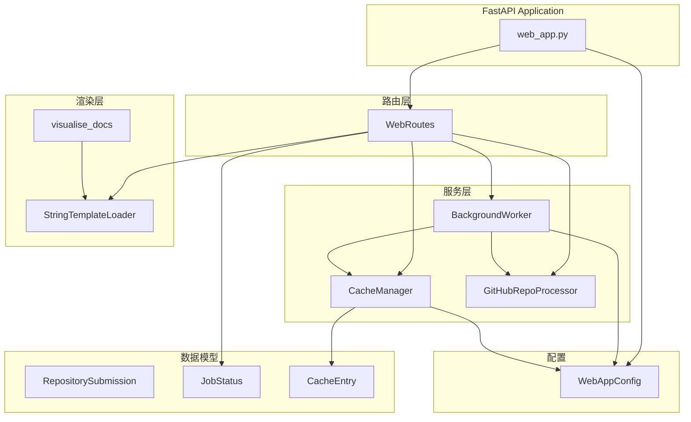
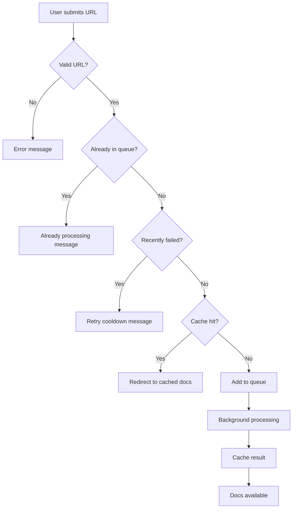
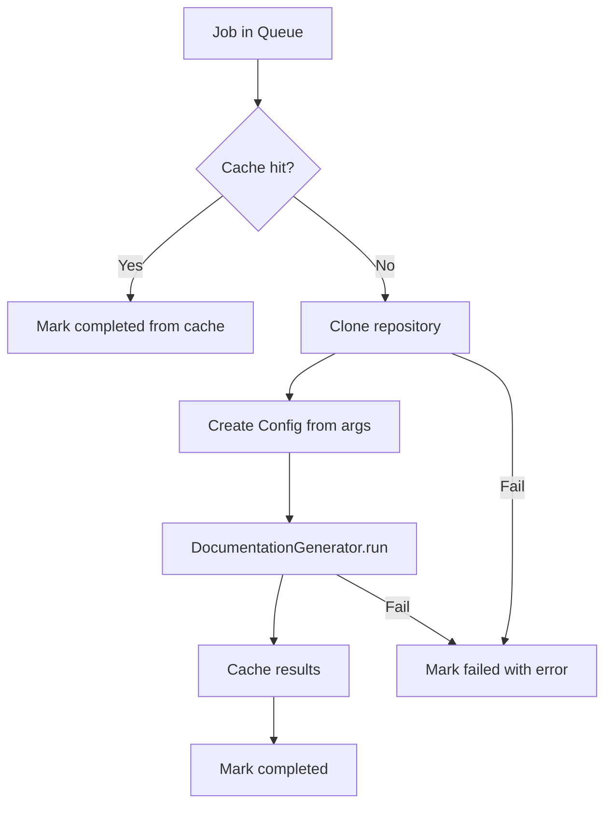
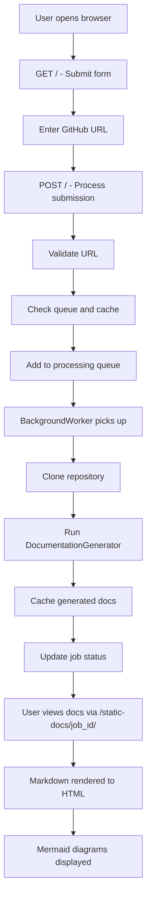

# Web 前端服务

## 模块概述

Web 前端服务是 CodeWiki-CN 的 Web 应用层，基于 FastAPI 框架构建，提供用户友好的 GitHub 仓库文档生成界面。该模块实现了完整的 Web 工作流：用户提交 GitHub 仓库 URL → 后台队列处理 → 文档缓存 → 在线浏览生成的文档。同时提供独立的文档可视化服务器，支持 Markdown 到 HTML 的渲染和 Mermaid 图表展示。

## 核心功能

- **仓库提交界面**：Web 表单接收 GitHub 仓库 URL，支持指定 commit ID
- **后台任务处理**：守护线程异步克隆仓库并生成文档
- **文档缓存系统**：缓存已生成的文档，避免重复分析
- **任务状态跟踪**：实时查看任务进度（排队/处理中/完成/失败）
- **文档在线浏览**：将 Markdown 文档渲染为 HTML，支持 Mermaid 图表和模块树导航
- **独立文档服务器**：可独立运行的文档可视化服务

## 架构总览

## 组件详解

### web_app（应用入口）

**源文件**：`codewiki/src/fe/web_app.py`

FastAPI 应用的入口点，负责组件初始化和路由注册。

**初始化组件：**
- CacheManager：配置缓存目录和过期时间
- BackgroundWorker：配置缓存管理器和临时目录
- WebRoutes：配置后台工作器和缓存管理器

**注册路由：**

| 路由 | 方法 | 说明 |
|------|------|------|
| `/` | GET | 主页，显示提交表单和近期任务 |
| `/` | POST | 处理仓库提交 |
| `/api/job/{job_id}` | GET | API 获取任务状态 |
| `/docs/{job_id}` | GET | 重定向到文档查看 |
| `/static-docs/{job_id}/{filename}` | GET | 服务生成的文档文件 |

**启动流程：**
1. 解析命令行参数（host、port、debug、reload）
2. 调用 `WebAppConfig.ensure_directories()` 创建必要目录
3. 启动 BackgroundWorker 守护线程
4. 启动 uvicorn 服务器

### WebRoutes（路由处理器）

**源文件**：`codewiki/src/fe/routes.py`

封装所有 Web 路由的业务逻辑。

**核心职责：**
- **主页渲染**：展示提交表单和近期 100 个任务列表
- **仓库提交处理**：
  1. 验证 GitHub URL 有效性
  2. 规范化 URL 并生成 job_id（`owner--repo` 格式）
  3. 检查是否已在队列/处理中/近期失败
  4. 检查缓存，命中则直接可用
  5. 未命中则加入后台处理队列
- **任务状态 API**：返回 JSON 格式的任务状态
- **文档服务**：加载 module_tree.json 和 metadata.json，将 Markdown 渲染为 HTML

**URL 规范化**：通过 `GitHubRepoProcessor.get_repo_info()` 统一 URL 格式，确保 `https://github.com/owner/repo` 的一致性。

**任务生命周期：**

### CacheManager（缓存管理器）

**源文件**：`codewiki/src/fe/cache_manager.py`

管理文档缓存的持久化和过期策略。

**核心职责：**
- 维护缓存索引（cache_index.json），映射 repo URL hash 到文档路径
- 缓存查找：基于 SHA-256 URL 哈希匹配
- 缓存写入：记录创建时间和最后访问时间
- 过期清理：删除超过 CACHE_EXPIRY_DAYS（默认 365 天）的缓存条目

**缓存索引结构：**

| 字段 | 说明 |
|------|------|
| repo_url | 仓库 URL |
| repo_url_hash | URL 的 SHA-256 哈希前 16 位 |
| docs_path | 生成文档的本地路径 |
| created_at | 缓存创建时间 |
| last_accessed | 最后访问时间 |

### BackgroundWorker（后台工作器）

**源文件**：`codewiki/src/fe/background_worker.py`

基于守护线程的后台任务处理器。

**核心职责：**
- 维护任务队列（Queue，maxsize=100）
- 守护线程循环处理任务
- 任务处理流程：缓存检查 → 克隆仓库 → 生成文档 → 缓存结果
- 任务状态持久化（jobs.json）
- 启动时从磁盘恢复已完成任务状态
- 从缓存重建丢失的任务记录

**任务处理流程：**

### GitHubRepoProcessor（GitHub 仓库处理器）

**源文件**：`codewiki/src/fe/github_processor.py`

静态工具类，处理 GitHub 仓库相关的操作。

**核心职责：**
- URL 验证：检查是否为有效的 github.com 链接，包含 owner/repo 路径
- 仓库信息提取：解析 owner、repo、full_name、clone_url
- 仓库克隆：支持浅克隆（depth=1）和指定 commit 的全量克隆

**克隆策略：**
- 默认浅克隆：`--depth 1`，超时 300 秒
- 指定 commit：全量克隆后 `git checkout <commit_id>`

### StringTemplateLoader（模板加载器）

**源文件**：`codewiki/src/fe/template_utils.py`

自定义 Jinja2 BaseLoader 实现，支持从字符串加载模板。

**设计目的：** 将 HTML 模板嵌入 Python 代码中作为字符串常量，避免外部模板文件依赖。

### visualise_docs（文档可视化服务器）

**源文件**：`codewiki/src/fe/visualise_docs.py`

独立运行的文档可视化服务器，可单独部署用于浏览已生成的文档。

**核心职责：**
- Markdown 到 HTML 渲染（使用 markdown-it-py）
- Mermaid 图表支持：将 `language-mermaid` 代码块转换为 `
` 
- 模块树导航：加载 module_tree.json 生成侧边栏
- 安全防护：目录遍历检查，仅服务 .md 文件
- 独立 FastAPI 应用，可通过命令行启动

### WebAppConfig（Web 应用配置）

**源文件**：`codewiki/src/fe/config.py`

Web 应用的集中配置类。

| 配置项 | 默认值 | 说明 |
|--------|--------|------|
| CACHE_DIR | ./output/cache | 缓存目录 |
| TEMP_DIR | ./output/temp | 临时克隆目录 |
| OUTPUT_DIR | ./output | 输出根目录 |
| QUEUE_SIZE | 100 | 任务队列最大长度 |
| CACHE_EXPIRY_DAYS | 365 | 缓存过期天数 |
| JOB_CLEANUP_HOURS | 24000 | 任务清理时间窗口 |
| RETRY_COOLDOWN_MINUTES | 3 | 失败重试冷却时间 |
| DEFAULT_HOST | 127.0.0.1 | 默认监听地址 |
| DEFAULT_PORT | 8000 | 默认端口 |
| CLONE_TIMEOUT | 300 | 克隆超时秒数 |
| CLONE_DEPTH | 1 | 浅克隆深度 |

### 数据模型

**源文件**：`codewiki/src/fe/models.py`

| 模型 | 说明 |
|------|------|
| `RepositorySubmission` | Pydantic 模型，验证仓库 URL（HttpUrl） |
| `JobStatus` | 任务状态跟踪：job_id、repo_url、status、时间戳、进度、文档路径 |
| `CacheEntry` | 缓存条目：repo_url、hash、docs_path、时间戳 |
| `JobStatusResponse` | API 响应模型 |

## 完整工作流

## 与其他模块的关系

- [分析服务](分析服务.md)：BackgroundWorker 通过 DocumentationGenerator 间接调用分析服务
- [共享基础设施](共享基础设施.md)：使用 Config 构建文档生成配置，使用 FileManager 进行 JSON 和文本 I/O
- [数据模型与算法](数据模型与算法.md)：分析结果驱动文档结构和模块树
- [分析器工具](分析器工具.md)：文档生成过程使用 patterns 和 logging_config

## 设计要点

1. **异步架构**：FastAPI 异步路由 + 守护线程后台处理，不阻塞 Web 请求
2. **缓存优先**：每次任务处理前先查缓存，避免重复分析大型仓库
3. **状态持久化**：任务状态和缓存索引都持久化到 JSON 文件，重启后可恢复
4. **独立文档服务**：visualise_docs 可独立部署，无需完整 Web 应用
5. **安全防护**：URL 验证、目录遍历检查、克隆超时控制