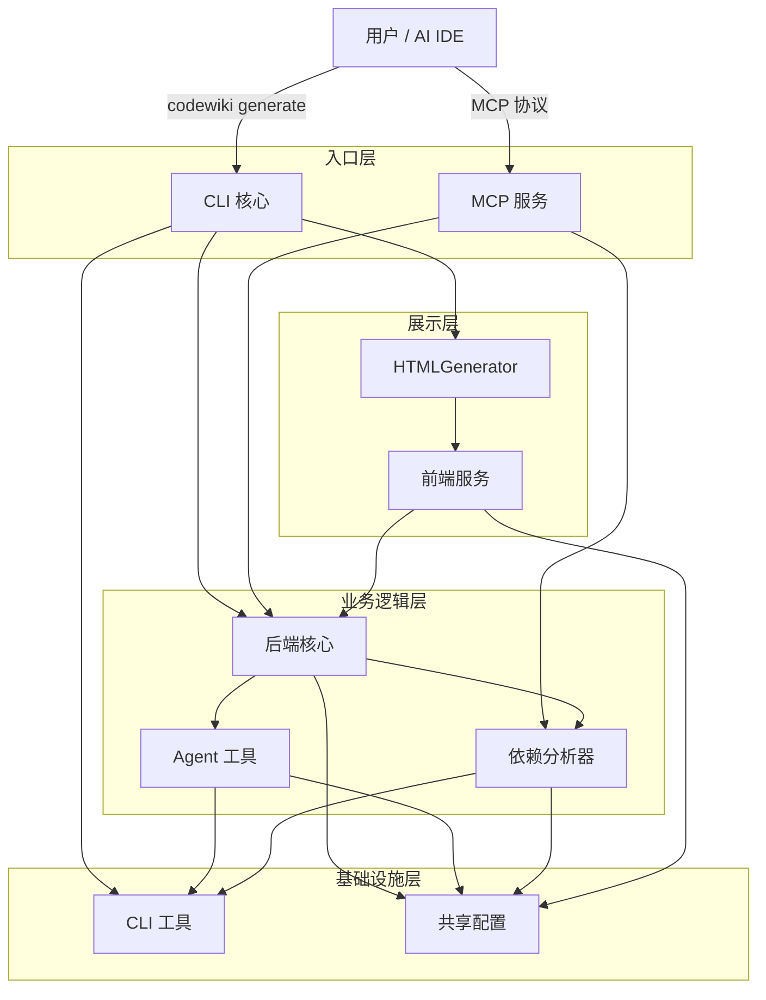
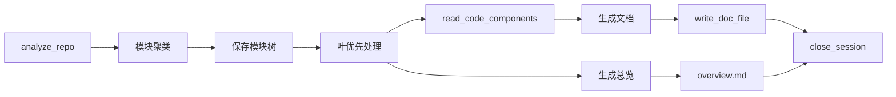

# CodeWiki-CN 仓库总览

## 项目简介

**CodeWiki-CN** 是 AI IDE 驱动的代码仓库文档生成工具的中国社区分支。通过零配置 MCP 协议与 AI IDE 集成，自动分析多语言代码仓库的依赖关系，生成结构化的 Wiki 文档（包含 Mermaid 架构图、交叉引用和模块索引），支持 CLI 模式和 Web 可视化。

### 核心能力

- **零 LLM 配置**：无需自行配置大模型 API，由 AI IDE 自身模型驱动
- **9 种语言支持**：Python、Java、JavaScript、TypeScript、C、C++、C#、Kotlin、PHP
- **IDE 原生集成**：通过 MCP 协议与 CodeBuddy、Cursor、Claude Desktop 等 AI IDE 无缝对接
- **双模式运行**：CLI 模式（`codewiki generate`）+ MCP Server 模式（10 个细粒度工具）
- **增量生成**：基于 Git diff 检测变更，仅重新生成受影响模块

## 端到端架构



## 工作流程



## 模块索引

| 模块 | 路径 | 组件数 | 说明 |
|------|------|--------|------|
| [Agent 工具](Agent 工具.md) | `codewiki/src/be/agent_tools/` | 13 | AI Agent 基础设施：依赖注入、代码读取、文档委托、文件编辑器 |
| [CLI 工具](CLI 工具.md) | `codewiki/cli/utils/` | 43 | CLI 基础工具：异常处理、文件系统、验证、日志、进度、仓库校验 |
| [CLI 核心](CLI 核心.md) | `codewiki/cli/` | 26 | CLI 入口和命令：config/generate 命令组、配置管理、Git 管理、HTML 生成 |
| [MCP 服务](MCP 服务.md) | `codewiki/mcp/` | 38 | MCP 协议服务器：10 个细粒度工具 + 线程安全会话管理 + 增量更新 + 安全加固 |
| [依赖分析器](依赖分析器.md) | `codewiki/src/be/dependency_analyzer/` | 61 | 代码分析引擎：多语言 Tree-sitter 解析、依赖图构建、拓扑排序 |
| [共享配置](共享配置.md) | `codewiki/src/` | 4 | 全局配置和工具：Config 类、FileManager、CLI/MCP 双上下文 |
| [前端服务](前端服务.md) | `codewiki/src/fe/` | 27 | Web 应用：FastAPI 路由、Jinja2 模板、文档可视化、缓存管理 |
| [后端核心](后端核心.md) | `codewiki/src/be/` | 44 | 文档生成引擎：LLM 后端适配（Caw/PydanticAI）、聚类、提示词、Mermaid 验证 |

## 技术栈

| 层次 | 技术 |
|------|------|
| AST 解析 | tree-sitter + tree-sitter-language-pack |
| LLM 集成 | litellm、openai-agents、pydantic-ai + 订阅模式（claude-code/codex） |
| Web 框架 | FastAPI + uvicorn |
| CLI 框架 | click |
| 模板引擎 | Jinja2 |
| 图表渲染 | Mermaid（CDN 客户端渲染 + Node.js/Python 服务端校验） |
| MCP 协议 | Python MCP SDK (stdio transport) |

## 目录结构

```
CodeWiki-CN/
├── codewiki/
│   ├── cli/                  # CLI 核心 + CLI 工具
│   │   ├── adapters/         # 文档生成适配器
│   │   ├── commands/         # config / generate 命令
│   │   ├── models/           # 配置和作业数据模型
│   │   └── utils/            # CLI 工具函数
│   ├── mcp/                  # MCP 服务
│   │   ├── tools/            # 工具处理器
│   │   └── server.py         # MCP 服务器入口
│   ├── src/
│   │   ├── be/               # 后端核心 + Agent 工具 + 依赖分析器
│   │   │   ├── agent_tools/  # AI Agent 工具
│   │   │   └── dependency_analyzer/  # 代码分析引擎
│   │   ├── fe/               # 前端服务
│   │   ├── config.py         # 共享配置
│   │   └── utils.py          # 共享工具
│   └── templates/            # GitHub Pages 模板
├── docker/                   # Docker 部署配置
├── docs/                     # 已生成的文档
└── repowiki/                 # 当前 Wiki 输出目录
```

## 快速开始

**MCP Server 模式**（推荐，零配置）：

```bash
python -m codewiki.mcp.server
```

在 AI IDE（CodeBuddy / Cursor / Claude Desktop）中配置 MCP，然后直接说"为这个项目生成 Wiki"。

**CLI 模式**：

```bash
codewiki config set --provider openai-compatible --api-key YOUR_KEY
codewiki generate
```

输出文档位于 `repowiki/` 目录。