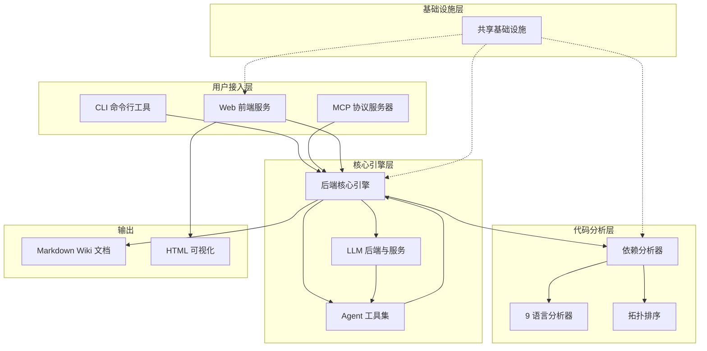
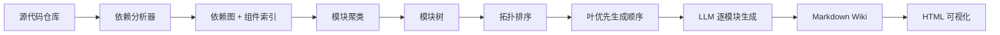

# CodeWiki-CN 仓库总览

## 项目简介

CodeWiki-CN 是一个自动化代码仓库文档生成系统，能够分析代码库的结构和依赖关系，并利用大语言模型（LLM）自动生成高质量的中文 Wiki 文档。系统支持 9 种编程语言的代码分析，提供 CLI 命令行工具和 MCP 协议两种接入方式，适用于本地开发环境和 AI 编程助手集成场景。

项目的核心理念是"让 AI 理解代码，让文档跟上代码"——通过 AST 解析构建精确的依赖图，再通过 LLM 将代码结构转化为人类可读的技术文档。

## 端到端架构



## 模块概览

CodeWiki-CN 包含 258 个代码组件，分布在 6 个顶层模块中。以下按模块在项目中的角色逐一介绍。

### [CLI 命令行工具](CLI%20命令行工具.md)

CLI 是面向人类用户的交互入口，基于 Python `click` 框架构建。提供三个核心子命令：`codewiki generate`（文档生成）、`codewiki config`（配置管理）和 `codewiki mcp`（启动 MCP 服务）。CLI 层负责参数解析、配置加载、Git 操作和进度展示，通过适配器模式将实际的文档生成任务委托给后端引擎。包含 68 个组件，分为 3 个子模块：[CLI 入口与命令](CLI%20入口与命令.md)、[CLI 配置与模型](CLI%20配置与模型.md)、[CLI 工具库](CLI%20工具库.md)。

### [MCP 协议服务器](MCP%20协议服务器.md)

MCP 服务器面向 LLM 智能体，通过 stdio JSON-RPC 协议提供 8 个结构化工具，使 IDE 中的 AI 助手能够以编程方式驱动文档生成全流程。核心工具包括：`analyze_repo`（仓库分析）、`read_code_components`（源码读取）、`save_module_tree`（模块聚类）、`write_doc_file` / `edit_doc_file`（文档写入与编辑）、`get_prompt`（提示词获取）等。采用文件侧通道架构——大体量数据写入磁盘文件，MCP 仅传输元数据和路径，突破了 stdio 传输的数据量限制。包含 35 个组件，分为 2 个子模块：[MCP 工具集](MCP%20工具集.md)、[MCP 会话与工作区](MCP%20会话与工作区.md)。

### [后端核心引擎](后端核心引擎.md)

后端引擎是整个系统的文档生成中枢，以 `DocumentationGenerator` 为核心编排器，协调从代码分析到文档输出的完整自动化流程。支持两种 LLM 后端：PydanticAI（API Key 直连模式）和 CAW（订阅制 CLI 模式），兼容 OpenAI、Anthropic、Azure、AWS Bedrock 等多种模型提供商。Agent 工具集提供文件编辑（str_replace_editor）、源码读取、子模块递归生成等能力。包含 57 个组件，分为 3 个子模块：[LLM 后端与服务](LLM%20后端与服务.md)、[Agent 工具集](Agent%20工具集.md)、[后端工具与流程](后端工具与流程.md)。

### [依赖分析器](依赖分析器.md)

依赖分析器是系统的代码理解基础层，将源代码转化为结构化的依赖图。Python 使用内置 `ast` 模块解析，其余 8 种语言（Java、JavaScript、TypeScript、C、C++、C#、PHP、Kotlin）使用 Tree-sitter 增量解析框架。分析产出包括代码组件元数据、调用与依赖关系、以及经拓扑排序的叶子节点列表。支持循环依赖检测（Tarjan 算法）和自动打破。包含 66 个组件，分为 4 个子模块：[分析服务](分析服务.md)、[语言分析器](语言分析器.md)、[数据模型与算法](数据模型与算法.md)、[分析器工具](分析器工具.md)。

### [Web 前端服务](Web%20前端服务.md)

Web 前端基于 FastAPI 构建，提供用户友好的 GitHub 仓库文档生成界面。用户提交仓库 URL 后，后台守护线程异步克隆并生成文档，支持任务状态实时跟踪、文档缓存和在线浏览。独立的文档可视化服务器支持 Markdown 到 HTML 渲染和 Mermaid 图表展示。包含 28 个组件。

### [共享基础设施](共享基础设施.md)

共享基础设施包含全局配置管理器（`Config`）和文件 I/O 工具类（`FileManager`），被多个子系统广泛依赖。`Config` 封装仓库路径、LLM 参数、输出目录等全局配置，支持从命令行参数和 CLI 上下文两种创建方式。包含 4 个组件。

## 数据流

文档生成的端到端数据流如下：



1. **代码分析**：依赖分析器遍历源代码，使用语言特定解析器提取组件和调用关系
2. **图构建**：DependencyGraphBuilder 构建有向依赖图
3. **模块聚类**：LLM 根据组件功能相似度将组件分组为逻辑模块
4. **拓扑排序**：检测并打破循环依赖，计算叶优先的处理顺序
5. **文档生成**：LLM 按叶→根顺序逐模块生成 Markdown 文档
6. **可视化**：Web 前端将 Markdown 渲染为带 Mermaid 图表的 HTML

## 技术栈

- **语言**：Python 3.10+
- **代码解析**：Python `ast` + Tree-sitter（9 种语言）
- **LLM 集成**：PydanticAI、OpenAI SDK、LiteLLM、Azure
- **CLI 框架**：click
- **Web 框架**：FastAPI、Jinja2
- **协议**：MCP（Model Context Protocol）over stdio
- **图表**：Mermaid.js
- **版本控制**：Git / GitPython

## 快速开始

```bash
# 安装
git clone https://github.com/mambo-wang/CodeWiki-CN.git
cd CodeWiki-CN && pip install -e .

# CLI 模式
codewiki generate --repo-path /path/to/repo --output-dir /path/to/repo/repowiki

# MCP 模式（IDE 集成）
codewiki mcp
```

MCP 配置（添加到 IDE）：

```json
{
  "mcpServers": {
    "codewiki": {
      "command": "python",
      "args": ["-m", "codewiki.mcp.server"],
      "cwd": "/path/to/CodeWiki-CN"
    }
  }
}
```
