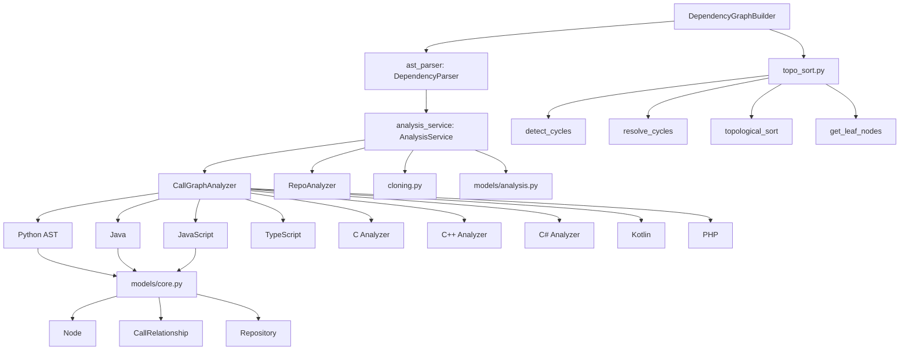
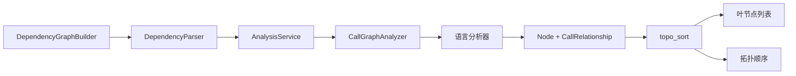

# 依赖分析器

## 简介

依赖分析器模块位于 `codewiki/src/be/dependency_analyzer/`，是 CodeWiki 的代码分析引擎。基于 Tree-sitter AST 解析，支持 9 种编程语言，构建组件依赖图、拓扑排序和调用关系分析。

## 架构概览

## 入口与图构建

### DependencyGraphBuilder

> **文件**: `codewiki/src/be/dependency_analyzer/dependency_graphs_builder.py`

依赖图构建入口。接收 `Config` 对象，调用 `DependencyParser` 解析源码，然后通过 `topo_sort` 计算叶节点。

### DependencyParser (ast_parser.py)

> **文件**: `codewiki/src/be/dependency_analyzer/ast_parser.py`

AST 解析网关。创建 `AnalysisService` 实例，遍历仓库文件并分发到各语言分析器。

## 分析服务

### AnalysisService

> **文件**: `codewiki/src/be/dependency_analyzer/analysis/analysis_service.py`

核心分析门面：

- `analyze_repository()`：完整依赖分析
- `analyze_repository_structure_only()`：仅结构分析（不含调用关系）
- 集成 `CallGraphAnalyzer`、`RepoAnalyzer`、`cloning.py`（GitHub 克隆）
- 安全路径检查（`assert_safe_path`）

### CallGraphAnalyzer

> **文件**: `codewiki/src/be/dependency_analyzer/analysis/call_graph_analyzer.py`

调用图分析器，按文件扩展名路由到对应语言分析器，支持超时控制。调用 9 种语言的 `analyze_*_file` 函数。

### RepoAnalyzer

> **文件**: `codewiki/src/be/dependency_analyzer/analysis/repo_analyzer.py`

仓库结构分析器。

### cloning.py

> **文件**: `codewiki/src/be/dependency_analyzer/analysis/cloning.py`

GitHub 仓库克隆与清理：URL 安全化、克隆、临时目录清理、只读文件处理。

## 语言分析器

### analyzers/ 目录

| 分析器 | 语言 | 核心类 |
|--------|------|--------|
| `python.py` | Python | `PythonASTAnalyzer` — 使用 Python 原生 AST + tree-sitter |
| `java.py` | Java | `TreeSitterJavaAnalyzer` — 类/方法解析，过滤外部符号 |
| `javascript.py` | JavaScript | `TreeSitterJSAnalyzer` — 函数/类声明和调用 |
| `typescript.py` | TypeScript | `TreeSitterTSAnalyzer` — TS 特有语法支持 |
| `c.py` | C | `TreeSitterCAnalyzer` — 函数定义和调用 |
| `cpp.py` | C++ | `TreeSitterCppAnalyzer` — 类/模板/命名空间 |
| `csharp.py` | C# | `TreeSitterCSharpAnalyzer` — 类/方法/属性 |
| `kotlin.py` | Kotlin | `TreeSitterKotlinAnalyzer` — 类/函数/扩展 |
| `php.py` | PHP | `TreeSitterPHPAnalyzer` + `NamespaceResolver` |

所有分析器基于 tree-sitter AST 解析，输出 `Node` 和 `CallRelationship` 对象。

## 拓扑排序

> **文件**: `codewiki/src/be/dependency_analyzer/topo_sort.py`

| 函数 | 说明 |
|------|------|
| `detect_cycles` | 使用 Tarjan 算法检测强连通分量 |
| `resolve_cycles` | 检测并标记循环依赖 |
| `topological_sort` | 拓扑排序（中断循环依赖） |
| `dependency_first_dfs` | 依赖优先深度遍历 |
| `get_leaf_nodes` | 获取依赖图中的叶节点 |
| `build_graph_from_components` | 从组件列表构建邻接图 |

## 数据模型

### models/core.py

| 类 | 说明 |
|------|------|
| `Node` | 代码组件节点：id、type、file、source_code、depends_on、language |
| `CallRelationship` | 调用关系：caller、callee、line_number |
| `Repository` | 仓库模型：path、files、languages |

### models/analysis.py

| 类 | 说明 |
|------|------|
| `AnalysisResult` | 分析结果聚合模型 |
| `NodeSelection` | 节点选择模型 |

## 工具模块

### utils/external_symbols.py

外部符号识别：`is_external_symbol`（判断是否为外部依赖）、`is_macro_name`（C/C++ 宏名检测）、`normalize_symbol`。

### utils/logging_config.py

`ColoredFormatter` 彩色日志格式化器，`setup_logging` 和 `setup_module_logging` 入口。

### utils/patterns.py

文件模式识别：入口点检测、高连通性文件识别、关键函数识别、fallback 入口点查找。

### utils/security.py

路径安全：`assert_safe_path`（沙箱路径检查）、`safe_open_text`（安全文件读取）。

## 数据流

## 模块依赖

- **上游**: [共享配置](共享配置.md)（Config）、[CLI 工具](CLI 工具.md)（日志、异常）
- **下游**: [MCP 服务](MCP 服务.md)（analyze_repo）、[后端核心](后端核心.md)（DocumentationGenerator）

## 关键设计

1. **多语言 Tree-sitter**：统一 AST 解析框架，每个语言独立分析器
2. **拓扑排序**：Tarjan SCC 检测循环依赖，确保文档生成顺序正确
3. **外部符号过滤**：区分项目内部符号与外部依赖，避免噪声
4. **安全沙箱**：路径检查防止目录遍历攻击
5. **超时控制**：CallGraphAnalyzer 单文件分析超时保护