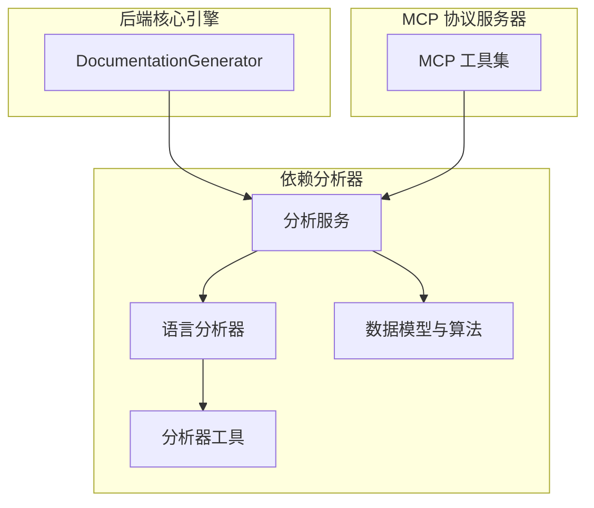
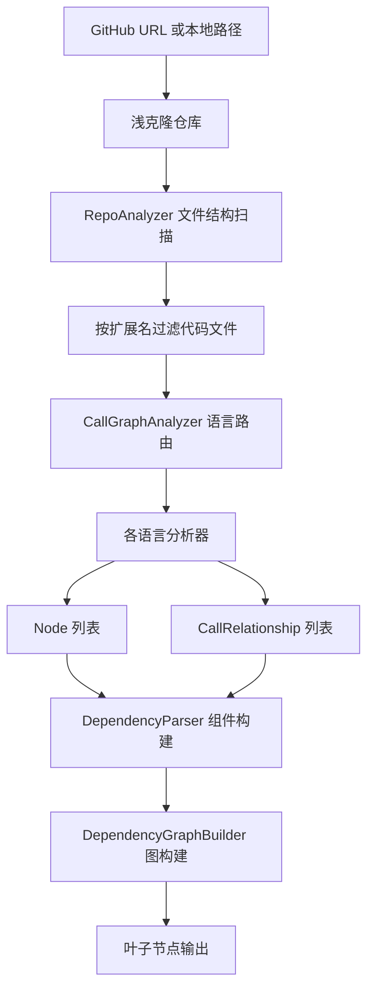
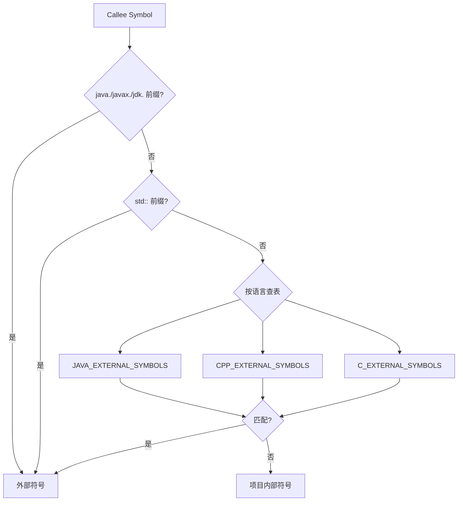
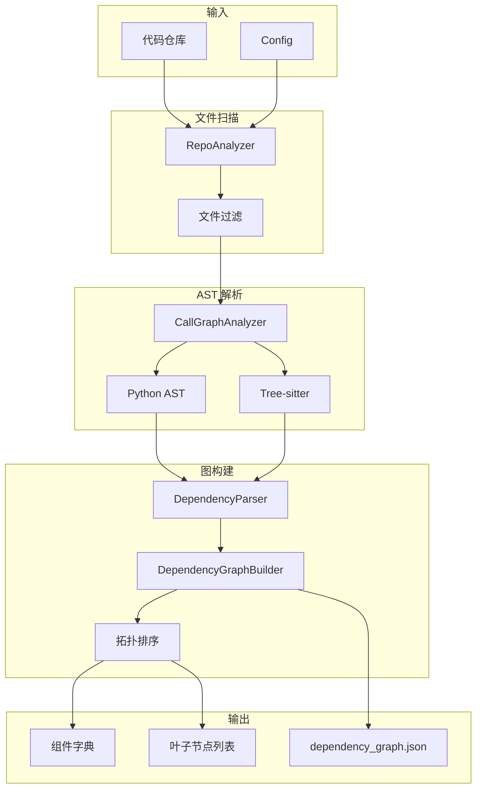

# 依赖分析器

## 模块概述

依赖分析器是 CodeWiki-CN 的代码理解基础层，负责将源代码仓库转化为结构化的依赖图数据。该模块支持 9 种编程语言的代码分析——Python 使用内置 `ast` 模块进行 AST 解析，其余 8 种语言（Java、JavaScript、TypeScript、C、C++、C#、PHP、Kotlin）使用 Tree-sitter 增量解析框架。分析产出包括代码组件（类、函数、方法等）的元数据、组件间的调用与依赖关系、以及经过拓扑排序的叶子节点列表。

作为文档生成管线的第一阶段，依赖分析器的输出质量直接决定了后续模块聚类和文档生成的准确性。它需要处理多语言语法差异、导入解析、外部符号过滤、循环依赖打破等复杂问题，同时保证在面对大型仓库时的性能和稳定性。

## 子模块架构

## 子模块说明

### 分析服务

[分析服务](分析服务.md) 是依赖分析引擎的核心编排层，协调文件结构扫描、多语言 AST 解析、调用图构建等子流程。

**核心组件：**

| 组件 | 职责 |
|------|------|
| `DependencyGraphBuilder` | 面向文档生成流程的高层接口，封装从解析到叶子节点输出的完整流程 |
| `DependencyParser` | 依赖分析的顶层入口，将仓库路径转化为组件字典 |
| `AnalysisService` | 分析流程的中枢调度器，支持完整分析、结构分析和本地分析三种模式 |
| `CallGraphAnalyzer` | 多语言调用图分析的核心执行器，负责逐文件解析和跨语言关系解析 |
| `RepoAnalyzer` | 仓库文件结构的递归扫描，支持包含/排除模式过滤 |
| `Cloning Utilities` | GitHub 仓库浅克隆与安全清理 |

**分析流程：**

**调用关系解析策略**（按优先级）：精确匹配 → `::` 后缀匹配 → `.` 尾部匹配 → Java 同包推断 → 简单名兜底。每个文件分析设置 30 秒超时保护。

**支持的语言**：Python、JavaScript、TypeScript、Java、C#、C、C++、PHP、Kotlin。

### 语言分析器

[语言分析器](语言分析器.md) 是依赖分析引擎的多语言 AST 解析层，为每种语言提供专门的语法分析器。

**分析器矩阵：**

| 语言 | 分析器 | 解析技术 | 提取的组件类型 |
|------|--------|---------|--------------|
| Python | PythonASTAnalyzer | Python ast 模块 | class, function, method |
| Java | TreeSitterJavaAnalyzer | tree-sitter-java | class, interface, enum, record, annotation, method |
| JavaScript | TreeSitterJSAnalyzer | tree-sitter-javascript | class, interface, function, method |
| TypeScript | TreeSitterTSAnalyzer | tree-sitter-typescript | class, interface, function, method |
| C | TreeSitterCAnalyzer | tree-sitter-c | function, struct |
| C++ | TreeSitterCppAnalyzer | tree-sitter-cpp | class, struct, function, method |
| C# | TreeSitterCSharpAnalyzer | tree-sitter-csharp | class, interface, struct, method |
| PHP | TreeSitterPHPAnalyzer | tree-sitter-php | class, interface, function, method |
| Kotlin | TreeSitterKotlinAnalyzer | tree-sitter-kotlin | class, function, method |

**统一接口**：所有分析器返回 `(List[Node], List[CallRelationship])` 元组，对上层透明。

**语言特殊处理：**
- Java 分析器实现完整的 import map（简单名 → 全限定名），支持变量类型推断
- JavaScript 分析器支持 5 种函数声明形式和 JSDoc 类型依赖提取
- PHP 分析器使用 `NamespaceResolver` 处理 `use` 声明和命名空间规则
- C/C++ 分析器通过内容启发式判断 `.h` 头文件的归属语言

### 数据模型与算法

[数据模型与算法](数据模型与算法.md) 为依赖分析引擎提供基础数据结构和图算法支持。

**核心数据模型：**

| 模型 | 用途 |
|------|------|
| `Node` | 代码组件的统一表示（类/函数/方法），含 ID、源码、行号、依赖集合等 |
| `CallRelationship` | 组件间的调用/依赖关系，含 caller、callee、行号、解析状态 |
| `AnalysisResult` | 完整分析结果容器，聚合组件、关系、文件树、统计摘要 |
| `Repository` | 仓库基本信息（URL、名称、克隆路径） |

**核心图算法：**

| 算法 | 功能 | 复杂度 |
|------|------|--------|
| Tarjan 强连通分量 | 检测循环依赖 | O(V+E) |
| `resolve_cycles` | 打破循环依赖（移除最弱边） | - |
| `topological_sort` | 基于入度的 Kahn 拓扑排序 | O(V+E) |
| `dependency_first_dfs` | 深度优先的依赖优先遍历 | O(V+E) |
| `build_graph_from_components` | 从组件字典构建邻接表 | O(V+E) |
| `get_leaf_nodes` | 识别叶子节点并多重过滤 | - |

**叶子节点过滤策略**：按组件类型过滤（优先 class/interface/struct，C 项目回退到 function）→ 排除无效标识符 → 数量控制（超过 400 个时进一步筛选）。

### 分析器工具

[分析器工具](分析器工具.md) 为各语言分析器和分析服务提供横切关注点的实现。

**四大工具模块：**

| 模块 | 职责 |
|------|------|
| `external_symbols` | 维护各语言标准库符号集合，分层过滤外部依赖 |
| `logging_config` | 基于 colorama 的彩色日志格式化，5 级彩色输出 |
| `patterns` | 定义入口点、高连接度文件、代码扩展名映射（30+ 种）、忽略模式等 |
| `security` | 安全文件访问：符号链接拒绝 + 路径逃逸检测 + O_NOFOLLOW 系统级防护 |

**外部符号分层过滤策略：**

## 完整数据流

## 与其他模块的关系

- **[后端核心引擎](后端核心引擎.md)**：`DocumentationGenerator` 在第一阶段调用 `DependencyGraphBuilder` 获取组件和叶子节点
- **[MCP 协议服务器](MCP%20协议服务器.md)**：MCP 的 `analyze_repo` 工具调用 `DependencyGraphBuilder` 执行仓库分析
- **[CLI 命令行工具](CLI%20命令行工具.md)**：CLI 的 `generate` 命令间接触发依赖分析流程

## 设计要点

1. **语言专门化**：每种语言使用最适合的解析技术——Python 用内置 AST（零依赖），其他用 Tree-sitter（增量解析）
2. **环容忍性**：所有图算法先调用 `resolve_cycles` 打破循环依赖，确保拓扑排序不会死锁
3. **安全优先**：符号链接拒绝、路径逃逸检测、O_NOFOLLOW 系统级防护，三层独立防线
4. **延迟导入**：分析器模块使用延迟导入，避免初始化时加载所有语言解析器
5. **超时保护**：每个文件分析 30 秒超时，浅克隆 5 分钟超时，防止大型仓库阻塞
6. **容错设计**：单文件分析失败不影响整体流程，无效标识符自动过滤，编码错误多级回退
