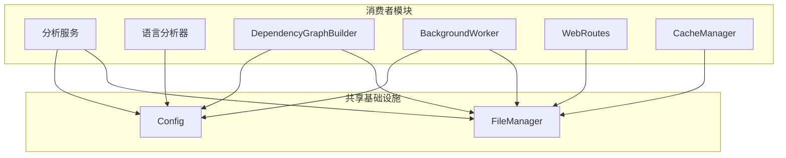
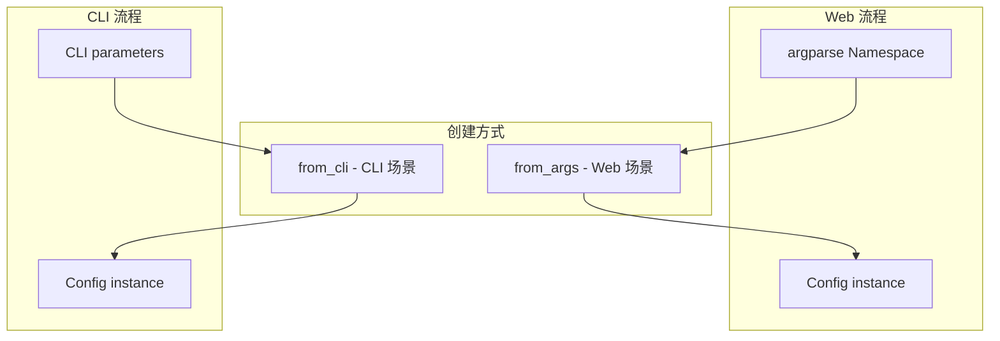
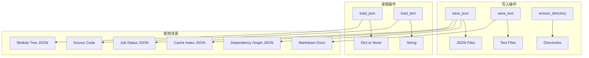
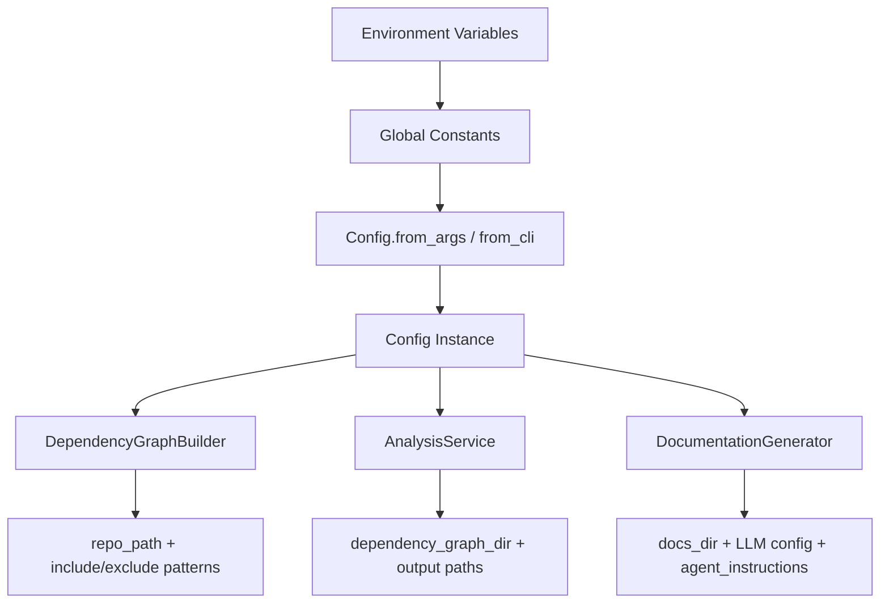

# 共享基础设施

## 模块概述

共享基础设施模块包含 CodeWiki-CN 项目中被多个子系统共同使用的基础组件：全局配置管理器（Config）和文件 I/O 工具类（FileManager）。Config 封装了仓库路径、LLM 参数、输出目录等全局配置信息，支持从命令行参数和 CLI 上下文两种创建方式。FileManager 提供统一的 JSON 和文本文件读写接口，简化各模块的文件操作。这两个组件作为项目的底层基础设施，被分析服务、语言分析器、Web 前端等多个模块广泛依赖。

## 核心功能

- **全局配置管理**：封装仓库路径、LLM 配置、输出目录、Agent 指令等全局参数
- **多入口配置创建**：支持从命令行参数和 CLI 上下文两种场景构建配置
- **Agent 指令定制**：支持通过 agent_instructions 自定义文档类型、关注模块、包含/排除模式
- **统一文件 I/O**：提供 JSON 序列化/反序列化和文本文件读写的统一接口
- **目录管理**：自动创建必要的输出目录结构

## 架构总览

## 组件详解

### Config（全局配置管理器）

**源文件**：`codewiki/src/config.py`

Config 是整个 CodeWiki-CN 系统的配置中枢，封装了从仓库分析到文档生成的全部配置参数。

**配置字段：**

| 字段 | 类型 | 说明 |
|------|------|------|
| `repo_path` | str | 被分析仓库的本地路径 |
| `output_dir` | str | 输出根目录 |
| `dependency_graph_dir` | str | 依赖图输出目录 |
| `docs_dir` | str | 文档输出目录 |
| `max_depth` | int | 层次分解的最大深度 |
| `llm_base_url` | str | LLM API 基础 URL |
| `llm_api_key` | str | LLM API 密钥 |
| `main_model` | str | 主模型名称 |
| `cluster_model` | str | 聚类模型名称 |
| `fallback_model` | str | 备用模型名称 |
| `provider` | str | LLM 提供商（openai-compatible/anthropic/bedrock/azure-openai） |
| `aws_region` | str | AWS 区域（Bedrock 提供商时使用） |
| `api_version` | str | Azure OpenAI API 版本 |
| `azure_deployment` | str | Azure OpenAI 部署名称 |
| `max_tokens` | int | LLM 最大 token 数 |
| `max_token_per_module` | int | 每模块最大 token 数 |
| `max_token_per_leaf_module` | int | 每叶子模块最大 token 数 |
| `agent_instructions` | Optional[Dict] | Agent 自定义指令 |

**配置创建方式：**

**from_args（Web 场景）：**
- 从 `argparse.Namespace` 对象创建
- 使用全局环境变量中的 LLM 配置
- 输出目录基于全局 OUTPUT_BASE_DIR
- 仓库名称自动清洗为安全文件名

**from_cli（CLI 场景）：**
- 接受完整的参数列表，包含所有 LLM 配置
- 支持多提供商（OpenAI、Anthropic、Bedrock、Azure）
- 支持 Agent 指令自定义
- 临时输出目录和最终输出目录分离

**Agent 指令属性：**

Config 通过属性访问器从 `agent_instructions` 字典中提取定制化配置：

| 属性 | 说明 | 示例值 |
|------|------|--------|
| `include_patterns` | 文件包含模式 | ["*.py", "*.js"] |
| `exclude_patterns` | 文件排除模式 | ["*Tests*"] |
| `focus_modules` | 重点关注模块 | ["auth", "api"] |
| `doc_type` | 文档类型 | "api", "architecture", "user-guide", "developer" |
| `custom_instructions` | 自定义指令文本 | 自由文本 |

**get_prompt_addition() 方法：**
根据 Agent 指令生成 LLM 提示词的附加内容：
- 文档类型指令：API 文档关注端点和参数，架构文档关注系统设计
- 重点模块提示：引导 LLM 对指定模块提供更详细的文档
- 自定义指令：直接附加用户提供的文本

### FileManager（文件 I/O 工具类）

**源文件**：`codewiki/src/utils.py`

FileManager 是全局唯一的文件操作单例，提供统一的文件 I/O 接口。

**方法定义：**

| 方法 | 说明 | 使用场景 |
|------|------|----------|
| `ensure_directory(path)` | 递归创建目录 | 初始化输出目录 |
| `save_json(data, filepath)` | 序列化并保存 JSON | 保存依赖图、缓存索引、任务状态 |
| `load_json(filepath)` | 加载 JSON 文件 | 读取依赖图、缓存索引、模块树 |
| `save_text(content, filepath)` | 保存文本文件 | 写入生成的 Markdown 文档 |
| `load_text(filepath)` | 读取文本文件 | 读取源代码、README、文档内容 |

**使用模式：**

**容错设计：**
- `load_json` 在文件不存在时返回 `None`，而不是抛出异常
- `ensure_directory` 使用 `exist_ok=True`，幂等操作
- JSON 序列化使用 4 空格缩进，便于人工检查

## 配置流转

## 与其他模块的关系

- [分析服务](分析服务.md)：AnalysisService 通过 Config 获取仓库路径，DependencyGraphBuilder 使用 Config 确定输出目录
- [语言分析器](语言分析器.md)：各分析器通过 Config 获取仓库路径以计算相对路径
- [数据模型与算法](数据模型与算法.md)：FileManager 用于依赖图 JSON 的读写
- [分析器工具](分析器工具.md)：patterns 模块中的 DEFAULT_IGNORE_PATTERNS 被 Config 的 include/exclude 机制使用
- [Web 前端服务](Web 前端服务.md)：BackgroundWorker 通过 Config.from_args 创建配置，CacheManager 和 WebRoutes 使用 FileManager

## 设计要点

1. **单例模式**：FileManager 以全局单例 `file_manager` 形式提供，避免重复实例化
2. **多入口配置**：Config 提供 from_args 和 from_cli 两种工厂方法，分别服务 Web 和 CLI 场景
3. **指令扩展性**：agent_instructions 字典设计允许无限扩展自定义配置，而无需修改 Config 类结构
4. **提供商抽象**：Config 支持多种 LLM 提供商配置，通过 provider 字段区分
5. **幂等操作**：ensure_directory 和 load_json 的容错设计确保重复调用不会出错
6. **路径安全**：仓库名称自动清洗为字母数字组合，防止文件系统注入