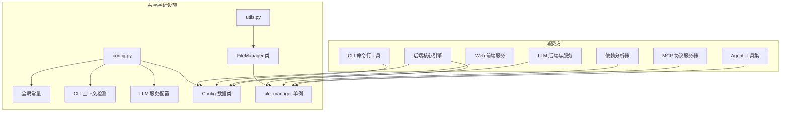
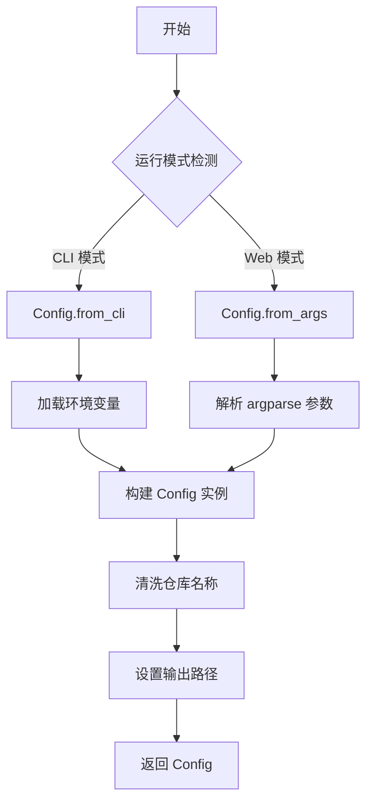

# 共享基础设施

## 模块简介

共享基础设施模块是 CodeWiki-CN 项目的底层支撑层，为系统中所有子系统提供共同依赖的基础组件。该模块包含两个核心源文件：`config.py`（全局配置管理）和 `utils.py`（文件 I/O 工具），共计 4 个主要组件。

作为整个系统的"地基层"，共享基础设施模块承担以下核心职责：

- **全局配置统一管理**：通过 `Config` 数据类封装仓库路径、LLM 参数、输出目录、模型提供商等全部可配置项，避免配置散落在各子系统之中。
- **多运行环境适配**：支持 CLI 命令行模式和 Web 应用模式两种运行上下文，通过环境变量和上下文标志自动切换行为。
- **多 LLM 提供商抽象**：在配置层统一 OpenAI 兼容、Anthropic、AWS Bedrock、Azure OpenAI 四种模型提供商的参数管理。
- **文件 I/O 标准化**：通过 `FileManager` 工具类提供统一的 JSON 和文本文件读写接口，确保所有子系统使用一致的编码和格式规范。

该模块虽然代码量精简，但被 [后端核心引擎](后端核心引擎.md)、[依赖分析器](依赖分析器.md)、[CLI 命令行工具](CLI%20命令行工具.md)、[MCP 协议服务器](MCP%20协议服务器.md) 和 [Web 前端服务](Web%20前端服务.md) 等多个子系统广泛依赖，是系统稳定运行的关键基础。

---

## 架构图

### 模块内部架构与外部依赖关系



### 配置创建流程



---

## 组件职责说明

### config.py -- 全局配置管理

`config.py` 是 CodeWiki-CN 的全局配置中心，定义了系统运行所需的所有配置常量、环境变量绑定以及配置数据类。

#### 全局常量

文件顶部定义了一系列目录和文件名常量，用于统一管理系统中所有文件的存放位置和命名：

| 常量名 | 值 | 用途 |
|--------|------|------|
| `OUTPUT_BASE_DIR` | `'output'` | 输出文件的根目录 |
| `DEPENDENCY_GRAPHS_DIR` | `'dependency_graphs'` | 依赖图的存储子目录 |
| `DOCS_DIR` | `'docs'` | 生成文档的存储目录 |
| `FIRST_MODULE_TREE_FILENAME` | `'first_module_tree.json'` | 初始模块树文件名 |
| `MODULE_TREE_FILENAME` | `'module_tree.json'` | 最终模块树文件名 |
| `OVERVIEW_FILENAME` | `'overview.md'` | 仓库总览文档文件名 |
| `SCHEMA_FILENAME` | `'schema.yaml'` | LLM Wiki 模式文件名 |
| `NOTES_DIR` | `'notes'` | LLM Wiki 笔记目录 |
| `DECISIONS_INDEX_FILENAME` | `'decisions_index.json'` | 决策索引文件名 |
| `INDEX_FILENAME` | `'index.md'` | 文档索引文件名 |
| `LOG_FILENAME` | `'log.md'` | 操作日志文件名 |
| `SEARCH_INDEX_FILENAME` | `'search_index.json'` | 搜索索引文件名 |
| `MAX_DEPTH` | `2` | 模块层级分解的最大深度 |

这些常量被 [后端核心引擎](后端核心引擎.md) 和 [MCP 会话与工作区](MCP%20会话与工作区.md) 等模块直接引用，确保文件路径在系统各层保持一致。

#### Token 限制常量

系统定义了三个默认的 Token 限制参数，用于控制 LLM 调用时的上下文窗口大小：

| 常量名 | 默认值 | 说明 |
|--------|--------|------|
| `DEFAULT_MAX_TOKENS` | 32,768 | LLM 单次响应的最大 Token 数 |
| `DEFAULT_MAX_TOKEN_PER_MODULE` | 36,369 | 每个模块聚类允许的最大 Token 数 |
| `DEFAULT_MAX_TOKEN_PER_LEAF_MODULE` | 16,000 | 叶子模块允许的最大 Token 数 |

同时保留了 `MAX_TOKEN_PER_MODULE` 和 `MAX_TOKEN_PER_LEAF_MODULE` 两个别名常量，用于向后兼容早期版本的代码。

#### CLI 上下文检测

```python
_CLI_CONTEXT = False

def set_cli_context(enabled: bool = True): ...
def is_cli_context() -> bool: ...
```

`config.py` 通过模块级全局变量 `_CLI_CONTEXT` 和两个辅助函数实现运行上下文的检测：

- `set_cli_context(enabled)` -- 设置当前是否运行在 CLI 模式下。由 [CLI 入口与命令](CLI%20入口与命令.md) 在启动时调用。
- `is_cli_context()` -- 查询当前运行上下文。被配置加载逻辑用于决定是从 `~/.codewiki/config.json` + 系统密钥链读取凭证（CLI 模式），还是从环境变量读取（Web 模式）。

这种设计使得同一个 `Config` 类能够适配两种完全不同的部署场景，而无需引入复杂的条件分支。

#### LLM 服务配置

文件定义了 LLM 服务相关的环境变量绑定，作为 Web 模式下的默认配置来源：

| 变量 | 环境变量 | 默认值 | 说明 |
|------|----------|--------|------|
| `MAIN_MODEL` | `MAIN_MODEL` | `claude-sonnet-4` | 主模型 |
| `FALLBACK_MODEL_1` | `FALLBACK_MODEL_1` | `glm-4p5` | 备选模型 |
| `CLUSTER_MODEL` | `CLUSTER_MODEL` | 同 MAIN_MODEL | 模块聚类专用模型 |
| `LLM_BASE_URL` | `LLM_BASE_URL` | `http://0.0.0.0:4000/` | LLM API 基础 URL |
| `LLM_API_KEY` | `LLM_API_KEY` | `sk-1234` | LLM API 密钥 |

在 CLI 模式下，这些值会被 [CLI 配置与模型](CLI%20配置与模型.md) 中从 `~/.codewiki/config.json` 和系统密钥链加载的值覆盖。

#### Config 数据类

`Config` 是本模块的核心组件，使用 Python `dataclass` 实现，封装了系统运行所需的全部配置参数。

**主要属性：**

| 属性 | 类型 | 说明 |
|------|------|------|
| `repo_path` | `str` | 目标代码仓库的路径 |
| `output_dir` | `str` | 输出文件根目录 |
| `dependency_graph_dir` | `str` | 依赖图存储目录 |
| `docs_dir` | `str` | 生成文档的存储路径 |
| `max_depth` | `int` | 模块层级分解最大深度（默认 2） |
| `llm_base_url` | `str` | LLM API 基础 URL |
| `llm_api_key` | `str` | LLM API 密钥 |
| `main_model` | `str` | 主模型名称 |
| `cluster_model` | `str` | 聚类分析专用模型 |
| `fallback_model` | `str` | 备选模型名称 |
| `provider` | `str` | LLM 提供商类型 |
| `aws_region` | `str` | AWS Bedrock 区域 |
| `api_version` | `str` | Azure OpenAI API 版本 |
| `azure_deployment` | `str` | Azure OpenAI 部署名称 |
| `max_tokens` | `int` | 单次响应最大 Token 数 |
| `max_token_per_module` | `int` | 每模块最大 Token 数 |
| `max_token_per_leaf_module` | `int` | 叶子模块最大 Token 数 |
| `agent_instructions` | `Optional[Dict]` | Agent 自定义指令集 |

**动态属性（Property）：**

Config 通过 `@property` 装饰器从 `agent_instructions` 字典中提取多个可选配置项，提供类型安全的访问接口：

| 属性 | 返回类型 | 说明 |
|------|----------|------|
| `include_patterns` | `Optional[List[str]]` | 文件包含模式列表，用于过滤分析范围 |
| `exclude_patterns` | `Optional[List[str]]` | 文件排除模式列表，用于跳过特定文件 |
| `focus_modules` | `Optional[List[str]]` | 重点关注模块列表，生成更详细的文档 |
| `doc_type` | `Optional[str]` | 文档类型（api/architecture/user-guide/developer） |
| `custom_instructions` | `Optional[str]` | 用户自定义附加指令 |

**`get_prompt_addition()` 方法：**

此方法根据 `agent_instructions` 中的配置动态生成提示词附加内容。其逻辑如下：

1. 根据 `doc_type` 选择对应的文档类型指令（API 文档、架构文档、用户指南、开发者文档各有不同的侧重点描述）。
2. 若设置了 `focus_modules`，追加要求对指定模块提供更详细文档的指令。
3. 若设置了 `custom_instructions`，追加用户自定义指令。
4. 将所有指令以换行符拼接返回。

该方法被 [后端工具与流程](后端工具与流程.md) 中的提示词工程模块调用，将用户意图注入 LLM 的系统提示词中。

**工厂方法：**

Config 提供两个类方法（`@classmethod`）用于不同场景下的实例创建：

**`from_args(args: argparse.Namespace)` -- Web 模式工厂**

- 从 `argparse` 解析的参数中读取 `repo_path`。
- 对仓库名称进行清洗（非字母数字字符替换为下划线）。
- 使用模块级常量填充 LLM 配置。
- 被 [Web 前端服务](Web%20前端服务.md) 在接收到 GitHub URL 后调用。

**`from_cli(...)` -- CLI 模式工厂**

- 接收显式传入的所有参数（共 15 个参数）。
- 支持完整的 LLM 提供商配置（provider、aws_region、api_version、azure_deployment）。
- 支持 Token 限制参数和 Agent 自定义指令。
- 输出目录分为 `base_output_dir`（临时文件）和 `output_dir`（最终文档），体现 CLI 模式的两阶段输出策略。
- 被 [CLI 入口与命令](CLI%20入口与命令.md) 在完成参数解析和配置加载后调用。

**提供商（provider）支持的类型：**

| 类型值 | 说明 |
|--------|------|
| `openai-compatible` | OpenAI 兼容接口（默认） |
| `anthropic` | Anthropic 原生接口 |
| `bedrock` | AWS Bedrock 托管服务 |
| `azure-openai` | Azure OpenAI 服务 |

这一设计使得 [LLM 后端与服务](LLM%20后端与服务.md) 可以根据 `provider` 字段选择正确的调用方式，而无需关心配置来源。

---

### utils.py -- 文件 I/O 工具

`utils.py` 提供了系统级的文件操作工具类 `FileManager`，为所有需要文件读写的子系统提供统一接口。

#### FileManager 类

`FileManager` 是一个纯静态方法类（所有方法均为 `@staticmethod`），不提供实例状态。这种设计确保文件操作的行为在整个系统中完全一致。

**方法列表：**

| 方法 | 签名 | 说明 |
|------|------|------|
| `ensure_directory` | `(path: str) -> None` | 递归创建目录，若已存在则静默跳过 |
| `save_json` | `(data: Any, filepath: str) -> None` | 将数据序列化为 JSON 并写入文件 |
| `load_json` | `(filepath: str) -> Optional[Dict]` | 从文件加载 JSON，文件不存在时返回 None |
| `save_text` | `(content: str, filepath: str) -> None` | 将文本内容写入文件 |
| `load_text` | `(filepath: str) -> str` | 从文件读取文本内容 |

**`ensure_directory(path)` -- 目录创建**

基于 `os.makedirs(path, exist_ok=True)` 实现，安全地创建多级目录。被 [Agent 工具集](Agent%20工具集.md) 和 [MCP 会话与工作区](MCP%20会话与工作区.md) 在写入文档前调用来确保目标目录存在。

**`save_json(data, filepath)` -- JSON 写入**

- 使用 `utf-8` 编码确保中文内容正确存储。
- 设置 `indent=4` 保证 JSON 文件的人类可读性。
- 设置 `ensure_ascii=False` 允许直接存储非 ASCII 字符（如中文），不进行 Unicode 转义。

此方法被 [依赖分析器](依赖分析器.md) 用于保存依赖图数据，被 [后端核心引擎](后端核心引擎.md) 用于保存模块树和搜索索引。

**`load_json(filepath)` -- JSON 读取**

- 文件不存在时返回 `None` 而非抛出异常，简化调用方的空值处理逻辑。
- 同样使用 `utf-8` 编码读取。

此方法被多个子系统用于加载缓存的中间结果（如已保存的模块树、依赖图等），实现增量生成能力。

**`save_text(content, filepath)` -- 文本写入**

- 使用 `utf-8` 编码。
- 主要用于保存生成的 Markdown 文档。

被 [Agent 工具集](Agent%20工具集.md) 中的文件编辑工具和 [MCP 工具集](MCP%20工具集.md) 中的 `write_doc_file` / `edit_doc_file` 工具调用。

**`load_text(filepath)` -- 文本读取**

- 使用 `utf-8` 编码。
- 返回文件完整内容字符串。

被 [后端核心引擎](后端核心引擎.md) 用于读取已生成的文档（用于增量更新场景），以及读取提示词模板文件。

#### file_manager 单例

```python
file_manager = FileManager()
```

模块底部创建了 `FileManager` 的一个实例 `file_manager`，作为全局单例供各模块导入使用。虽然 `FileManager` 的所有方法都是静态方法，可以直接通过类名调用，但提供单例实例允许在需要时替换实现（如测试中使用 Mock 对象）。

---

## 设计特点

### 配置与实现的分离

共享基础设施模块将配置管理（`Config`）和工具实现（`FileManager`）分为两个独立文件，遵循单一职责原则。配置文件负责"是什么"（系统参数），工具文件负责"怎么做"（文件操作），两者互不依赖，降低了耦合度。

### 环境变量优先的配置策略

`config.py` 在模块加载时即通过 `dotenv` 库加载 `.env` 文件，并使用 `os.getenv()` 为所有 LLM 相关配置提供默认值。这种设计允许：

1. 开发环境通过 `.env` 文件快速配置。
2. 生产环境通过系统环境变量覆盖。
3. CLI 环境通过配置文件 + 密钥链完全替代。

### 防御性文件操作

`FileManager` 的所有方法均体现了防御性编程思想：

- `ensure_directory` 使用 `exist_ok=True` 避免目录已存在时的异常。
- `load_json` 在文件不存在时返回 `None` 而非抛出 `FileNotFoundError`。
- 所有文件操作统一使用 `utf-8` 编码，避免跨平台编码差异。

### 多提供商 LLM 配置

`Config` 类在设计上预留了四种 LLM 提供商的配置字段（`provider`、`aws_region`、`api_version`、`azure_deployment`），使 [LLM 后端与服务](LLM%20后端与服务.md) 能够根据提供商类型选择正确的调用策略，而无需在配置层引入条件逻辑。

---

## 交叉引用

共享基础设施模块被以下模块直接依赖：

| 依赖模块 | 依赖组件 | 依赖方式 |
|----------|----------|----------|
| [CLI 入口与命令](CLI%20入口与命令.md) | `Config`, `set_cli_context` | 创建配置实例、设置运行上下文 |
| [CLI 配置与模型](CLI%20配置与模型.md) | `Config`, LLM 常量 | 配置加载与验证 |
| [后端核心引擎](后端核心引擎.md) | `Config`, `FileManager` | 读取配置参数、保存生成文档 |
| [后端工具与流程](后端工具与流程.md) | `Config.get_prompt_addition()` | 获取提示词附加内容 |
| [LLM 后端与服务](LLM%20后端与服务.md) | `Config` | 读取 LLM 提供商和模型配置 |
| [Agent 工具集](Agent%20工具集.md) | `file_manager` | 文件创建与编辑操作 |
| [MCP 工具集](MCP%20工具集.md) | `file_manager` | 文档写入与编辑工具实现 |
| [MCP 会话与工作区](MCP%20会话与工作区.md) | `FileManager`, 文件常量 | 会话状态持久化、文件路径管理 |
| [依赖分析器](依赖分析器.md) | `file_manager` | 依赖图数据的 JSON 存储与加载 |
| [数据模型与算法](数据模型与算法.md) | `file_manager` | 分析结果的序列化存储 |
| [Web 前端服务](Web%20前端服务.md) | `Config.from_args()` | 从 Web 请求参数创建配置 |

---

## 使用示例

### CLI 模式创建配置

```python
from codewiki.src.config import Config, set_cli_context

set_cli_context(True)

config = Config.from_cli(
    repo_path="/path/to/repo",
    output_dir="/path/to/output",
    llm_base_url="http://localhost:4000/",
    llm_api_key="sk-xxx",
    main_model="claude-sonnet-4",
    cluster_model="claude-sonnet-4",
    provider="openai-compatible",
    agent_instructions={
        "doc_type": "architecture",
        "focus_modules": ["core", "api"],
        "exclude_patterns": ["*.test.py", "node_modules/**"]
    }
)

# 获取提示词附加内容
prompt_addition = config.get_prompt_addition()
```

### 文件操作

```python
from codewiki.src.utils import file_manager

# 确保输出目录存在
file_manager.ensure_directory("output/docs")

# 保存模块树
file_manager.save_json(module_tree, "output/module_tree.json")

# 加载依赖图（文件不存在时返回 None）
graph_data = file_manager.load_json("output/dependency_graphs/graph.json")
if graph_data is None:
    print("依赖图尚未生成")

# 保存生成的文档
file_manager.save_text(markdown_content, "output/docs/overview.md")
```

---

## 文件清单

| 文件路径 | 行数 | 核心组件 |
|----------|------|----------|
| `codewiki/src/config.py` | 226 | 常量定义、CLI 上下文检测、LLM 配置、`Config` 数据类 |
| `codewiki/src/utils.py` | 45 | `FileManager` 类、`file_manager` 单例 |


<!-- crosslinks (auto-generated) -->
## Related Modules
- Used by: [CLI 工具库](cli_工具库.md), [MCP 代码分析工具](mcp_代码分析工具.md), [MCP 协议与会话](mcp_协议与会话.md)
