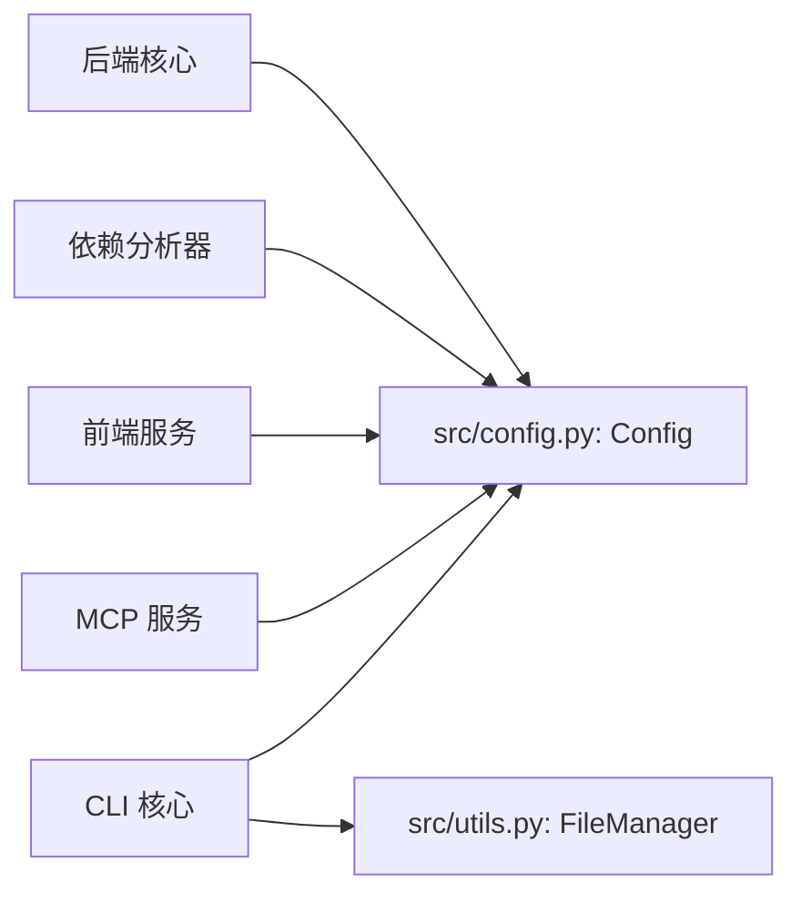

# 共享配置

## 简介

共享配置模块位于 `codewiki/src/`，提供全局配置管理和通用文件操作工具，被所有后端模块引用。

## 架构概览

## 核心组件

### Config (src/config.py)

> **文件**: `codewiki/src/config.py`

全局配置类，承载所有后端运行参数：

| 字段 | 说明 |
|------|------|
| `repo_path` | 仓库路径 |
| `output_dir` | 输出目录 |
| `dependency_graph_dir` | 依赖图中间文件目录 |
| `docs_dir` | 文档输出目录 |
| `max_depth` | 子模块递归最大深度 |
| `llm_base_url` | LLM API 地址 |
| `llm_api_key` | LLM API Key |
| `main_model` | 主模型名称 |
| `cluster_model` | 聚类模型名称 |
| `fallback_model` | fallback 模型名称 |
| `provider` | 提供商类型 |
| `aws_region` | AWS 区域（Bedrock） |
| `api_version` | API 版本（Azure） |
| `azure_deployment` | Azure 部署名 |
| `max_tokens` | LLM 最大 Token |
| `max_token_per_module` | 每模块最大 Token |
| `max_token_per_leaf_module` | 每叶模块最大 Token |
| `agent_instructions` | Agent 指令配置 |

**上下文函数**：

- `set_cli_context(flag)`：设置 CLI 运行标记
- `is_cli_context()`：检查是否在 CLI 上下文中运行

### FileManager (src/utils.py)

> **文件**: `codewiki/src/utils.py`

通用文件操作管理器，提供跨模块使用的文件读写功能。

## 模块依赖

- 被 [后端核心](后端核心.md)、[依赖分析器](依赖分析器.md)、[前端服务](前端服务.md)、[MCP 服务](MCP 服务.md)、[CLI 核心](CLI 核心.md) 共同引用
- 不依赖其他项目内部模块，保持最小依赖

## 设计要点

1. **单一配置入口**：`Config` 类统一管理所有参数，避免配置散落
2. **CLI/MCP 双模式**：通过 `is_cli_context()` 区分配置加载策略
3. **FileManager 单例**：全局文件操作工具，确保文件访问一致性