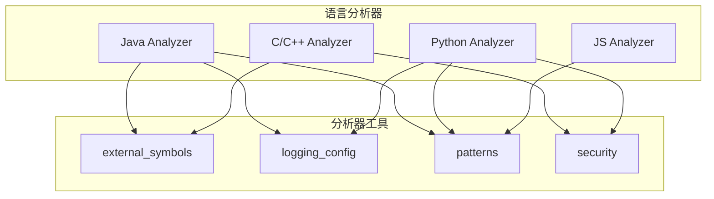
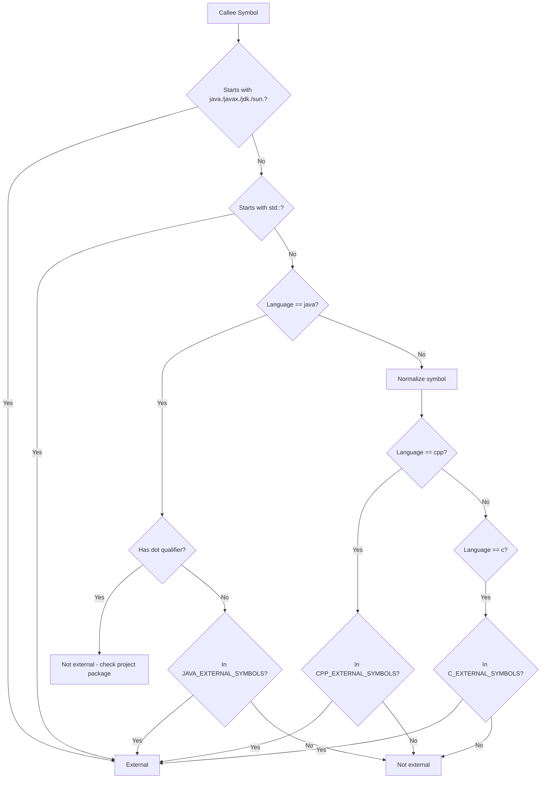
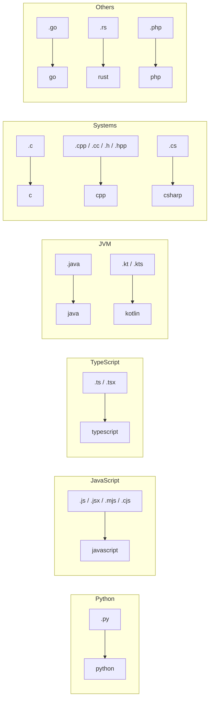
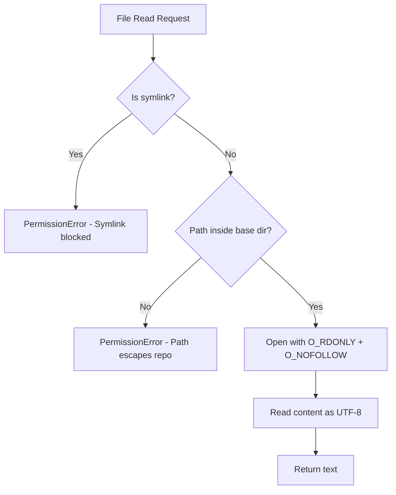

# 分析器工具

## 模块概述

分析器工具模块为 CodeWiki-CN 的依赖分析引擎提供基础支撑设施，包括外部符号识别、日志配置、代码模式匹配和安全文件访问四大功能。这些工具模块不直接参与 AST 解析或依赖图构建，而是为各语言分析器和分析服务提供横切关注点的实现，确保分析过程的正确性、安全性和可观测性。

## 核心功能

- **外部符号过滤**：识别各语言的标准库和运行时符号，避免将外部依赖误判为项目组件
- **彩色日志输出**：提供分级别彩色日志格式化，提升分析过程的可观测性
- **代码模式匹配**：定义入口点、高连接度文件、关键函数等识别模式
- **安全文件访问**：防止符号链接攻击和路径逃逸，确保仓库分析的安全性

## 架构总览

## 组件详解

### external_symbols（外部符号识别）

**源文件**：`codewiki/src/be/dependency_analyzer/utils/external_symbols.py`

该模块维护各语言的标准库符号集合，用于在调用关系解析阶段过滤外部依赖。

**核心数据结构：**

| 符号集合 | 覆盖范围 | 示例 |
|----------|----------|------|
| `C_EXTERNAL_SYMBOLS` | C 标准库函数 | printf, malloc, strlen, fopen, memcpy |
| `CPP_EXTERNAL_SYMBOLS` | C++ STL 成员 + C 标准库 | vector, string, push_back, shared_ptr, make_unique |
| `JAVA_EXTERNAL_SYMBOLS` | java.lang 类型 | String, Integer, Object, Exception, Thread |
| `JAVA_OBJECT_METHODS` | Object 继承方法 | equals, hashCode, toString, clone, wait |
| `CPP_STANDARD_HEADERS` | C++ 标准头文件 | algorithm, vector, iostream, memory |
| `NON_MACRO_UPPER` | 非宏的大写常量 | NULL, TRUE, FALSE, EOF |

**核心函数：**

| 函数 | 说明 |
|------|------|
| `is_external_symbol(language, symbol)` | 分层判断符号是否为外部符号 |
| `is_macro_name(token)` | 启发式判断是否为 C/C++ 宏名称 |
| `normalize_symbol(symbol)` | 规范化符号名，去除限定符和指针标记 |

**分层过滤策略：**

**宏名称判断规则**：匹配 `^[A-Z][A-Z0-9_]*$` 且长度≥4或含下划线，且不在 `NON_MACRO_UPPER` 集合中。宏永远不会被提取为组件，因此对宏的调用永远无法解析为项目函数。

### logging_config（彩色日志配置）

**源文件**：`codewiki/src/be/dependency_analyzer/utils/logging_config.py`

基于 colorama 的彩色日志格式化系统，为分析过程提供分级彩色输出。

**核心组件：**

**ColoredFormatter（彩色格式化器）：**

| 日志级别 | 颜色 | 用途 |
|----------|------|------|
| DEBUG | 蓝色 | 开发调试信息 |
| INFO | 青色 | 正常操作消息 |
| WARNING | 黄色 | 需要关注的警告 |
| ERROR | 红色 | 错误消息 |
| CRITICAL | 亮红色 | 严重问题 |

额外颜色：时间戳为蓝色，模块名为品红色。

**配置函数：**

| 函数 | 说明 |
|------|------|
| `setup_logging(level)` | 配置全局根日志记录器 |
| `setup_module_logging(name, level)` | 为特定模块配置独立日志记录器 |

输出格式示例：`[14:30:25] INFO     Analyzing 42 source files...`

### patterns（代码模式匹配）

**源文件**：`codewiki/src/be/dependency_analyzer/utils/patterns.py`

定义用于代码分析和文件过滤的各种模式集合。

**核心数据结构：**

| 模式集合 | 用途 | 示例 |
|----------|------|------|
| `DEFAULT_IGNORE_PATTERNS` | 默认排除的目录和文件 | node_modules, .git, __pycache__, *.class, venv |
| `DEFAULT_INCLUDE_PATTERNS` | 默认包含的文件扩展名 | *.py, *.js, *.ts, *.java, *.cpp, *.cs 等 30+ 种 |
| `CODE_EXTENSIONS` | 扩展名到语言的映射 | .py→python, .java→java, .cpp→cpp |
| `ENTRY_POINT_PATTERNS` | 入口点文件名 | main.py, index.js, server.go, app.rs |
| `HIGH_CONNECTIVITY_PATTERNS` | 高连接度文件模式 | router, controller, service, handler, middleware |
| `CRITICAL_FUNCTION_NAMES` | 关键函数名 | main, index, app, server, init, run |
| `SOURCE_DIRECTORY_PATTERNS` | 源码目录模式 | src/, lib/, core/, pkg/, cmd/ |

**工具函数：**

| 函数 | 说明 |
|------|------|
| `is_entry_point_file(filename)` | 检查是否为入口点文件 |
| `is_entry_point_path(filepath)` | 检查路径是否暗示入口点 |
| `has_high_connectivity_potential(filename, filepath)` | 评估文件的连接度潜力 |
| `is_critical_function(func_name, code_snippet)` | 判断函数是否关键 |
| `find_fallback_entry_points(code_files, max_files)` | 回退入口点查找 |
| `find_fallback_connectivity_files(code_files, max_files)` | 回退高连接度文件查找 |

**CODE_EXTENSIONS 完整映射：**

### security（安全文件访问）

**源文件**：`codewiki/src/be/dependency_analyzer/utils/security.py`

提供安全文件读取功能，防止恶意仓库通过符号链接或路径逃逸攻击。

**核心函数：**

| 函数 | 说明 |
|------|------|
| `_inside(base, target)` | 检查目标路径是否在基准目录内 |
| `assert_safe_path(base_dir, target)` | 验证路径安全性，拒绝符号链接和逃逸路径 |
| `safe_open_text(base_dir, target, encoding)` | 安全读取文本文件，使用 O_NOFOLLOW 标志 |

**安全策略：**

**防护层次：**
1. **符号链接拒绝**：`is_symlink()` 检查阻止任何形式的符号链接
2. **路径逃逸检测**：`resolve().is_relative_to()` 确保解析后的路径仍在仓库目录内
3. **系统级防护**：使用 `O_NOFOLLOW` 标志在系统调用层阻止符号链接跟随
4. **编码容错**：使用 `errors="replace"` 处理非 UTF-8 编码文件

## 与其他模块的关系

- [分析服务](分析服务.md)：AnalysisService 使用 security 模块安全读取文件，使用 patterns 模块的扩展名映射
- [语言分析器](语言分析器.md)：各语言分析器通过 external_symbols 过滤外部依赖，通过 patterns 获取语言配置
- [数据模型与算法](数据模型与算法.md)：图算法中使用 external_symbols 判断未解析的 callee 是否为外部依赖
- [共享基础设施](共享基础设施.md)：logging_config 提供全局日志配置，Config 使用 patterns 中的默认模式

## 设计要点

1. **分层外部符号过滤**：从命名空间前缀规则到具体符号集合，逐层缩小判断范围
2. **零依赖安全**：security 模块仅使用 Python 标准库，不引入额外依赖
3. **模式集合化**：将入口点、高连接度文件等识别规则集中管理，便于扩展和维护
4. **跨平台日志**：使用 colorama 的 autoreset 确保 Windows/macOS/Linux 上颜色输出一致
5. **防御性编程**：安全模块的每一层都是独立的防线，即使一层被绕过，后续层仍然生效