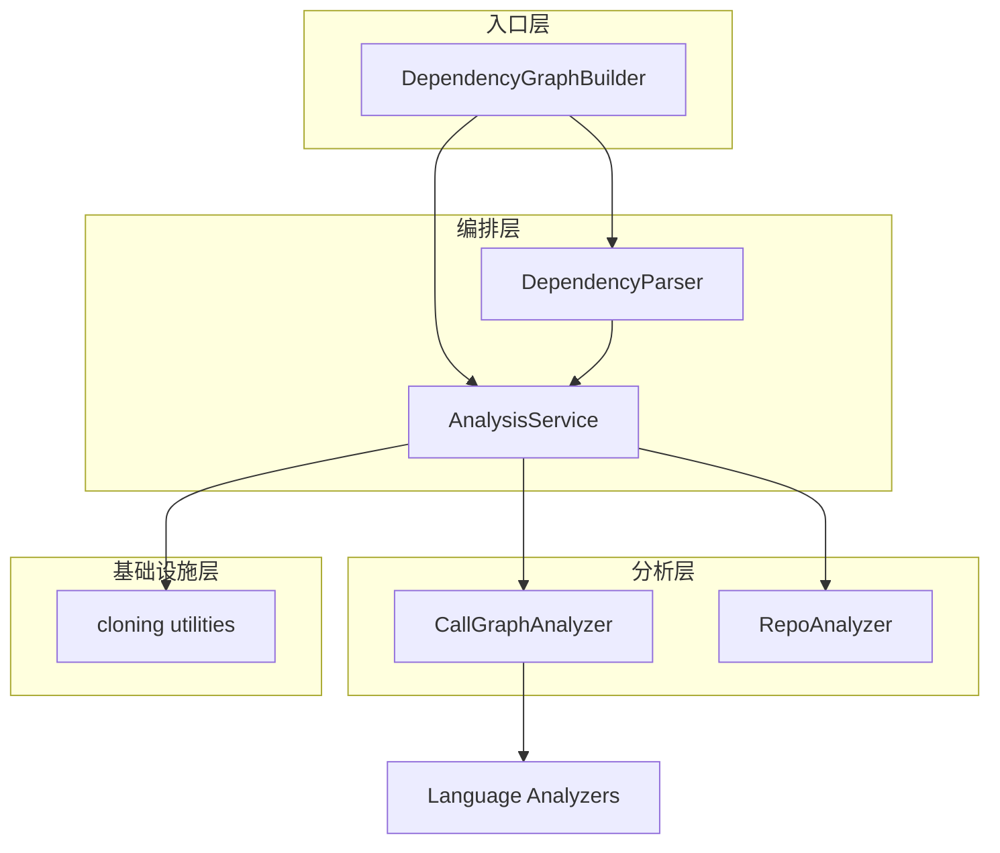
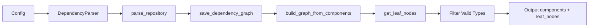
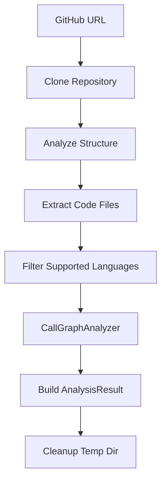
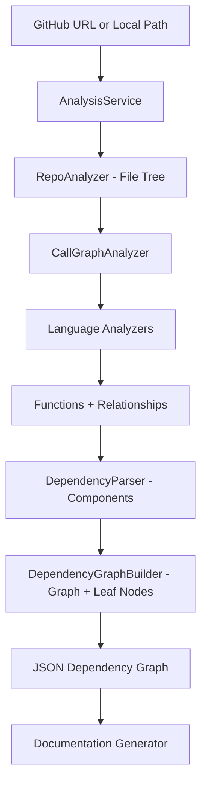

# 分析服务

## 模块概述

分析服务（Analysis Service）是 CodeWiki-CN 依赖分析引擎的核心编排层，负责将源代码仓库转化为结构化的依赖图数据。该模块协调文件结构扫描、多语言 AST 解析、调用图构建、仓库克隆等多个子流程，为后续的文档生成提供完整的代码组件与依赖关系数据。

## 核心功能

- **仓库克隆与清理**：从 GitHub 克隆仓库到临时目录，分析完成后自动清理
- **文件结构分析**：递归遍历仓库目录树，按包含/排除模式过滤代码文件
- **多语言调用图分析**：协调各语言分析器（Python、Java、JavaScript 等），提取函数/类定义与调用关系
- **依赖图构建**：将分析结果转化为组件字典与依赖图，输出叶子节点供文档生成使用
- **结果持久化**：将依赖图序列化为 JSON 文件，供后续流程使用

## 架构总览

## 组件详解

### DependencyParser（AST 依赖解析器）

**源文件**：`codewiki/src/be/dependency_analyzer/ast_parser.py`

DependencyParser 是依赖分析的顶层入口，负责将仓库路径转化为结构化的组件字典。

**核心职责：**
- 接收仓库路径与可选的包含/排除模式
- 调用 AnalysisService 完成文件结构分析和调用图分析
- 将分析结果转化为 `Node` 对象字典，建立组件 ID 映射
- 处理调用关系，将 caller-callee 映射到组件的 `depends_on` 集合
- 将依赖图序列化为 JSON 文件

**关键方法：**
| 方法 | 说明 |
|------|------|
| `parse_repository()` | 解析仓库，返回组件字典 |
| `_build_components_from_analysis()` | 从分析结果构建组件与关系 |
| `save_dependency_graph()` | 保存依赖图为 JSON |

**组件 ID 格式**：采用 `相对路径::名称` 格式，例如 `src/main.py::MyClass.method`。对于类成员，ID 包含类名前缀。

### DependencyGraphBuilder（依赖图构建器）

**源文件**：`codewiki/src/be/dependency_analyzer/dependency_graphs_builder.py`

DependencyGraphBuilder 是面向文档生成流程的高层接口，封装了从解析到输出叶子节点的完整流程。

**核心职责：**
- 创建 DependencyParser 实例并执行仓库解析
- 调用 `build_graph_from_components` 和 `get_leaf_nodes` 构建可遍历的依赖图
- 过滤叶子节点：仅保留 class/interface/struct 类型（C 项目回退到 function 类型）
- 排除无效标识符（含 error/exception 等关键词的条目）

**工作流程：**

### AnalysisService（分析服务）

**源文件**：`codewiki/src/be/dependency_analyzer/analysis/analysis_service.py`

AnalysisService 是整个分析流程的中枢调度器，支持多种分析模式和多语言处理。

**核心职责：**
- **完整分析** (`analyze_repository_full`)：克隆 → 结构分析 → 调用图分析 → 返回 AnalysisResult
- **结构分析** (`analyze_repository_structure_only`)：轻量级文件结构扫描
- **本地分析** (`analyze_local_repository`)：分析本地目录，支持语言过滤和文件数量限制
- 管理临时目录生命周期，确保异常时也能清理

**支持的语言**：Python、JavaScript、TypeScript、Java、C#、C、C++、PHP、Kotlin

**分析流程：**

### CallGraphAnalyzer（调用图分析器）

**源文件**：`codewiki/src/be/dependency_analyzer/analysis/call_graph_analyzer.py`

CallGraphAnalyzer 是多语言调用图分析的核心执行器，负责逐文件解析和跨语言关系解析。

**核心职责：**
- 从文件树中提取代码文件（基于扩展名映射）
- 路由 `.h` 头文件到 C 或 C++ 分析器（基于内容启发式判断）
- 按语言分派到对应分析器（Python AST、Tree-sitter 系列）
- 解析跨文件调用关系：精确匹配、简单名匹配、Java 包推断
- 去重和过滤外部符号（标准库、JDK 类型等）
- 生成 Cytoscape.js 兼容的可视化数据

**调用关系解析策略：**
1. 精确匹配：component_id、qualified_name、name
2. `::` 分隔符后缀匹配
3. `.` 分隔符尾部匹配
4. Java 同包推断：为未限定的方法名添加当前包前缀
5. 简单名兜底匹配

**超时保护**：每个文件分析设置 30 秒超时。

### RepoAnalyzer（仓库结构分析器）

**源文件**：`codewiki/src/be/dependency_analyzer/analysis/repo_analyzer.py`

RepoAnalyzer 负责仓库文件结构的递归扫描和过滤。

**核心职责：**
- 递归构建文件树（包含文件路径、扩展名、大小等元数据）
- 基于 `include_patterns` 过滤文件类型（默认支持 30+ 种扩展名）
- 基于 `exclude_patterns` 排除目录和文件（默认排除 node_modules、.git、__pycache__ 等）
- 安全防护：拒绝符号链接，阻止路径逃逸
- 统计文件总数和总大小

### Cloning Utilities（克隆工具集）

**源文件**：`codewiki/src/be/dependency_analyzer/analysis/cloning.py`

提供 GitHub 仓库克隆和清理的工具函数。

**核心函数：**
| 函数 | 说明 |
|------|------|
| `sanitize_github_url()` | 规范化 GitHub URL，提取 owner/repo |
| `clone_repository()` | 浅克隆仓库到临时目录，支持 Windows longpaths |
| `cleanup_repository_safe()` | Windows 安全的目录删除，处理只读文件 |
| `parse_github_url()` | 从 URL 提取 owner、name 等元数据 |

**克隆策略**：使用 `--depth 1 --filter=blob:none` 进行浅克隆，超时 5 分钟。Windows 环境下额外配置 sparse checkout 过滤特定大型目录。

## 数据流

## 与其他模块的关系

- [语言分析器](语言分析器.md)：CallGraphAnalyzer 按语言分派到各语言分析器
- [数据模型与算法](数据模型与算法.md)：使用 Node、CallRelationship、AnalysisResult 等数据模型，依赖拓扑排序算法
- [分析器工具](分析器工具.md)：使用 external_symbols 过滤外部符号，使用 security 进行安全文件读取，使用 patterns 定义的扩展名和忽略模式
- [共享基础设施](共享基础设施.md)：使用 Config 获取仓库路径和输出目录配置，使用 FileManager 进行 JSON 持久化
- [Web 前端服务](Web 前端服务.md)：Web 后台任务调用 AnalysisService 进行仓库分析

## 设计要点

1. **分层架构**：从高层的 DependencyGraphBuilder 到底层的语言分析器，职责逐层细化
2. **多语言透明**：CallGraphAnalyzer 通过语言路由实现对调用方的透明多语言支持
3. **安全优先**：符号链接拒绝、路径逃逸检测、超时保护
4. **资源管理**：临时目录自动追踪与清理，析构函数兜底清理
5. **容错设计**：单文件分析失败不影响整体流程，无效标识符自动过滤