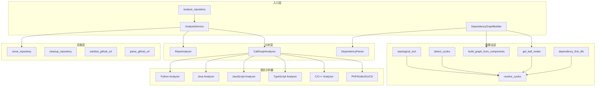

# 分析服务与图算法

## 模块概述

分析服务与图算法模块是 CodeWiki-CN 依赖分析引擎的核心服务层，负责调度语言分析器、构建依赖图并执行拓扑排序。该模块将底层的 [语言分析器](语言分析器.md) 输出汇聚为完整的仓库调用图，并通过图算法（环检测、拓扑排序、叶子节点发现）为文档生成流程提供有序的组件遍历序列。模块横跨 6 个源文件，包含 24 个组件，是连接代码解析与文档产出的中枢管线。

## 核心功能

- **仓库分析调度**：AnalysisService 统一编排克隆、结构分析、多语言 AST 解析和结果汇总的完整流程
- **跨文件调用图构建**：CallGraphAnalyzer 协调 10 种语言分析器，解析跨文件调用关系并生成可视化数据
- **仓库克隆与清理**：安全的 Git 浅克隆、URL 消毒、跨平台目录清理
- **仓库结构分析**：RepoAnalyzer 构建文件树，支持 include/exclude 模式过滤
- **拓扑排序与环处理**：基于 Tarjan 算法的强连通分量检测、环消解、Kahn 拓扑排序、DFS 依赖优先遍历
- **依赖图构建与持久化**：DependencyGraphBuilder 串联解析、图构建、叶子节点筛选的端到端流程

## 架构总览



## AnalysisService -- 分析调度入口

**源文件**：`codewiki/src/be/dependency_analyzer/analysis/analysis_service.py`

AnalysisService 是仓库分析的中央调度器，编排从克隆到结果产出的完整分析管线。该类对外暴露三种分析模式，满足不同场景的需求。

### 分析模式

| 方法 | 分析深度 | 输入 | 输出 |
|------|---------|------|------|
| `analyze_repository_full` | 完整分析（克隆+结构+调用图） | GitHub URL | `AnalysisResult` |
| `analyze_repository_structure_only` | 轻量结构分析（仅文件树） | GitHub URL | `Dict` |
| `analyze_local_repository` | 本地目录分析 | 本地路径 | `Dict` |

### 完整分析流程

`analyze_repository_full` 方法执行以下步骤：

1. **仓库克隆**：调用 `clone_repository` 将 GitHub 仓库浅克隆到临时目录
2. **URL 解析**：通过 `parse_github_url` 提取 owner/name 元数据
3. **结构分析**：使用 `RepoAnalyzer` 构建文件树，应用 include/exclude 过滤
4. **调用图分析**：通过 `CallGraphAnalyzer` 提取代码文件并执行多语言 AST 解析
5. **README 读取**：使用安全路径校验读取 README 文件
6. **结果组装**：将各阶段结果封装为 `AnalysisResult` 模型
7. **清理**：删除临时克隆目录

### 语言支持

AnalysisService 内置语言过滤机制，支持以下 11 种编程语言：

- Python, JavaScript, TypeScript
- Java, Kotlin
- C, C++, C#
- PHP, Go, Rust（声明但尚未完全实现）

`_filter_supported_languages` 方法从文件列表中筛选受支持的语言，`_get_supported_languages` 返回当前活跃的语言列表。不在支持集合中的文件会被静默跳过。

### 向后兼容接口

模块提供两个模块级函数以保持向后兼容：

- `analyze_repository(github_url, ...)` -- 返回 `(AnalysisResult, None)` 元组
- `analyze_repository_structure_only(github_url, ...)` -- 返回 `(Dict, None)` 元组

第二个元素始终为 `None`，因为临时目录的清理由 AnalysisService 内部管理。

### 资源管理

AnalysisService 通过 `_temp_directories` 列表跟踪所有克隆的临时目录。`cleanup_all` 方法批量清理所有跟踪的目录，`__del__` 析构函数确保在服务销毁时执行清理。

## CallGraphAnalyzer -- 跨文件调用关系分析

**源文件**：`codewiki/src/be/dependency_analyzer/analysis/call_graph_analyzer.py`

CallGraphAnalyzer 是多语言调用图分析的核心协调器，负责将各语言分析器的输出汇聚为统一的调用图。

### 分析流程

`analyze_code_files` 方法是分析的主入口，执行以下步骤：

1. **头文件路由**：通过 `_route_contextual_headers` 将 `.h` 文件智能路由到 C 或 C++ 分析器
2. **逐文件解析**：遍历所有代码文件，根据语言分发到对应的分析器方法
3. **关系解析**：调用 `_resolve_call_relationships` 跨文件解析函数调用目标
4. **去重**：通过 `_deduplicate_relationships` 消除重复的 caller-callee 对
5. **可视化数据生成**：生成 Cytoscape.js 兼容的图渲染数据

### 超时保护机制

每个文件的分析都受 30 秒超时保护，基于 Unix `signal.SIGALRM` 实现：

```python
@contextmanager
def timeout(seconds):
    def signal_handler(signum, frame):
        raise TimeoutError(f"File parsing exceeded {seconds}s timeout")
    old_handler = signal.signal(signal.SIGALRM, signal_handler)
    signal.alarm(seconds)
    yield
    signal.alarm(0)
    signal.signal(signal.SIGALRM, old_handler)
```

该机制在 Windows 上自动降级（Windows 不支持 SIGALRM），通过 `AttributeError` 捕获实现跨平台兼容。

### C/C++ 头文件路由

`_route_contextual_headers` 方法解决 `.h` 文件的语言歧义问题：

- **C++ 信号检测**：扫描头文件内容，检测 `namespace`、`class`、`template`、`typename`、访问修饰符、`::` 作用域运算符、C++ 标准头文件引用
- **仓库上下文推断**：若仓库中存在 `.cpp/.cc/.cxx` 文件但无 `.c` 文件，将所有 `.h` 路由到 C++ 分析器
- **默认行为**：在混合 C/C++ 仓库中，无 C++ 信号的 `.h` 文件保持 C 语言路由

### 调用关系解析

`_resolve_call_relationships` 方法通过多层索引策略解析跨文件调用：

1. **索引构建**（`_build_resolution_indexes`）：为所有函数构建 exact 索引（按 id、component_id、qualified_name、name）和 simple 索引（按简单名、尾部名）
2. **多级匹配**（`_resolve_callee`）：优先精确匹配，然后尝试 `::` 分隔符后缀匹配、`.` 分隔符匹配、Java 同包匹配，最后回退到 simple 索引匹配
3. **唯一性约束**：只有恰好一个候选的匹配才会被采纳（`_unique_match`），避免歧义解析
4. **外部符号过滤**（`_is_external_callee`）：通过 `is_external_symbol` 识别标准库调用，通过全大写命名规则识别 C/C++ 宏，通过 Java 包名前缀匹配识别第三方依赖

### 语言分析器分发

CallGraphAnalyzer 为每种语言提供专门的分析方法，通过延迟导入加载对应的分析器模块：

| 方法 | 语言 | 导入路径 |
|------|------|----------|
| `_analyze_python_file` | Python | `analyzers.python` |
| `_analyze_javascript_file` | JavaScript | `analyzers.javascript` |
| `_analyze_typescript_file` | TypeScript | `analyzers.typescript` |
| `_analyze_java_file` | Java | `analyzers.java` |
| `_analyze_kotlin_file` | Kotlin | `analyzers.kotlin` |
| `_analyze_csharp_file` | C# | `analyzers.csharp` |
| `_analyze_c_file` | C | `analyzers.c` |
| `_analyze_cpp_file` | C++ | `analyzers.cpp` |
| `_analyze_php_file` | PHP | `analyzers.php` |
| `_analyze_go_file` | Go | `analyzers.go` |

### 可视化数据

`_generate_visualization_data` 生成 Cytoscape.js 兼容的图数据，包含：

- **节点**：每个函数/方法生成一个节点，附带语言类型 CSS 类（`lang-python`、`lang-javascript` 等）和节点类型类（`node-method`、`node-function`）
- **边**：仅包含已解析（`is_resolved=True`）的调用关系
- **摘要**：总节点数、总边数、未解析调用数

## 仓库克隆与清理

**源文件**：`codewiki/src/be/dependency_analyzer/analysis/cloning.py`

cloning 模块提供 Git 仓库的克隆、URL 处理和目录清理功能。

### URL 消毒（sanitize_github_url）

`sanitize_github_url` 函数将各种格式的 GitHub URL 规范化为标准格式：

- 去除 `https://`、`http://`、`www.` 前缀
- 提取 `owner/repo` 部分，丢弃多余路径组件
- 去除 `.git` 后缀
- 重新拼接为 `https://github.com/{owner}/{repo}`

### 仓库克隆（clone_repository）

`clone_repository` 使用 Git 浅克隆策略将仓库克隆到临时目录：

- **克隆参数**：`--depth 1 --filter=blob:none`，仅获取最新提交，跳过 blob 对象
- **超时控制**：300 秒（5 分钟）超时保护
- **Windows 适配**：在 Windows 系统上启用 `core.longpaths` 和稀疏检出，规避路径长度限制
- **错误处理**：对超时、克隆失败、Git 未安装等场景分别抛出 `RuntimeError`，并在失败时自动清理临时目录

### 目录清理（cleanup_repository / cleanup_repository_safe）

`cleanup_repository_safe` 处理跨平台目录删除，特别是 Windows 上的只读文件问题：

- 首次尝试使用 `shutil.rmtree`，Windows 上注册 `handle_remove_readonly` 回调
- 若因 `PermissionError` 失败，等待 1 秒后重试：遍历目录修改所有文件和子目录的权限为可写，然后重新删除
- `cleanup_repository` 是向后兼容的包装函数

### URL 解析（parse_github_url）

`parse_github_url` 从 GitHub URL 中提取 owner 和 repo 名称，返回包含 `owner`、`name`、`full_name`、`url` 的字典。

## RepoAnalyzer -- 仓库结构分析

**源文件**：`codewiki/src/be/dependency_analyzer/analysis/repo_analyzer.py`

RepoAnalyzer 负责分析仓库的文件结构，生成详细的文件树表示，并支持灵活的模式过滤。

### 文件树构建

`analyze_repository_structure` 方法调用 `_build_file_tree` 递归遍历仓库目录，生成嵌套的字典结构。每个节点包含：

- **文件节点**：`type`（file）、`name`、`path`（相对路径）、`extension`、`_size_bytes`
- **目录节点**：`type`（directory）、`name`、`path`、`children`

### 安全防护

文件树构建过程中实施了严格的安全检查：

- **符号链接拒绝**：`path.is_symlink()` 检测并跳过所有符号链接
- **路径逃逸检测**：通过 `path.resolve().is_relative_to(base_path.resolve())` 确保所有路径都在仓库根目录内，防止符号链接指向外部

### 模式过滤

RepoAnalyzer 支持两层过滤机制：

- **exclude_patterns**（排除模式）：用户指定的模式与 `DEFAULT_IGNORE_PATTERNS` 合并，排除匹配的目录和文件
- **include_patterns**（包含模式）：若指定则替换 `DEFAULT_INCLUDE_PATTERNS`，仅包含匹配的文件

排除匹配逻辑支持四种匹配策略：`fnmatch` 通配符匹配、前缀目录匹配、精确路径匹配、路径组件匹配。

### 统计信息

`_count_files` 递归统计文件总数，`_calculate_size` 递归计算总大小（KB），两个方法都通过遍历文件树实现。

## 拓扑排序与图算法

**源文件**：`codewiki/src/be/dependency_analyzer/topo_sort.py`

topo_sort 模块提供依赖图上的核心算法，包括环检测、环消解、拓扑排序和叶子节点发现。

### detect_cycles -- Tarjan 强连通分量检测

`detect_cycles` 使用 Tarjan 算法在 O(V+E) 时间内找到有向图中的所有强连通分量（SCC）：

- 为每个节点维护 `index`（深度索引）和 `lowlink`（最低可达索引）
- 使用栈跟踪当前路径上的节点（`onstack` 集合）
- 当 `lowlink[node] == index[node]` 时，该节点是一个 SCC 的根节点，弹出栈中所有属于该 SCC 的节点
- 仅返回包含 2 个及以上节点的 SCC（即真正的循环依赖）

### resolve_cycles -- 环消解

`resolve_cycles` 在检测到 SCC 后，通过移除环中最弱的一条边来打破循环：

- 对每个 SCC，遍历环中的边，移除第一条找到的依赖边
- 返回新的无环图（`new_graph`），不修改原始图
- 若无环则直接返回原图

### topological_sort -- Kahn 拓扑排序

`topological_sort` 使用基于入度的 Kahn 算法对无环图进行排序：

1. 先调用 `resolve_cycles` 确保图无环
2. 计算每个节点的入度
3. 将入度为 0 的节点加入队列
4. 依次出队并减少后继节点的入度，入度降为 0 时入队
5. 反转结果使依赖项排在前面（dependencies first）
6. 若排序失败（存在未消解的环），回退为任意顺序

### dependency_first_dfs -- DFS 依赖优先遍历

`dependency_first_dfs` 提供基于深度优先搜索的依赖优先遍历：

- 找到所有根节点（无入边的节点）
- 从根节点开始 DFS，先递归访问所有依赖，再将当前节点加入结果
- 若存在未访问节点，补充遍历
- 结果保证依赖项在被依赖项之前出现

### build_graph_from_components -- 图构建

`build_graph_from_components` 从组件字典构建邻接表表示的依赖图：

- 输入：`Dict[str, Component]`，每个组件有 `depends_on` 属性
- 输出：`Dict[str, Set[str]]`，自然依赖方向（A 依赖 B 则有边 A -> B）
- 仅包含存在于组件集合中的依赖（过滤外部依赖）

### get_leaf_nodes -- 叶子节点发现

`get_leaf_nodes` 识别图中不被其他节点依赖的叶子节点：

- 先通过 `resolve_cycles` 确保无环
- 初始叶子节点集合为所有节点
- 遍历所有节点的依赖，将被依赖的节点从叶子集合中移除
- 通过 `concise_node` 内部函数过滤叶子节点类型：仅保留 class/interface/struct 类型，对于纯 C 项目额外保留 function 类型
- 将 `__init__` 节点替换为其所属类名
- 过滤包含 error/exception/failed/invalid 等错误标识的节点
- 若叶子节点超过 400 个，进一步移除被其他节点依赖的节点

## DependencyGraphBuilder -- 依赖图构建与持久化

**源文件**：`codewiki/src/be/dependency_analyzer/dependency_graphs_builder.py`

DependencyGraphBuilder 是依赖图构建的端到端入口，串联解析、图构建和叶子节点筛选。

### build_dependency_graph 方法

该方法是文档生成流程的关键入口，执行以下步骤：

1. **输出目录准备**：确保 `dependency_graphDir` 目录存在
2. **路径计算**：基于仓库名生成依赖图和过滤目录的 JSON 文件路径（仓库名中的非字母数字字符替换为下划线）
3. **模式配置**：从 `Config` 对象读取 include/exclude 模式
4. **仓库解析**：创建 `DependencyParser` 实例，调用 `parse_repository` 提取所有代码组件
5. **图持久化**：调用 `parser.save_dependency_graph` 将依赖图保存为 JSON 文件
6. **图构建**：调用 `build_graph_from_components` 构建邻接表
7. **叶子节点筛选**：调用 `get_leaf_nodes` 获取叶子节点，并执行二次过滤

### 叶子节点二次过滤

DependencyGraphBuilder 对 `get_leaf_nodes` 的结果进行额外的类型过滤：

- 有效类型集合：`class`、`interface`、`struct`
- 对于无类/接口/结构体的项目（如纯 C 项目），自动扩展为包含 `function` 类型
- 过滤包含错误标识符（error、exception、failed、invalid）的节点
- 验证每个叶子节点确实存在于组件字典中

### 返回值

返回 `(components, leaf_nodes)` 元组：

- `components`：`Dict[str, Node]`，所有代码组件的字典
- `leaf_nodes`：`List[str]`，经过类型过滤的叶子节点 ID 列表

## 组件清单

| 组件 | 类型 | 源文件 |
|------|------|--------|
| AnalysisService | class | analysis_service.py |
| analyze_repository | function | analysis_service.py |
| analyze_repository_structure_only | function | analysis_service.py |
| CallGraphAnalyzer | class | call_graph_analyzer.py |
| timeout | contextmanager | call_graph_analyzer.py |
| TimeoutError | exception | call_graph_analyzer.py |
| clone_repository | function | cloning.py |
| cleanup_repository | function | cloning.py |
| cleanup_repository_safe | function | cloning.py |
| sanitize_github_url | function | cloning.py |
| parse_github_url | function | cloning.py |
| RepoAnalyzer | class | repo_analyzer.py |
| topological_sort | function | topo_sort.py |
| detect_cycles | function | topo_sort.py |
| resolve_cycles | function | topo_sort.py |
| dependency_first_dfs | function | topo_sort.py |
| build_graph_from_components | function | topo_sort.py |
| get_leaf_nodes | function | topo_sort.py |
| DependencyGraphBuilder | class | dependency_graphs_builder.py |

## 数据流与交叉引用

分析管线的完整数据流如下：

1. **输入**：GitHub URL 或本地仓库路径
2. **克隆与结构分析**：cloning 模块完成仓库获取，RepoAnalyzer 构建文件树
3. **代码解析**：CallGraphAnalyzer 调度 [语言分析器](语言分析器.md) 提取函数和调用关系
4. **图构建**：DependencyGraphBuilder 通过 DependencyParser（参见 [数据模型与工具](数据模型与工具.md)）构建组件字典
5. **图算法**：topo_sort 模块执行环检测和拓扑排序，产出有序遍历序列
6. **输出**：AnalysisResult 模型（参见 [数据模型与工具](数据模型与工具.md)）或组件+叶子节点元组，供 [MCP 代码分析工具](MCP 代码分析工具.md) 消费

## 关键设计决策

- **浅克隆策略**：使用 `--depth 1 --filter=blob:none` 最小化克隆体积和耗时，适合分析场景
- **信号超时而非线程超时**：使用 `signal.SIGALRM` 而非 `threading.Timer`，避免线程泄漏，但牺牲了 Windows 上的超时能力
- **唯一匹配原则**：调用关系解析仅在恰好一个候选时采纳匹配，宁可保持未解析也不做歧义推断
- **延迟导入**：语言分析器通过函数内 `import` 加载，避免启动时加载所有分析器模块
- **叶子节点数量控制**：当叶子节点超过 400 个时自动降级为更严格的筛选策略，防止文档生成过载


<!-- crosslinks (auto-generated) -->
## Related Modules
- Depends on: [CLI 工具库](cli_工具库.md), [MCP 知识管理工具](mcp_知识管理工具.md), [数据模型与工具](数据模型与工具.md), [语言分析器](语言分析器.md)
- Used by: [LLM 后端与服务](llm_后端与服务.md), [MCP 代码分析工具](mcp_代码分析工具.md), [MCP 知识管理工具](mcp_知识管理工具.md), [Web 前端服务](web_前端服务.md), [数据模型与工具](数据模型与工具.md)
