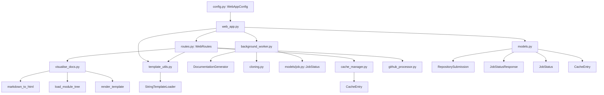
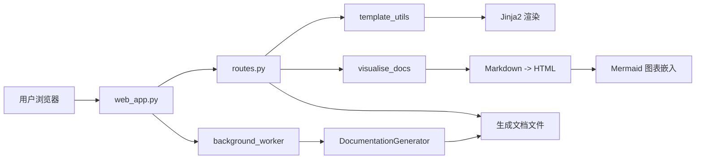

# 前端服务

## 简介

前端服务模块位于 `codewiki/src/fe/`，提供 Web 应用接口和文档可视化能力。包含 FastAPI Web 服务、路由管理、模板渲染、文档可视化、缓存管理、后台任务处理和 GitHub 仓库处理。

## 架构概览

## 核心组件

### web_app.py — Web 入口

| 端点 | 说明 |
|------|------|
| `index_get()` | GET / — 渲染主页（递归渲染，显示作业列表） |
| `index_post()` | POST / — 提交仓库生成任务（递归渲染） |
| `get_job_status()` | GET /status/{job_id} — 查询作业状态（递归） |
| `view_docs()` | GET /docs/{job_id} — 查看生成的文档 |
| `serve_generated_docs()` | GET /docs/{job_id}/{path} — 提供生成文档文件 |
| `main()` | 启动 uvicorn Web 服务 |

### routes.py — WebRoutes

Web 路由管理器，整合所有端点逻辑。使用 `render_template` 渲染 HTML，调用 `markdown_to_html` 转换文档，通过 `get_file_title` 获取页面标题。

### models.py — Web 数据模型

| 模型 | 说明 |
|------|------|
| `RepositorySubmission` | 仓库提交请求模型（URL/路径） |
| `JobStatusResponse` | 作业状态响应模型 |
| `JobStatus` | Web 层作业状态枚举 |
| `CacheEntry` | 缓存条目模型（数据 + 时间戳） |

### background_worker.py — 后台任务

`BackgroundWorker` 在后台异步执行文档生成：克隆 GitHub 仓库（`clone_repository`）→ 调用 `DocumentationGenerator` → 更新作业状态。

### cache_manager.py — 缓存管理

`CacheManager` 管理文档生成结果缓存，使用 `CacheEntry` 模型存储缓存数据及过期时间。

### github_processor.py — GitHub 处理

`GitHubRepoProcessor` 处理 GitHub 仓库 URL 解析和下载。

### config.py — Web 配置

`WebAppConfig` 管理 Web 应用配置（端口、host、模板路径等）。

### template_utils.py — 模板渲染

| 组件 | 说明 |
|------|------|
| `StringTemplateLoader` | 自定义 Jinja2 模板加载器，支持字符串模板 |
| `render_template(template_name, context)` | 渲染指定模板 |
| `render_navigation(module_tree)` | 渲染模块导航 |
| `render_job_list(jobs)` | 渲染作业列表 |

### visualise_docs.py — 文档可视化

| 组件 | 说明 |
|------|------|
| `load_module_tree()` | 加载 `module_tree.json` |
| `initialize_globals()` | 初始化全局变量（加载模块树） |
| `markdown_to_html(md_content)` | Markdown 转 HTML |
| `replace_mermaid(match)` | Mermaid 代码块替换为 HTML div |
| `get_file_title(filename)` | 从文件名提取文档标题 |
| `index()` | 文档索引页渲染 |
| `serve_doc(filename)` | 单个文档页渲染 |
| `main()` | 启动文档可视化 Web 服务器 |

## 数据流

## 模块依赖

- **上游**: [后端核心](后端核心.md)（DocumentationGenerator）、[依赖分析器](依赖分析器.md)（cloning）、[CLI 核心](CLI 核心.md)（models/job）
- **共享**: [共享配置](共享配置.md)（WebAppConfig）

## 关键设计

1. **Jinja2 模板引擎**：`StringTemplateLoader` 支持内联模板，无需外部模板文件
2. **Mermaid 客户端渲染**：文档可视化使用 CDN 加载 Mermaid.js，在浏览器端渲染图表
3. **后台任务队列**：`BackgroundWorker` 异步执行文档生成，Web 服务即时响应
4. **缓存机制**：`CacheManager` 缓存已生成的文档，避免重复生成