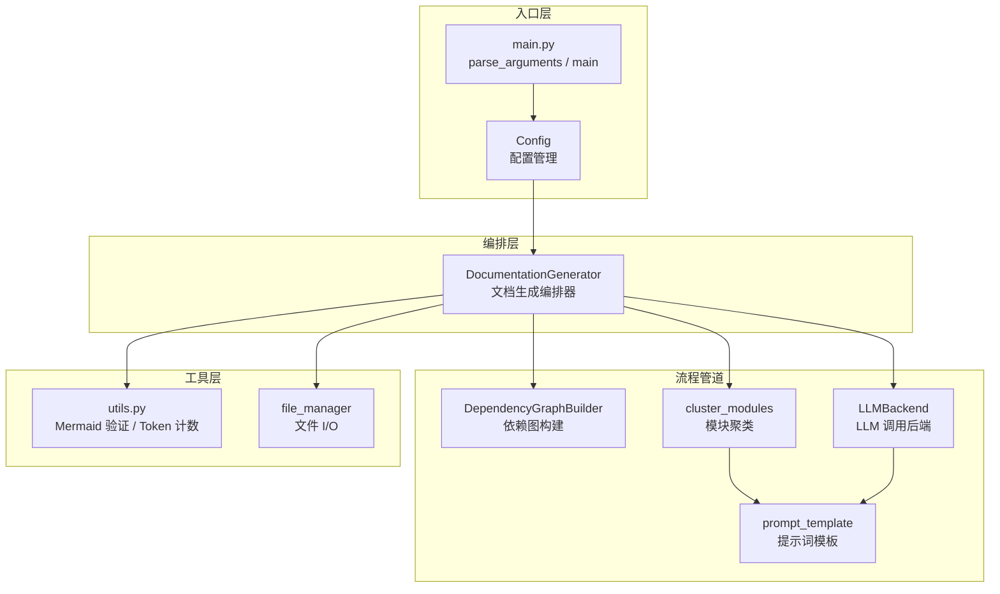
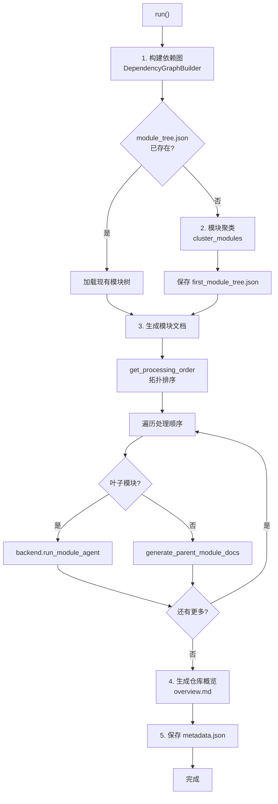
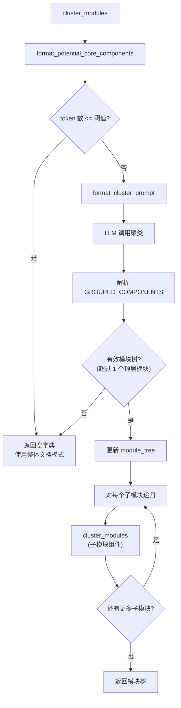
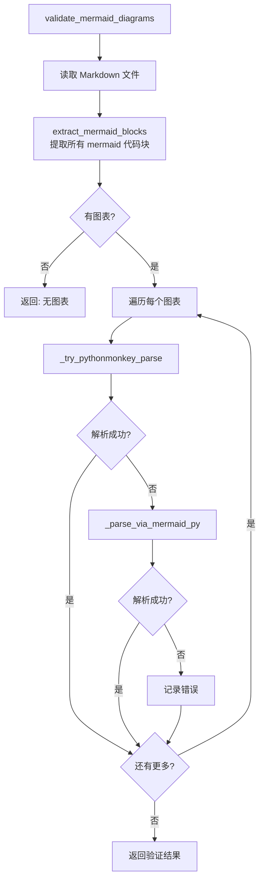
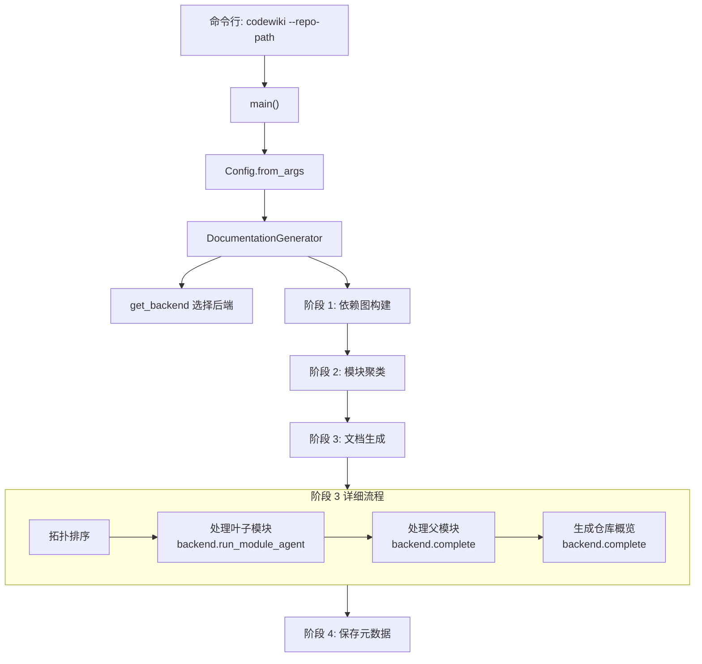

# 后端工具与流程

## 模块概述

后端工具与流程模块是 CodeWiki-CN 的顶层编排层，负责协调从代码分析到文档输出的完整工作流。该模块以 `DocumentationGenerator` 为核心编排器，以 `main.py` 为入口点，结合提示词模板、模块聚类算法和实用工具函数，实现端到端的自动化文档生成。

### 核心功能

- **入口与配置**：`main.py` 解析命令行参数，创建 `Config` 并启动文档生成流程
- **流程编排**：`DocumentationGenerator` 协调依赖图构建、模块聚类、文档生成和概览生成
- **提示词模板**：提供系统提示、用户提示、聚类提示和概览提示的模板与格式化函数
- **模块聚类**：`cluster_modules` 使用 LLM 将代码组件智能分组为层次化模块树
- **实用工具**：Mermaid 图表验证、token 计数、复杂度判断等辅助函数

## 架构总览



## 组件详解

### 1. main.py — 入口点

`main.py` 是 CodeWiki-CN 的命令行入口，负责参数解析和流程启动。

**文件路径**: `codewiki/src/be/main.py`

```python
def parse_arguments() -> argparse.Namespace:
    """解析命令行参数。"""
    parser = argparse.ArgumentParser(
        description='Generate comprehensive documentation '
                    'for Python components in dependency order.'
    )
    parser.add_argument(
        '--repo-path', type=str, required=True,
        help='Path to the repository'
    )
    return parser.parse_args()

async def main() -> None:
    """主入口点。"""
    try:
        args = parse_arguments()
        config = Config.from_args(args)
        doc_generator = DocumentationGenerator(config)
        await doc_generator.run()
    except KeyboardInterrupt:
        logger.debug("Documentation generation interrupted")
    except Exception as e:
        logger.error(f"Unexpected error: {str(e)}")
        raise
```

**执行入口**：`python -m codewiki.src.be.main --repo-path /path/to/repo`

### 2. DocumentationGenerator — 文档生成编排器

`DocumentationGenerator` 是整个 CodeWiki-CN 系统的核心控制器，负责协调文档生成的全部流程。

**文件路径**: `codewiki/src/be/documentation_generator.py`

```python
class DocumentationGenerator:
    """主文档生成编排器。"""

    def __init__(self, config: Config, commit_id: str = None,
                 backend: LLMBackend = None):
        self.config = config
        self.commit_id = commit_id
        self.graph_builder = DependencyGraphBuilder(config)
        self.backend = backend or get_backend(config)
```

#### 完整运行流程



#### run() 方法详解

```python
async def run(self) -> None:
    """运行完整的文档生成流程。"""
    # 阶段 1: 构建依赖图
    components, leaf_nodes = self.graph_builder.build_dependency_graph()

    # 阶段 2: 模块聚类（或使用缓存）
    working_dir = os.path.abspath(self.config.docs_dir)
    file_manager.ensure_directory(working_dir)

    if os.path.exists(first_module_tree_path):
        module_tree = file_manager.load_json(first_module_tree_path)
    else:
        cluster_model = self.config.cluster_model or None
        module_tree = cluster_modules(
            leaf_nodes, components, self.config,
            completer=lambda p: self.backend.complete(p, model=cluster_model),
        )
        file_manager.save_json(module_tree, first_module_tree_path)

    # 阶段 3: 按拓扑顺序生成文档
    working_dir = await self.generate_module_documentation(
        components, leaf_nodes
    )

    # 阶段 4: 保存元数据
    self.create_documentation_metadata(
        working_dir, components, len(leaf_nodes)
    )
```

#### 处理顺序策略

`get_processing_order` 使用后序遍历（拓扑排序）确保叶子模块先于其父模块处理：

```python
def get_processing_order(self, module_tree, parent_path=[]):
    """获取处理顺序：叶子模块优先。"""
    processing_order = []

    def collect_modules(tree, path):
        for module_name, module_info in tree.items():
            current_path = path + [module_name]
            if module_info.get("children") and \
               isinstance(module_info["children"], dict) and \
               len(module_info["children"]) > 0:
                # 先处理子模块
                collect_modules(
                    module_info["children"], current_path
                )
                # 然后添加父模块
                processing_order.append(
                    (current_path, module_name)
                )
            else:
                # 叶子模块立即添加
                processing_order.append(
                    (current_path, module_name)
                )

    collect_modules(module_tree, parent_path)
    return processing_order
```

**设计理由**：父模块的概览文档需要引用其子模块的文档内容，因此必须先生成子模块文档。

#### 父模块文档生成

`generate_parent_module_docs` 基于已生成的子模块文档创建父模块概览：

```python
async def generate_parent_module_docs(self, module_path, working_dir):
    """基于子模块文档生成父模块文档。"""
    # 加载模块树
    module_tree = file_manager.load_json(module_tree_path)

    # 构建包含子模块文档内容的结构
    repo_structure = self.build_overview_structure(
        module_tree, module_path, working_dir
    )

    # 根据是否为根节点选择不同的提示模板
    if len(module_path) >= 1:
        prompt = MODULE_OVERVIEW_PROMPT.format(
            module_name=module_name,
            repo_structure=json.dumps(repo_structure, indent=4)
        )
    else:
        prompt = REPO_OVERVIEW_PROMPT.format(
            repo_name=module_name,
            repo_structure=json.dumps(repo_structure, indent=4)
        )

    # 单次 LLM 调用生成概览
    parent_docs = self.backend.complete(prompt)

    # 解析 <OVERVIEW> 标签内容
    if "<OVERVIEW>" in parent_docs:
        parent_content = parent_docs.split("<OVERVIEW>")[1] \
            .split("</OVERVIEW>")[0].strip()
    else:
        parent_content = parent_docs.strip()

    file_manager.save_text(parent_content, parent_docs_path)
```

#### 子模块文档路径解析

`_resolve_child_docs_path` 处理子 Agent 可能使用不同文件命名约定的情况：

```python
@staticmethod
def _resolve_child_docs_path(working_dir, child_name):
    """尝试多种命名变体查找子模块文档。"""
    candidates = []
    base_variants = [
        child_name,
        child_name.replace(" ", "_"),
        child_name.replace(" ", "-"),
        child_name.replace(" ", ""),
    ]
    for variant in base_variants:
        for cased in (variant, variant.lower()):
            candidates.append(f"{cased}.md")

    for filename in candidates:
        candidate_path = os.path.join(working_dir, filename)
        if os.path.exists(candidate_path):
            return candidate_path
    return None
```

### 3. prompt_template — 提示词模板

提示词模板模块定义了文档生成过程中使用的所有 LLM 提示模板及其格式化函数。

**文件路径**: `codewiki/src/be/prompt_template.py`

#### 模板类型一览

| 模板名 | 用途 | 关键参数 |
|---------|------|----------|
| `SYSTEM_PROMPT` | 复杂模块的 Agent 系统提示 | `module_name`, `custom_instructions` |
| `LEAF_SYSTEM_PROMPT` | 叶子模块的 Agent 系统提示 | `module_name`, `custom_instructions` |
| `USER_PROMPT` | Agent 用户提示 | `module_name`, `module_tree`, `formatted_core_component_codes` |
| `REPO_OVERVIEW_PROMPT` | 仓库概览生成 | `repo_name`, `repo_structure` |
| `MODULE_OVERVIEW_PROMPT` | 父模块概览生成 | `module_name`, `repo_structure` |
| `CLUSTER_REPO_PROMPT` | 仓库级模块聚类 | `potential_core_components` |
| `CLUSTER_MODULE_PROMPT` | 子模块级再聚类 | `module_tree`, `module_name`, `potential_core_components` |

#### 系统提示结构

系统提示分为复杂模块和叶子模块两种：

**复杂模块** (`SYSTEM_PROMPT`)：
- 角色定义：AI 文档助手
- 文档结构：主文件 + 子模块文件 + Mermaid 图表
- 工作流：分析代码 → 创建主文件 → 调用 `generate_sub_module_documentation` → 调整交叉引用
- 工具列表：`str_replace_editor`、`read_code_components`、`generate_sub_module_documentation`

**叶子模块** (`LEAF_SYSTEM_PROMPT`)：
- 角色定义：相同
- 文档要求：单文件完整文档，包含 Mermaid 图表
- 工作流：分析代码 → 生成单个 `{module_name}.md` 文件
- 工具列表：仅 `str_replace_editor` 和 `read_code_components`

#### 格式化函数

```python
def format_user_prompt(module_name, core_component_ids,
                       components, module_tree):
    """格式化用户提示，包含模块树和组件源代码。"""
    # 1. 格式化模块树（标记当前模块）
    # 2. 按文件分组组件源代码
    # 3. 读取每个文件的完整内容
    # 4. 组合成结构化提示

def format_system_prompt(module_name, custom_instructions=None):
    """格式化复杂模块系统提示。"""
    custom_section = ""
    if custom_instructions:
        custom_section = (
            f"\n\n<CUSTOM_INSTRUCTIONS>\n"
            f"{custom_instructions}\n"
            f"</CUSTOM_INSTRUCTIONS>"
        )
    return SYSTEM_PROMPT.format(
        module_name=module_name,
        custom_instructions=custom_section
    ).strip()

def format_leaf_system_prompt(module_name, custom_instructions=None):
    """格式化叶子模块系统提示。"""
    # 同 format_system_prompt，使用 LEAF_SYSTEM_PROMPT

def format_cluster_prompt(potential_core_components,
                          module_tree={}, module_name=None):
    """格式化聚类提示。"""
    if module_tree == {}:
        return CLUSTER_REPO_PROMPT.format(
            potential_core_components=potential_core_components
        )
    else:
        return CLUSTER_MODULE_PROMPT.format(
            potential_core_components=potential_core_components,
            module_tree=formatted_module_tree,
            module_name=module_name
        )
```

#### 文件扩展名到语言的映射

`prompt_template` 还维护了一个扩展名到代码语言名称的映射表，用于在用户提示中正确格式化代码块：

```python
EXTENSION_TO_LANGUAGE = {
    ".py": "python",  ".md": "markdown",
    ".js": "javascript", ".ts": "typescript",
    ".java": "java", ".cpp": "cpp",
    ".json": "json", ".yaml": "yaml",
    # ... 更多映射
}
```

### 4. cluster_modules — 模块聚类

`cluster_modules` 函数使用 LLM 将代码组件智能分组为层次化的模块树。它采用递归策略，先进行仓库级聚类，再对每个子模块进行再聚类。

**文件路径**: `codewiki/src/be/cluster_modules.py`



#### 核心实现

```python
def cluster_modules(leaf_nodes, components, config,
                    current_module_tree={},
                    current_module_name=None,
                    current_module_path=[],
                    completer=None):
    """将组件聚类为层次化模块树。"""
    # 1. 格式化输入并计数 token
    potential_core_components, with_code = \
        format_potential_core_components(leaf_nodes, components)
    input_tokens = count_tokens(with_code)

    # 2. 如果 token 数不超过阈值，跳过聚类
    if input_tokens <= config.max_token_per_module:
        return {}

    # 3. 调用 LLM 进行聚类
    prompt = format_cluster_prompt(
        potential_core_components,
        current_module_tree, current_module_name
    )
    if completer:
        response = completer(prompt)
    else:
        response = call_llm(prompt, config, model=config.cluster_model)

    # 4. 解析响应中的模块树
    response_content = response.split("<GROUPED_COMPONENTS>")[1] \
        .split("</GROUPED_COMPONENTS>")[0]
    module_tree = eval(response_content)

    # 5. 对每个子模块递归聚类
    for module_name, module_info in module_tree.items():
        sub_leaf_nodes = module_info.get("components", [])
        current_module_path.append(module_name)
        module_info["children"] = cluster_modules(
            sub_leaf_nodes, components, config,
            current_module_tree, module_name,
            current_module_path, completer=completer,
        )
        current_module_path.pop()

    return module_tree
```

#### format_potential_core_components

该辅助函数将组件按文件分组并格式化为提示可用的字符串：

```python
def format_potential_core_components(leaf_nodes, components):
    """格式化潜在核心组件为提示字符串。"""
    # 按文件分组
    leaf_nodes_by_file = defaultdict(list)
    for leaf_node in valid_leaf_nodes:
        leaf_nodes_by_file[
            components[leaf_node].relative_path
        ].append(leaf_node)

    # 生成两种格式：
    # 1. 仅包含组件名（用于提示）
    # 2. 包含源代码（用于 token 计数）
    return potential_core_components, \
           potential_core_components_with_code
```

### 5. utils.py — 实用工具

utils 模块提供了文档生成过程中的多种辅助功能。

**文件路径**: `codewiki/src/be/utils.py`

#### Token 计数

使用 tiktoken（GPT-4 编码器）进行 token 计数：

```python
enc = tiktoken.encoding_for_model("gpt-4")

def count_tokens(text: str) -> int:
    """计算文本的 token 数量。"""
    return len(enc.encode(text))
```

#### 模块复杂度判断

```python
def is_complex_module(components, core_component_ids):
    """判断模块是否复杂（包含多文件组件）。"""
    files = set()
    for component_id in core_component_ids:
        if component_id in components:
            files.add(components[component_id].file_path)
    return len(files) > 1
```

**设计意图**：仅包含单个文件的模块不需要子 Agent 拆分，直接生成单文件文档即可。

#### Mermaid 图表验证

Mermaid 验证是 CodeWiki-CN 的重要质量保障机制，确保生成的文档中的流程图语法正确。



**双引擎验证策略**：

1. **PythonMonkey 引擎**（首选）：
   - 使用 `mermaid-parser-py` 库
   - 绑定 JS 引擎到主线程
   - 支持跨线程调用（通过 `asyncio.run_coroutine_threadsafe`）
   - Python 3.12+ 自动跳过（不兼容）

2. **mermaid-py 引擎**（备选）：
   - 使用 `mermaid` Python 包
   - 在线程池中运行（15 秒超时）
   - 默认禁用，需设置 `MERMAID_VALIDATE=1` 启用

**主线程事件循环绑定**：

```python
_main_loop: "asyncio.AbstractEventLoop | None" = None
_main_loop_thread_ident: int | None = None

def set_main_loop(loop):
    """记录主线程事件循环，供 caw 后端的工作线程使用。"""
    global _main_loop, _main_loop_thread_ident
    _main_loop = loop
    _main_loop_thread_ident = threading.get_ident()
```

这一机制解决了 caw 后端的工作线程中 PythonMonkey 找不到事件循环的问题。

#### extract_mermaid_blocks

```python
def extract_mermaid_blocks(content: str):
    """从 Markdown 内容中提取所有 mermaid 代码块。"""
    mermaid_blocks = []
    lines = content.split('\n')
    i = 0
    while i < len(lines):
        line = lines[i].strip()
        if line == '```mermaid' or line.startswith('```mermaid'):
            start_line = i + 1
            diagram_lines = []
            i += 1
            while i < len(lines):
                if lines[i].strip() == '```':
                    break
                diagram_lines.append(lines[i])
                i += 1
            if diagram_lines:
                diagram_content = '\n'.join(diagram_lines)
                mermaid_blocks.append(
                    (start_line, diagram_content)
                )
        i += 1
    return mermaid_blocks
```

## 完整文档生成流程图



## 关键配置参数

| 参数 | 说明 | 默认值 |
|------|------|--------|
| `max_depth` | 子模块递归最大深度 | 配置指定 |
| `max_token_per_module` | 聚类触发阈值 | 配置指定 |
| `max_token_per_leaf_module` | 子模块递归触发阈值 | 配置指定 |
| `docs_dir` | 文档输出目录 | 配置指定 |
| `repo_path` | 代码仓库路径 | 命令行参数 |
| `max_tokens` | LLM 最大输出 token | 配置指定 |

## 跨模块引用

- [LLM 后端与服务](LLM%20后端与服务.md)：`DocumentationGenerator` 使用的 LLM 后端抽象层
- [Agent 工具集](Agent%20工具集.md)：Agent 在文档生成过程中可调用的工具集合

## 错误处理与容错

| 场景 | 处理方式 |
|------|----------|
| 模块文档已存在 | 跳过生成（幂等性保证） |
| 单个模块生成失败 | 记录错误并继续处理其他模块 |
| LLM 聚类响应格式无效 | 回退到整体文档模式 |
| 子模块文档文件名不匹配 | 尝试多种命名变体 |
| 概览缺少 `<OVERVIEW>` 标签 | 使用原始响应作为文档内容 |
| 模块树为空 | 进入整体仓库文档模式（不聚类） |
