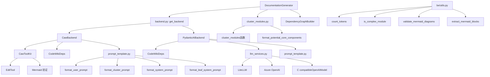
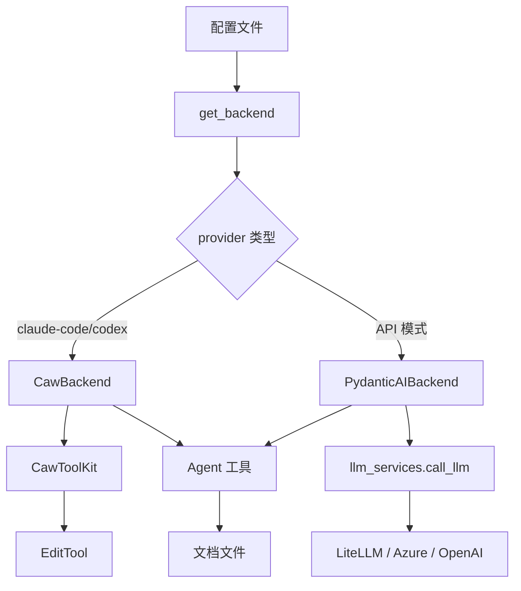

# 后端核心

## 简介

后端核心模块位于 `codewiki/src/be/`，是 CodeWiki 的文档生成引擎。包含文档生成编排器、多 LLM 后端适配、提示词模板、模块聚类和 Mermaid 图表验证等核心能力。

## 架构概览

## 文档生成引擎

### DocumentationGenerator

> **文件**: `codewiki/src/be/documentation_generator.py`

文档生成主控制器，协调整个生成流程：

1. 调用 `DependencyGraphBuilder` 构建依赖图
2. 调用 `cluster_modules` 进行模块聚类
3. 通过 `get_backend()` 获取 LLM 后端
4. 调度模块文档生成
5. 管理进度和日志

### main.py — 独立入口

为命令行直接调用后端提供的入口：`parse_arguments()` 解析参数 → 创建 `DocumentationGenerator` → `run()`。

## LLM 后端

### Backend 抽象层 (backend.py)

| 组件 | 说明 |
|------|------|
| `LLMBackend` | 后端抽象基类 |
| `get_backend(config)` | 工厂函数：根据 provider 返回 CawBackend 或 PydanticAIBackend |
| `is_caw_provider(provider)` | 判断是否为订阅模式提供商（claude-code/codex） |

### CawBackend (caw_backend.py)

> **文件**: `codewiki/src/be/caw_backend.py`

订阅模式后端（Code As Workflow），直接使用 AI IDE 的内置模型，无需手动配置 LLM API。使用 `CawToolKit` 作为工具集，`CodeWikiDeps` 作为依赖注入。

**核心特性**：
- 零配置：依赖 IDE 的认证凭证
- 工具组适配：`_agent_tool_group_for_provider` 按提供商选择工具集
- 超时补丁：`_patch_codex_tool_timeout` 处理 Codex 的超时问题

### PydanticAIBackend (pydantic_ai_backend.py)

> **文件**: `codewiki/src/be/pydantic_ai_backend.py`

API 模式后端，使用 OpenAI 兼容 API。通过 `llm_services.py` 调用 LLM，使用 `call_llm` 发送 prompt，配合 `CodeWikiDeps` 依赖注入和 Agent 工具。

### CawToolKit (caw_toolkit.py)

> **文件**: `codewiki/src/be/caw_toolkit.py`

订阅模式工具集：集成 `EditTool`（文件编辑）、Mermaid 验证、心跳检测、JSON 参数兼容处理。

### llm_services.py — LLM 调用层

| 组件 | 说明 |
|------|------|
| `call_llm()` | 统一 LLM 调用入口，路由到 LiteLLM 或 Azure |
| `CompatibleOpenAIModel` | OpenAI 兼容模型封装 |
| `create_main_model()` | 创建主模型客户端 |
| `create_fallback_model()` | 创建 fallback 模型客户端 |
| `create_fallback_models()` | 创建主 + fallback 模型列表 |
| `_call_llm_via_litellm()` | 通过 LiteLLM 调用 |
| `_call_llm_via_azure()` | 通过 Azure OpenAI 调用 |
| `_build_model_settings()` | 构建模型参数（max_tokens 等） |
| `_should_use_max_completion_tokens()` | 判断是否使用 max_completion_tokens |

支持提供商：OpenAI、Anthropic、Azure OpenAI、AWS Bedrock 及所有 LiteLLM 兼容端点。

## 模块聚类

### cluster_modules.py

| 组件 | 说明 |
|------|------|
| `cluster_modules(components, config)` | 调用 LLM 进行组件聚类（递归调用自身处理大模块） |
| `format_potential_core_components(ids, components)` | 格式化核心组件列表为 LLM 输入 |
| `get_clustering_input_token_count()` | 估算聚类输入的 Token 数量 |

聚类策略根据组件数量和模型能力动态选择：
- 顶级模型 + 大量组件 → LLM 全量聚类
- 非顶级模型或其他情况 → 基于文件目录结构的启发式聚类

## 提示词模板

### prompt_template.py

| 组件 | 说明 |
|------|------|
| `format_cluster_prompt()` | 聚类提示词模板 |
| `format_system_prompt()` | 复杂模块系统提示词 |
| `format_leaf_system_prompt()` | 叶模块系统提示词 |
| `format_user_prompt()` | 用户提示词（含模块树、组件列表） |
| `_format_module_tree()` | 递归格式化模块树结构 |

## 后端工具

### be/utils.py

| 组件 | 说明 |
|------|------|
| `count_tokens(text)` | Token 计数（支持 tiktoken） |
| `is_complex_module(components, ids)` | 判断模块是否需要子模块拆分 |
| `validate_mermaid_diagrams(file_path)` | 验证文件中所有 Mermaid 图表语法 |
| `extract_mermaid_blocks(content)` | 提取 Mermaid 代码块 |
| `validate_single_diagram(code)` | 验证单个 Mermaid 图表（支持 pythonmonkey 和 mermaid-py） |
| `set_main_loop()` | 设置 asyncio 主事件循环引用 |

## 数据流

## 模块依赖

- **上游**: [依赖分析器](依赖分析器.md)（DependencyGraphBuilder）、[共享配置](共享配置.md)（Config）、[Agent 工具](Agent 工具.md)（CodeWikiDeps、EditTool）
- **下游**: [CLI 核心](CLI 核心.md)（CLIDocumentationGenerator）、[前端服务](前端服务.md)（BackgroundWorker）
- **工具**: [CLI 工具](CLI 工具.md)（日志、进度）

## 关键设计

1. **双后端架构**：`CawBackend`（订阅模式/零配置）和 `PydanticAIBackend`（API 模式），通过 `get_backend` 工厂统一创建
2. **分层 LLM 调用**：`llm_services.py` 屏蔽 LiteLLM/Azure/OpenAI 差异
3. **动态聚类策略**：根据模型能力和组件规模选择聚类算法
4. **Mermaid 双重验证**：支持 Node.js 和 Python 两种验证方式
5. **Token 管理**：`count_tokens` + `is_complex_module` 确保单次 LLM 调用不超限