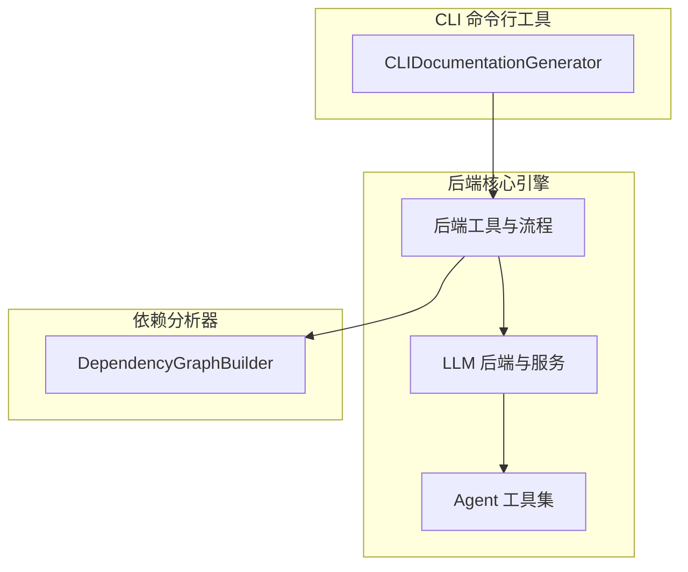
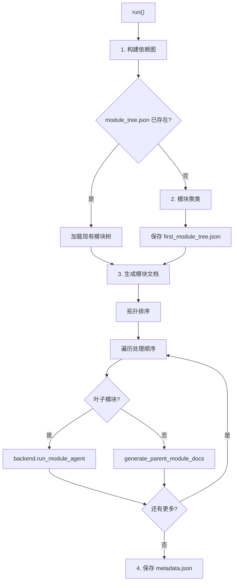
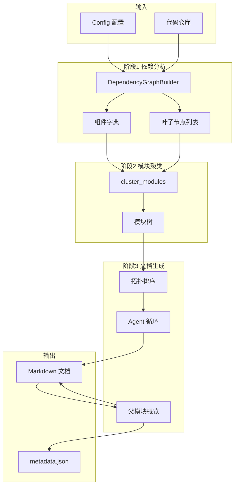

# 后端核心引擎

## 模块概述

后端核心引擎是 CodeWiki-CN 的文档生成中枢，负责协调从代码分析到文档输出的完整自动化工作流。该模块以 `DocumentationGenerator` 为核心编排器，将 LLM 调用、Agent 工具编排、模块聚类、提示词工程和文件管理等功能有机整合，实现了端到端的文档生成管线。

后端引擎采用"编排层 + 服务层"的分层架构：编排层（`DocumentationGenerator`）负责流程调度和阶段管理；服务层包括 LLM 后端抽象（支持多种 LLM 提供商）、Agent 工具集（读写源码、编辑文件、递归子模块）和提示词模板（系统提示、用户提示、聚类提示）。这种分层使各组件可独立替换和测试。

## 子模块架构

## 子模块说明

### LLM 后端与服务

[LLM 后端与服务](LLM%20后端与服务.md) 是 LLM 调用的统一抽象层，通过工厂模式自动选择正确的后端实现。

**两种后端模式：**

| 后端 | 认证方式 | 技术栈 | 适用场景 |
|------|---------|--------|----------|
| `PydanticAIBackend` | API 密钥 | pydantic-ai + OpenAI 客户端 | OpenAI/Anthropic/Bedrock/Azure |
| `CawBackend` | OAuth 订阅 | caw 库 + CLI 子进程 | Claude Code / Codex |

**核心组件：**
- `LLMBackend` 抽象基类定义 `complete`（单次补全）和 `run_module_agent`（异步 Agent 循环）两个接口
- `get_backend` 工厂函数根据 `provider` 配置延迟导入对应实现
- `FallbackModel` 实现主模型到备用模型的自动回退链
- `CompatibleOpenAIModel` 修补非标准 API 代理的响应格式
- `call_llm` 统一补全函数，按提供商自动选择调用路径（OpenAI 直调 / litellm 转译 / Azure 客户端）
- `CawToolKit` 将 CodeWiki Agent 工具以 MCP 服务器形式暴露给 caw Agent

**Token 参数自适应**：自动识别新模型（o1/o3/o4/gpt-4o/gpt-5 等），智能选择 `max_tokens` 或 `max_completion_tokens` 参数。

### Agent 工具集

[Agent 工具集](Agent%20工具集.md) 提供了 LLM Agent 在文档生成过程中可调用的全部工具。

**三大核心工具：**

| 工具 | 功能 | 关键特性 |
|------|------|----------|
| `read_code_components` | 按组件 ID 读取源代码 | 支持批量读取，未找到组件时返回友好提示 |
| `str_replace_editor` | 文件查看/创建/编辑/撤销 | 唯一匹配替换、flake8 语法检查、Mermaid 验证 |
| `generate_sub_module_documentation` | 子模块文档递归生成 | 并行子 Agent、递归深度控制、心跳保活 |

**EditTool 编辑器**源自 SWE-agent 项目，支持 view/create/str_replace/insert/undo_edit 五种命令，关键安全设计包括：
- `str_replace` 要求 `old_str` 在文件中必须唯一匹配
- 编辑历史通过 `registry` 持久化，支持多次 `undo_edit`
- 可选 flake8 语法检查捕获编辑引入的新错误
- 超过 16000 字符时自动切换到 Filemap 模式显示文件结构

**子模块递归控制**：递归条件为 `is_complex_module AND current_depth < max_depth AND tokens >= max_token_per_leaf_module` 三者同时满足。

**双后端暴露**：pydantic-ai 使用 `Tool` 对象注册，caw 使用 `@tool` 装饰器注册到 `CawToolKit`，共享 `EditTool` 核心实现。

### 后端工具与流程

[后端工具与流程](后端工具与流程.md) 是顶层编排层，以 `DocumentationGenerator` 为核心控制器协调完整工作流。

**DocumentationGenerator 运行流程：**

**关键设计：**
- **拓扑排序**：后序遍历确保叶子模块先于父模块处理，使父模块概览能引用已生成的子模块内容
- **幂等性**：已存在的文档自动跳过，单个模块失败不影响其他模块
- **文件名容错**：`_resolve_child_docs_path` 尝试多种命名变体（空格替换、大小写）查找子模块文档

**模块聚类**：`cluster_modules` 使用 LLM 将组件智能分组，采用递归策略——先仓库级聚类，再对每个子模块递归再聚类。当 token 数不超过 `max_token_per_module` 阈值时跳过聚类，进入整体文档模式。

**提示词模板**包括系统提示（复杂模块/叶子模块）、用户提示、聚类提示和概览提示，支持自定义指令注入和文件扩展名到语言的自动映射。

**Mermaid 验证**采用双引擎策略：PythonMonkey 引擎（首选，JS 绑定）和 mermaid-py 引擎（备选，需 `MERMAID_VALIDATE=1` 启用）。

## 完整数据流

## 与其他模块的关系

- **[CLI 命令行工具](CLI%20命令行工具.md)**：`CLIDocumentationGenerator` 适配器将 CLI 参数转化为 `DocumentationGenerator` 调用
- **[MCP 协议服务器](MCP%20协议服务器.md)**：MCP 工具集复用后端引擎的 `DependencyGraphBuilder` 和提示词模板
- **[依赖分析器](依赖分析器.md)**：`DocumentationGenerator` 第一阶段调用 `DependencyGraphBuilder` 构建代码依赖图

## 设计要点

1. **编排与执行分离**：`DocumentationGenerator` 仅负责流程编排，实际的文档生成工作委托给 Agent 工具完成
2. **后端可插拔**：通过 `LLMBackend` 抽象和工厂模式，新增 LLM 提供商只需实现一个子类
3. **递归深度控制**：三层条件（复杂度/深度/token 数）联合控制子模块递归，防止无限展开
4. **Mermaid 质量门禁**：每次文件编辑后自动验证流程图语法，及早发现问题
5. **容错设计**：模块文档已存在则跳过、单模块失败不影响整体、聚类失败回退到整体模式
