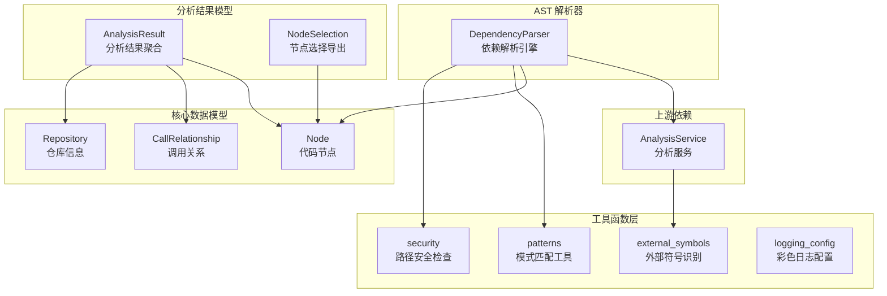

# 数据模型与工具

## 模块概述

数据模型与工具模块是 CodeWiki-CN 依赖分析引擎的基础设施层，为整个代码分析流水线提供核心数据结构定义、AST 解析能力、模式匹配工具、外部符号识别、安全路径校验和日志配置等基础能力。该模块由 7 个源文件、23 个核心组件构成，是分析服务、语言分析器和前端可视化等上层模块的共同依赖基础。

### 核心职责

- **数据模型定义**：基于 Pydantic 定义代码节点、调用关系和仓库等核心数据结构，确保数据在分析流水线中的类型安全和序列化一致性
- **AST 解析引擎**：通过 `DependencyParser` 从多语言仓库中提取代码组件和依赖关系，构建依赖图的原始数据
- **模式匹配工具**：提供入口点检测、关键函数识别、高连接度文件发现等启发式规则，覆盖 Python、JavaScript、Go、Rust、C/C++ 等多种语言
- **外部符号处理**：维护 C/C++ 标准库、Java 标准库等外部符号集合，避免将语言内置 API 误判为项目内部未解析依赖
- **安全工具**：防止路径遍历攻击，阻止符号链接越权访问，保障仓库分析过程的文件系统安全
- **日志配置**：基于 colorama 的彩色日志格式化器，提升开发调试体验

## 架构总览



## 核心数据模型

### Node -- 代码节点

**文件路径**: `codewiki/src/be/dependency_analyzer/models/core.py`

`Node` 是基于 Pydantic `BaseModel` 的核心数据模型，表示仓库中的一个代码实体（函数、类、方法、接口等）。每个节点携带完整的元数据，支撑依赖图的构建和可视化展示。

| 字段 | 类型 | 默认值 | 说明 |
|------|------|--------|------|
| `id` | `str` | 必填 | 节点唯一标识符，通常由文件路径和名称组合生成 |
| `name` | `str` | 必填 | 代码实体的名称，如函数名或类名 |
| `component_type` | `str` | 必填 | 组件类型：`function`、`method`、`class`、`interface`、`struct`、`enum` 等 |
| `file_path` | `str` | 必填 | 文件的绝对路径 |
| `relative_path` | `str` | 必填 | 相对于仓库根目录的文件路径 |
| `depends_on` | `Set[str]` | `set()` | 该节点依赖的其他节点 ID 集合 |
| `source_code` | `Optional[str]` | `None` | 源代码片段 |
| `start_line` | `int` | `0` | 在源文件中的起始行号 |
| `end_line` | `int` | `0` | 在源文件中的结束行号 |
| `has_docstring` | `bool` | `False` | 是否包含文档字符串 |
| `docstring` | `str` | `""` | 文档字符串内容 |
| `parameters` | `Optional[List[str]]` | `None` | 函数参数列表 |
| `node_type` | `Optional[str]` | `None` | 细粒度节点类型，如 `class`、`interface`、`abstract class` |
| `base_classes` | `Optional[List[str]]` | `None` | 继承的基类列表 |
| `class_name` | `Optional[str]` | `None` | 所属类名（用于方法节点） |
| `display_name` | `Optional[str]` | `None` | 用于前端展示的显示名称 |
| `component_id` | `Optional[str]` | `None` | 组件 ID，用于前端组件寻址 |
| `language` | `Optional[str]` | `None` | 编程语言标识 |
| `qualified_name` | `Optional[str]` | `None` | 限定名称，包含命名空间或模块路径 |

`Node` 提供一个辅助方法 `get_display_name()`，优先返回 `display_name`，回退到 `name`。

### CallRelationship -- 调用关系

**文件路径**: `codewiki/src/be/dependency_analyzer/models/core.py`

`CallRelationship` 表示两个代码节点之间的调用关系，是构建依赖图边的基础数据单元。

| 字段 | 类型 | 默认值 | 说明 |
|------|------|--------|------|
| `caller` | `str` | 必填 | 调用方的节点标识 |
| `callee` | `str` | 必填 | 被调用方的节点标识 |
| `call_line` | `Optional[int]` | `None` | 调用发生的行号 |
| `is_resolved` | `bool` | `False` | 该关系是否已成功解析到项目内部组件 |

`is_resolved` 字段在依赖图构建中起关键作用：当值为 `False` 时，表示该调用指向外部符号或尚未解析的目标，需要配合 `external_symbols` 模块进一步过滤。

### Repository -- 仓库信息

**文件路径**: `codewiki/src/be/dependency_analyzer/models/core.py`

`Repository` 封装被分析仓库的基本信息，作为分析结果的上下文载体。

| 字段 | 类型 | 说明 |
|------|------|------|
| `url` | `str` | 仓库的 Git URL |
| `name` | `str` | 仓库名称 |
| `clone_path` | `str` | 本地克隆路径 |
| `analysis_id` | `str` | 分析会话的唯一 ID |

## 分析结果模型

### AnalysisResult -- 分析结果聚合

**文件路径**: `codewiki/src/be/dependency_analyzer/models/analysis.py`

`AnalysisResult` 是对一次完整仓库分析的结果聚合，将仓库信息、节点列表、调用关系和可视化数据统一封装。

```python
class AnalysisResult(BaseModel):
    repository: Repository          # 被分析的仓库信息
    functions: List[Node]           # 所有提取的代码节点
    relationships: List[CallRelationship]  # 所有发现的调用关系
    file_tree: Dict[str, Any]       # 仓库文件树结构
    summary: Dict[str, Any]         # 分析摘要统计
    visualization: Dict[str, Any]   # 可视化数据（默认空字典）
    readme_content: Optional[str]   # README 文件内容
```

该模型是 [分析服务与图算法](分析服务与图算法.md) 中 `AnalysisService` 的输出产物，也是前端生成 [Web 前端服务](Web%20前端服务.md) 可视化页面的数据源。

### NodeSelection -- 节点选择导出

**文件路径**: `codewiki/src/be/dependency_analyzer/models/analysis.py`

`NodeSelection` 用于支持部分导出场景，允许用户选择特定的节点子集进行导出。

```python
class NodeSelection(BaseModel):
    selected_nodes: List[str] = []            # 选中的节点 ID 列表
    include_relationships: bool = True        # 是否包含节点间的关系数据
    custom_names: Dict[str, str] = {}         # 节点自定义名称映射
```

## AST 解析器

### DependencyParser -- 依赖解析引擎

**文件路径**: `codewiki/src/be/dependency_analyzer/ast_parser.py`

`DependencyParser` 是多语言仓库的依赖解析入口，负责协调结构分析和调用图分析，将原始代码转化为 `Node` 组件集合。

#### 初始化参数

| 参数 | 类型 | 说明 |
|------|------|------|
| `repo_path` | `str` | 仓库的本地路径，初始化时转为绝对路径 |
| `include_patterns` | `List[str]` | 自定义包含文件模式（如 `["*.cs", "*.py"]`） |
| `exclude_patterns` | `List[str]` | 自定义排除文件/目录模式（如 `["*Tests*"]`） |

#### 核心方法

**`parse_repository(filtered_folders)`**

仓库解析的主入口方法，执行流程如下：

1. 调用 `AnalysisService._analyze_structure()` 分析仓库文件结构，应用包含/排除模式过滤文件
2. 调用 `AnalysisService._analyze_call_graph()` 在文件树基础上构建调用图
3. 通过 `_build_components_from_analysis()` 将分析结果转化为 `Node` 组件字典

返回值为 `Dict[str, Node]`，键为组件 ID，值为对应的 `Node` 实例。

**`_build_components_from_analysis(call_graph_result)`**

内部方法，负责将调用图分析的原始字典数据转化为标准化的 `Node` 对象。处理逻辑包括：

- 遍历函数列表，为每个函数创建 `Node` 实例并注册到 `self.components`
- 构建 `component_id_mapping` 映射表，处理新旧 ID 格式的兼容
- 通过 `"::"` 和 `"."` 分隔符推断模块路径，注册到 `self.modules` 集合
- 遍历关系列表，通过映射表解析 caller/callee 的实际组件 ID，建立 `depends_on` 依赖关系

**`save_dependency_graph(output_path)`**

将组件字典序列化为 JSON 文件，自动处理 `Set` 到 `List` 的类型转换。输出文件使用 UTF-8 编码并格式化缩进。

#### 与上游服务的关系

`DependencyParser` 依赖 [分析服务与图算法](分析服务与图算法.md) 中的 `AnalysisService` 完成实际的结构分析和调用图分析工作，自身主要承担数据转化和组件管理的职责。解析器通过语言分析器（参见 [语言分析器](语言分析器.md)）获取各语言的 AST 解析能力。

## 模式匹配工具

**文件路径**: `codewiki/src/be/dependency_analyzer/utils/patterns.py`

模式匹配模块提供了一系列启发式规则和工具函数，用于在不完全解析代码的情况下快速识别关键文件和函数。所有模式覆盖 Python、JavaScript/TypeScript、Go、Rust、C/C++、PHP、Kotlin、Java 等多种语言。

### 文件过滤模式

**`DEFAULT_IGNORE_PATTERNS`** -- 默认忽略的文件/目录模式集合（约 150 项），覆盖：

- 版本控制目录（`.git`、`.svn`、`.hg`）
- 依赖目录（`node_modules`、`venv`、`.gradle`）
- 构建产物（`*.class`、`*.o`、`*.pyc`）
- IDE 配置（`.idea`、`.vscode`）
- 媒体文件（`*.png`、`*.jpg`、`*.svg`）
- 临时文件和缓存（`*.tmp`、`*.log`、`.cache`）

**`DEFAULT_INCLUDE_PATTERNS`** -- 默认包含的源码文件扩展名列表（36 种），涵盖所有主流编程语言和配置文件格式。

**`CODE_EXTENSIONS`** -- 代码扩展名到编程语言名称的映射字典，用于从文件扩展名快速判断语言类型。支持 22 种扩展名到 16 种语言的映射。

### 入口点检测

入口点检测采用三层策略逐级回退：

**第一层：精确文件名匹配**

`ENTRY_POINT_PATTERNS` 集合包含约 60 个常见入口文件名，如 `main.py`、`index.js`、`server.go`、`main.rs`、`main.cpp`、`index.php` 等。通过 `is_entry_point_file(filename)` 函数进行匹配。

**第二层：路径模式匹配**

`ENTRY_POINT_PATH_PATTERNS` 列表包含 `cmd/main`、`src/app`、`bin/server` 等路径片段模式。通过 `is_entry_point_path(filepath)` 函数进行子串匹配。

**第三层：灵活名称匹配**

`ENTRY_POINT_NAME_PATTERNS` 列表包含 `main`、`app`、`server`、`start`、`bootstrap` 等通用名称。在 `is_entry_point_file()` 中，当精确匹配失败时，检查文件名是否包含这些模式且具有代码扩展名。

**回退策略**: `find_fallback_entry_points()` 函数在上述策略均无匹配时启用，按路径深度和文件名优先级排序，返回最多 `max_files` 个候选入口点。

### 高连接度文件识别

`HIGH_CONNECTIVITY_PATTERNS` 集合包含约 90 个文件名/路径模式，用于识别可能包含大量函数调用的文件。模式分为以下几类：

- **通用架构模式**: `router`、`controller`、`service`、`handler`、`middleware`
- **语言特定模式**: `mod`（Rust 模块）、`pkg`（Go 包）
- **框架模式**: `express`、`fastapi`、`gin`、`actix`
- **数据层模式**: `db`、`database`、`model`、`repository`

`has_high_connectivity_potential(filename, filepath)` 函数同时检查文件名和路径，并结合 `SOURCE_DIRECTORY_PATTERNS`（`src/`、`lib/`、`core/`、`pkg/` 等）进行综合判断。

### 关键函数识别

`is_critical_function(func_name, code_snippet)` 函数通过两个维度判断函数是否为关键函数：

1. **名称匹配**: 函数名在 `CRITICAL_FUNCTION_NAMES` 集合中（`main`、`index`、`app`、`server`、`start`、`init`、`run`、`new`）
2. **代码模式匹配**: 代码片段中包含 `EXPORT_PATTERNS` 中的导出声明模式，如 `export default`、`pub fn`、`if __name__ == "__main__"` 等

### 函数定义模式

`FUNCTION_DEFINITION_PATTERNS` 字典为每种语言定义了函数定义的快速扫描模式。`get_function_patterns_for_language(language)` 函数返回对应语言的模式列表，未知语言回退到 `general` 模式。

## 外部符号处理

**文件路径**: `codewiki/src/be/dependency_analyzer/utils/external_symbols.py`

外部符号模块维护了 C/C++ 和 Java 标准库的符号集合，用于在依赖图构建过程中过滤掉语言内置 API 调用，避免产生大量无意义的未解析边。

### 符号集合

**`C_EXTERNAL_SYMBOLS`** -- C 标准库符号集合（约 120 个），包含 `stdio.h`、`stdlib.h`、`string.h`、`math.h`、`time.h`、`ctype.h`、`stdarg.h` 等头文件中的标准函数，如 `printf`、`malloc`、`memcpy`、`fopen` 等。

**`CPP_EXTERNAL_SYMBOLS`** -- C++ 标准库符号集合，继承 C 集合并扩展约 60 个 STL 成员函数和核心类型，包括：

- 容器操作：`push_back`、`emplace_back`、`insert`、`erase`、`size`、`empty`、`begin`、`end`
- 智能指针：`shared_ptr`、`unique_ptr`、`make_shared`、`make_unique`
- 字符串操作：`substr`、`c_str`、`length`、`append`
- 工具类型：`pair`、`tuple`、`optional`、`string_view`

**`JAVA_EXTERNAL_SYMBOLS`** -- Java `java.lang` 包符号集合（约 70 个），包含自动导入的核心类和异常类型：

- 核心类：`String`、`Integer`、`System`、`Thread`、`Math`、`Object`
- 异常类型：`NullPointerException`、`IllegalArgumentException`、`RuntimeException` 等
- 注解：`Override`、`Deprecated`、`FunctionalInterface`

**`JAVA_OBJECT_METHODS`** -- Java `Object` 类继承方法集合（`clone`、`equals`、`hashCode`、`toString`、`wait`、`notify` 等），这些方法在任何对象上调用都不应产生项目内部边。

**`CPP_STANDARD_HEADERS`** -- C++ 标准头文件集合（24 个），用于过滤 `#include` 指令中的标准库引用。

### 宏识别

`is_macro_name(token)` 函数通过启发式规则判断一个标识符是否为 C/C++ 宏：

- 匹配全大写模式（正则 `^[A-Z][A-Z0-9_]*$`）
- 长度至少 4 个字符或包含下划线
- 排除已知的标准常量（`TRUE`、`FALSE`、`NULL`、`EOF`、`EXIT_SUCCESS`、`EXIT_FAILURE`）

宏在 C/C++ 中不会被提取为代码组件，因此对宏的调用永远无法解析到项目内部函数，需要在依赖图中过滤。

### 符号归一化

`normalize_symbol(symbol)` 函数将不同格式的符号引用归一化为可比较的名称：

1. 去除前后空白
2. 处理 C++ 命名空间限定（`Foo::Bar::baz` 取最后一段 `baz`，保留 `std::` 前缀）
3. 去除函数参数部分（`foo(int)` 取 `foo`）
4. 去除指针/引用/数组修饰符（`&`、`*`、`[]`）
5. 处理点号限定（`obj.method` 取 `method`）

### 外部符号判定

`is_external_symbol(language, symbol)` 函数采用分层判定策略：

1. **命名空间前缀规则**（通用层）：以 `java.`、`javax.`、`jdk.`、`sun.` 或 `std::` 开头的符号一律视为外部符号
2. **语言特定集合**（精确层）：对于 Java 语言，仅当符号不含点号（即简单名称）时才查询 `JAVA_EXTERNAL_SYMBOLS`；对于 C/C++，先归一化后查询对应集合
3. **回退**：其他语言或无法判定的情况返回 `False`

这种分层设计确保语言级别的通用知识（标准库符号）与项目级别的特定知识（第三方库符号）解耦，后者由解析器的导入映射机制处理。

## 安全工具

**文件路径**: `codewiki/src/be/dependency_analyzer/utils/security.py`

安全工具模块提供文件系统路径安全校验，防止恶意仓库通过路径遍历或符号链接攻击访问仓库目录之外的文件。

### 核心函数

**`_inside(base, target)`**

内部辅助函数，判断 `target` 路径是否在 `base` 目录内部：

1. 对两个路径均执行 `resolve()` 获取绝对规范路径
2. 优先使用 Python 3.9+ 的 `Path.is_relative_to()` 方法
3. 回退到字符串前缀匹配（兼容旧版 Python）

**`assert_safe_path(base_dir, target)`**

路径安全断言函数，执行两项检查：

1. **符号链接阻断**：如果 `target` 是符号链接（无论指向文件还是目录），立即抛出 `PermissionError`
2. **路径逃逸阻断**：调用 `_inside()` 检查 `target` 是否逃逸出 `base_dir`，逃逸时抛出 `PermissionError`

**`safe_open_text(base_dir, target, encoding)`**

安全的文件读取函数，在 `assert_safe_path()` 校验通过后，使用底层文件描述符读取文件内容：

1. 调用 `assert_safe_path()` 进行安全校验
2. 使用 `os.O_RDONLY` 标志打开文件，若系统支持则附加 `os.O_NOFOLLOW` 标志（二次防止符号链接跟随）
3. 通过 `os.fdopen()` 将文件描述符包装为文件对象进行读取
4. 编码错误采用 `replace` 策略处理

## 日志配置

**文件路径**: `codewiki/src/be/dependency_analyzer/utils/logging_config.py`

日志配置模块基于 `colorama` 库实现跨平台的彩色终端日志输出，提升开发调试体验。

### ColoredFormatter -- 彩色格式化器

`ColoredFormatter` 继承自 `logging.Formatter`，为不同日志级别和组件分配颜色：

| 组件 | 颜色 |
|------|------|
| DEBUG 级别 | 蓝色 |
| INFO 级别 | 青色 |
| WARNING 级别 | 黄色 |
| ERROR 级别 | 红色 |
| CRITICAL 级别 | 亮红色 |
| 时间戳 | 蓝色 |

日志输出格式为：`[HH:MM:SS] LEVEL    message`，其中时间戳和级别均带颜色。异常信息附加在消息之后。

### 初始化函数

**`setup_logging(level)`**

全局日志配置函数：

- 创建输出到 `sys.stdout` 的 `StreamHandler`
- 设置 `ColoredFormatter` 格式化器
- 清除根日志器的已有处理器，避免重复输出
- 默认日志级别为 `INFO`

**`setup_module_logging(module_name, level)`**

模块级日志配置函数：

- 为指定模块名创建独立的日志器
- 配置与全局相同的彩色处理器
- 设置 `propagate = False` 防止日志向上传播导致重复输出
- 返回配置好的 `Logger` 实例

## 模块间依赖关系

本模块作为依赖分析引擎的基础设施层，被以下上游模块直接依赖：

- [分析服务与图算法](分析服务与图算法.md) -- `AnalysisService` 使用 `Node`、`CallRelationship` 模型构建分析结果，使用 `external_symbols` 过滤外部调用，使用 `patterns` 进行入口点和关键函数识别
- [语言分析器](语言分析器.md) -- 各语言的 AST 解析器使用 `patterns` 中的函数定义模式和文件过滤模式，使用 `external_symbols` 识别语言标准库调用
- [MCP 代码分析工具](MCP%20代码分析工具.md) -- MCP 工具层通过 `DependencyParser` 触发仓库解析流程
- [Agent 工具集](Agent%20工具集.md) -- Agent 工具在文档生成过程中读取 `Node` 组件的源代码和元数据

## 设计决策

### Pydantic 模型选型

核心数据模型全部采用 Pydantic `BaseModel`，而非 `dataclass` 或普通字典。这一选择确保：

- **类型安全**：在分析流水线的各个环节进行自动类型校验
- **序列化一致性**：通过 `model_dump()` 生成标准化的字典表示，`Set` 字段在 JSON 序列化时自动转为 `List`
- **前后端契约**：Pydantic 模型的字段定义直接对应前端 TypeScript 接口的数据结构

### 分层外部符号过滤

外部符号判定采用「命名空间前缀 + 语言集合」的分层策略，而非单一的大型符号表。这样设计的优势是：

- 命名空间前缀规则适用于所有项目，无需按仓库配置
- 语言标准库集合仅包含真正的语言级知识，不包含第三方库
- 第三方库的外部性由解析器的导入映射机制按仓库动态判定

### 安全防御纵深

路径安全检查采用多重防御策略：先检查符号链接，再验证路径归属，读取时附加 `O_NOFOLLOW` 标志。这种纵深防御确保即使某一层被绕过，后续层仍能阻断攻击。


<!-- crosslinks (auto-generated) -->
## Related Modules
- Depends on: [CLI 工具库](cli_工具库.md), [分析服务与图算法](分析服务与图算法.md)
- Used by: [CLI 工具库](cli_工具库.md), [分析服务与图算法](分析服务与图算法.md), [语言分析器](语言分析器.md)
