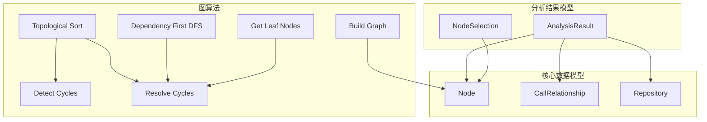
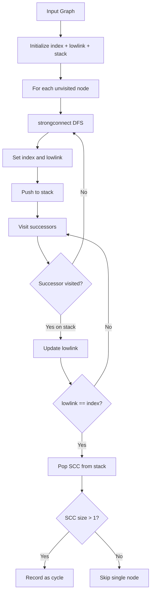
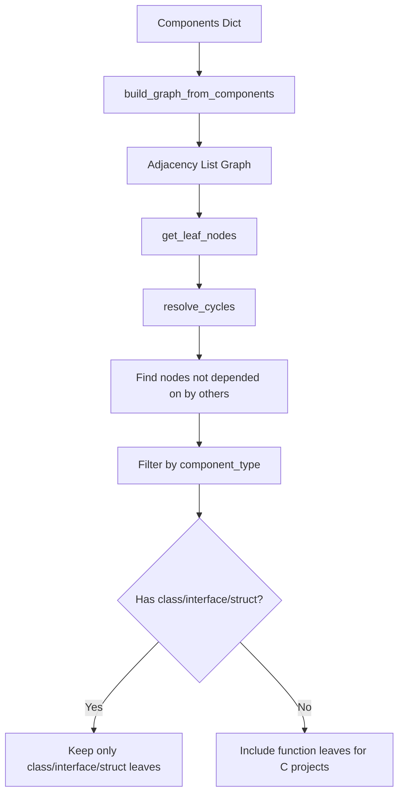

# 数据模型与算法

## 模块概述

数据模型与算法模块为 CodeWiki-CN 的依赖分析引擎提供基础数据结构和图算法支持。该模块定义了整个分析流程中流转的核心数据模型（节点、调用关系、仓库、分析结果），以及依赖图上的拓扑排序、环检测、叶子节点发现等关键算法。这些数据结构和算法是连接语言分析器输出与文档生成流程的桥梁。

## 核心功能

- **统一数据模型**：定义 Node、CallRelationship、Repository、AnalysisResult、NodeSelection 等 Pydantic 模型
- **环检测与解析**：基于 Tarjan 算法检测强连通分量，自动打破循环依赖
- **拓扑排序**：提供基于入度的拓扑排序和基于 DFS 的依赖优先遍历
- **图构建与叶子节点发现**：从组件字典构建邻接表，识别叶子节点供文档生成使用

## 架构总览



## 数据模型详解

### Node（代码组件节点）

**源文件**：`codewiki/src/be/dependency_analyzer/models/core.py`

Node 是代码组件的统一表示模型，承载从源代码中提取的每一个类、函数、方法等组件的完整元数据。

**字段定义：**

| 字段 | 类型 | 说明 |
|------|------|------|
| `id` | str | 组件唯一标识，格式为 `相对路径::名称` |
| `name` | str | 组件名称（类名、函数名、方法名） |
| `component_type` | str | 组件类型：class, interface, struct, function, method, enum 等 |
| `file_path` | str | 文件绝对路径 |
| `relative_path` | str | 相对于仓库根目录的路径 |
| `depends_on` | Set[str] | 依赖的其他组件 ID 集合 |
| `source_code` | Optional[str] | 源代码片段 |
| `start_line` / `end_line` | int | 源代码行号范围 |
| `has_docstring` / `docstring` | bool / str | 文档字符串信息 |
| `parameters` | Optional[List[str]] | 函数参数列表 |
| `node_type` | Optional[str] | 节点类型标识 |
| `base_classes` | Optional[List[str]] | 基类列表（仅类组件） |
| `class_name` | Optional[str] | 所属类名（仅方法组件） |
| `display_name` | Optional[str] | 显示名称（如 `class MyClass`） |
| `component_id` | Optional[str] | 组件 ID 冗余字段 |
| `language` | Optional[str] | 编程语言标识 |
| `qualified_name` | Optional[str] | 全限定名（如 `package.Class.method`） |

**组件 ID 命名规范：**
```
相对路径::ClassName                  # 类
相对路径::ClassName.method_name      # 方法
相对路径::function_name              # 顶层函数
```

### CallRelationship（调用关系）

**源文件**：`codewiki/src/be/dependency_analyzer/models/core.py`

表示两个代码组件之间的调用或依赖关系。

**字段定义：**

| 字段 | 类型 | 说明 |
|------|------|------|
| `caller` | str | 调用方组件 ID |
| `callee` | str | 被调用方组件 ID |
| `call_line` | Optional[int] | 调用发生的行号 |
| `is_resolved` | bool | 是否已解析到项目内的实际组件 |

**关系类型覆盖：**
- 函数调用：`funcA()` 调用 `funcB()`
- 继承关系：`class Child extends Parent`
- 接口实现：`class Impl implements Interface`
- 字段类型依赖：`private Service service`
- 对象创建：`new MyClass()`

### Repository（仓库信息）

**源文件**：`codewiki/src/be/dependency_analyzer/models/core.py`

封装被分析仓库的基本信息。

| 字段 | 类型 | 说明 |
|------|------|------|
| `url` | str | GitHub 仓库 URL |
| `name` | str | 仓库名称 |
| `clone_path` | str | 本地克隆路径 |
| `analysis_id` | str | 分析唯一标识（owner-repo） |

### AnalysisResult（分析结果）

**源文件**：`codewiki/src/be/dependency_analyzer/models/analysis.py`

完整仓库分析的结果容器，聚合所有分析产出物。

| 字段 | 类型 | 说明 |
|------|------|------|
| `repository` | Repository | 仓库信息 |
| `functions` | List[Node] | 提取的所有代码组件 |
| `relationships` | List[CallRelationship] | 所有调用关系 |
| `file_tree` | Dict[str, Any] | 文件树结构 |
| `summary` | Dict[str, Any] | 统计摘要 |
| `visualization` | Dict[str, Any] | Cytoscape.js 可视化数据 |
| `readme_content` | Optional[str] | README 文件内容 |

### NodeSelection（节点选择）

**源文件**：`codewiki/src/be/dependency_analyzer/models/analysis.py`

用于部分导出场景的节点选择配置。

| 字段 | 类型 | 说明 |
|------|------|------|
| `selected_nodes` | List[str] | 选中的节点 ID 列表 |
| `include_relationships` | bool | 是否包含关系数据 |
| `custom_names` | Dict[str, str] | 自定义名称映射 |

## 图算法详解

### 环检测：Tarjan 强连通分量算法

**源文件**：`codewiki/src/be/dependency_analyzer/topo_sort.py`

使用 Tarjan 算法检测依赖图中的循环依赖。

**算法流程：**



**复杂度**：O(V + E)，其中 V 为节点数，E 为边数。

### 环解析策略

`resolve_cycles` 函数通过删除环中的 weakest edge 来打破循环依赖：
- 对每个强连通分量（SCC），移除一条边使其成为 DAG
- 策略：移除 SCC 中最后一条边（`cycle[i] → cycle[i+1]` 中第一条可删除的边）
- 返回新的无环图

### 拓扑排序

`topological_sort` 函数实现基于入度的 Kahn 算法：

1. 先调用 `resolve_cycles` 确保图无环
2. 计算每个节点的入度
3. 将入度为 0 的节点加入队列
4. 依次处理队列中的节点，减少其邻居的入度
5. 反转结果，使依赖项排在前面

### 依赖优先 DFS

`dependency_first_dfs` 函数实现深度优先的依赖优先遍历：

1. 解析环后找到根节点（无入边的节点）
2. 从每个根节点开始 DFS，先访问所有依赖项
3. 在依赖项全部访问后才将当前节点加入结果
4. 处理未访问的孤立节点

### 图构建与叶子节点



`build_graph_from_components`：从 Node 字典构建邻接表，仅保留项目内的依赖边。

`get_leaf_nodes`：识别叶子节点（无其他节点依赖它的节点），并进行多重过滤：
- 按组件类型过滤：优先保留 class/interface/struct，C 项目回退到 function
- 排除无效标识符：过滤含 error/exception 等关键词的节点
- 数量控制：当叶子节点超过 400 个时，进一步排除被其他节点依赖的节点
- `__init__` 方法合并到类名

## 与其他模块的关系

- [分析服务](分析服务.md)：AnalysisService 构建 AnalysisResult，DependencyGraphBuilder 调用拓扑排序和叶子节点算法
- [语言分析器](语言分析器.md)：各语言分析器输出 Node 和 CallRelationship 实例
- [分析器工具](分析器工具.md)：图算法中使用 external_symbols 判断外部依赖
- [Web 前端服务](Web 前端服务.md)：分析结果驱动文档生成的模块树结构
- [共享基础设施](共享基础设施.md)：FileManager 用于依赖图 JSON 的持久化

## 设计要点

1. **Pydantic 模型**：所有数据模型继承 BaseModel，自动获得序列化、反序列化、类型校验能力
2. **自然依赖方向**：图的边方向为 A→B 表示 A 依赖 B，与直觉一致
3. **环容忍性**：所有图算法先调用 resolve_cycles，确保循环依赖不会导致死锁
4. **叶子节点语义**：叶子节点是文档生成的起点，从底层无依赖组件开始向上生成
5. **类型感知过滤**：叶子节点过滤策略根据项目语言特性自动适配（OOP 项目用类，C 项目用函数）