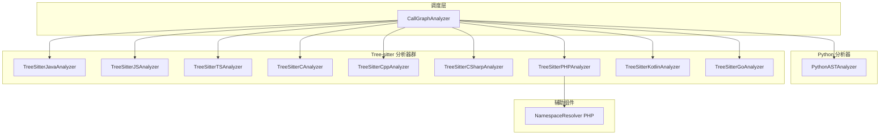
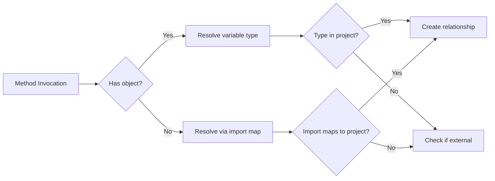
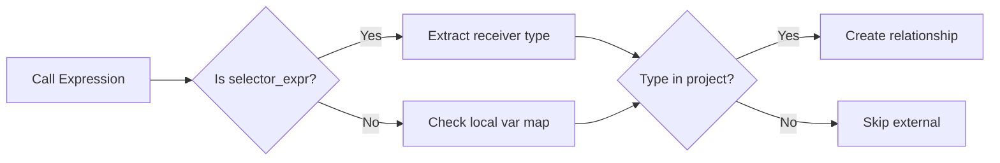
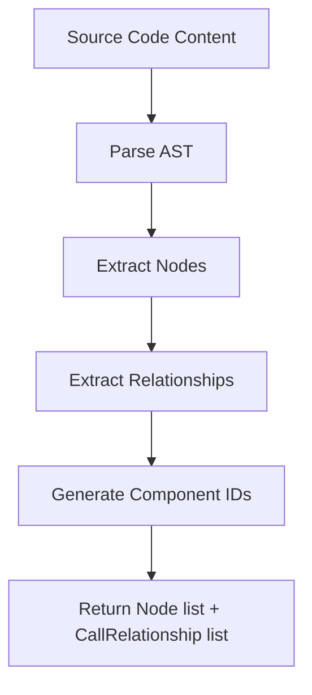

# 语言分析器

## 模块概述

语言分析器模块是 CodeWiki-CN 依赖分析引擎的多语言 AST 解析层，为每种支持的编程语言提供专门的语法分析器。该模块通过两种技术路线实现代码组件提取：Python 使用内置 `ast` 模块，其余 9 种语言（Java、JavaScript、TypeScript、C、C++、C#、PHP、Kotlin、Go）使用 Tree-sitter 增量解析框架。所有分析器输出统一的 `Node` 和 `CallRelationship` 数据模型，供上层 [分析服务](分析服务.md) 统一消费。

## 核心功能

- **多语言组件提取**：从源代码中提取类、接口、结构体、函数、方法等代码组件
- **调用关系识别**：识别函数调用、继承关系、接口实现、字段类型依赖等
- **统一输出格式**：所有分析器输出 `List[Node]` 和 `List[CallRelationship]`
- **限定名解析**：为每个组件生成全限定名，支持跨文件关系解析

## 架构总览

## 分析器分类

| 语言 | 分析器类 | 解析技术 | 提取的组件类型 |
|------|----------|----------|--------------|
| Python | PythonASTAnalyzer | Python ast 模块 | class, function, method |
| Java | TreeSitterJavaAnalyzer | tree-sitter-java | class, interface, enum, record, annotation, method |
| JavaScript | TreeSitterJSAnalyzer | tree-sitter-javascript | class, interface, function, method |
| TypeScript | TreeSitterTSAnalyzer | tree-sitter-typescript | class, interface, function, method |
| C | TreeSitterCAnalyzer | tree-sitter-c | function, struct |
| C++ | TreeSitterCppAnalyzer | tree-sitter-cpp | class, struct, function, method |
| C# | TreeSitterCSharpAnalyzer | tree-sitter-csharp | class, interface, struct, method |
| PHP | TreeSitterPHPAnalyzer | tree-sitter-php | class, interface, function, method |
| Kotlin | TreeSitterKotlinAnalyzer | tree-sitter-kotlin | class, function, method |
| Go | TreeSitterGoAnalyzer | tree-sitter-go | struct, interface, function, method |

## 组件详解

### PythonASTAnalyzer（Python AST 分析器）

**源文件**：`codewiki/src/be/dependency_analyzer/analyzers/python.py`

基于 Python 内置 `ast.NodeVisitor` 实现的访问者模式分析器。

**核心职责：**
- 遍历 Python AST 提取类定义（`visit_ClassDef`）和函数定义（`visit_FunctionDef`/`visit_AsyncFunctionDef`）
- 提取基类继承关系，自动解析 `ast.Name` 和 `ast.Attribute` 形式的基类名
- 识别函数调用（`visit_Call`），过滤 Python 内置函数（print、len、isinstance 等）
- 仅提取顶层函数和类定义，类内方法作为类组件的一部分

**组件 ID 格式：**
- 类：`相对路径::ClassName`
- 类方法：`相对路径::ClassName.method_name`
- 顶层函数：`相对路径::function_name`

**调用关系提取逻辑：**
- caller 为当前类或当前函数（优先类级别）
- 如果 callee 在本文件的 `top_level_nodes` 中，标记为已解析
- 支持 `obj.method` 形式的属性调用

### TreeSitterJavaAnalyzer（Java 分析器）

**源文件**：`codewiki/src/be/dependency_analyzer/analyzers/java.py`

功能最丰富的 Tree-sitter 分析器，处理 Java 的包系统、导入解析和类型推断。

**核心职责：**
- 提取包名和导入声明，构建 `import_map`（简单名 → 全限定名）和 `wildcard_imports`
- 识别 6 种类型声明：class、abstract class、interface、enum、record、annotation
- 提取 5 种关系类型：继承、接口实现、字段类型使用、方法调用、对象创建
- 变量类型推断：通过局部变量声明、方法参数、字段声明解析对象方法调用的目标类型
- 过滤 JDK 类型：通过 `is_external_symbol` 排除 java.lang、java.*、javax.* 类型
- 泛型参数过滤：识别作用域内的类型参数（如 `K`、`V`），避免误判为项目组件

**关系解析策略：**

**限定名生成：**
- 类：`package.ClassName`
- 方法：`package.ClassName.methodName`
- 嵌套类型：`package.Outer.Inner`

### TreeSitterJSAnalyzer（JavaScript 分析器）

**源文件**：`codewiki/src/be/dependency_analyzer/analyzers/javascript.py`

处理 JavaScript 的多种函数声明形式和类体系。

**核心职责：**
- 提取 5 种函数声明形式：`function_declaration`、`generator_function_declaration`、`export_statement`、`lexical_declaration`（箭头函数/函数表达式）、`method_definition`
- 识别类声明、抽象类、接口，提取继承关系（`class_heritage`）
- 提取方法调用（`call_expression`）、`new` 表达式、`await` 表达式
- JSDoc 类型依赖提取：解析 `@param`、`@returns`、`@type`、`@typedef` 中的类型引用
- 内置类型过滤：排除 JavaScript 原生类型（Array、Promise、Map 等）和 JSDoc 泛型参数

**去重机制：** 使用 `seen_relationships` 集合基于 (caller, callee, call_line) 三元组去重。

### TypeScript / C / C++ / C# / Kotlin 分析器

这些分析器遵循与 Java/JS 分析器相同的架构模式：

1. **初始化**：加载对应语言的 Tree-sitter 语法，创建解析器
2. **组件提取**：递归遍历 AST，识别类型声明和函数/方法定义
3. **关系提取**：识别调用表达式、继承关系、字段类型引用
4. **限定名生成**：根据语言约定生成全限定名

**各语言特殊处理：**

| 语言 | 特殊处理 |
|------|----------|
| TypeScript | 处理类型注解、泛型约束、namespace |
| C | 提取 struct 和函数，处理头文件包含关系 |
| C++ | 处理 namespace、模板、类成员函数 |
| C# | 处理 namespace、属性、委托、事件 |
| Kotlin | 处理 companion object、data class、扩展函数 |
| Go | 处理 embedded struct、selector_expression、composite_literal、short_var_declaration 类型推断 |

### TreeSitterGoAnalyzer（Go 分析器）

**源文件**：`codewiki/src/be/dependency_analyzer/analyzers/go.py`

基于 Tree-sitter 的 Go 语言分析器，提取 Go 源文件中的结构体、接口、函数、方法及其调用关系。

**核心职责：**
- 提取 `type_declaration` 中的 struct 和 interface 定义，包括 embedded struct（匿名嵌入）识别
- 提取顶层函数声明（`function_declaration`）和方法声明（`method_declaration`，带 receiver）
- 识别函数调用（`call_expression`），处理 `selector_expression`（如 `pkg.Func`）和普通标识符调用
- 处理 `composite_literal` 中的类型引用，识别 struct 实例化依赖
- 通过 `short_var_declaration` 和 `var_declaration` 进行局部变量类型推断

**类型推断策略：**

**限定名生成：**
- 结构体：`package_path.StructName`
- 接口：`package_path.InterfaceName`
- 顶层函数：`package_path.FunctionName`
- 方法：`package_path.ReceiverType.MethodName`

### NamespaceResolver（PHP 命名空间解析器）

**源文件**：`codewiki/src/be/dependency_analyzer/analyzers/php.py`

PHP 专用的命名空间解析辅助类，处理 PHP 的 `use` 声明和命名空间规则。

**核心职责：**
- 提取 `namespace` 声明和 `use` 导入语句
- 解析 PHP 的部分名规则（unqualified name 自动拼接当前命名空间）
- 构建类名到全限定名的映射表

## 分析器通用流程

## 与其他模块的关系

- [分析服务](分析服务.md)：CallGraphAnalyzer 按文件语言分派到对应分析器，分析结果是上层构建依赖图的基础
- [数据模型与算法](数据模型与算法.md)：所有分析器输出统一的 Node 和 CallRelationship 模型
- [分析器工具](分析器工具.md)：使用 external_symbols 模块过滤外部符号，使用 patterns 模块的 CODE_EXTENSIONS 映射
- [共享基础设施](共享基础设施.md)：通过 Config 获取仓库路径信息

## 设计要点

1. **语言专门化**：每种语言使用最适合的解析技术，Python 用内置 AST，其他用 Tree-sitter
2. **统一接口**：所有分析器返回 `(List[Node], List[CallRelationship])` 元组，对上层透明
3. **延迟导入**：分析器模块使用延迟导入（`from ... import ...`），避免初始化时加载所有语言解析器
4. **导入解析**：Java 分析器实现完整的 import map，JS 分析器实现 JSDoc 类型解析，PHP 使用 NamespaceResolver
5. **外部符号过滤**：分层过滤策略——语言前缀规则 + 标准库符号集合 + 项目包匹配