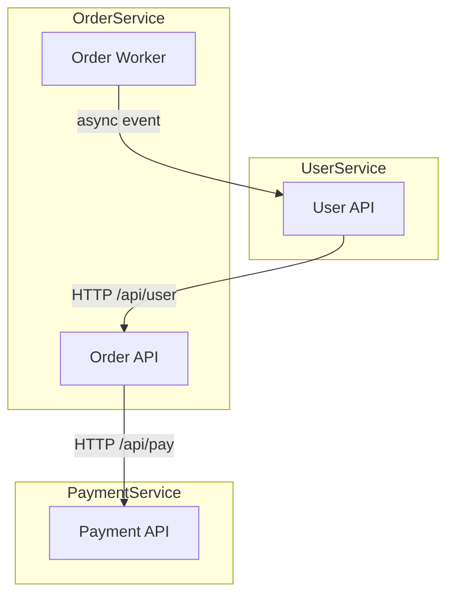

# codebase-memory-mcp 增强

codebase-memory-mcp 提供知识图谱、Leiden 社区检测、Cypher 查询、复杂度分析和跨服务追踪能力。相比 CodeGraph 的调用图分析，它在以下方面有质的飞跃：

- **自动模块发现**：Leiden 社区检测算法自动发现代码中的功能模块，比手动按目录聚类更客观
- **复杂依赖查询**：Cypher 查询支持多跳模式匹配和聚合，可发现 CodeGraph 无法表达的关系模式
- **复杂度热点**：每个函数节点自带圈复杂度、认知复杂度、嵌套循环深度等指标
- **跨服务追踪**：追踪 HTTP/gRPC/GraphQL 路由间的调用链，特别适合 monorepo 子服务关系分析
- **语义搜索**：BM25 + 向量余弦搜索，跨越词汇差异发现相关代码

## 环境检测

检查 MCP 工具列表中是否存在 `index_repository`：
- 存在 → **深度增强模式**（标注 `🧠 codebase-memory 增强` 的步骤）
- 不存在但存在 `codegraph_status` → **调用图增强模式**（降级到 CodeGraph，见 [codegraph.md](codegraph.md)）
- 都不存在 → **标准模式**（仅使用 CodeWiki MCP）

## 阶段 1 增强：索引与架构发现

在 `analyze_repo` 完成后，执行以下补充步骤：

1. `index_repository` — 构建知识图谱：
   ```json
   {"repo_path": "<仓库路径>", "mode": "moderate", "persistence": true}
   ```
   记录返回的 `project`（项目名，如 `"D-repos-MyProject"`）、`nodes`、`edges`

2. `get_architecture` — 获取架构全貌：
   ```json
   {"project": "<project名>", "aspects": ["all"]}
   ```

3. 解读返回数据，提取：
   - `clusters` → Leiden 社区检测结果（用于阶段 2 模块划分）
   - `boundaries` → 模块间调用边界
   - `layers` → 自动推断的分层（api/entry/core/internal）
   - `hotspots` → 热点函数（按 fan-in 排序）
   - `routes` → HTTP API 路由列表
   - `languages` → 语言分布

### Monorepo 专项

对于 monorepo 仓库，额外执行：

1. **识别子服务**：用 `search_graph` 查找各子服务入口：
   ```json
   {"project": "<project>", "query": "main server app", "label": "Function", "limit": 30}
   ```

2. **跨服务路由映射**：`get_architecture` 的 `routes` 数据已包含所有 HTTP 端点。按服务前缀分组（如 `/api/v1/user/*`、`/api/v1/order/*`）。

3. **跨服务调用追踪**：对每个服务的核心入口函数，用 `trace_path` 的 `cross_service` 模式：
   ```json
   {"project": "<project>", "function_name": "<函数名>", "mode": "cross_service", "depth": 3}
   ```
   这会揭示子服务之间通过 HTTP/gRPC/异步消息的调用关系。

## 阶段 2：Leiden 聚类驱动模块划分

用 Leiden 社区检测结果替代或增强手动聚类：

1. 从 `get_architecture` 返回的 `clusters` 提取初始模块计划
2. 按 `members` 降序排列，过滤 members < 3 的微小聚类
3. 用 `label` + `top_nodes` 推导模块名（如果多个 cluster 共享 label，用 top_nodes 区分）
4. 每个模块记录：cluster_id、members、cohesion（> 0.5 高内聚）、top_nodes、packages

**与 CodeWiki 组件映射**：
- CodeWiki 的 `list_components` 给出组件 ID（如 `file.py::ClassA`）
- codebase-memory 的 clusters 给出符号名（如 `ClassA`）
- 通过符号名匹配，将 CodeWiki 组件分配到 codebase-memory 发现的模块中

**Cypher 验证模块边界**：

用 `query_graph` 验证聚类合理性：

```cypher
-- 查询模块间依赖强度
MATCH (a)-[r:CALLS]->(b)
WHERE a.file_path STARTS WITH 'service-a/' AND b.file_path STARTS WITH 'service-b/'
RETURN a.qualified_name, b.qualified_name
LIMIT 20

-- 查询架构违规
MATCH (c:Class)-[:DEFINES_METHOD]->(m:Method)-[:CALLS]->(r:Method)
WHERE c.file_path CONTAINS 'controller' AND r.qualified_name CONTAINS 'Repository'
RETURN c.qualified_name, m.qualified_name, r.qualified_name
LIMIT 20
```

## 阶段 3：深度增强文档

为每个模块收集增强数据：

### 调用关系（替代 CodeGraph 的 callers/callees）

```json
{"project": "<project>", "function_name": "<核心函数>", "mode": "calls", "direction": "both", "depth": 2}
```

### 复杂度热点

```cypher
MATCH (f:Function)
WHERE f.file_path STARTS WITH '<模块路径>'
  AND (f.complexity >= 10 OR f.transitive_loop_depth >= 3 OR f.linear_scan_in_loop >= 1)
RETURN f.qualified_name, f.complexity, f.cognitive, f.loop_depth, f.linear_scan_in_loop
ORDER BY f.complexity DESC
LIMIT 10
```

### 死代码检测

```cypher
MATCH (f:Function)
WHERE f.file_path STARTS WITH '<模块路径>'
  AND NOT ()-[:CALLS]->(f)
  AND NOT f.qualified_name CONTAINS 'main'
  AND NOT f.qualified_name CONTAINS 'test'
RETURN f.qualified_name, f.file_path
LIMIT 20
```

### 语义关联

```json
{"project": "<project>", "semantic_query": ["<关键词1>", "<关键词2>"]}
```

写入文档时增加以下章节：
- **复杂度热点**：高圈复杂度/深嵌套循环的函数列表及风险
- **死代码**：无入度调用的函数（候选清理目标）
- **语义关联**：通过向量搜索发现的跨文件语义相关代码

## 阶段 4 增强：Monorepo 总览

### 子服务关系图

在 `overview.md` 中增加 **子服务拓扑** 章节：

1. 从 `get_architecture` 的 `boundaries` 和 `clusters` 提取子服务间调用关系
2. 从 `routes` 按服务前缀分组，生成 API 端点清单
3. 用 `trace_path(mode: "cross_service")` 追踪的跨服务调用链生成 Mermaid 图：



4. 列出每个子服务的：
   - 入口点和路由清单
   - 依赖的其他服务（从 boundaries 获取）
   - 被依赖方（反向查询）
   - 核心热点函数

### 分层架构

用 `layers` 数据自动标注每个模块的架构层级（api/entry/core/internal/leaf），在总览架构图中体现分层关系。

## 增量元数据

使用 SQLite 数据库存储（替代 JSON），路径：`{output_dir}/.meta/module_map.db`

**Schema**：

```sql
CREATE TABLE modules (name TEXT PRIMARY KEY, cluster_id INTEGER, cohesion REAL);
CREATE TABLE module_files (module_name TEXT REFERENCES modules(name), file_path TEXT);
CREATE INDEX idx_file_path ON module_files(file_path);
CREATE TABLE module_symbols (module_name TEXT REFERENCES modules(name), symbol_name TEXT);
CREATE TABLE wiki_metadata (key TEXT PRIMARY KEY, value TEXT);
```

**写入方式**：用 Python 标准库 `sqlite3`（无额外依赖）：

```python
import sqlite3
conn = sqlite3.connect(f"{output_dir}/.meta/module_map.db")
# 建表 + 写入模块数据 + 写入元数据
```

**增量更新查询**：

```python
# 查找变更文件所属模块（索引加速）
conn.execute("SELECT DISTINCT module_name FROM module_files WHERE file_path IN (?, ?, ...)", changed_files)
```

## 增量更新（深度增强模式）

1. **读取基线**：从 SQLite 获取 `commit_sha`
2. **检测变更**：`git diff <commit_sha>..HEAD --name-only`
3. **映射到模块**：SQLite 索引查询（O(1)）
4. **扩展影响范围**：Cypher 查询替代 `codegraph_impact`：
   ```cypher
   MATCH (changed)-[:CALLS*1..2]->(impacted)
   WHERE changed.qualified_name IN ['<变更符号>']
   RETURN DISTINCT impacted.qualified_name, impacted.file_path
   ```
5. 重新生成受影响模块 → 更新 overview → 更新 SQLite 元数据

**回退全量条件**：`module_map.db` 缺失、>50% 模块受影响、新增文件不属于任何模块、用户明确要求。
